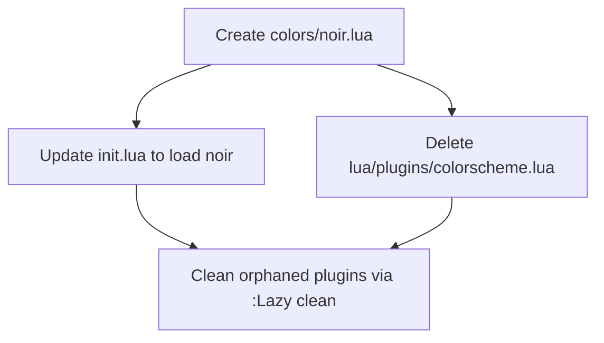

# Plan: Create Custom "Noir" Colorscheme

## Purpose

Create a custom Neovim colorscheme called **"noir"** — a dark/black background with mostly white text, minimal coloring. Gray for less important elements, blue for function names and important identifiers. Clean and minimal: mostly white on black.

This replaces the current zenbones colorscheme (which itself replaced kanagawa-dragon and catppuccin). The user's color journey has been: Catppuccin → kanagawa-dragon → zenbones → **custom noir**. Each step moved toward less color. A fully custom scheme gives exact control.

## Color Journey Context

From `minimal-dark-colorscheme.md`: the user has rejected three themes as "too much color." Zenbones is close but still has more color/variation than desired. A hand-crafted scheme with only black, white, gray, and blue accent is the logical endpoint.

## Palette

| Role | Hex | Usage |
|------|-----|-------|
| **bg** | `#000000` | Pure black background |
| **bg_float** | `#111111` | Float/window backgrounds |
| **bg_cursorline** | `#111111` | Cursor line highlight |
| **bg_visual** | `#1a1a2e` | Visual selection (very subtle blue tint) |
| **fg** | `#d4d4d4` | Primary text (off-white, easier on eyes than pure #fff) |
| **fg_dim** | `#808080` | Dimmed text (line numbers, non-current) |
| **fg_muted** | `#6b6b6b` | Comments, less important text |
| **fg_subtle** | `#4a4a4a` | Very subtle elements (gutter line nums, separators) |
| **fg_bright** | `#ffffff` | Bold/emphasized text |
| **blue** | `#7aa2f7` | Functions, important identifiers, search highlights |
| **blue_dim** | `#3a3a5c` | Visual/search background (blue tint on dark) |
| **red_diag** | `#cc4444` | Diagnostic errors (muted red) |
| **yellow_diag** | `#ccaa44` | Diagnostic warnings (muted yellow) |
| **green_git** | `#4a8a4a` | Git add signs (muted green) |
| **red_git** | `#8a4a4a` | Git delete signs (muted red) |
| **yellow_git** | `#8a8a4a` | Git change signs (muted yellow) |

## Design Decisions

1. **Pure black background** (`#000000`) — not "almost black," truly black
2. **Off-white foreground** (`#d4d4d4`) — softer than pure white, easier on eyes
3. **Blue is the ONLY accent color** — used for functions, methods, constructors, and important identifiers
4. **Gray scale for differentiation** — comments are dimmer gray, keywords are bold white, types are slightly dimmer, strings are slightly dimmer, punctuation is mid-gray
5. **Bold/italic for structure** — keywords use bold, comments use italic, types use italic — font variations replace color for syntax differentiation
6. **Diagnostics retain muted color** — red/yellow/blue for error/warn/info — functional utility outweighs minimalism here
7. **Git signs retain muted color** — green/red/yellow — same reasoning as diagnostics
8. **Search uses blue** — blue bg with black fg for search matches, making them pop clearly

---

## Dependency Graph



Wave 1 creates the colorscheme file (the core deliverable). Wave 2 wires it into the config by updating init.lua and removing the old colorscheme plugin spec. Wave 3 is a manual cleanup step.

---

## Progress

### Wave 1 — Create the colorscheme (core deliverable)
- [x] **1.1** Create `colors/noir.lua` with full highlight definitions

### Wave 2 — Wire into config (depends: Wave 1)
- [x] **2.1** Add `vim.cmd.colorscheme('noir')` to `init.lua` after `require 'options'`
- [x] **2.2** Delete `lua/plugins/colorscheme.lua` (removes zenbones + lush.nvim dependency)

### Wave 3 — Manual verification
- [ ] **3.1** Run `:Lazy clean` to remove orphaned zenbones and lush.nvim plugins
- [ ] **3.2** Verify colorscheme loads without errors on startup
- [ ] **3.3** Verify Treesitter highlighting in a Lua file
- [ ] **3.4** Verify plugin UIs: snacks picker, blink completion, which-key, noice cmdline, gitsigns gutter, flash jump

---

## Detailed Specifications

### Task 1.1 — Create `colors/noir.lua`

**File:** `colors/noir.lua` (new file — the `colors/` directory doesn't exist yet)

This is the complete colorscheme. It defines:
- `vim.g.colors_name = 'noir'`
- `vim.opt.background = 'dark'`
- `vim.cmd('highlight clear')` + reset `syntax`
- All highlight groups via `vim.api.nvim_set_hl(0, group, opts)`

**Structure of the file:**

```lua
-- colors/noir.lua
-- Custom minimal colorscheme: black bg, white fg, blue accents, gray for less important

-- Clear existing highlights
if vim.g.colors_name then
  vim.cmd('highlight clear')
  vim.cmd('syntax reset')
end
vim.opt.background = 'dark'
vim.g.colors_name = 'noir'

-- Palette
local bg        = '#000000'
local bg_float  = '#111111'
local bg_visual = '#1a1a2e'
local fg        = '#d4d4d4'
local fg_dim    = '#808080'
local fg_muted  = '#6b6b6b'
local fg_subtle = '#4a4a4a'
local blue      = '#7aa2f7'

local function hl(group, opts)
  vim.api.nvim_set_hl(0, group, opts)
end

-- [Sections below: see full highlight map in the appendix]
```

**Highlight group map** (organized by category):

#### Core / UI
| Group | Foreground | Background | Style |
|-------|-----------|------------|-------|
| `Normal` | `#d4d4d4` | `#000000` | — |
| `NormalFloat` | `#d4d4d4` | `#111111` | — |
| `NormalNC` | `#808080` | `#000000` | — |
| `Comment` | `#6b6b6b` | — | italic |
| `Constant` | `#d4d4d4` | — | — |
| `String` | `#b0b0b0` | — | — |
| `Character` | `#b0b0b0` | — | — |
| `Number` | `#d4d4d4` | — | — |
| `Boolean` | `#d4d4d4` | — | bold |
| `Float` | `#d4d4d4` | — | — |
| `Identifier` | `#d4d4d4` | — | — |
| `Function` | `#7aa2f7` | — | — |
| `Statement` | `#d4d4d4` | — | bold |
| `Conditional` | `#d4d4d4` | — | bold |
| `Repeat` | `#d4d4d4` | — | bold |
| `Label` | `#d4d4d4` | — | — |
| `Operator` | `#d4d4d4` | — | — |
| `Keyword` | `#d4d4d4` | — | bold |
| `Exception` | `#d4d4d4` | — | bold |
| `Include` | `#d4d4d4` | — | — |
| `Define` | `#d4d4d4` | — | — |
| `PreProc` | `#d4d4d4` | — | — |
| `Type` | `#b0b0b0` | — | italic |
| `StorageClass` | `#d4d4d4` | — | bold |
| `Structure` | `#b0b0b0` | — | italic |
| `Typedef` | `#b0b0b0` | — | italic |
| `Special` | `#808080` | — | — |
| `SpecialChar` | `#808080` | — | — |
| `Tag` | `#7aa2f7` | — | — |
| `Delimiter` | `#808080` | — | — |
| `SpecialComment` | `#6b6b6b` | — | italic |
| `Debug` | `#808080` | — | — |
| `Underlined` | `#7aa2f7` | — | underline |
| `Ignore` | `#4a4a4a` | — | — |
| `Error` | `#cc4444` | — | — |
| `Todo` | `#7aa2f7` | — | bold |
| `qfLineNr` | `#4a4a4a` | — | — |
| `qfSeparator` | `#4a4a4a` | — | — |
| `Conceal` | `#4a4a4a` | — | — |

#### Editor UI
| Group | Foreground | Background | Style |
|-------|-----------|------------|-------|
| `CursorLine` | — | `#111111` | — |
| `CursorLineNr` | `#6b6b6b` | — | — |
| `LineNr` | `#4a4a4a` | — | — |
| `LineNrAbove` | `#3a3a3a` | — | — |
| `LineNrBelow` | `#3a3a3a` | — | — |
| `SignColumn` | — | NONE | — |
| `EndOfBuffer` | `#1a1a1a` | — | — |
| `NonText` | `#1a1a1a` | — | — |
| `Whitespace` | `#2a2a2a` | — | — |
| `VertSplit` | `#2a2a2a` | — | — |
| `WinSeparator` | `#2a2a2a` | — | — |
| `Folded` | `#6b6b6b` | `#111111` | — |
| `FoldColumn` | `#4a4a4a` | NONE | — |
| `TabLine` | `#6b6b6b` | `#111111` | — |
| `TabLineFill` | — | `#000000` | — |
| `TabLineSel` | `#d4d4d4` | — | bold |
| `Title` | `#d4d4d4` | — | bold |
| `FloatBorder` | `#3a3a3a` | — | — |
| `FloatTitle` | `#d4d4d4` | — | bold |
| `NormalFloat` | `#d4d4d4` | `#111111` | — |
| `Pmenu` | `#d4d4d4` | `#111111` | — |
| `PmenuSel` | `#000000` | `#7aa2f7` | — |
| `PmenuSbar` | — | `#2a2a2a` | — |
| `PmenuThumb` | — | `#4a4a4a` | — |
| `PmenuMatch` | `#7aa2f7` | `#111111` | — |
| `PmenuMatchSel` | `#000000` | `#7aa2f7` | bold |
| `WildMenu` | `#000000` | `#7aa2f7` | — |
| `Search` | `#000000` | `#7aa2f7` | — |
| `IncSearch` | `#000000` | `#7aa2f7` | bold |
| `CurSearch` | `#000000` | `#7aa2f7` | bold |
| `Substitute` | `#000000` | `#7aa2f7` | — |
| `Visual` | — | `#1a1a2e` | — |
| `VisualNOS` | — | `#1a1a2e` | — |
| `MatchParen` | — | `#1a1a2e` | bold |
| `MatchWord` | — | `#1a1a2e` | underline |
| `CursorColumn` | — | `#111111` | — |
| `ColorColumn` | — | `#0a0a0a` | — |
| `QuickFixLine` | — | `#111111` | — |
| `StatusLine` | `#d4d4d4` | `#111111` | — |
| `StatusLineNC` | `#4a4a4a` | `#000000` | — |
| `StatusLineTerm` | `#d4d4d4` | `#111111` | — |
| `StatusLineTermNC` | `#4a4a4a` | `#000000` | — |
| `MsgArea` | `#d4d4d4` | — | — |
| `ModeMsg` | `#6b6b6b` | — | — |
| `MoreMsg` | `#7aa2f7` | — | — |
| `Question` | `#7aa2f7` | — | — |
| `WarningMsg` | `#ccaa44` | — | — |
| `ErrorMsg` | `#cc4444` | — | — |
| `Directory` | `#7aa2f7` | — | — |
| `SpecialKey` | `#4a4a4a` | — | — |
| `DiffAdd` | `#4a8a4a` | `#0a1a0a` | — |
| `DiffChange` | `#8a8a4a` | `#1a1a0a` | — |
| `DiffDelete` | `#8a4a4a` | `#1a0a0a` | — |
| `DiffText` | `#7aa2f7` | `#0a0a1a` | — |
| `Added` | `#4a8a4a` | — | — |
| `Changed` | `#8a8a4a` | — | — |
| `Removed` | `#8a4a4a` | — | — |

#### Diagnostics
| Group | Foreground | Style |
|-------|-----------|-------|
| `DiagnosticError` | `#cc4444` | — |
| `DiagnosticWarn` | `#ccaa44` | — |
| `DiagnosticInfo` | `#7aa2f7` | — |
| `DiagnosticHint` | `#6b6b6b` | — |
| `DiagnosticOk` | `#4a8a4a` | — |
| `DiagnosticUnderlineError` | `#cc4444` | undercurl |
| `DiagnosticUnderlineWarn` | `#ccaa44` | undercurl |
| `DiagnosticUnderlineInfo` | `#7aa2f7` | undercurl |
| `DiagnosticUnderlineHint` | `#6b6b6b` | undercurl |
| `DiagnosticVirtualTextError` | `#5a2a2a` | — |
| `DiagnosticVirtualTextWarn` | `#5a4a2a` | — |
| `DiagnosticVirtualTextInfo` | `#2a2a5a` | — |
| `DiagnosticVirtualTextHint` | `#3a3a3a` | — |
| `DiagnosticSignError` | `#cc4444` | — |
| `DiagnosticSignWarn` | `#ccaa44` | — |
| `DiagnosticSignInfo` | `#7aa2f7` | — |
| `DiagnosticSignHint` | `#6b6b6b` | — |

#### Git Signs (Gitsigns)
| Group | Foreground |
|-------|-----------|
| `GitSignsAdd` | `#4a8a4a` |
| `GitSignsChange` | `#8a8a4a` |
| `GitSignsDelete` | `#8a4a4a` |
| `GitSignsAddLn` | `#0a1a0a` |
| `GitSignsChangeLn` | `#1a1a0a` |
| `GitSignsDeleteLn` | `#1a0a0a` |
| `GitSignsAddInline` | bg `#0a2a0a` |
| `GitSignsChangeInline` | bg `#2a2a0a` |
| `GitSignsDeleteInline` | bg `#2a0a0a` |

#### Treesitter Highlights (`@` groups)
| Group | Foreground | Style | Purpose |
|-------|-----------|-------|---------|
| `@variable` | `#d4d4d4` | — | Variables |
| `@variable.builtin` | `#d4d4d4` | italic | `self`, `this`, `super` |
| `@variable.parameter` | `#b0b0b0` | — | Function parameters |
| `@variable.member` | `#d4d4d4` | — | Object/struct fields |
| `@constant` | `#d4d4d4` | — | Constants |
| `@constant.builtin` | `#d4d4d4` | bold | `true`, `false`, `nil`, `None` |
| `@constant.macro` | `#d4d4d4` | — | Macro constants |
| `@module` | `#b0b0b0` | italic | Module/namespace names |
| `@module.builtin` | `#b0b0b0` | italic | Built-in modules |
| `@label` | `#808080` | — | Labels |
| `@string` | `#b0b0b0` | — | Strings |
| `@string.documentation` | `#6b6b6b` | — | Doc strings |
| `@string.regexp` | `#808080` | — | Regex strings |
| `@string.escape` | `#808080` | — | Escape sequences |
| `@string.special` | `#808080` | — | Special strings |
| `@string.special.symbol` | `#808080` | — | Symbols |
| `@string.special.url` | `#7aa2f7` | underline | URLs |
| `@string.special.path` | `#808080` | underline | File paths |
| `@character` | `#b0b0b0` | — | Characters |
| `@character.special` | `#808080` | — | Special chars |
| `@boolean` | `#d4d4d4` | bold | Booleans |
| `@number` | `#d4d4d4` | — | Numbers |
| `@number.float` | `#d4d4d4` | — | Floats |
| `@float` | `#d4d4d4` | — | Floats (legacy) |
| `@integer` | `#d4d4d4` | — | Integers (legacy) |
| `@type` | `#b0b0b0` | italic | Type names |
| `@type.builtin` | `#b0b0b0` | italic | Built-in types |
| `@type.definition` | `#b0b0b0` | italic | Type in definitions |
| `@type.qualifier` | `#d4d4d4` | bold | `const`, `static`, `mut` |
| `@attribute` | `#d4d4d4` | — | Annotations/attributes |
| `@property` | `#d4d4d4` | — | Object properties |
| `@function` | `#7aa2f7` | — | Function definitions |
| `@function.builtin` | `#7aa2f7` | — | Built-in functions |
| `@function.call` | `#7aa2f7` | — | Function calls |
| `@function.macro` | `#7aa2f7` | — | Macro functions |
| `@function.method` | `#7aa2f7` | — | Method definitions |
| `@function.method.call` | `#7aa2f7` | — | Method calls |
| `@constructor` | `#7aa2f7` | — | Constructors |
| `@operator` | `#d4d4d4` | — | Operators |
| `@keyword` | `#d4d4d4` | bold | Keywords |
| `@keyword.coroutine` | `#d4d4d4` | bold | `async`, `await` |
| `@keyword.function` | `#7aa2f7` | — | `function` keyword |
| `@keyword.operator` | `#d4d4d4` | bold | `in`, `not`, `and` |
| `@keyword.import` | `#d4d4d4` | — | `import`, `require` |
| `@keyword.type` | `#d4d4d4` | bold | `type`, `interface` |
| `@keyword.modifier` | `#d4d4d4` | bold | Access modifiers |
| `@keyword.repeat` | `#d4d4d4` | bold | `for`, `while` |
| `@keyword.return` | `#d4d4d4` | bold | `return` |
| `@keyword.debug` | `##808080` | — | Debug statements |
| `@keyword.exception` | `#d4d4d4` | bold | `try`, `catch`, `raise` |
| `@keyword.conditional` | `#d4d4d4` | bold | `if`, `else`, `switch` |
| `@keyword.conditional.ternary` | `#d4d4d4` | — | Ternary `? :` |
| `@keyword.directive` | `#d4d4d4` | — | Preprocessor directives |
| `@keyword.directive.define` | `#d4d4d4` | — | `#define` |
| `@keyword.storage` | `#d4d4d4` | bold | `static`, `const` |
| `@punctuation.delimiter` | `#808080` | — | `,`, `;`, `:` |
| `@punctuation.bracket` | `#808080` | — | `(`, `)`, `{`, `}` |
| `@punctuation.special` | `#808080` | — | Special punctuation |
| `@comment` | `#6b6b6b` | italic | Comments |
| `@comment.documentation` | `#6b6b6b` | italic | Doc comments |
| `@comment.error` | `#cc4444` | italic | TODO/FIXME/BUG |
| `@comment.warning` | `#ccaa44` | italic | WARNING/HACK |
| `@comment.todo` | `#7aa2f7` | italic | TODO comments |
| `@comment.note` | `#6b6b6b` | italic | NOTE comments |
| `@tag` | `#7aa2f7` | — | HTML/XML tags |
| `@tag.attribute` | `#d4d4d4` | — | HTML attributes |
| `@tag.delimiter` | `#808080` | — | `<`, `>`, `</` |
| `@markup.heading` | `#d4d4d4` | bold | Markdown headings |
| `@markup.strong` | `#d4d4d4` | bold | Bold text |
| `@markup.italic` | `#d4d4d4` | italic | Italic text |
| `@markup.strikethrough` | `#6b6b6b` | strikethrough | Struck text |
| `@markup.underline` | `#d4d4d4` | underline | Underlined text |
| `@markup.link` | `#7aa2f7` | underline | Links |
| `@markup.link.label` | `#7aa2f7` | — | Link labels |
| `@markup.link.url` | `#7aa2f7` | underline | URLs |
| `@markup.list` | `#808080` | — | List markers |
| `@markup.list.checked` | `#4a8a4a` | — | Checked items |
| `@markup.list.unchecked` | `#6b6b6b` | — | Unchecked items |
| `@markup.raw` | `#b0b0b0` | — | Code blocks/inline code |
| `@markup.raw.block` | `#b0b0b0` | — | Fenced code blocks |
| `@diff.plus` | `#4a8a4a` | — | Added lines |
| `@diff.minus` | `#8a4a4a` | — | Removed lines |
| `@diff.delta` | `#8a8a4a` | — | Changed lines |
| `@text` | `#d4d4d4` | — | Plain text (legacy) |
| `@text.reference` | `#7aa2f7` | — | References |
| `@text.emphasis` | `#d4d4d4` | italic | Emphasis |
| `@text.strong` | `#d4d4d4` | bold | Strong |
| `@text.strike` | `#6b6b6b` | strikethrough | Strikethrough |
| `@text.uri` | `#7aa2f7` | underline | URLs |
| `@text.literal` | `#b0b0b0` | — | Literal/code |
| `@text.todo` | `#7aa2f7` | — | TODO |
| `@text.danger` | `#cc4444` | — | Danger |
| `@text.warning` | `#ccaa44` | — | Warning |
| `@text.note` | `#7aa2f7` | — | Note |
| `@text.title` | `#d4d4d4` | bold | Title |
| `@text.todo.unchecked` | `#6b6b6b` | — | Unchecked |
| `@text.todo.checked` | `#4a8a4a` | — | Checked |
| `@text.diff.add` | `#4a8a4a` | — | Diff add |
| `@text.diff.delete` | `#8a4a4a` | — | Diff delete |
| `@string.json` | `#b0b0b0` | — | JSON strings |
| `@tag.javascript` | `#7aa2f7` | — | JSX tags |

#### LSP Semantic Tokens
| Group | Foreground | Style |
|-------|-----------|-------|
| `@lsp.type.class` | `#b0b0b0` | italic |
| `@lsp.type.decorator` | `#d4d4d4` | — |
| `@lsp.type.enum` | `#b0b0b0` | italic |
| `@lsp.type.enumMember` | `#d4d4d4` | — |
| `@lsp.type.function` | `#7aa2f7` | — |
| `@lsp.type.interface` | `#b0b0b0` | italic |
| `@lsp.type.macro` | `#7aa2f7` | — |
| `@lsp.type.method` | `#7aa2f7` | — |
| `@lsp.type.namespace` | `#b0b0b0` | italic |
| `@lsp.type.parameter` | `#b0b0b0` | — |
| `@lsp.type.property` | `#d4d4d4` | — |
| `@lsp.type.struct` | `#b0b0b0` | italic |
| `@lsp.type.type` | `#b0b0b0` | italic |
| `@lsp.type.typeParameter` | `#b0b0b0` | italic |
| `@lsp.type.variable` | `#d4d4d4` | — |
| `@lsp.mod.readonly` | — | italic (linked to `@constant`) |
| `@lsp.mod.deprecated` | `#6b6b6b` | strikethrough |

#### Plugin-specific Highlights

**Snacks.nvim:**
| Group | Foreground | Background |
|-------|-----------|------------|
| `SnacksPickerDir` | `#6b6b6b` | — |
| `SnacksPickerMatch` | `#7aa2f7` | — |
| `SnacksPickerSel` | `#d4d4d4` | `#1a1a2e` |
| `SnacksPickerInput` | `#d4d4d4` | — |

**Blink.cmp:**
| Group | Foreground | Background |
|-------|-----------|------------|
| `BlinkCmpLabel` | `#d4d4d4` | — |
| `BlinkCmpLabelMatch` | `#7aa2f7` | — |
| `BlinkCmpKind` | `#6b6b6b` | — |
| `BlinkCmpDoc` | `#d4d4d4` | `#111111` |
| `BlinkCmpDocBorder` | `#3a3a3a` | — |
| `BlinkCmpGhostText` | `#3a3a3a` | — |

**Flash:**
| Group | Foreground | Background | Style |
|-------|-----------|------------|-------|
| `FlashLabel` | `#000000` | `#7aa2f7` | bold |
| `FlashMatch` | — | `#1a1a2e` | — |
| `FlashCurrent` | — | `#1a1a2e` | bold |
| `FlashBackdrop` | `#4a4a4a` | — | — |
| `FlashPrompt` | `#d4d4d4` | — | — |

**Which-key:**
| Group | Foreground |
|-------|-----------|
| `WhichKeyNormal` | (linked to `NormalFloat`) |
| `WhichKey` | `#6b6b6b` |
| `WhichKeyDesc` | `#d4d4d4` |
| `WhichKeyGroup` | `#7aa2f7` |
| `WhichKeySeparator` | `#4a4a4a` |
| `WhichKeyValue` | `#6b6b6b` |

**Mini.nvim:**
| Group | Foreground |
|-------|-----------|
| `MiniIconsAzure` | `#7aa2f7` |
| `MiniIconsBlue` | `#7aa2f7` |
| `MiniIconsCyan` | `#808080` |
| `MiniIconsGreen` | `#4a8a4a` |
| `MiniIconsGrey` | `#6b6b6b` |
| `MiniIconsOrange` | `#8a8a4a` |
| `MiniIconsPurple` | `#808080` |
| `MiniIconsRed` | `#8a4a4a` |
| `MiniIconsYellow` | `#8a8a4a` |

**Noice:**
| Group | Foreground |
|-------|-----------|
| `NoiceCmdline` | `#d4d4d4` |
| `NoiceCmdlineIcon` | `#6b6b6b` |
| `NoiceCmdlinePopupBorder` | `#3a3a3a` |
| `NoiceCmdlinePopupTitle` | `#6b6b6b` |
| `NoiceConfirm` | (linked to `NormalFloat`) |
| `NoiceConfirmBorder` | `#3a3a3a` |
| `NoiceFormatProgressDone` | — | bg `#1a1a2e` |
| `NoiceFormatProgressTodo` | — | bg `#111111` |
| `NoiceLspProgressClient` | `#6b6b6b` |
| `NoiceLspProgressSpinner` | `#6b6b6b` |
| `NoiceLspProgressTitle` | `#d4d4d4` |
| `NoiceMini` | `#d4d4d4` | bg `#111111` |

**Neogit:**
| Group | Foreground |
|-------|-----------|
| `NeogitBranch` | `#7aa2f7` |
| `NeogitRemote` | `#7aa2f7` |
| `NeogitHunkHeader` | — | bg `#111111` |
| `NeogitHunkHeaderHighlight` | — | bg `#1a1a2e` |

---

### Task 2.1 — Add colorscheme loading to `init.lua`

**File:** `init.lua`

After `require 'options'` (line 5), add the colorscheme call. This must come after `vim.opt.termguicolors = true` is set (which happens in `options.lua` line 18).

```lua
-- Set <space> as the leader key (before any plugin/keymap requires)
vim.g.mapleader = ' '
vim.g.maplocalleader = ' '

require 'options'
vim.cmd.colorscheme 'noir'
require 'keymaps'
require 'autocmds'
require 'lsp_init'
```

**Why `init.lua` instead of a lazy.nvim spec?** The custom colorscheme is a local file in `colors/noir.lua` — it's always available on the runtimepath (since `~/.config/nvim` is on rtp). No plugin management needed. Calling `vim.cmd.colorscheme 'noir'` from init.lua is the simplest, most reliable approach.

### Task 2.2 — Delete `lua/plugins/colorscheme.lua`

Delete the entire file. This removes:
- The `zenbones-theme/zenbones.nvim` plugin spec
- The `rktjmp/lush.nvim` dependency
- All zenbones configuration (`vim.g.zenbones = { ... }`)

After deletion, running `:Lazy clean` will remove the now-orphaned zenbones and lush.nvim plugin directories from `~/.local/share/nvim/lazy/`.

### Task 3.1 — Clean orphaned plugins (manual)

Run `:Lazy clean` to remove:
- `zenbones.nvim`
- `lush.nvim`

### Tasks 3.2–3.4 — Verification (manual)

1. **Startup** — Launch `nvim`. No errors. Dashboard renders with noir colors.
2. **Syntax** — Open a `.lua` file. Verify:
   - Functions/methods are blue (`#7aa2f7`)
   - Keywords (if, else, return, local, function) are bold white
   - Comments are dim gray italic
   - Strings are slightly dimmer than normal text
   - Types are slightly dimmer italic
   - Most code is white-on-black
   - Only blue stands out as a distinct color
3. **Plugin UI** — Test:
   - `<leader>sf` — snacks picker (blue match highlights, dark float)
   - Insert mode — blink completion (blue match in items)
   - `:` — noice cmdline popup
   - `<leader>` — which-key popup
   - `s` — flash jump (blue labels)
   - `<leader>gs` — neogit status

---

## Surprises & Discoveries

1. **No `colors/` directory exists yet** — This is a fresh directory to create. The config has always relied on third-party colorscheme plugins.

2. **Previous theme evolution** — Catppuccin → kanagawa-dragon → zenbones → custom. Each transition was driven by "too much color." A custom scheme is the natural endpoint.

3. **zenbones dependency on lush.nvim** — The current colorscheme requires `rktjmp/lush.nvim` as a build-time dependency. Removing zenbones also removes this dependency — one less plugin.

4. **`~/.config/nvim` is always on runtimepath** — This means `colors/noir.lua` is immediately discoverable by `vim.cmd.colorscheme('noir')` without any plugin spec or rtp manipulation.

5. **Noice, snacks, blink, flash, which-key all use standard highlight groups** — These plugins define their own highlight group names, so we need to set them explicitly. But they fall back gracefully to standard groups if their custom groups aren't set.

## Decision Log

| Decision | Rationale |
|----------|-----------|
| **Name: "noir"** | French for "black." Short, memorable, perfectly describes the aesthetic. Better than "void" (too dramatic), "ink" (implies dark-on-light), "midnight" (too common). |
| **Pure black `#000000` background** | User explicitly requested "dark/black background." No reason to soften it. |
| **Off-white `#d4d4d4` foreground** | Pure `#ffffff` is harsh on pure black. `#d4d4d4` is still clearly white but easier on the eyes. |
| **Blue `#7aa2f7` for functions** | User requested blue for function names and important identifiers. This is a Tokyo Night-inspired blue — visible but not neon. |
| **Gray scale with bold/italic for differentiation** | Avoids introducing additional colors while maintaining readability through typographic emphasis. |
| **Diagnostics/git retain muted color** | Functional utility. Error/warning colors serve a purpose. Making them gray would reduce usability. Muted shades keep them subtle. |
| **Load from `init.lua`, not lazy.nvim spec** | Local colorscheme doesn't need plugin management. Simplest approach: `vim.cmd.colorscheme 'noir'` in init.lua after options are loaded. |
| **Delete `lua/plugins/colorscheme.lua`** | Clean removal. No orphaned lazy.nvim spec. `:Lazy clean` handles plugin directory cleanup. |
| **Keep `vim.opt.termguicolors = true` in options.lua** | Still needed — ensures `gui=` attributes (bold, italic, undercurl) work in the colorscheme. |
| **Include LSP semantic tokens** | Modern Neovim (0.11+) uses semantic tokens heavily. Without them, LSP-provided highlighting falls back to less precise Treesitter groups. |
| **Include Treesitter `@text.*` legacy groups** | Some Treesitter parsers still use the older `@text.*` namespace alongside the newer `@markup.*` namespace. Covering both prevents gaps. |

## Outcomes & Retrospective

_To be completed during execution._
