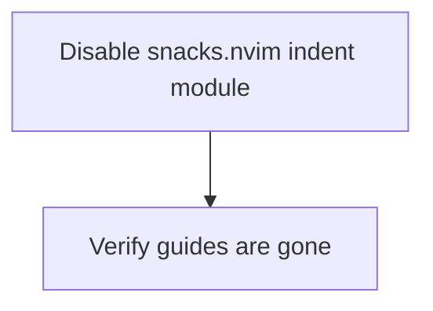

# Plan: Disable Vertical Indent Guide Lines

## Purpose
Remove the vertical indent guide lines that appear at each indentation level in Neovim.

## Root Cause Analysis

Two indent-related settings were found:

| File | Setting | Purpose |
|------|---------|---------|
| `lua/plugins/snacks.lua:21` | `indent = { enabled = true }` | **Visual indent guide lines** — this is the one drawing the vertical lines |
| `lua/plugins/treesitter.lua:16` | `indent = { enable = true }` | Treesitter-based indentation *computation* (for `=` reformatting, `<Tab>`, autoindent) — NOT visual guides |

**The vertical indent guide lines come from snacks.nvim's `indent` module.** Treesitter's `indent` setting only controls smart indentation logic and should NOT be touched.

## Dependency Graph

## Progress

### Wave 1 — Disable indent guides
- [x] Set `indent = { enabled = false }` in `lua/plugins/snacks.lua` line 21

## Detailed Specifications

### Task: Disable snacks.nvim indent module
**File:** `lua/plugins/snacks.lua`  
**Change:** Line 21 — change `indent = { enabled = true }` to `indent = { enabled = false }`  
**Rationale:** The snacks.nvim `indent` module renders the vertical indent guide characters. Disabling it removes the guides entirely while leaving all other snacks features untouched.

## Surprises & Discoveries
- No other indent-guide plugins (indent-blankline, mini.indentscope) are installed — snacks.nvim is the sole source.
- Treesitter's `indent = { enable = true }` is unrelated to visual guides; it must remain enabled.

## Decision Log
- Decided to disable rather than uninstall, since it's a single config toggle within the snacks.nvim opts table.
- Confirmed treesitter indent should remain enabled (it provides smart indentation, not visual guides).

## Outcomes & Retrospective
- Changed `indent = { enabled = true }` to `indent = { enabled = false }` in `lua/plugins/snacks.lua` line 21.
- The vertical indent guide lines rendered by snacks.nvim's indent module will no longer appear.
- All other snacks.nvim features remain untouched.
- Treesitter indent computation remains enabled (`lua/plugins/treesitter.lua`) as intended.
