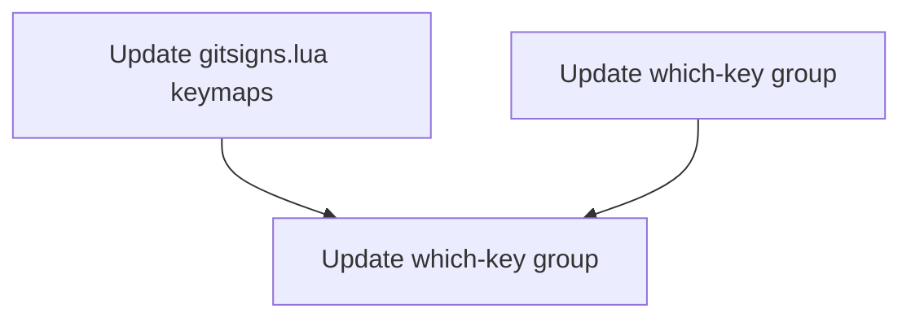

# Plan: Move Git Hunk Keybinds from `<leader>h` to `<leader>gh`

## Purpose

The gitsigns.nvim hunk operations are currently under `<leader>h` (e.g. `<leader>hs` to stage hunk), while all other git commands live under `<leader>g` (e.g. `<leader>gs` for Neogit status, `<leader>gb` for branches). This is inconsistent. The fix moves all hunk mappings into the `<leader>g` group as a `gh` subgroup, so hunk operations become `<leader>ghs`, `<leader>ghr`, etc.

## Dependency Graph

Both changes are independent at the file level (different files) but logically related. They can be done in parallel since there is no output dependency.

## Progress

### Wave 1 — Remap hunk keybindings (parallel, 2 files)
- [x] 1.1 Update `gitsigns.lua` — change 6 `<leader>h*` mappings to `<leader>gh*`
- [x] 1.2 Update `which-key.lua` — remove `<leader>h` group, add `<leader>gh` subgroup

## Detailed Specifications

### Task 1.1 — Update gitsigns.lua keymaps

**File:** `lua/plugins/gitsigns.lua`

Change all `<leader>h` prefixed keymaps to `<leader>gh`:

| Current | New | Description |
|---------|-----|-------------|
| `<leader>hs` | `<leader>ghs` | Stage hunk |
| `<leader>hr` | `<leader>ghr` | Reset hunk |
| `<leader>hu` | `<leader>ghu` | Undo stage hunk |
| `<leader>hp` | `<leader>ghp` | Preview hunk |
| `<leader>hb` | `<leader>ghb` | Blame line |
| `<leader>hd` | `<leader>ghd` | Diff this |

**Keep unchanged:** `]h` and `[h` navigation mappings (lines 25-26) — these are standard vim-style navigation, not leader-based.

### Task 1.2 — Update which-key group

**File:** `lua/plugins/which-key.lua`

- **Remove** line 44: `{ '<leader>h', group = 'Git [H]unk', mode = { 'n', 'v' } },`
- **Add** a new subgroup under the existing `<leader>g` family: `{ '<leader>gh', group = 'Git [H]unk', mode = { 'n', 'v' } },`

The `<leader>g` group already exists on line 45, so `<leader>gh` will appear as a subgroup when pressing `<leader>g`.

## Conflict Analysis

- **No `<leader>gh` prefix exists** — confirmed zero matches across all `.lua` files.
- **No overlap with existing `<leader>g` mappings:**
  - `git.lua`: `gs`, `gc`, `gp`, `gP`, `gB`, `gd`, `gD`, `gC`
  - `snacks.lua`: `gb`, `gl`, `gL`
  - New: `ghs`, `ghr`, `ghu`, `ghp`, `ghb`, `ghd` — all under `gh` prefix, no collision.
- **Freed `<leader>h`** — becomes available for future use (e.g. "Help" subgroup). No other mappings currently use it.

## Surprises & Discoveries

- `<leader>hb` (blame line) in gitsigns.lua overlaps conceptually with `<leader>gB` (blame line full) in git.lua. After migration, both will live under `<leader>g`: `<leader>ghb>` vs `<leader>gB` — this is actually cleaner and shows their relationship.
- `<leader>hd` (diffthis) in gitsigns.lua overlaps conceptually with `<leader>gd` (DiffviewOpen) in git.lua. After migration, `<leader>ghd>` vs `<leader>gd` — again cleaner.

## Decision Log

- **Chose `<leader>gh` prefix** (not `<leader>gH`): lowercase `h` matches the existing hunk convention and keeps all gitsigns hunk operations grouped under one memorable prefix. The `]h`/`[h` navigation uses lowercase `h`, so consistency is maintained.
- **Kept `]h`/`[h` navigation unchanged**: These are vim-style bracket-navigation mappings, not leader-prefixed. They follow the `]q`/`[q`, `]d`/`[d` pattern already in the config and should stay as-is.

## Outcomes & Retrospective

All tasks completed successfully. The 6 gitsigns hunk keybindings were moved from `<leader>h*` to `<leader>gh*`, and the which-key group was updated accordingly. The `<leader>h` prefix is now freed for future use.

### Files Modified
- `lua/plugins/gitsigns.lua` — 6 keymap prefixes changed
- `lua/plugins/which-key.lua` — Group line changed from `<leader>h` to `<leader>gh`

### Verification
- All `<leader>gh*` mappings are unique (no collisions with existing `<leader>g*` bindings)
- `]h`/`[h` navigation mappings left unchanged as planned
- No other files reference `<leader>h` for gitsigns operations
