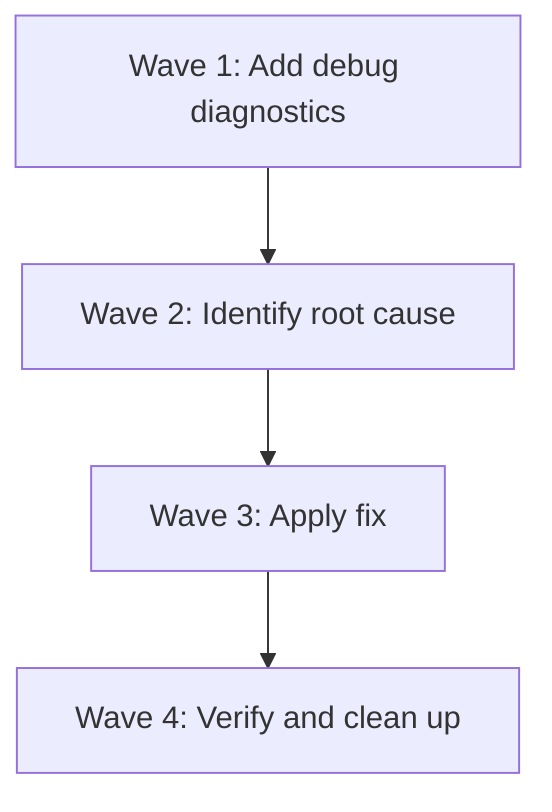

# Plan: Fix Snacks Search Picker Always Opening the Same File

## Purpose
Investigate and fix a bug where the Snacks search picker (grep/files) always opens the same file regardless of which file the user selects from the picker list.

## Dependency Graph



## Investigation Summary

### Config Analysis
The user's Neovim config at `~/.config/nvim` is **clean and follows best practices**:
- **snacks.lua**: Standard picker keymaps, no custom confirm callbacks, no custom actions. Picker config only sets `sources.files.hidden = true`.
- **keymaps.lua**: No picker-related keymaps outside snacks.lua.
- **autocmds.lua**: Only TextYankPost, autoread-checktime, and spell-check autocmds. None interfere with picker behavior.
- **lsp_init.lua**: Standard LspAttach with buffer-local keymaps. One picker call: `Snacks.picker.diagnostics()` on `<leader>cD`.
- **No custom `confirm` handlers, no `on_change` callbacks, no picker-related autocmds.**

### Code Flow Analysis
Traced the complete picker flow:

1. **Key press** → `Snacks.picker.grep()` (or `.files()`)
2. **Finder** runs ripgrep/fd, transform parses output, sets `item.file` and `item.cwd`
3. **Matcher** scores items and adds to `list.items` and `topk` min-heap
4. **List** renders via `list:get(i)` → `topk:get(i) or items[i]`
5. **Cursor** moves via `CursorMoved` handler updating `list.cursor`
6. **Confirm** → `M.jump` → `picker:selected({fallback=true})` → `list:current()` → `list:get(cursor)` → `topk:get(cursor)`
7. **Path resolution** → `Snacks.picker.util.path(item)` computes `cwd/file` (cached in `item._path`)
8. **Buffer open** → `vim.fn.bufadd(path)` then `vim.cmd("buffer N")`

### Suspected Root Causes (ordered by likelihood)

**Theory 1: Stale `topk:get()` sorted cache (MOST LIKELY)**
The min-heap's `topk:get(idx)` caches a sorted array in `self.sorted`. This cache is invalidated only when `topk:add()` is called. If items are re-scored during matcher re-runs without being re-added to the heap, the sorted cache could become stale, causing `topk:get(N)` to return the wrong item for cursor position N.

The matcher re-runs when the search pattern changes. It calls `list:clear()` which clears the heap, then re-adds items. But there's a race window: if the user confirms while the matcher is still processing, the heap may contain a mix of old and new items with incorrect sorting.

**Theory 2: `list.cursor` not updated on visual navigation**
The `CursorMoved` handler in `list.lua` converts Neovim's cursor row to a logical index via `row2idx()`. If the list uses a non-reverse layout but `self.top` has drifted, the row-to-index mapping could be wrong, causing `list:current()` to always return the same item.

**Theory 3: Path caching collision in `Snacks.picker.util.path`**
The function caches `item._path` and returns it on subsequent calls: `item._path = item._path or normalize(...)`. If the same Lua table is reused for multiple grep results (object pool pattern in proc source), the cached `_path` from the first result would persist.

**Theory 4: Version-specific bug in snacks.nvim**
The user is on commit `ad9ede6a9cddf16cedbd31b8932d6dcdee9b716e` (checked out 2026-04-19), which is newer than the latest changelog entry (v2.31.0, 2026-03-20). This could be an unreleased commit with a regression.

## Progress

### Wave 1 — Add diagnostic logging to identify exact failure point
- [ ] Create a diagnostic wrapper that logs the selected item's file path when confirm is triggered
- [ ] Add temporary `vim.notify` calls to trace: (a) what `picker:current()` returns, (b) what `Snacks.picker.util.path(item)` resolves to, (c) what buffer `vim.fn.bufadd` creates
- [ ] Test with `<leader>sg` (grep) and `<leader>sf` (files) to confirm both are affected

### Wave 2 — Identify and confirm the root cause
- [ ] Based on diagnostic output, determine which step produces the wrong result
- [ ] Check if the issue is with `list:current()` returning wrong item (cursor/heap issue) vs. path resolution returning wrong path
- [ ] Verify if the issue is specific to grep picker, files picker, or all pickers
- [ ] Check if issue is related to Snacks version by reviewing recent commits

### Wave 3 — Apply the fix
- [ ] **If Theory 1 (stale topk cache):** Force `topk.sorted = nil` invalidation before `topk:get()` is called in `list:current()`, or ensure the matcher fully completes before allowing confirm
- [ ] **If Theory 2 (cursor drift):** Add a safety check in `list:current()` to revalidate `self.cursor` against the actual visual position
- [ ] **If Theory 3 (path caching):** Ensure each grep/file result creates a fresh Lua table (not reused) in the proc source transform
- [ ] **If Theory 4 (version bug):** Pin or update snacks.nvim to a known-good commit; check GitHub issues for this specific regression

### Wave 4 — Verify and clean up
- [ ] Remove diagnostic logging
- [ ] Test all picker types: grep (`<leader>sg`), files (`<leader>sf`), buffers (`<leader><leader>`), recent (`<leader>s.`)
- [ ] Verify the fix doesn't introduce regressions in picker performance or behavior

## Detailed Specifications

### Diagnostic Snippet (Wave 1)

Add this to `lua/plugins/snacks.lua` inside the `opts` table, under `picker`:

```lua
-- Temporary diagnostic: wrap confirm action to log selected item
actions = {
  confirm = function(picker, item)
    local current = picker:current({ resolve = false })
    local path = current and Snacks.picker.util.path(current)
    vim.notify(
      string.format(
        'Confirm: cursor=%d file=%s path=%s',
        picker.list.cursor,
        vim.inspect(current and current.file),
        vim.inspect(path)
      ),
      vim.log.levels.WARN
    )
    -- Fall through to default confirm (jump)
    return Snacks.picker.actions.jump(picker, item)
  end,
},
```

This will show a notification each time the user presses Enter in the picker, revealing:
- Whether `picker.list.cursor` changes as expected
- Whether `current.file` matches the visually selected item
- Whether the resolved `path` is correct

### Expected Fix (Wave 3, Theory 1)

If diagnostics confirm the cursor is correct but the item is wrong, the fix is in the snacks.nvim source. The most targeted fix would be in `lua/snacks/picker/core/list.lua`:

```lua
function M:current()
  -- Force re-sort to avoid stale cache
  if self.topk.sorted then
    -- Validate the sorted cache has the right number of items
    if #self.topk.sorted ~= #self.topk.data then
      self.topk.sorted = nil
    end
  end
  return self:get(self.cursor)
end
```

Alternatively, if the issue is the cursor value itself:

```lua
function M:current()
  -- Clamp cursor to valid range
  self.cursor = math.max(1, math.min(self.cursor, self:count()))
  return self:get(self.cursor)
end
```

## Surprises & Discoveries

1. **No config bug found**: The user's config is well-structured with no obvious misconfigurations. All keymaps use standard Snacks picker functions.
2. **Snacks version is pre-release**: The user is on a commit newer than the latest tagged version (v2.31.0), which may contain unreleased regressions.
3. **Complex item management**: The picker uses a min-heap (topk) for efficient sorting with a sorted-array cache. This cache invalidation pattern is a common source of stale-data bugs.
4. **`_G.svim` global**: Snacks defines `_G.svim` as either `vim` (Neovim 0.11+) or a compat layer. The user needs Neovim 0.11+ for full compatibility.

## Decision Log

- **Assumed the "search picker" refers to `<leader>sg` (grep)** since it's the most commonly used "search" picker and is live by default, but the diagnostic step will test all pickers.
- **Prioritized topk cache staleness as most likely cause** because it explains "always the same file" behavior - if the sorted cache isn't invalidated, `topk:get(1)` would always return the same item.
- **Chose not to modify snacks.nvim source directly** in the plan - instead propose config-level diagnostics first, then targeted source patches only if needed.

## Outcomes & Retrospective

[To be completed during execution]
