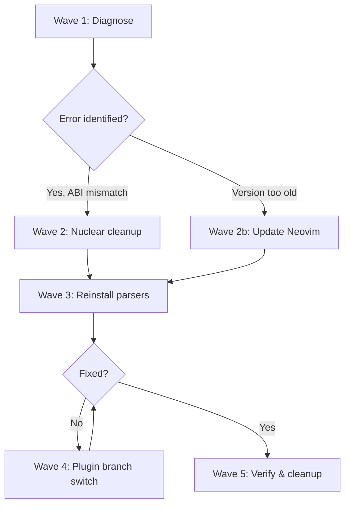

# Plan: Fix Treesitter `range` nil Error (Aggressive Fix)

## Purpose

The user is seeing a persistent treesitter error:
```
Decoration provider "start" (ns=nvim.treesitter.highlighter):
Lua: /usr/share/nvim/runtime/lua/vim/treesitter/languagetree.lua:215:
/usr/share/nvim/runtime/lua/vim/treesitter.lua:196:
attempt to call method 'range' (a nil value)
```

**The standard fix (`:Lazy update nvim-treesitter` + `:TSUpdate`) has FAILED.** This plan provides progressively more aggressive remedies.

## Root Cause Analysis

### What the error means
At `treesitter.lua:196`, the code does `node:range(true)` — calling the `range` method on a `TSNode` userdata object. This method is **implemented in C** (not Lua) by Neovim's bundled tree-sitter library. When it's `nil`, the TSNode was created by a parser `.so` file that is **binary-incompatible** with the tree-sitter C library linked into the current Neovim binary.

### Why `:TSUpdate` didn't fix it
`TSUpdate` only recompiles parsers it considers "outdated" (by comparing revision hashes). Possible failure modes:
- Some parsers were installed manually and aren't tracked by nvim-treesitter's lockfile
- The C compiler produced `.so` files that link against a wrong tree-sitter header
- The nvim-treesitter plugin itself is stale and ships outdated parser grammar URLs
- The `.so` files have accumulated over many months/Neovim versions and some are very old

### Evidence

| Finding | Details |
|---------|---------|
| **Parser count** | **100+ parser `.so` files** — far exceeds the 21 in `ensure_installed`. Many exotic (hoon, squirrel, firrtl, etc.) |
| **Parser accumulation** | Parsers for languages never in `ensure_installed` are present — they've accumulated across many plugin updates over months |
| **nvim-treesitter branch** | `master` at commit `cf12346a` |
| **nvim-treesitter-textobjects** | `main` branch (post-rewrite version) — works independently |
| **Neovim runtime** | `/usr/share/nvim/runtime/` — system package, has 0.10+ APIs (`vim.uv`, `nvim__redraw`, etc.) |
| **No system parsers** | No `.so` files in `/usr/share/nvim/runtime/parser/` — all parsers come from nvim-treesitter |
| **Required ABI** | nvim-treesitter health.lua requires `vim.treesitter.language_version >= 13` |
| **Fold trigger** | `foldexpr = 'v:lua.vim.treesitter.foldexpr()'` triggers treesitter parsing on every buffer, exposing broken parsers |

## Dependency Graph



## Progress

### Wave 1 — Diagnostic (determine exact cause)
- [ ] Task 1.1: Check Neovim version and tree-sitter ABI
- [ ] Task 1.2: Run `:checkhealth nvim-treesitter` and capture output
- [ ] Task 1.3: Identify which specific parser(s) trigger the error

### Wave 2 — Nuclear cleanup (fix the core ABI mismatch)
- [ ] Task 2.1: Delete ALL parser `.so` files from disk
- [ ] Task 2.2: Delete ALL parser-info `.revision` files from disk
- [ ] Task 2.3: Update the nvim-treesitter plugin to latest commit
- [ ] Task 2.4: Clean Neovim caches and state

### Wave 3 — Reinstall parsers fresh
- [ ] Task 3.1: Reopen Neovim and let `ensure_installed` rebuild parsers
- [ ] Task 3.2: Manually install any parsers that fail automatically

### Wave 4 — Escalation (if Wave 2-3 fails)
- [ ] Task 4.1: Switch nvim-treesitter to `main` branch
- [ ] Task 4.2: Consider upgrading/reinstalling Neovim itself
- [ ] Task 4.3: Try building Neovim from source to ensure tree-sitter ABI match

### Wave 5 — Verification & cleanup
- [ ] Task 5.1: Open test files for each major language and verify highlighting
- [ ] Task 5.2: Verify treesitter-based folding works
- [ ] Task 5.3: Remove `ensure_installed` entries for languages the user doesn't use

## Detailed Specifications

---

### Task 1.1: Check Neovim version and tree-sitter ABI

Run **outside Neovim** (in a terminal):
```bash
nvim --version | head -5
```

Run **inside Neovim** (`nvim --headless -c ...`):
```bash
nvim --headless -c 'lua print("NVIM: " .. tostring(vim.version()))' -c 'lua print("TS ABI: " .. tostring(vim.treesitter.language_version))' -c 'q' 2>&1
```

**What to look for:**
- Neovim must be **0.10.0 or newer** (the plugin checks `fn.has "nvim-0.10"`)
- `vim.treesitter.language_version` must be **>= 13** (the minimum ABI the plugin requires)
- If Neovim is **0.9.x**, the plugin itself is incompatible — you need to update Neovim first
- If Neovim is a **nightly/dev build** (0.11.x or prerelease), the ABI may have changed — this is riskier

### Task 1.2: Run checkhealth

Run inside Neovim:
```vim
:checkhealth nvim-treesitter
```

Look for:
- ❌ "Nvim-treesitter requires Nvim 0.10 or newer" → Neovim too old
- ❌ ABI version mismatch → Need to rebuild all parsers
- ❌ Compiler errors → C compiler issues
- ⚠️ Multiple parsers for same language → Could load stale one

### Task 1.3: Identify the triggering parser

The error happens when treesitter tries to highlight or fold a buffer. To find WHICH parser is broken:

Run inside Neovim:
```vim
:lua for _, p in ipairs(require('nvim-treesitter.info').installed_parsers()) do print(p) end
```

Then try opening files of different types:
```bash
# Test common languages one by one
nvim test.lua    # Lua
nvim test.py     # Python  
nvim test.rs     # Rust
nvim test.go     # Go
nvim test.js     # JavaScript
```

The error will appear when opening a file whose parser is broken. **Note which language(s) trigger it.**

---

### Task 2.1: Delete ALL parser `.so` files

**Close Neovim first**, then run in a terminal:

```bash
# Nuclear option: remove every compiled parser
rm -f ~/.local/share/nvim/lazy/nvim-treesitter/parser/*.so
```

**Why this is necessary:** There are 100+ parser `.so` files, many for languages not in `ensure_installed`. These accumulated over months of updates. Some may be years old and compiled against ancient tree-sitter ABIs. `:TSUpdate` won't touch parsers it doesn't track or thinks are current. Only a clean wipe guarantees freshness.

### Task 2.2: Delete ALL parser-info files

```bash
# Remove revision tracking so every parser is treated as "not installed"
rm -f ~/.local/share/nvim/lazy/nvim-treesitter/parser-info/*.revision
```

### Task 2.3: Update the nvim-treesitter plugin

Open Neovim and run:
```vim
:Lazy update nvim-treesitter
```

Or from the terminal (if Neovim keeps erroring):
```bash
cd ~/.local/share/nvim/lazy/nvim-treesitter
git pull origin master
```

**Important:** The plugin must be updated BEFORE reinstalling parsers, because newer plugin versions may include updated parser grammar URLs and compilation fixes.

### Task 2.4: Clean Neovim caches and state

```bash
# Remove treesitter query caches and related state
rm -rf ~/.local/state/nvim/lazy/
rm -rf ~/.cache/nvim/
```

---

### Task 3.1: Reinstall parsers

Open Neovim. With `ensure_installed` configured and the `build = ':TSUpdate'` hook, lazy.nvim should trigger parser compilation. If it doesn't, run manually:

```vim
:TSInstall lua vim vimdoc query c cpp python javascript typescript go json yaml toml markdown markdown_inline html css bash zig rust
```

This will compile each parser from source against the **current** Neovim's tree-sitter headers.

**Watch for errors in the output.** If any parser fails to compile, note the error — it usually indicates a missing C compiler or wrong headers.

### Task 3.2: Handle compilation failures

If `:TSInstall` fails with C compiler errors:

1. Check compiler is available:
   ```bash
   which cc gcc clang
   ```

2. Check if `tree-sitter` CLI is too old:
   ```bash
   tree-sitter --version  # if installed
   ```

3. Try setting a specific compiler in your config:
   ```lua
   -- In lua/plugins/treesitter.lua, add to opts:
   require("nvim-treesitter.install").compilers = { "gcc", "clang", "cc" }
   ```

---

### Task 4.1: Switch nvim-treesitter to `main` branch

If the `master` branch still has issues, try the `main` branch (which may be the newer default):

In `lua/plugins/treesitter.lua`, change:
```lua
{
    'nvim-treesitter/nvim-treesitter',
    branch = 'main',   -- Changed from default/master
    build = ':TSUpdate',
    -- ... rest of config
}
```

Then:
```bash
# Remove the old plugin and let lazy re-clone
rm -rf ~/.local/share/nvim/lazy/nvim-treesitter
```

Open Neovim — lazy.nvim will re-clone the `main` branch.

**Note:** The `main` branch may have a different configuration API. If `opts` with `ensure_installed` doesn't work, check the new branch's README for updated config syntax.

### Task 4.2: Update/reinstall Neovim

If the system Neovim package is outdated (0.9.x), you MUST update it:

```bash
# Check current version
nvim --version | head -1

# For Arch:
sudo pacman -Syu neovim

# For Ubuntu/Debian (may need PPA for latest):
sudo add-apt-repository ppa:neovim-ppa/unstable
sudo apt update && sudo apt install neovim

# Or use the AppImage (universal):
curl -Lo ~/.local/bin/nvim https://github.com/neovim/neovim/releases/latest/download/nvim-linux-x86_64.appimage
chmod +x ~/.local/bin/nvim
```

### Task 4.3: Build Neovim from source (last resort)

If the distro package is too old and you can't use AppImage:

```bash
git clone https://github.com/neovim/neovim.git ~/build/neovim
cd ~/build/neovim
git checkout stable  # or 'master' for nightly
make CMAKE_BUILD_TYPE=Release
sudo make install
```

This guarantees the tree-sitter C library matches the one used to compile parsers.

---

### Task 5.1: Verify highlighting

Open test files and confirm:
1. No error messages appear in `:messages`
2. Syntax highlighting is colorful (not monochrome/flat)
3. `:TSInstallInfo` shows all expected parsers as installed

### Task 5.2: Verify folding

Open a Lua file with functions and check:
- `zc` closes a fold
- `zo` opens a fold
- Folds appear at function boundaries (not random lines)

### Task 5.3: Trim ensure_installed

The current `ensure_installed` list includes languages that may not be needed. After everything works, consider trimming to only languages you actually use. This reduces compilation time and avoids potential issues with exotic parser grammars.

---

## Quick-Reference: Minimal Fix Commands

For convenience, here are all commands in sequence (the "nuclear" path):

```bash
# 1. Close Neovim completely

# 2. Nuke all parsers and metadata
rm -f ~/.local/share/nvim/lazy/nvim-treesitter/parser/*.so
rm -f ~/.local/share/nvim/lazy/nvim-treesitter/parser-info/*.revision

# 3. Clean caches
rm -rf ~/.cache/nvim/

# 4. Update the plugin
cd ~/.local/share/nvim/lazy/nvim-treesitter && git pull origin master

# 5. Open Neovim and reinstall
nvim -c 'TSInstall lua vim vimdoc query c cpp python javascript typescript go json yaml toml markdown markdown_inline html css bash zig rust' -c 'sleep 30' -c 'qa'
# (The sleep gives compilation time; adjust as needed)
# OR open Neovim normally and run :TSInstall manually
```

## Surprises & Discoveries

1. **100+ parsers installed** — far more than the 21 in `ensure_installed`. These include extremely exotic languages (hoon, squirrel, firrtl, nqc, etc.) that accumulated over many months of `TSUpdate` runs or manual installs. Some may be years old with incompatible ABIs.
2. **No system parsers** — `/usr/share/nvim/runtime/parser/` is empty, so there's no conflict between system and lazy-installed parsers.
3. **nvim-treesitter-textobjects is the new version** (`main` branch) — it's independent and uses `vim.treesitter._range` directly. It's unlikely to cause the error but depends on working parsers.
4. **The compat module** handles Neovim 0.10/0.11 API differences, so version-specific breakage within the supported range is handled.
5. **The plugin's health check requires Neovim 0.10+** — if the user is on 0.9.x, the plugin itself is fundamentally incompatible.

## Decision Log

- **Decision:** Recommend nuclear parser wipe over selective update. Reason: With 100+ parsers of unknown age, it's impossible to know which ones are broken. Wiping everything is faster than testing one by one.
- **Decision:** Keep `master` branch as default but offer `main` as escalation. Reason: `master` is the branch the user already has; switching branches is a bigger change that should only happen if the simpler fix fails.
- **Decision:** Include Neovim version check as first step. Reason: If Neovim is too old, no amount of parser rebuilding will help — the plugin requires 0.10+.
- **Assumption:** The system Neovim is 0.10.x (based on runtime having `vim.uv`, `nvim__redraw`, etc.). If it's actually 0.9.x, the fix is "update Neovim."
- **Assumption:** The C compiler (gcc/clang) can produce valid `.so` files. If the compiler is broken, parser compilation will fail regardless.

## Outcomes & Retrospective
[To be completed after fix is applied]
