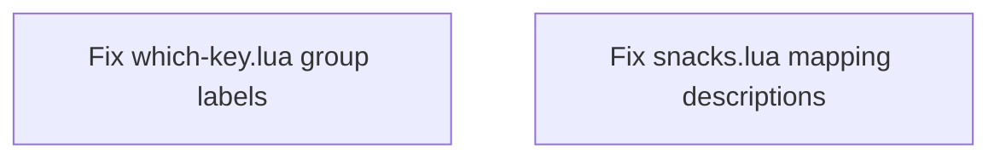

# Plan: Fix Which-Key Label Case Mismatch

## Purpose
The bracketed letter in which-key group labels and mapping descriptions uses uppercase (`[N]otifications`) even when the actual keybind is lowercase (`n`). The bracketed letter should match the case of the keybinding — lowercase keys get `[l]owercase`, uppercase keys get `[U]ppercase`.

## Dependency Graph

No dependencies between tasks — they can run in parallel.

## Progress

### Wave 1 — Fix label case in both files
- [x] Fix all 12 group labels in `which-key.lua` (change `[X]` → `[x]` where key is lowercase)
- [x] Fix all 13 search descriptions in `snacks.lua` (change `[S]` → `[s]` and `[X]` → `[x]` where sub-key is lowercase)

## Detailed Specifications

### Task 1: Fix which-key.lua group labels

**File:** `/home/mazon/.config/nvim/lua/plugins/which-key.lua`

All 12 group labels have uppercase bracketed letters but lowercase keybindings. Changes:

| Line | Key | Current | Fixed |
|------|-----|---------|-------|
| 39 | `c` | `[C]ode` | `[c]ode` |
| 40 | `b` | `[B]uffer` | `[b]uffer` |
| 41 | `s` | `[S]earch` | `[s]earch` |
| 42 | `w` | `[W]orkspace` | `[w]orkspace` |
| 43 | `t` | `[T]oggle` | `[t]oggle` |
| 44 | `h` | `Git [H]unk` | `Git [h]unk` |
| 45 | `g` | `[G]it` | `[g]it` |
| 46 | `o` | `[O]pencode` | `[o]pencode` |
| 47 | `n` | `[N]otifications` | `[n]otifications` |
| 48 | `q` | `[Q]uit/Session` | `[q]uit/Session` |
| 49 | `p` | `[P]aste` | `[p]aste` |
| 50 | `u` | `[U]ndotree` | `[u]ndotree` |

### Task 2: Fix snacks.lua mapping descriptions

**File:** `/home/mazon/.config/nvim/lua/plugins/snacks.lua`

All search-group mappings (`<leader>s...`) use `[S]earch` with uppercase S. Since the key `s` is lowercase, it should be `[s]earch`. Additionally, the sub-key bracketed letter should also match case.

Changes needed:

| Line | Key | Current desc | Fixed desc |
|------|-----|-------------|------------|
| 51 | `sh` | `[S]earch [H]elp` | `[s]earch [h]elp` |
| 52 | `sk` | `[S]earch [K]eymaps` | `[s]earch [k]eymaps` |
| 53 | `sf` | `[S]earch [F]iles` | `[s]earch [f]iles` |
| 54 | `ss` | `[S]earch [S]elect Picker` | `[s]earch [s]elect Picker` |
| 55 | `sw` | `[S]earch current [W]ord` | `[s]earch current [w]ord` |
| 56 | `sg` | `[S]earch by [G]rep` | `[s]earch by [g]rep` |
| 57 | `sd` | `[S]earch [D]iagnostics` | `[s]earch [d]iagnostics` |
| 58 | `sr` | `[S]earch [R]esume` | `[s]earch [r]esume` |
| 59 | `s.` | `[S]earch Recent Files ("." for repeat)` | `[s]earch Recent Files ("." for repeat)` |
| 60 | `sl` | `[S]earch [L]sp Symbols` | `[s]earch [l]sp Symbols` |
| 66 | `s/` | `[S]earch [/] in Open Files` | `[s]earch [/] in Open Files` |
| 67 | `sn` | `[S]earch [N]eovim files` | `[s]earch [n]eovim files` |
| 69 | `sN` | `[S]earch [N]otifications` | `[s]earch [N]otifications` |

**Already correct — no change needed:**
- Line 61: `[ ] Find existing buffers` (space key, no letter to case-match)
- Line 62: `Git [b]ranches` (lowercase b, lowercase `[b]` ✓)
- Line 63: `Git [l]og` (lowercase l, lowercase `[l]` ✓)
- Line 64: `Git file [L]og` (uppercase L, uppercase `[L]` ✓)
- Line 65: `[/] Fuzzily search in current buffer` (`/` is not a letter ✓)

## Surprises & Discoveries
- Some descriptions in `snacks.lua` already follow the correct convention (e.g., `Git [b]ranches`, `Git [l]og`, `Git file [L]og`). This confirms the convention is intentional but was applied inconsistently.
- The pattern `Git file [L]og` for `<leader>gL` correctly keeps `[L]` uppercase because the actual key is uppercase `L`.

## Decision Log
- Decided to only change the bracketed letter case, not the rest of the word. E.g., `[s]earch` not `[s]earch` → `Search` — the remaining word casing stays as-is since it follows normal title casing.
- For `[s]earch [s]elect Picker` (line 54), the second `[s]` matches the key `s` (lowercase), but the first word `select` stays capitalized as `Select` since it's part of the description text.

## Outcomes & Retrospective

All tasks completed successfully. All 12 group labels in which-key.lua and all 13 search descriptions in snacks.lua now use lowercase bracketed letters matching their lowercase keybindings. Uppercase keys (`<leader>gL`, `<leader>sN`) correctly retain uppercase bracketed letters.

### Files Modified
- `lua/plugins/which-key.lua` — 12 group label case fixes
- `lua/plugins/snacks.lua` — 13 search description case fixes

### Verification
- No unintended case changes to already-correct lines (e.g., `Git [b]ranches`, `Git file [L]og`)
- `[s]earch [N]otifications` correctly keeps `N` uppercase (matches `<leader>sN` key)
- Non-letter keys (`[/]`, `[ ]`) left unchanged
