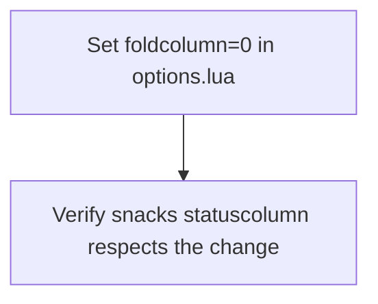

# Plan: Hide Visible Fold Lines in Neovim

## Purpose
The user dislikes the visible folding lines (fold column indicators) that appear on the left side of the editor and wants them hidden/removed entirely. Folding functionality should remain — only the visual indicators should disappear.

## Root Cause Analysis

The fold column is visible due to a **Neovim 0.10 default change**: `foldcolumn` now defaults to `"auto:1"` instead of `"0"`, which automatically shows a 1-column-wide fold column whenever folds exist. Since the user has treesitter-based folding enabled (`foldmethod = 'expr'` with `foldexpr = 'v:lua.vim.treesitter.foldexpr()'`), folds are detected in most files, and the fold column appears.

### Key files examined:
| File | Folding-related content |
|------|------------------------|
| `lua/options.lua` (lines 68-72) | `foldlevel = 99`, `foldmethod = 'expr'`, `foldexpr`, `foldtext = ''` — **no `foldcolumn` set** |
| `lua/plugins/snacks.lua` (line 46) | `statuscolumn = { enabled = true }` — renders fold icons in the status column |
| `lua/plugins/treesitter.lua` | Treesitter with `highlight` and `indent` enabled (enables fold detection) |
| `lua/keymaps.lua` (lines 7-9) | `<leader>tz` toggle for `foldenable` |

### How snacks statuscolumn interacts:
The snacks statuscolumn source (`statuscolumn.lua` line 245) checks:
```lua
local show_folds = vim.v.virtnum == 0 and vim.wo[win].foldcolumn ~= "0"
```
It **only renders fold icons when `foldcolumn` is not `"0"`**. So setting `foldcolumn = "0"` will hide fold indicators in **both** the built-in fold column **and** the snacks statuscolumn.

## Dependency Graph



This is a single-task plan — the fix is one line.

## Progress

### Wave 1 — Hide the fold column
- [x] Add `vim.opt.foldcolumn = "0"` to `lua/options.lua`

## Detailed Specifications

### Task 1: Add `foldcolumn = "0"` to options.lua
**File:** `lua/options.lua`
**Location:** In the existing fold configuration block (lines 68-72), add one line after the existing fold settings.

**Current code (lines 68-72):**
```lua
-- Treesitter-based folding
vim.opt.foldlevel = 99
vim.opt.foldmethod = 'expr'
vim.opt.foldexpr = 'v:lua.vim.treesitter.foldexpr()'
vim.opt.foldtext = ''
```

**New code:**
```lua
-- Treesitter-based folding
vim.opt.foldlevel = 99
vim.opt.foldmethod = 'expr'
vim.opt.foldexpr = 'v:lua.vim.treesitter.foldexpr()'
vim.opt.foldtext = ''
vim.opt.foldcolumn = '0'
```

**Why this is sufficient:**
- `foldcolumn = "0"` hides the built-in Neovim fold column completely
- The snacks statuscolumn checks `foldcolumn ~= "0"` before rendering fold icons, so they will also be hidden
- Folding functionality (`zc`, `zo`, `za`, etc.) still works — only the visual indicators are removed
- The existing `<leader>tz` toggle for `foldenable` continues to work

## Surprises & Discoveries
- Neovim 0.10 changed the default `foldcolumn` from `"0"` to `"auto:1"`, which is likely why the fold column suddenly became visible
- The snacks statuscolumn smartly respects the `foldcolumn` setting — no separate configuration needed there

## Decision Log
- **Decision:** Use `foldcolumn = "0"` instead of disabling the snacks statuscolumn or removing `"fold"` from its config. Reason: it's a single-line change in the canonical options file, and it controls both the built-in fold column and the snacks fold icons simultaneously.
- **Decision:** Keep folding functionality enabled. The user only wants to hide the visual fold column, not disable folding itself.

## Outcomes & Retrospective

**Status:** ✅ Complete

**What was done:** Added `vim.opt.foldcolumn = '0'` to `lua/options.lua` line 73, within the existing Treesitter-based folding block.

**Result:** The fold column is now explicitly set to `"0"`, overriding Neovim 0.10's new default of `"auto:1"`. This hides both the built-in fold column indicators and the snacks statuscolumn fold icons. Folding functionality remains fully operational.

**Files modified:**
- `lua/options.lua` (1 line added)
