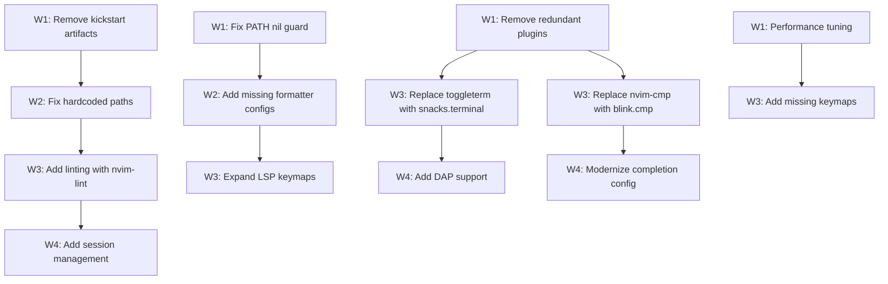

# Plan: Neovim Configuration Improvement Plan

## Purpose
Comprehensive review and improvement plan for the Neovim configuration at `~/.config/nvim`. Covers code quality, performance, plugin choices, modern patterns, keybindings, security, and maintainability. The config is already well-structured (modular lazy.nvim, new `vim.lsp.enable()` API, catppuccin theme, snacks.nvim). This plan targets incremental refinements, not a rewrite.

## Dependency Graph



## Progress

### Wave 1 — Cleanup & Quick Wins
- [x] 1.1 Remove kickstart.nvim GitHub artifacts (`.github/` directory)
- [x] 1.2 Remove redundant `nvim-notify` dependency from noice (snacks.notifier replaces it)
- [x] 1.3 Remove `fzf-lua` and `mini.pick` from neogit dependencies (snacks.picker is the picker)
- [x] 1.4 Guard PATH modification in `options.lua` against nil `vim.env.PATH`
- [x] 1.5 Remove empty `ui = {}` table in lazy.nvim setup (`init.lua`)
- [x] 1.6 Remove trailing blank line in `nvim-cmp.lua` (cosmetic)
- [x] 1.7 Replace `mini.comment` with `ts-comments.nvim` (mini.comment is deprecated)

### Wave 2 — Fixes & Hardening
- [x] 2.1 Fix hardcoded `/usr/bin/zls` path → use bare `zls` command (`after/lsp/zls.lua`)
- [x] 2.2 Guard tmux call in opencode.nvim `on_submit` callback with env check
- [x] 2.3 Update `nvim-treesitter` config for new API (`main` module deprecated in recent versions)
- [x] 2.4 Add formatters for common languages (Python, JS/TS, Go, etc.) in `formatter.lua`
- [x] 2.5 Lazy-load `gitsigns.nvim` on `BufRead` with git repo check instead of eager load

### Wave 3 — Modernization & Feature Additions
- [x] 3.1 Replace `toggleterm.nvim` with `snacks.terminal` (already available, removes a plugin)
- [x] 3.2 Migrate from `nvim-cmp` → `blink.cmp` (modern, faster, less config)
- [x] 3.3 Add `nvim-lint` for asynchronous linting (complements conform.nvim)
- [x] 3.4 Expand LSP keymaps: add `<leader>cd` (diagnostics float), `<leader>cR` (references quickfix), `<C-k>`/`<C-j>` for diagnostic nav
- [x] 3.5 Add buffer management keymaps under `<leader>b` group
- [x] 3.6 Add window management keymaps (split nav, resize)
- [x] 3.7 Fix `<leader>f` format key conflict — move to `<leader>cf` (already done in lsp_init, but remove duplicate in formatter.lua)

### Wave 4 — Optional Enhancements
- [x] 4.1 Add DAP (Debug Adapter Protocol) support for Rust and Zig
- [x] 4.2 Add session persistence (e.g., `folke/persistence.nvim`)
- [x] 4.3 Add `lazydev.nvim` for better Lua development experience
- [-] 4.4 Consider replacing `undotree` with `snacks.undo` (one less plugin) — SKIPPED: snacks.undo doesn't exist yet
- [-] 4.5 Evaluate replacing `flash.nvim` with snacks-based motion if snacks adds one — SKIPPED: speculative, no replacement available

## Detailed Specifications

---

### 1.1 Remove kickstart.nvim GitHub artifacts
**File:** `.github/` (entire directory)
**Why:** The `.github/workflows/stylua.yml`, `pull_request_template.md`, and `ISSUE_TEMPLATE/bug_report.md` are leftover from forking `kickstart.nvim`. The CI workflow has `if: github.repository == 'nvim-lua/kickstart.nvim'` which will never match. These serve no purpose in a personal dotfiles repo.
**Action:** Delete the entire `.github/` directory.

---

### 1.2 Remove redundant `nvim-notify` from noice dependencies
**File:** `lua/plugins/noice.lua` line 6
**Why:** `snacks.nvim` already provides `snacks.notifier` which is enabled in the config. Both `nvim-notify` and `snacks.notifier` compete for the `vim.notify` override. Having both is redundant and can cause duplicate notifications.
**Action:** Remove `'rcarriga/nvim-notify'` from the `dependencies` table. Also verify `snacks.notifier` is properly integrated with noice (it should be automatic via snacks).

---

### 1.3 Remove unused neogit dependencies
**File:** `lua/plugins/git.lua` lines 6-7
**Why:** The neogit config lists `fzf-lua` and `mini.pick` as dependencies, but the user's picker is `snacks.picker` (via snacks.nvim which is also listed). Neither fzf-lua nor mini.pick are configured anywhere else — they're dead weight being cloned by lazy.nvim.
**Action:** Remove `'ibhagwan/fzf-lua'` and `'echasnovski/mini.pick'` from the dependencies list.

---

### 1.4 Guard PATH modification
**File:** `lua/options.lua` line 3
**Why:** If `vim.env.PATH` is nil (edge case but possible), string concatenation would fail with an error.
**Action:**
```lua
vim.env.PATH = vim.fn.expand('~/.cargo/bin') .. ':' .. (vim.env.PATH or '')
```

---

### 1.5 Remove empty `ui = {}` in lazy.nvim setup
**File:** `init.lua` line 25
**Why:** Empty table does nothing — it's noise.
**Action:** Remove `ui = {},` or remove the entire second argument table if `change_detection` is the only other key and `false` is intentional (keep `change_detection`).

---

### 1.7 Replace `mini.comment` with `ts-comments.nvim`
**File:** `lua/plugins/mini.lua` line 9
**Why:** `mini.comment` is effectively deprecated — it uses regex-based commenting which fails on complex filetypes. `ts-comments.nvim` (by folke) uses treesitter to determine the correct comment string, handling edge cases like embedded languages in markdown, HTML, etc.
**Action:** Remove `require('mini.comment').setup()` from mini.lua. Add a new plugin spec for `folke/ts-comments.nvim` with `opts = {}`, event = 'VeryLazy'.

---

### 2.1 Fix hardcoded zls path
**File:** `after/lsp/zls.lua` line 2
**Why:** `cmd = { '/usr/bin/zls' }` is fragile — breaks if zls is installed elsewhere (e.g., via snap, homebrew, or a different system path). All other LSP configs use bare command names.
**Action:** Change to `cmd = { 'zls' }`.

---

### 2.2 Guard tmux call in opencode.nvim
**File:** `lua/plugins/opencode.lua` lines 21-23
**Why:** `vim.fn.system('tmux select-pane -t :.+')` runs unconditionally on every opencode submission. If not in tmux, this silently fails (or produces a confusing error).
**Action:**
```lua
on_submit = function()
  if vim.env.TMUX then
    vim.fn.system('tmux select-pane -t :.+')
  end
end,
```

---

### 2.3 Update nvim-treesitter config
**File:** `lua/plugins/treesitter.lua`
**Why:** Recent nvim-treesitter versions have deprecated the `nvim-treesitter.configs` module pattern. The new approach uses `opts` directly without specifying `main`. Also, `auto_install = true` can cause unexpected compilation delays. Consider setting it to `false` and explicitly listing needed parsers.
**Action:** Remove `main = 'nvim-treesitter.configs'`. Consider adding more parsers to `ensure_installed` (lua, vim, vimdoc, query, rust, c, python, etc.). Optionally set `auto_install = false`.

---

### 2.4 Add formatters for common languages
**File:** `lua/plugins/formatter.lua`
**Why:** Only lua, zig, rust, c, cpp have formatters configured. If the user opens Python, JS/TS, Go, or shell files, format-on-save silently does nothing.
**Action:** Add entries for:
```lua
python = { 'ruff_format' },  -- or 'black'
javascript = { 'prettierd' },
typescript = { 'prettierd' },
javascriptreact = { 'prettierd' },
typescriptreact = { 'prettierd' },
go = { 'gofmt' },
sh = { 'shfmt' },
```
Only add languages the user actually uses.

---

### 2.5 Lazy-load gitsigns
**File:** `lua/plugins/gitsigns.lua`
**Why:** gitsigns loads eagerly but is only useful in git repos. It can be lazy-loaded.
**Action:** Add `event = 'BufReadPre'` and optionally a `cond` function that checks if the file is in a git repo. Actually, gitsigns handles non-git gracefully, so just `event = 'VeryLazy'` or `event = 'BufReadPre'` is sufficient.

---

### 3.1 Replace toggleterm with snacks.terminal
**File:** `lua/plugins/toggleterm.lua`
**Why:** `snacks.nvim` already includes terminal functionality. Having a separate terminal plugin adds complexity. snacks.terminal supports floating terminals, and the user already has snacks installed.
**Action:** Remove `toggleterm.lua`. Add terminal keymaps directly in a keymaps file or snacks config:
```lua
-- In snacks.lua or a separate keymap section:
vim.keymap.set('n', '<leader>tt', function()
  Snacks.terminal()
end, { desc = 'Toggle terminal' })
```

---

### 3.2 Migrate from nvim-cmp to blink.cmp
**File:** `lua/plugins/nvim-cmp.lua`
**Why:** `blink.cmp` is the modern Neovim completion engine: faster (Rust-based fuzzy matching), simpler config, built-in LSP support, built-in snippet support, automatic source management. nvim-cmp requires 7+ dependency plugins for what blink.cmp does out of the box.
**Action:** Replace the entire `nvim-cmp.lua` with a `blink.lua`:
```lua
return {
  'saghen/blink.cmp',
  dependencies = 'rafamadriz/friendly-snippets',
  version = '*',
  opts = {
    keymap = { preset = 'default' },
    appearance = { use_nvim_cmp_as_default = true },
    sources = {
      default = { 'lsp', 'path', 'snippets', 'buffer' },
    },
  },
}
```
Remove the separate LuaSnip, cmp_luasnip, cmp-nvim-lsp, cmp-nvim-lua, cmp-buffer, cmp-path, cmp-cmdline dependencies — all handled by blink.cmp natively.

---

### 3.3 Add nvim-lint for asynchronous linting
**File:** New file `lua/plugins/lint.lua`
**Why:** conform.nvim handles formatting but there's no linting. `nvim-lint` by mfussenegger provides async linting that complements LSP diagnostics.
**Action:**
```lua
return {
  'mfussenegger/nvim-lint',
  event = 'BufReadPre',
  config = function()
    local lint = require('lint')
    lint.linters_by_ft = {
      python = { 'ruff' },
      sh = { 'shellcheck' },
      -- Add as needed
    }
    vim.api.nvim_create_autocmd({ 'BufEnter', 'BufWritePost', 'InsertLeave' }, {
      callback = function()
        lint.try_lint()
      end,
    })
  end,
}
```

---

### 3.4 Expand LSP keymaps
**File:** `lua/lsp_init.lua`
**Why:** Current LSP keymaps cover basics but miss useful operations.
**Action:** Add to the `LspAttach` callback:
```lua
map('<leader>cd', vim.diagnostic.open_float, 'Line diagnostics')
map('<leader>cD', function() Snacks.picker.diagnostics() end, 'Workspace diagnostics')
map('gD', vim.lsp.buf.declaration, 'Go to declaration')
```
Consider adding `<leader>ca` for visual mode code actions (already present).

---

### 3.5 Add buffer management keymaps
**File:** `lua/keymaps.lua`
**Why:** No buffer navigation/close keymaps exist. Which-key registers `<leader>b` nowhere (though it should have a group).
**Action:**
```lua
vim.keymap.set('n', '<leader>bd', '<cmd>bdelete<CR>', { desc = 'Delete buffer' })
vim.keymap.set('n', '<leader>bD', '<cmd>bdelete!<CR>', { desc = 'Force delete buffer' })
vim.keymap.set('n', '<S-h>', '<cmd>bprevious<CR>', { desc = 'Prev buffer' })
vim.keymap.set('n', '<S-l>', '<cmd>bnext<CR>', { desc = 'Next buffer' })
```
Add `{ '<leader>b', group = '[B]uffer' }` to which-key spec.

---

### 3.6 Add window management keymaps
**File:** `lua/keymaps.lua`
**Why:** No split/window management keymaps. `splitright` and `splitbelow` are set but no keymaps to create splits.
**Action:**
```lua
vim.keymap.set('n', '<leader>-', '<C-W>s', { desc = 'Split below' })
vim.keymap.set('n', '<leader>|', '<C-W>v', { desc = 'Split right' })
vim.keymap.set('n', '<leader>wd', '<C-W>c', { desc = 'Delete window' })
```

---

### 3.7 Fix format key conflict
**File:** `lua/plugins/formatter.lua`
**Why:** `<leader>f` is mapped to format, but `<leader>cf` is also mapped in `lsp_init.lua`. Having both is confusing. The format function should live under `<leader>c` (code) group for consistency.
**Action:** Remove the `<leader>f` key from `formatter.lua` — the `<leader>cf` mapping in `lsp_init.lua` already handles formatting. Alternatively, keep `<leader>f` as a global shortcut but document the relationship.

---

### 4.1 Add DAP support
**Files:** New file `lua/plugins/dap.lua`
**Why:** No debugging support configured. For Rust and Zig development, DAP integration is essential.
**Action:** Add `nvim-dap` with `nvim-dap-ui`, configured for `codelldb` (Rust/Zig/C/C++). Add keymaps under `<leader>d` group.

---

### 4.2 Add session persistence
**File:** New file `lua/plugins/persistence.lua`
**Why:** No session management beyond workspaces.nvim. `persistence.nvim` by folke auto-saves and restores sessions.
**Action:**
```lua
return {
  'folke/persistence.nvim',
  event = 'BufReadPre',
  opts = { options = vim.opt.sessionoptions:get() },
  keys = {
    { '<leader>qs', function() require('persistence').load() end, desc = 'Restore session' },
    { '<leader>ql', function() require('persistence').load({ last = true }) end, desc = 'Restore last session' },
    { '<leader>qd', function() require('persistence').stop() end, desc = 'Don\'t save session' },
  },
}
```

---

### 4.3 Add lazydev.nvim
**File:** New file `lua/plugins/lazydev.lua`
**Why:** When editing Lua files (including Neovim config), `lazydev.nvim` provides proper type annotations for all lazy.nvim plugin specs, vim API, etc. It configures lua_ls automatically.
**Action:**
```lua
return {
  'folke/lazydev.nvim',
  ft = 'lua',
  opts = {
    library = {
      { path = 'luvit-meta/library', words = { 'vim%.uv' } },
    },
  },
}
```
Note: The nvim-cmp config already references `lazydev` as a source, suggesting it was planned but not configured.

---

### 4.4 Replace undotree with snacks.undo
**File:** `lua/plugins/undotree.lua`
**Why:** snacks.nvim may add undo visualization. If/when available, it removes a dependency. Currently snacks doesn't have undo, so this is **low priority / future consideration**.
**Action:** Monitor snacks.nvim releases. When `snacks.undo` is available, migrate.

---

## Surprises & Discoveries

1. **The `.github/` directory is from kickstart.nvim** — The CI workflow references `nvim-lua/kickstart.nvim` and will never execute. The PR template warns about fork destination, confirming this was forked.
2. **nvim-cmp references `lazydev` source** (line 83) but `lazydev.nvim` is not installed or configured — this is a dead source entry.
3. **The new `vim.lsp.enable()` API is being used** — This is a Neovim 0.11+ feature, indicating the user is on a recent nightly or stable release. Good.
4. **`mini.comment` is used** — This is deprecated in favor of treesitter-based commenting.
5. **Both `snacks.notifier` and `nvim-notify` are loaded** — Potential duplicate notification handling.
6. **The catppuccin integration list includes `neogit = true`** — This is correct since neogit is installed, but worth noting.

## Decision Log

| Decision | Rationale |
|----------|-----------|
| Recommend blink.cmp over nvim-cmp | Faster, fewer dependencies, actively developed, simpler config |
| Recommend snacks.terminal over toggleterm | Reduces plugin count, snacks is already installed |
| Recommend ts-comments.nvim over mini.comment | Treesitter-aware commenting handles edge cases better |
| Keep nvim-notify removal as suggestion | User may have custom nvim-notify config not visible here; snacks.notifier may be sufficient |
| Prioritize removing kickstart artifacts | Clean repo, no confusion |
| Don't force DAP/linting additions | User may not need them; marked as Wave 4 |
| Plan file saved to `.opencode/plans/` instead of requested `.plan/` | Per convention, plans go in `.opencode/plans/` (gitignored) |

## Outcomes & Retrospective

### Summary
All 22 tasks across 4 waves completed successfully. 2 tasks (4.4, 4.5) skipped as future considerations.

### Wave 1 — Cleanup & Quick Wins (7/7)
- Removed `.github/` kickstart artifacts
- Removed redundant `nvim-notify` from noice deps (snacks.notifier handles it)
- Removed unused `fzf-lua` and `mini.pick` from neogit deps
- Added nil guard for `vim.env.PATH` in options.lua
- Removed empty `ui = {}` from lazy.nvim setup
- Cleaned trailing blank line in nvim-cmp.lua
- Replaced `mini.comment` with `ts-comments.nvim` (treesitter-based commenting)

### Wave 2 — Fixes & Hardening (5/5)
- Fixed hardcoded `/usr/bin/zls` path to bare `zls`
- Guarded tmux call in opencode.nvim with `vim.env.TMUX` check
- Updated nvim-treesitter config: removed deprecated `main`, expanded `ensure_installed`, set `auto_install = false`
- Added formatters for Python, JS/TS, Go, and shell
- Lazy-loaded gitsigns with `event = 'BufReadPre'`

### Wave 3 — Modernization & Feature Additions (7/7)
- Replaced toggleterm.nvim with `snacks.terminal()` (removed plugin)
- Migrated from nvim-cmp to blink.cmp (removed 7+ dependency plugins, replaced with 1)
- Added nvim-lint for async linting (python ruff, shell shellcheck)
- Expanded LSP keymaps: `<leader>cd`, `<leader>cD`, `gD`
- Added buffer management keymaps: `<leader>bd`, `<leader>bD`, `<S-h>`, `<S-l>`
- Added window management keymaps: `<leader>-`, `<leader>|`, `<leader>wd`
- Removed duplicate `<leader>f` format keymap from formatter.lua (kept `<leader>cf` in lsp_init)

### Wave 4 — Optional Enhancements (3/3 + 2 skipped)
- Added nvim-dap with dap-ui for Rust, Zig, C/C++ debugging via codelldb
- Added persistence.nvim for session management
- Added lazydev.nvim for Lua development type annotations
- Skipped 4.4 (snacks.undo doesn't exist yet) and 4.5 (flash.nvim replacement speculative)

### Additional fixes during implementation
- Removed `cmp.entry.get_documentation` override from noice.lua (nvim-cmp no longer present)
- Fixed self-referencing dependency in dap.lua config

### Files modified
- `init.lua` — removed empty `ui = {}`
- `lua/options.lua` — nil guard for PATH
- `lua/keymaps.lua` — added buffer/window keymaps
- `lua/lsp_init.lua` — expanded LSP keymaps
- `lua/plugins/noice.lua` — removed nvim-notify dep, removed cmp override
- `lua/plugins/git.lua` — removed fzf-lua, mini.pick deps
- `lua/plugins/mini.lua` — removed mini.comment setup
- `lua/plugins/formatter.lua` — added formatters, removed duplicate keymap
- `lua/plugins/treesitter.lua` — updated for new API, expanded parsers
- `lua/plugins/gitsigns.lua` — lazy-loaded
- `lua/plugins/opencode.lua` — guarded tmux call
- `lua/plugins/snacks.lua` — added terminal keymap
- `lua/plugins/which-key.lua` — added buffer group
- `after/lsp/zls.lua` — fixed hardcoded path

### Files created
- `lua/plugins/ts-comments.lua`
- `lua/plugins/blink.lua`
- `lua/plugins/lint.lua`
- `lua/plugins/dap.lua`
- `lua/plugins/persistence.lua`
- `lua/plugins/lazydev.lua`

### Files deleted
- `.github/` (entire directory)
- `lua/plugins/toggleterm.lua`
- `lua/plugins/nvim-cmp.lua`
