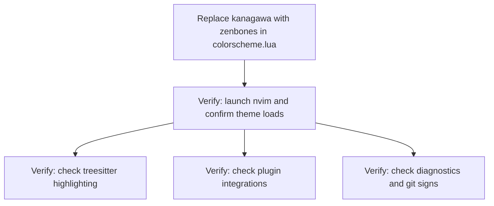

# Plan: Further Desaturate Colorscheme (Round 2)

## Purpose

Kanagawa-dragon is still "too much color" after migrating from Catppuccin Mocha. The user wants syntax highlighting that is predominantly monochrome/grayscale. Two viable approaches exist: **swap to zenbones** (designed from the ground up for this aesthetic) or **heavily desaturate kanagawa-dragon** via theme-level color overrides.

**Recommendation: Swap to zenbones.**

## Analysis

### Why zenbones wins over desaturated kanagawa

| Criterion | zenbones | Desaturated kanagawa |
|-----------|----------|---------------------|
| Philosophy match | Built for this — "colors only for diagnostics/diffs/search, syntax via contrast/font variations" | Fighting the theme — overriding 17 syntax colors to be grayscale |
| Maintenance | Zero overrides needed; theme updates just work | 17 hand-picked hex values that must be re-evaluated if kanagawa changes its highlight mapping |
| Plugin support | gitsigns, neogit, which-key, cmp, telescope, trouble, mini.nvim (via standard groups) | Same — but overrides may affect plugin highlights that reference theme colors |
| Startup | Clean `vim.g.zenbones = { ... }` + `colorscheme zenbones` | Still requires `overrides` function + `colors.theme.dragon.syn` block |
| "Too much color" risk | Near zero — it's intentionally almost colorless | Medium — even desaturated, 8 distinct hue biases may still read as "colored" |
| Diagnostics/VCS | Keeps color for these (intentional design) | Would need additional overrides to desaturate diag/vcs colors too |

The user has now tried **two** colorful themes (Catppuccin → kanagawa-dragon) and said both are too much. The desaturated kanagawa approach is a compromise that still carries kanagawa's warm character. Zenbones was literally designed for exactly this use case.

### What zenbones will look like

- **Syntax**: Almost entirely grayscale — differentiation via **bold**, **italic**, and **lightness contrast** (dark gray vs light gray vs white)
- **Strings**: Italic gray (no green/yellow)
- **Keywords**: Bold gray (no violet/red)
- **Functions**: Regular gray (no blue/green)
- **Types**: Italic gray (no aqua/teal)
- **Comments**: Dimmer gray, italic
- **Diagnostics**: Retain color (red errors, yellow warnings, blue info) — this is intentional and useful
- **Git signs**: Retain subtle color (green add, red delete, yellow change)
- **Search/visual**: Subtle background highlights

### Kanagawa desaturation as fallback

If zenbones feels *too* monochrome (all code is just gray), the desaturated kanagawa provides a middle ground with warm/cool gray biases that give slight visual distinction between syntax categories. The override leverages kanagawa's `colors.theme.dragon.syn` table — this is the *theme-level* mapping (not individual highlight groups), so all derived groups update automatically.

---

## Dependency Graph



Single-file change. All verification is manual.

---

## Progress

### Wave 1 — Replace colorscheme (single file edit)
- [x] **1.1** Replace kanagawa with zenbones in `lua/plugins/colorscheme.lua`

### Wave 2 — Verify (manual, parallel)
- [ ] **2.1** Confirm theme loads without errors on nvim startup
- [ ] **2.2** Check syntax highlighting feels monochrome — code should look mostly grayscale with font variations for differentiation
- [ ] **2.3** Check plugin UI: snacks picker (`<leader>sf`), noice cmdline (`:`), blink completion, which-key (`<leader>`), gitsigns gutter, flash jump (`s`), neogit (`<leader>gs`)
- [ ] **2.4** Confirm diagnostics colors are readable (virtual text, float) — these should still have color
- [ ] **2.5** Confirm git sign colors are visible in gutter

---

## Detailed Specifications

### Task 1.1 — Replace colorscheme in `lua/plugins/colorscheme.lua`

Replace the entire file contents:

```lua
return {
  'zenbones-theme/zenbones.nvim',
  name = 'zenbones',
  priority = 1000,
  dependencies = { 'rktjmp/lush.nvim' },
  config = function()
    vim.g.zenbones = {
      darkness = 'stark',                -- Darkest variant — most muted
      lighten_noncurrent_window = true,  -- Dim inactive windows
      solid_line_nr = true,              -- Solid line number background
      solid_float_border = true,         -- Distinguishable float borders
    }
    vim.opt.background = 'dark'
    vim.cmd.colorscheme 'zenbones'
  end,
}
```

**Configuration decisions:**

| Setting | Rationale |
|---------|-----------|
| `darkness = 'stark'` | Darkest available option. More muted than default or `'warm'`. Best for "too much color" complaint. |
| `lighten_noncurrent_window = true` | Subtle visual cue for active vs inactive window using lightness, not color |
| `solid_line_nr = true` | Gives line numbers a solid background — cleaner look |
| `solid_float_border = true` | Makes float borders (noice, snacks picker, which-key) distinguishable |
| `vim.opt.background = 'dark'` | Explicit — zenbones uses this to select dark mode colors. Not set elsewhere in config. |
| `dependencies = { 'rktjmp/lush.nvim' }` | Required — zenbones is built on lush (a colorscheme creation framework). Without lush, zenbones falls back to compat mode which has fewer features. |

**No explicit `integrations` table needed** — zenbones applies appropriate highlight groups for built-in Neovim groups + treesitter + diagnostics. Plugins that follow standard highlight groups (snacks, noice, blink, flash, mini) will be themed automatically.

**What `darkness = 'stark'` changes:** Background becomes darker and more contrast-heavy. The `warm` option adds slight warmth to the background — `stark` is neutral/cold, which reads as more "monochrome."

### Task 2.x — Manual Verification Checklist

After applying the change, open Neovim and verify:

1. **Theme loads cleanly** — No error messages, lush.nvim loads successfully, dashboard renders
2. **Syntax highlighting feels monochrome** — Open a Lua or Rust file:
   - Keywords, strings, functions, types should look like different **shades of gray** with bold/italic variations
   - You should NOT see distinct green, blue, red, yellow, or purple in syntax
   - Comments should be dimmer gray, italic
   - The overall feel should be "reading text with emphasis" not "colorful code"
3. **Plugin UI** — Test each:
   - `<leader>sf` — snacks picker (should render with zenbones contrast)
   - `:` — noice cmdline popup
   - Type in insert mode — blink completion menu
   - `<leader>` wait — which-key popup
   - `s` — flash jump labels (may still use color for visibility — this is intentional)
   - `<leader>gs` — neogit status
4. **Diagnostics** — Open a file with warnings/errors:
   - Diagnostic virtual text and floats should have **subtle color** (red error, yellow warn) — this is by design
   - If you want diagnostics to also be monochrome, see the "Further tuning" section below
5. **Git signs** — Open a tracked file with changes:
   - `+`, `~`, `-` gutter signs should have **subtle color** (green/red/yellow) — also by design

---

## Fallback: Desaturated Kanagawa-Dragon

If zenbones is *too* monochrome (you miss even the slightest warmth/distinction), use this heavily desaturated kanagawa config. It overrides the `syn` table at the theme level so ALL derived highlight groups update automatically — no need to override individual highlight groups.

```lua
return {
  'rebelot/kanagawa.nvim',
  name = 'kanagawa',
  priority = 1000,
  config = function()
    require('kanagawa').setup {
      background = {
        dark = 'dragon',
      },
      colors = {
        theme = {
          all = {
            ui = {
              bg_gutter = 'none',
            },
          },
          dragon = {
            syn = {
              -- Desaturated: all syntax colors are near-grayscale with slight warm/cool bias
              -- Different LIGHTNESS levels provide visual distinction between categories
              string     = '#95978e', -- warm gray-green (strings: slightly warm)
              variable   = 'none',   -- unchanged (already neutral)
              number     = '#989599', -- neutral gray (numbers: subtle mauve bias)
              constant   = '#a3958e', -- warm gray (constants: slightly warm)
              identifier = '#b5ae9c', -- warm tan-gray (identifiers: warm light)
              parameter  = '#a6a69c', -- neutral gray (parameters: unchanged from dragonGray)
              fun        = '#939da2', -- cool gray (functions: slight cool bias)
              statement  = '#8e93a0', -- blue-gray (statements: cool medium)
              keyword    = '#8e93a0', -- blue-gray (keywords: same as statement)
              operator   = '#a08987', -- warm gray (operators: slight red warmth)
              preproc    = '#a08987', -- warm gray (preproc: same as operator)
              type       = '#939d9c', -- neutral gray (types: balanced)
              regex      = '#a08987', -- warm gray (regex: same as operator)
              punct      = '#9e9b93', -- neutral gray (punctuation: unchanged)
              comment    = '#737c73', -- muted gray-green (comments: unchanged)
              special1   = '#969ba8', -- blue-gray (special: cool)
              special2   = '#a09090', -- warm gray (special2: slight warmth)
              special3   = '#a09090', -- warm gray (special3: same)
            },
          },
        },
      },
      overrides = function(colors)
        local theme = colors.theme
        return {
          NonText = { fg = theme.ui.bg_p1 },
          Whitespace = { fg = theme.ui.bg_p1 },
          Visual = { bg = theme.ui.bg_p2 },
        }
      end,
    }
    vim.cmd.colorscheme 'kanagawa-dragon'
  end,
}
```

**Desaturation strategy:**
- Each color retains a *slight* warm or cool bias (preserving minimal visual distinction)
- Primary differentiation comes from **lightness** (lighter = identifiers/constants, medium = keywords/types, darker = comments/special)
- Diagnostics and VCS colors are left at their defaults — they use color intentionally for readability

---

## Further Tuning Options

If after applying zenbones you want to fine-tune:

### Make diagnostics monochrome too
Add after `vim.cmd.colorscheme 'zenbones'`:
```lua
vim.api.nvim_create_autocmd('ColorScheme', {
  pattern = 'zenbones',
  callback = function()
    vim.api.nvim_set_hl(0, 'DiagnosticError', { fg = '#a08080', italic = true })
    vim.api.nvim_set_hl(0, 'DiagnosticWarn', { fg = '#a09888', italic = true })
    vim.api.nvim_set_hl(0, 'DiagnosticInfo', { fg = '#8898a0', italic = true })
    vim.api.nvim_set_hl(0, 'DiagnosticHint', { fg = '#88a098', italic = true })
  end,
})
```

### Make git signs monochrome
```lua
vim.api.nvim_set_hl(0, 'GitSignsAdd', { fg = '#888888' })
vim.api.nvim_set_hl(0, 'GitSignsChange', { fg = '#999999' })
vim.api.nvim_set_hl(0, 'GitSignsDelete', { fg = '#777777' })
```

### Try `zenwritten` for ZERO color
If even zenbones has too much color in diagnostics/git signs, change:
```lua
vim.cmd.colorscheme 'zenwritten'  -- instead of 'zenbones'
```
`zenwritten` has zero hue and saturation — pure grayscale everywhere.

### Try `darkness = 'warm'` instead of `'stark'`
If `stark` feels too cold, `warm` adds slight warmth to the background while still being monochrome.

---

## Surprises & Discoveries

1. **Previous fallback config had errors** — The zenbones fallback in the original plan used `style = 'dark'`, `lightness = 'dim'`, `darken_noncurrent`, and `dim_noncurrent` which are not valid zenbones dark-mode options. The correct options are `darkness = 'stark'`/`'warm'` and `lighten_noncurrent_window = true`.

2. **Kanagawa's theme-level override system is powerful** — The `colors.theme.dragon.syn` table controls ALL syntax highlight colors via a 17-field table. Overriding these propagates to every derived highlight group automatically. This makes heavy desaturation feasible with just one nested table.

3. **Dragon palette is already muted** — The dragon colors (`dragonPink` #a292a3, `dragonGreen2` #8a9a7b, etc.) are individually desaturated. But having 8 distinct hues still reads as "colorful" overall. The zenbones approach eliminates hue entirely rather than trying to minimize it.

4. **Zenbones plugin coverage is good** — Explicit support for: gitsigns, neogit, which-key, cmp, telescope, trouble, mini.nvim (via standard groups). Not explicitly listed: snacks.nvim, noice, flash — but these follow standard Neovim highlight groups that any well-structured colorscheme covers.

5. **lush.nvim is lightweight** — It's a colorscheme creation framework (~200 lines), not a runtime dependency. It generates the highlight groups at load time and then is done. No performance concern.

6. **`zenwritten` exists as a nuclear option** — If zenbones still has too much color in diagnostics/search, `zenwritten` is literally zero saturation, zero hue. Pure grayscale everywhere.

## Decision Log

| Decision | Rationale |
|----------|-----------|
| **Primary: zenbones over desaturated kanagawa** | User has rejected two colorful themes. Zenbones was designed for this exact aesthetic. Desaturating kanagawa fights its nature and requires maintaining 17 hand-picked hex values. |
| **`darkness = 'stark'`** | Darkest, most muted option. `warm` adds background warmth that might read as "color." Stark is the most monochrome. |
| **Keep diagnostic/VCS colors as-is** | Diagnostic colors (red error, yellow warn) serve a functional purpose. Making them gray reduces usability. User can opt-in to monochrome diagnostics if desired. |
| **`solid_float_border = true`** | Floats (noice, snacks picker, which-key) need visible borders to distinguish from main buffer. Without this, borders can be too subtle. |
| **`vim.opt.background = 'dark'` in config** | Not set in options.lua. zenbones needs it to select dark colors. Setting it in the config function ensures correct timing. |
| **Secondary: desaturated kanagawa config** | Kept as fallback in case zenbones is *too* monochrome. Uses theme-level `syn` overrides for clean propagation. |
| **Removed `bg_gutter = 'none'` from zenbones** | zenbones handles gutter backgrounds well by default. Override is unnecessary. |
| **Kept `bg_gutter = 'none'` in desaturated kanagawa** | Kanagawa's gutter background is a distinct dark shade that may feel like "extra color." Setting to `none` makes it match the main background. |

## Outcomes & Retrospective

_To be completed during execution._
