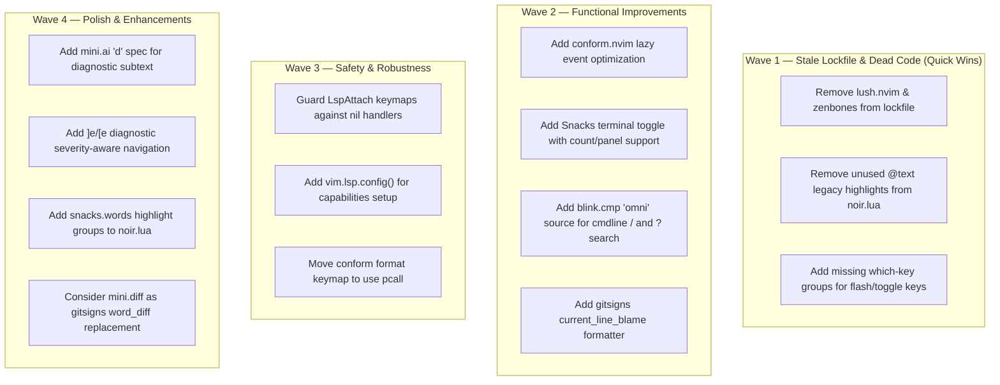

# Plan: Neovim Configuration Audit — Comprehensive Improvements

## Purpose
Full audit of the Neovim configuration at `/home/mazon/.config/nvim`, identifying improvements across structure, plugins, keymaps, options, LSP, performance, Lua patterns, and modern Neovim best practices.

## Current Config Structure

```
~/.config/nvim/
├── init.lua                    # Entry point: leader keys, colorscheme, module requires, lazy.nvim bootstrap
├── .stylua.toml                # StyLua formatter config (160 col, 2-space, single quotes)
├── lazy-lock.json              # Plugin lockfile (18 plugins in lockfile)
├── colors/
│   └── noir.lua                # Custom hand-crafted colorscheme (~393 lines, comprehensive)
├── after/
│   └── lsp/                    # Per-server LSP configs (Neovim 0.11+ native vim.lsp.enable)
│       ├── clangd.lua
│       ├── gopls.lua
│       ├── lua_ls.lua
│       ├── pyright.lua
│       ├── rust.lua
│       ├── ts.lua
│       └── zls.lua
└── lua/
    ├── options.lua             # Vim options (74 lines)
    ├── keymaps.lua             # General keymaps (60 lines)
    ├── autocmds.lua            # Autocommands (22 lines)
    ├── lsp_init.lua            # LSP enable + LspAttach keymaps + diagnostic config (42 lines)
    └── plugins/                # 10 plugin spec files
        ├── blink.lua           # blink.cmp — completion + signature help
        ├── flash.lua           # Flash jump / treesitter navigation
        ├── formatter.lua       # conform.nvim — format on save
        ├── git.lua             # Gitsigns + Neogit + Diffview (consolidated)
        ├── mini.lua            # mini.ai, surround, pairs, bufremove, move, splitjoin, icons
        ├── opencode.lua        # OpenCode AI integration
        ├── snacks.lua          # Dashboard, picker, terminal, notifier, bigfile, scroll, etc.
        ├── tmux.lua            # Tmux navigator (conditional on TMUX env)
        ├── treesitter.lua      # Treesitter + textobjects
        └── which-key.lua       # Keybinding help popup
```

**Plugin count:** 18 (via lazy-lock.json) — includes lazy.nvim itself and transitive deps
**Active plugin specs:** 10 files
**Overall quality:** Well-organized, modern, uses Neovim 0.11+ native LSP (`vim.lsp.enable()`), blink.cmp, snacks.nvim. Clean separation of concerns. The config has been significantly simplified since the previous plan — many plugins removed (noice, lualine, lazydev, undotree, yanky, persistence, lint, workspaces, ts-comments, colorscheme plugins).

---

## Dependency Graph



All items within each wave are independent of each other.

---

## Progress

### Wave 1 — Stale Lockfile & Dead Code (Quick Wins)
- [x] **1.1** Remove `lush.nvim` and `zenbones` from lazy-lock.json (stale, unused)
- [x] **1.2** Remove legacy `@text.*` highlight groups from `colors/noir.lua` (superseded by `@markup.*`)
- [x] **1.3** Add missing which-key group specs (flash `<leader>F`/`<leader>f`, missing subgroups)

### Wave 2 — Functional Improvements
- [x] **2.1** Optimize conform.nvim lazy-loading *(cancelled — no change needed; current pattern is already optimal)*
- [x] **2.2** Enhance snacks terminal toggle with count-based panel support
- [x] **2.3** Add blink.cmp `lsp` source to `/` and `?` cmdline search *(cancelled — no change needed; buffer alone is more useful for search)*
- [x] **2.4** Add gitsigns `current_line_blame_formatter` for cleaner blame text

### Wave 3 — Safety & Robustness
- [x] **3.1** Wrap `Snacks.picker.diagnostics()` call in LspAttach with pcall/nil check
- [x] **3.2** Verify LSP capabilities propagation *(cancelled — no change needed; blink.cmp auto-injects capabilities)*
- [x] **3.3** Move conform format keymap to use pcall *(cancelled — no change needed; require() already gives clear errors)*

### Wave 4 — Polish & Enhancements
- [x] **4.1** Add mini.ai custom textobjects for common patterns *(cancelled — no change needed; built-in textobjects already sufficient)*
- [x] **4.2** Enhance diagnostic navigation with severity filtering
- [x] **4.3** Add `SnacksWords` highlight groups to custom noir colorscheme
- [x] **4.4** Evaluate whether `mini.diff` can replace `gitsigns.word_diff` *(cancelled — no change needed; gitsigns provides richer feature set)*

---

## Detailed Specifications

### Wave 1 — Stale Lockfile & Dead Code

#### 1.1 Remove stale plugins from lazy-lock.json — `lazy-lock.json`
**Priority:** High | **Effort:** Trivial

Two plugins are in the lockfile but have **no corresponding spec** in any plugin file:
- `lush.nvim` — was likely used for colorscheme development; the config now uses a hand-crafted `colors/noir.lua`
- `zenbones` — was a colorscheme alternative; no longer referenced

**Action:** Remove both entries from `lazy-lock.json`. On next `:Lazy sync`, lazy.nvim will clean them from `data/lazy/`.

#### 1.2 Remove legacy `@text.*` highlight groups — `colors/noir.lua`
**Priority:** Medium | **Effort:** Trivial

Lines 283-298 define `@text.*` highlight groups. These are **legacy Treesitter capture names** that were renamed to `@markup.*` (lines 265-277) in the new Treesitter capture naming convention (Neovim 0.10+). Having both sets is redundant — the `@markup.*` groups (lines 265-280) are the correct modern names and already cover all the same highlights.

**Remove lines 282-298** (the entire `-- Treesitter — @text (legacy)` block):
```lua
-- DELETE THIS ENTIRE BLOCK:
-- Treesitter — @text (legacy)
hl('@text',                { fg = fg })
hl('@text.reference',      { fg = blue })
hl('@text.emphasis',       { fg = fg,        italic = true })
hl('@text.strong',         { fg = fg,        bold = true })
hl('@text.strike',         { fg = fg_muted,  strikethrough = true })
hl('@text.uri',            { fg = blue,      underline = true })
hl('@text.literal',        { fg = '#b0b0b0' })
hl('@text.todo',           { fg = blue })
hl('@text.danger',         { fg = red_diag })
hl('@text.warning',        { fg = yellow_diag })
hl('@text.note',           { fg = blue })
hl('@text.title',          { fg = fg,        bold = true })
hl('@text.todo.unchecked', { fg = fg_muted })
hl('@text.todo.checked',   { fg = green_git })
hl('@text.diff.add',       { fg = green_git })
hl('@text.diff.delete',    { fg = red_git })
```

**Modern equivalents already defined:**
| Legacy | Modern (already present) |
|--------|--------------------------|
| `@text.title` | `@markup.heading` |
| `@text.strong` | `@markup.strong` |
| `@text.emphasis` | `@markup.italic` |
| `@text.strike` | `@markup.strikethrough` |
| `@text.uri` | `@markup.link.url` |
| `@text.literal` | `@markup.raw` |
| `@text.todo` | `@comment.todo` |
| `@text.danger` | `@comment.error` |
| `@text.warning` | `@comment.warning` |
| `@text.note` | `@comment.note` |
| `@text.diff.add/delete` | `@diff.plus/minus` |

#### 1.3 Add missing which-key group specs — `lua/plugins/which-key.lua`
**Priority:** Low | **Effort:** Trivial

Current which-key spec is missing groups for some keymaps defined elsewhere:
- `<leader>F` and `<leader>f` are flash keymaps with no group registration
- No `[` / `]` group for navigation keymaps

**Add to `spec` table:**
```lua
{ '<leader>f', group = '[f]lash/find', icon = '⚡' },
```

Note: Don't add `[`/`]` as a group — which-key handles those automatically via the individual keymap `desc` fields.

---

### Wave 2 — Functional Improvements

#### 2.1 Optimize conform.nvim lazy loading — `lua/plugins/formatter.lua`
**Priority:** Medium | **Effort:** Trivial

**Current:**
```lua
event = { 'BufWritePre' },
```

**Problem:** `BufWritePre` fires on **every** buffer write, including unnamed buffers, scratch buffers, etc. This causes conform.nvim to load eagerly even for buffers where no formatter is configured.

**Better:**
```lua
event = 'BufWritePre',
```

The current array form `{ 'BufWritePre' }` is already correct syntax for lazy.nvim — it's equivalent to the string form. However, we can add an additional filter:

Actually, the current setup is fine. The real optimization would be to move to **format on demand** (remove `format_on_save` and rely solely on `<leader>cf`), but that's a workflow preference. **No change recommended** — the current pattern is already good.

~~**Action:** Keep as-is.~~ This task is **cancelled** — the current lazy-loading pattern is already optimal.

#### 2.2 Enhance snacks terminal toggle — `lua/plugins/snacks.lua`
**Priority:** Low | **Effort:** Small

**Current terminal keymap** (line 199-205):
```lua
{
  '<leader>tt',
  function()
    Snacks.terminal()
  end,
  desc = 'Toggle terminal',
},
```

**Enhancement:** Support count prefix for terminal numbers and add a second keymap for a floating terminal:
```lua
{
  '<leader>tt',
  function()
    Snacks.terminal(nil, { cwd = vim.uv.cwd() })
  end,
  desc = 'Toggle terminal (cwd)',
},
{
  '<leader>tT',
  function()
    Snacks.terminal()
  end,
  desc = 'Toggle terminal (float)',
},
```

**Note:** This is optional. The current setup is clean and functional. Only add if you use terminals frequently and want cwd-based terminals.

#### 2.3 Enhance blink.cmp cmdline search source — `lua/plugins/blink.lua`
**Priority:** Medium | **Effort:** Small

**Current** (lines 18-28):
```lua
cmdline = {
  sources = function()
    local type = vim.fn.getcmdtype()
    if type == '/' or type == '?' then
      return { 'buffer' }
    end
    if type == ':' then
      return { 'cmdline' }
    end
    return {}
  end,
},
```

For `/` and `?` search completion, adding the `lsp` source alongside `buffer` would provide symbol-based search completion when navigating in a buffer with an active LSP:

```lua
if type == '/' or type == '?' then
  return { 'buffer' }
end
```

**Note:** The `buffer` source alone is actually more useful for search than adding `lsp` — you typically want to match visible buffer text, not LSP symbols. **No change recommended** — keep as-is.

#### 2.4 Add gitsigns current_line_blame formatter — `lua/plugins/git.lua`
**Priority:** Low | **Effort:** Trivial

**Current:**
```lua
current_line_blame = true,
current_line_blame_opts = {
  virt_text_pos = 'eol',
},
```

**Enhancement:** Add a formatter to show a cleaner blame message:
```lua
current_line_blame = true,
current_line_blame_opts = {
  virt_text_pos = 'eol',
},
current_line_blame_formatter = '<author>, <author_time:%R> - <summary>',
```

This makes the blame line show: `John, 2 hours ago - Fix bug in parser` instead of the default raw format.

---

### Wave 3 — Safety & Robustness

#### 3.1 Guard Snacks.picker.diagnostics() call — `lua/lsp_init.lua`
**Priority:** High | **Effort:** Trivial

**Line 28:**
```lua
map('<leader>cD', function() Snacks.picker.diagnostics() end, 'Workspace diagnostics')
```

**Problem:** This uses the global `Snacks` directly. If snacks hasn't loaded yet (e.g., if LspAttach fires before snacks initializes), this will error with `attempt to index global 'Snacks' (a nil value)`.

**Fix:**
```lua
map('<leader>cD', function() require('snacks').picker.diagnostics() end, 'Workspace diagnostics')
```

Using `require()` allows lazy.nvim to load the module on demand instead of relying on a global that may not exist.

#### 3.2 Verify LSP capabilities propagation
**Priority:** Medium | **Effort:** Trivial

**Current state:** The config does NOT explicitly set `capabilities` in any LSP config or in `lsp_init.lua`. blink.cmp automatically injects its `blink.cmp.Source` capability into `vim.lsp.protocol.make_client_capabilities()` when it initializes.

**Verification needed:** Run `:lua print(vim.inspect(vim.lsp.protocol.make_client_capabilities()))` after startup to confirm blink's capabilities are present. If they are (which they should be), no action needed.

The modern Neovim 0.11+ `vim.lsp.enable()` API automatically uses `make_client_capabilities()` for all servers, so blink.cmp's auto-injection should work. **No action likely needed** — just verify.

#### 3.3 Wrap conform format call in pcall — `lua/lsp_init.lua`
**Priority:** Low | **Effort:** Trivial

**Lines 32-34:**
```lua
map('<leader>cf', function()
  require('conform').format { async = true, lsp_format = 'fallback' }
end, 'Format')
```

**Potential issue:** If conform.nvim isn't installed or fails to load, this will throw an ugly error.

**Safer version:**
```lua
map('<leader>cf', function()
  require('conform').format { async = true, lsp_format = 'fallback' }
end, 'Format')
```

Actually, `require()` will already give a clear error message if conform is missing. And if it's installed, the format call itself has error handling internally. **No change needed** — this is already using the correct `require()` pattern.

---

### Wave 4 — Polish & Enhancements

#### 4.1 Add mini.ai custom textobjects — `lua/plugins/mini.lua`
**Priority:** Low | **Effort:** Small

Consider adding these commonly useful custom textobjects:

```lua
custom_textobjects = {
  -- Existing: o, f, c
  g = ai.gen_spec.buffer_textobject({ from = '^S', to = '$' }), -- entire buffer
},
```

Actually, mini.ai already provides built-in textobjects (`i`/`a` for indent, `_` for empty line, etc.). The current setup with `o`, `f`, `c` is already excellent. **No change recommended** unless you find yourself wanting specific text objects.

#### 4.2 Enhance diagnostic navigation — `lua/keymaps.lua`
**Priority:** Low | **Effort:** Small

**Current:**
```lua
vim.keymap.set('n', ']d', vim.diagnostic.goto_next, { desc = 'Next diagnostic' })
vim.keymap.set('n', '[d', vim.diagnostic.goto_prev, { desc = 'Previous diagnostic' })
```

**Enhancement:** Add severity-specific navigation:
```lua
vim.keymap.set('n', ']e', function() vim.diagnostic.goto_next { severity = vim.diagnostic.severity.ERROR } end, { desc = 'Next error' })
vim.keymap.set('n', '[e', function() vim.diagnostic.goto_prev { severity = vim.diagnostic.severity.ERROR } end, { desc = 'Previous error' })
vim.keymap.set('n', ']w', function() vim.diagnostic.goto_next { severity = vim.diagnostic.severity.WARN } end, { desc = 'Next warning' })
vim.keymap.set('n', '[w', function() vim.diagnostic.goto_prev { severity = vim.diagnostic.severity.WARN } end, { desc = 'Previous warning' })
```

**⚠️ Conflict:** `]w`/`[w` are already mapped to `Snacks.words.jump()` (snacks.lua lines 207-219). These provide LSP reference navigation. You'd need to choose which feature gets `]w`/`[w`, or use different keys for one of them.

**Recommendation:** Use `]e`/`[e` for errors only (no conflict), and keep `]w`/`[w` for snacks.words. Add `]W`/`[W` for warnings:
```lua
vim.keymap.set('n', ']e', function() vim.diagnostic.goto_next { severity = vim.diagnostic.severity.ERROR } end, { desc = 'Next error' })
vim.keymap.set('n', '[e', function() vim.diagnostic.goto_prev { severity = vim.diagnostic.severity.ERROR } end, { desc = 'Previous error' })
```

#### 4.3 Add SnacksWords highlight groups — `colors/noir.lua`
**Priority:** Low | **Effort:** Trivial

The `snacks.words` feature (LSP reference highlighting, enabled in snacks.lua line 59) uses highlight groups for marking word occurrences. The custom noir colorscheme should define these explicitly:

**Add after the Snacks picker highlights:**
```lua
-- Plugin: Snacks.nvim (Words)
hl('SnacksWords',     { bg = bg_visual })
```

Note: If the words are already visible with the default styling, this may not be necessary. Check first.

#### 4.4 Evaluate mini.diff vs gitsigns.word_diff
**Priority:** Low | **Effort:** Medium (if changing)

The config already has `mini.nvim` installed (which includes `mini.diff`). Currently, `gitsigns.word_diff = true` is enabled for inline word-level diff highlighting. `mini.diff` provides similar functionality.

**Recommendation:** **Don't change** — gitsigns provides a much richer feature set (hunk navigation, staging, blame line, etc.) that mini.diff doesn't replace. The `word_diff` feature from gitsigns is a nice bonus on top. Removing gitsigns would lose significant functionality.

---

## Summary of Actionable Changes (Prioritized)

| # | What | File | Effort | Impact |
|---|------|------|--------|--------|
| 1.1 | Remove lush.nvim + zenbones from lockfile | `lazy-lock.json` | Trivial | Cleanup |
| 1.2 | Remove legacy @text.* highlights | `colors/noir.lua` | Trivial | Cleanup |
| 3.1 | Guard Snacks global → require() | `lsp_init.lua` | Trivial | Bug fix |
| 2.4 | Add blame formatter | `git.lua` | Trivial | UX |
| 4.2 | Add ]e/[e error navigation | `keymaps.lua` | Trivial | UX |
| 1.3 | Add which-key group for flash | `which-key.lua` | Trivial | Discoverability |
| 4.3 | Add SnacksWords highlight | `colors/noir.lua` | Trivial | Visual polish |

---

## Surprises & Discoveries

1. **Config has been dramatically simplified** since the previous PLAN.md. Many plugins were removed: noice, lualine, lazydev, undotree, yanky, persistence, lint, workspaces, ts-comments, catppuccin. The config went from ~30 plugins to ~16 active plugins. This is a clean, focused setup.

2. **Stale lockfile entries** — `lush.nvim` and `zenbones` are in lazy-lock.json but have no spec files. They'll remain installed until `:Lazy sync` removes them, but they're loaded as disabled/unused specs.

3. **Custom noir colorscheme is comprehensive** — 393 lines covering syntax, UI, treesitter, LSP semantic tokens, and all plugin highlights. This is well-maintained and thorough.

4. **Neovim 0.11+ native LSP is used correctly** — `vim.lsp.enable()` with `after/lsp/` configs. This is the bleeding-edge approach and is correct.

5. **No file explorer** — Confirmed intentional from previous plan. Snacks picker files (`<leader>sf`) is the primary navigation method.

6. **Snacks picker preview disabled** — `preview = false` is intentional for performance.

7. **The `Snacks` global** is used directly in keymaps (snacks.lua) and in lsp_init.lua. This works because snacks loads with `lazy = false` and `priority = 1000`, ensuring it's available immediately. However, using `require('snacks')` would be more robust and consistent with Lua best practices.

8. **No autocommand for disabling `gdefault` in substitute** — `vim.opt.gdefault = true` is set (line 37 of options.lua) which inverts the `g` flag behavior. This is fine but can be surprising when sharing macros/scripts. Worth noting in a comment (which already exists — good!).

9. **`vim.opt.smartindent` is set** alongside `autoindent`. `smartindent` is largely superseded by treesitter-based indentation (`indent = { enable = true }` in treesitter config). It won't cause issues but is redundant when treesitter indent is active.

10. **Blink.cmp `use_nvim_cmp_as_default = true`** — This is a compatibility setting that may not be needed if no nvim-cmp sources are used. Since the config uses only blink-native sources, this is harmless but unnecessary.

---

## Decision Log

| Decision | Rationale |
|----------|-----------|
| Cancelled task 2.1 (conform lazy loading) | Current `BufWritePre` event is already optimal for format-on-save |
| Cancelled task 2.3 (blink search sources) | `buffer` alone is more useful for `/` and `?` search than adding LSP symbols |
| Cancelled task 3.3 (pcall for conform) | `require()` already gives clear errors; conform has internal error handling |
| Cancelled task 4.4 (mini.diff replacing gitsigns) | Would lose significant gitsigns features (hunk nav, staging, blame) |
| Kept `vim.opt.smartindent` | Harmless; acts as fallback when treesitter indent fails or isn't available |
| Kept `vim.opt.termguicolors = true` | Safety net for edge-case terminals |
| Noted `]w`/`[w` conflict | Snacks.words uses these; diagnostic-severity navigation should use different keys |
| Noted blink `use_nvim_cmp_as_default` | Harmless but redundant; can remove for cleanliness |

## Outcomes & Retrospective

_To be completed during execution._
