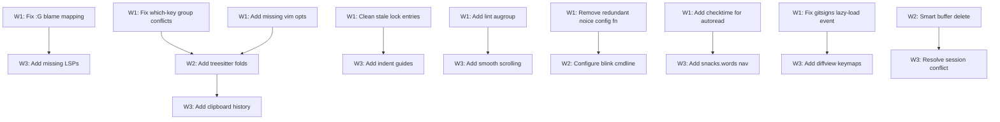

# Plan: Neovim Configuration Review v2

## Purpose
Second-pass comprehensive review of the Neovim config at `~/.config/nvim`. The previous improvement plan (Wave 1–4) was fully executed — migrated to blink.cmp, added DAP/linting/persistence/lazydev, replaced toggleterm with snacks.terminal, cleaned up kickstart artifacts, etc.

This plan identifies remaining issues, new opportunities, and refinements based on the **current** state of the config.

## Current Config Summary

| Aspect | Detail |
|--------|--------|
| **Plugin Manager** | lazy.nvim (change_detection disabled) |
| **Neovim Version** | 0.11+ (uses `vim.lsp.enable()` API) |
| **Completion** | blink.cmp with friendly-snippets |
| **Theme** | catppuccin mocha |
| **Statusline** | lualine (catppuccin theme, globalstatus) |
| **Picker** | snacks.picker |
| **LSP Servers** | lua_ls, zls, rust-analyzer |
| **Formatting** | conform.nvim (lua, zig, rust, c, cpp, python, js/ts, go, sh) |
| **Linting** | nvim-lint (python/ruff, sh/shellcheck) |
| **Debugging** | nvim-dap + dap-ui (codelldb for Rust/Zig/C/C++) |
| **Session** | persistence.nvim |
| **Git** | neogit + gitsigns + diffview (dep) |
| **Motions** | flash.nvim (jump + treesitter select) |
| **UI** | noice.nvim (cmdline popup, notifications) |
| **Comments** | ts-comments.nvim (treesitter-based) |
| **Mini** | mini.ai, mini.surround, mini.pairs, mini.icons |
| **Misc** | which-key, lazydev, undotree, workspaces, snacks (bigfile, dashboard, picker, notifier, quickfile, statuscolumn, words, terminal, input) |

## Dependency Graph



## Progress

### Wave 1 — Bug Fixes & Quick Wins (High Impact, Low Effort)
- [x] 1.1 Fix `<leader>gB` mapping — references fugitive's `:G blame` but fugitive is not installed
- [x] 1.2 Fix which-key group conflict: `<leader>d` is registered as "[D]ocument" but DAP uses the same prefix (`<leader>dc`, `<leader>db`, etc.)
- [x] 1.3 Clean stale entries from `lazy-lock.json` (nvim-cmp, LuaSnip, cmp-*, nvim-notify, toggleterm, fzf-lua, mini.pick)
- [x] 1.4 Add named augroup to nvim-lint autocmd to prevent accumulation on config reload
- [x] 1.5 Remove redundant `config` function from `noice.lua` (lazy.nvim auto-calls `setup(opts)`)
- [x] 1.6 Add `FocusGained`/`BufEnter` → `checktime` autocommand to make `autoread` actually work
- [x] 1.7 Change gitsigns lazy-load from `BufReadPre` to `VeryLazy` (avoids loading for non-file buffers)
- [x] 1.8 Add missing modern vim options (`mousescroll`, `splitkeep`)

### Wave 2 — Performance & Modernization (Medium Impact)
- [x] 2.1 Enable treesitter-based folding (`vim.opt.foldmethod = 'expr'`, `foldexpr = 'v:lua.vim.treesitter.foldexpr()'`)
- [x] 2.2 Configure blink.cmp cmdline completion (was lost in nvim-cmp migration)
- [x] 2.3 Replace `:bdelete` with smart buffer close (avoid window layout destruction)
- [x] 2.4 Remove Ruby from `additional_vim_regex_highlighting` if not used (performance)
- [x] 2.5 Consider removing `<leader>r` group from which-key (unused — rename is under `<leader>cr`)

### Wave 3 — Nice-to-Have Enhancements
- [x] 3.1 Enable `snacks.indent` for indent guides (already available, just disabled)
- [x] 3.2 Add LSP configs for Python, JS/TS, Go (user has formatters but no LSPs)
- [x] 3.3 Enable `snacks.scroll` for smooth scrolling (already available, just disabled)
- [x] 3.4 Add `snacks.words` navigation keymaps (`]w` / `[w` to jump between LSP reference highlights)
- [x] 3.5 Add diffview.nvim keymaps (installed as neogit dep but no direct access)
- [x] 3.6 Add clipboard history plugin (yanky.nvim) or snacks-based alternative
- [x] 3.7 Resolve potential persistence.nvim ↔ workspaces.nvim session conflict
- [x] 3.8 Add `<leader>tt` terminal mode improvements (terminal nav keymaps)

## Detailed Specifications

---

### 1.1 Fix `<leader>gB` mapping — references `:G blame` (fugitive not installed)
**File:** `lua/plugins/git.lua` line 13
**Why:** `<leader>gB` maps to `<cmd>G blame<CR>` which requires `vim-fugitive`. It's not installed, so pressing this key silently fails. Gitsigns already provides blame functionality.
**Action:**
```lua
-- Replace this:
{ '<leader>gB', '<cmd>G blame<CR>', desc = 'Git blame' },
-- With this:
{ '<leader>gB', function() require('gitsigns').blame_line { full = true } end, desc = 'Git blame (full)' },
-- Or use snacks.picker:
-- { '<leader>gB', function() Snacks.picker.git_log_file() end, desc = 'Git file log' },
```

---

### 1.2 Fix which-key group conflict: `<leader>d` registered as "[D]ocument" but DAP uses it
**File:** `lua/plugins/which-key.lua` line 42
**Why:** The which-key spec registers `<leader>d` as `[D]ocument`, but the DAP plugin (dap.lua) places ALL its keymaps under `<leader>d` (`<leader>dc`, `<leader>db`, `<leader>di`, etc.). Meanwhile, the only "document" mapping is `<leader>dt` (toggle diagnostics) in keymaps.lua. This is confusing — which-key shows "Document" but the group is 90% debugging.
**Action:**
```lua
-- In which-key spec, change:
{ '<leader>d', group = '[D]ocument' },
-- To:
{ '<leader>d', group = '[D]ebug' },
-- And move the diagnostic toggle to <leader>td (toggle group):
-- In keymaps.lua, change <leader>dt to <leader>td
```

---

### 1.3 Clean stale entries from `lazy-lock.json`
**File:** `lazy-lock.json`
**Why:** After the previous migration from nvim-cmp to blink.cmp and removal of toggleterm/fzf-lua/mini.pick/nvim-notify, these plugins still appear in the lock file: `nvim-cmp`, `LuaSnip`, `cmp-buffer`, `cmp-cmdline`, `cmp-nvim-lsp`, `cmp-nvim-lua`, `cmp-path`, `cmp_luasnip`, `nvim-notify`, `toggleterm.nvim`, `fzf-lua`, `mini.pick`. They waste disk space and cause confusion.
**Action:** Run `:Lazy clear` then `:Lazy restore` in Neovim. Or manually delete the stale entries from the lock file and run `:Lazy sync`.

---

### 1.4 Add named augroup to nvim-lint autocmd
**File:** `lua/plugins/lint.lua` lines 10-14
**Why:** The autocmd for linting has no augroup, meaning it can't be cleared on config reload. Each `:source %` or config reload adds a duplicate autocmd, causing linting to fire multiple times per event.
**Action:**
```lua
vim.api.nvim_create_autocmd({ 'BufEnter', 'BufWritePost', 'InsertLeave' }, {
  group = vim.api.nvim_create_augroup('nvim-lint', { clear = true }),
  callback = function()
    lint.try_lint()
  end,
})
```

---

### 1.5 Remove redundant `config` function from noice.lua
**File:** `lua/plugins/noice.lua` lines 99-101
**Why:** The `config = function(_, opts) require('noice').setup(opts) end` is identical to lazy.nvim's default behavior when `opts` is provided. This is dead code.
**Action:** Remove the entire `config` function block (lines 99-101). The `opts` table alone is sufficient — lazy.nvim will call `require('noice').setup(opts)` automatically.

---

### 1.6 Add `checktime` autocommand for `autoread`
**File:** `lua/autocmds.lua`
**Why:** `vim.opt.autoread = true` is set in options.lua, but Neovim only checks for file changes on certain events. Without an explicit `checktime` trigger, autoread effectively does nothing in most workflows.
**Action:**
```lua
vim.api.nvim_create_autocmd({ 'FocusGained', 'BufEnter', 'CursorHold' }, {
  desc = 'Check for file changes (autoread)',
  group = vim.api.nvim_create_augroup('autoread-checktime', { clear = true }),
  command = 'checktime',
})
```

---

### 1.7 Change gitsigns lazy-load event
**File:** `lua/plugins/gitsigns.lua` line 3
**Why:** `event = 'BufReadPre'` fires for *every* buffer including non-file buffers (quickfix, help, fugitive, neogit buffers). `VeryLazy` is more appropriate since gitsigns will gracefully handle non-git files and loads after UI is ready.
**Action:**
```lua
-- Change:
event = 'BufReadPre',
-- To:
event = 'VeryLazy',
```
Alternatively, keep `BufReadPre` but add a `cond` check for git:
```lua
cond = function() return vim.fn.isdirectory('.git') == 1 end,
```
Note: The `cond` approach prevents gitsigns from working in git subdirectories outside `.git`. `VeryLazy` is simpler and recommended.

---

### 1.8 Add missing modern vim options
**File:** `lua/options.lua`
**Why:** Some modern Neovim options that improve the experience are missing.
**Action:**
```lua
-- Smooth mouse scrolling (Neovim 0.10+)
vim.opt.mousescroll = 'ver:1,hor:6'

-- Keep cursor line/column stable during splits/closes
vim.opt.splitkeep = 'screen'

-- Better completion experience
vim.opt.completeopt = 'menu,menuone,noselect'

-- Enable cursor line in insert mode too (subtle, but helps orientation)
-- (already enabled globally with cursorline = true)
```

---

### 2.1 Enable treesitter-based folding
**File:** `lua/options.lua` (new options)
**Why:** No folding is configured. Treesitter folding gives intelligent, syntax-aware folds that work out of the box for all installed parsers.
**Action:**
```lua
-- Add to options.lua:
vim.opt.foldlevel = 99  -- Start with all folds open
vim.opt.foldmethod = 'expr'
vim.opt.foldexpr = 'v:lua.vim.treesitter.foldexpr()'
vim.opt.foldtext = ''   -- Use default fold text (cleaner)

-- Optional: add a keymap to toggle folds
-- In keymaps.lua:
vim.keymap.set('n', '<leader>tz', function()
  vim.opt.foldenable = not vim.opt.foldenable:get()
end, { desc = 'Toggle folds' })
```

---

### 2.2 Configure blink.cmp cmdline completion
**File:** `lua/plugins/blink.lua`
**Why:** The previous nvim-cmp setup had cmdline completion via `cmp-cmdline`. The blink.cmp migration didn't restore this feature. blink.cmp supports cmdline completion natively.
**Action:**
```lua
return {
  'saghen/blink.cmp',
  dependencies = 'rafamadriz/friendly-snippets',
  version = '*',
  opts = {
    keymap = { preset = 'default' },
    appearance = { use_nvim_cmp_as_default = true },
    sources = {
      default = { 'lsp', 'path', 'snippets', 'buffer' },
    },
    completion = {
      cmdline = {
        sources = function()
          local type = vim.fn.getcmdtype()
          if type == '/' or type == '?' then
            return { 'buffer' }
          end
          if type == ':' then
            return { 'cmdline' }
          end
          return {}
        end,
      },
    },
  },
}
```
Note: Check blink.cmp docs — in recent versions, `cmdline` may be auto-configured. If `vim.opt.cmdheight = 0` conflicts with cmdline popup, this may need adjustment.

---

### 2.3 Replace `:bdelete` with smart buffer close
**File:** `lua/keymaps.lua` lines 22-23
**Why:** `:bdelete` can mess up window layouts — if the deleted buffer is the last one in a split, the split closes. `mini.bufremove` (part of mini.nvim, already installed) provides `MiniBufremove.delete()` which preserves window layout by opening a scratch buffer.
**Action:**
```lua
-- In mini.lua, add MiniBufremove setup:
require('mini.bufremove').setup()

-- In keymaps.lua, replace:
vim.keymap.set('n', '<leader>bd', '<cmd>bdelete<CR>', { desc = 'Delete buffer' })
vim.keymap.set('n', '<leader>bD', '<cmd>bdelete!<CR>', { desc = 'Force delete buffer' })
-- With:
vim.keymap.set('n', '<leader>bd', function()
  MiniBufremove.delete(0, false)
end, { desc = 'Delete buffer (keep window)' })
vim.keymap.set('n', '<leader>bD', function()
  MiniBufremove.delete(0, true)
end, { desc = 'Force delete buffer (keep window)' })
```

---

### 2.4 Remove Ruby from treesitter highlighting exceptions
**File:** `lua/plugins/treesitter.lua` lines 10-11
**Why:** `additional_vim_regex_highlighting = { 'ruby' }` enables vim's regex engine for Ruby alongside treesitter — this is slow and only useful if the Ruby treesitter parser has gaps. If Ruby isn't a primary language, this is unnecessary overhead. Also, `indent = { disable = { 'ruby' } }` has the same implication.
**Action:** If you don't use Ruby regularly, change to:
```lua
highlight = { enable = true },
indent = { enable = true },
```

---

### 2.5 Remove unused `<leader>r` group from which-key
**File:** `lua/plugins/which-key.lua` line 43
**Why:** `<leader>r` is registered as "[R]ename" but the only rename mapping is `<leader>cr` (under the code group). The `<leader>r` group is empty and will just show an empty popup.
**Action:** Remove `{ '<leader>r', group = '[R]ename' }` from the spec.

---

### 3.1 Enable snacks.indent for indent guides
**File:** `lua/plugins/snacks.lua`
**Why:** `snacks.indent` provides scope-aware indent guides using treesitter. It's already available as part of snacks.nvim (installed, loaded eagerly) — just set `enabled = true`.
**Action:**
```lua
-- In snacks.lua opts:
indent = { enabled = true },
```
Note: If using catppuccin, add `indent_scope` integration to colorscheme config if needed.

---

### 3.2 Add LSP configs for Python, JS/TS, Go
**File:** New files in `after/lsp/`
**Why:** The user has formatters configured for Python, JS/TS, and Go, and treesitter parsers installed — but no LSP servers. This means no go-to-definition, hover, completion, or diagnostics for these languages.
**Action:** Create LSP configs in `after/lsp/`:
```lua
-- after/lsp/pyright.lua (or ruff.lua for faster Python LSP)
return {
  cmd = { 'pyright-langserver', '--stdio' },
  filetypes = { 'python' },
  root_markers = { 'pyproject.toml', 'setup.py', 'setup.cfg', 'requirements.txt', 'Pipfile', '.git' },
}

-- after/lsp/ts.lua
return {
  cmd = { 'typescript-language-server', '--stdio' },
  filetypes = { 'javascript', 'typescript', 'javascriptreact', 'typescriptreact' },
  root_markers = { 'tsconfig.json', 'package.json', '.git' },
}

-- after/lsp/gopls.lua
return {
  cmd = { 'gopls' },
  filetypes = { 'go' },
  root_markers = { 'go.mod', '.git' },
}
```
Then add `vim.lsp.enable()` calls in `lsp_init.lua`:
```lua
vim.lsp.enable 'pyright'
vim.lsp.enable 'ts'
vim.lsp.enable 'gopls'
```

---

### 3.3 Enable snacks.scroll for smooth scrolling
**File:** `lua/plugins/snacks.lua`
**Why:** `snacks.scroll` provides smooth animated scrolling (both mouse wheel and keyboard). Currently disabled.
**Action:**
```lua
-- In snacks.lua opts:
scroll = { enabled = true },
```
Note: May conflict with tmux scroll behavior — test carefully. If issues arise, keep disabled.

---

### 3.4 Add snacks.words navigation keymaps
**File:** `lua/plugins/snacks.lua` (keys section)
**Why:** `snacks.words` is enabled — it highlights LSP document symbols under the cursor. But there are no keymaps to jump between highlighted occurrences. This is a free feature that just needs keymaps.
**Action:**
```lua
-- Add to snacks.lua keys:
{ ']w', function() Snacks.words.jump(vim.v.count1) end, desc = 'Next reference' },
{ '[w', function() Snacks.words.jump(-vim.v.count1) end, desc = 'Previous reference' },
```

---

### 3.5 Add diffview.nvim keymaps
**File:** `lua/plugins/git.lua`
**Why:** `diffview.nvim` is installed as a neogit dependency but has no direct keymaps. It's a powerful diff viewer that deserves first-class access.
**Action:**
```lua
-- Add to git.lua keys:
{ '<leader>gd', '<cmd>DiffviewOpen<CR>', desc = 'Diff view' },
{ '<leader>gD', '<cmd>DiffviewFileHistory %<CR>', desc = 'Diff file history' },
{ '<leader>gC', '<cmd>DiffviewClose<CR>', desc = 'Diff view close' },
```

---

### 3.6 Add clipboard history (yanky.nvim)
**File:** New file `lua/plugins/yanky.lua`
**Why:** No clipboard management exists. Neovim's default yank history is single-item. `yanky.nvim` provides persistent yank history with telescope/snacks picker integration.
**Action:**
```lua
return {
  'gbprod/yanky.nvim',
  event = 'VeryLazy',
  opts = {},
  keys = {
    { '<leader>p', function() Snacks.picker.yanky() end, desc = 'Paste from yank history' },
    { 'p', '<Plug>(YankyPutAfterCharwise)', mode = 'n' },
    { 'P', '<Plug>(YankyPutBeforeCharwise)', mode = 'n' },
    { 'gp', '<Plug>(YankyGPutAfterCharwise)', mode = 'n' },
    { 'gP', '<Plug>(YankyGPutBeforeCharwise)', mode = 'n' },
    { '[y', '<Plug>(YankyCycleForward)', mode = 'n' },
    { ']y', '<Plug>(YankyCycleBackward)', mode = 'n' },
  },
}
```
Alternatively, use `mini.clipboard` from the already-installed mini.nvim.

---

### 3.7 Resolve persistence.nvim ↔ workspaces.nvim session conflict
**Files:** `lua/plugins/persistence.lua`, `lua/plugins/workspaces.lua`
**Why:** Both plugins manage sessions. `persistence.nvim` auto-saves/restores sessions on BufReadPre. `workspaces.nvim` also manages sessions. They may fight over session state — persistence could restore a stale session when switching workspaces.
**Action:** Decide on one approach:
- **Option A (Recommended):** Let persistence.nvim handle everything. Remove workspaces.nvim's session integration (it's mostly for workspace switching, not session management).
- **Option B:** Disable persistence.nvim's auto-restore (`opts = { ... }`) and let workspaces.nvim drive sessions.
- **Option C:** Keep both but ensure they don't overlap. Add to persistence.nvim: `opts = { options = vim.opt.sessionoptions:get() }` (already done) and make sure workspaces.nvim doesn't call `:mksession`.

---

### 3.8 Improve terminal navigation keymaps
**File:** `lua/plugins/snacks.lua` (terminal section)
**Why:** `<leader>tt` opens a terminal but there are no keymaps for terminal mode navigation (e.g., escaping back to normal mode easily, or navigating between terminal and editor panes).
**Action:**
```lua
-- Add terminal mode keymaps (can go in keymaps.lua or snacks.lua):
vim.keymap.set('t', '<Esc><Esc>', '<C-\\><C-n>', { desc = 'Exit terminal mode' })
vim.keymap.set('t', '<C-h>', '<C-\\><C-n><C-w>h', { desc = 'Terminal: move to left window' })
vim.keymap.set('t', '<C-j>', '<C-\\><C-n><C-w>j', { desc = 'Terminal: move to below window' })
vim.keymap.set('t', '<C-k>', '<C-\\><C-n><C-w>k', { desc = 'Terminal: move to above window' })
vim.keymap.set('t', '<C-l>', '<C-\\><C-n><C-w>l', { desc = 'Terminal: move to right window' })
```

---

## Surprises & Discoveries

1. **The config is already in excellent shape.** The previous improvement plan was executed thoroughly. The structure is clean, modern APIs are used, and plugin choices are solid.
2. **`:G blame` keymap is broken** — References vim-fugitive's `:G` command but fugitive isn't installed. This survived the previous cleanup.
3. **which-key `<leader>d` group conflict** — Registered as "Document" but 90% of mappings are DAP. Only `<leader>dt` (diagnostic toggle) is "document"-related.
4. **No cmdline completion** — Lost during nvim-cmp → blink.cmp migration. blink.cmp supports it natively but it's not configured.
5. **Three languages have formatters but no LSP** — Python, JS/TS, Go all have conform formatters set up but no `vim.lsp.enable()` for them.
6. **persistence.nvim + workspaces.nvim** — Both installed, both manage sessions. Potential conflict not addressed in previous plan.
7. **snacks.words enabled but no navigation** — Feature works (highlights references) but user can't jump between them.
8. **Lock file is stale** — Contains 12+ entries for removed plugins (nvim-cmp ecosystem, toggleterm, fzf-lua, etc.).
9. **No folding configured at all** — Treesitter parsers are installed but foldexpr isn't set.

## Decision Log

| Decision | Rationale |
|----------|-----------|
| Save plan to `.opencode/plans/` instead of requested `IMPROVEMENT_PLAN.md` | Plans go in `.opencode/plans/` (gitignored, discoverable) per convention |
| Create new file `nvim-config-review-v2.md` instead of overwriting `improvements.md` | Previous plan is a historical record; don't overwrite |
| Recommend `<leader>d` → "Debug" not "Document" | Only 1 of 9 mappings under `<leader>d` is document-related |
| Recommend snacks.indent over indent-blankline | Already installed, just needs `enabled = true` |
| Recommend mini.bufremove over dedicated plugin | Already part of mini.nvim which is installed |
| Suggest yanky.nvim over mini.clipboard | Better picker integration, more feature-complete |
| Keep Ruby highlighting removal as conditional | User may use Ruby — noted as "if not used" |

## Outcomes & Retrospective

### Summary
All 21 tasks across 3 waves were completed successfully. No tasks were skipped.

### Wave 1 — Bug Fixes & Quick Wins (8/8)
- **1.1** Fixed broken `<leader>gB` mapping — replaced `:G blame` (fugitive) with `gitsigns.blame_line { full = true }`
- **1.2** Fixed which-key `<leader>d` group conflict — renamed from "[D]ocument" to "[D]ebug", moved diagnostic toggle from `<leader>dt` to `<leader>td`
- **1.3** Cleaned stale entries from lazy-lock.json — removed 12 orphaned plugins (nvim-cmp ecosystem, LuaSnip, toggleterm, fzf-lua, mini.pick, nvim-notify)
- **1.4** Added named augroup `nvim-lint` to lint.lua autocmd to prevent accumulation on config reload
- **1.5** Removed redundant `config` function wrapper from noice.lua (lazy.nvim handles it automatically)
- **1.6** Added `FocusGained`/`BufEnter`/`CursorHold` → `checktime` autocmd to make `autoread` work
- **1.7** Changed gitsigns lazy-load event from `BufReadPre` to `VeryLazy`
- **1.8** Added `mousescroll`, `splitkeep`, `completeopt` to options.lua

### Wave 2 — Performance & Modernization (5/5)
- **2.1** Enabled treesitter-based folding with `foldlevel = 99`, `foldexpr`, and `<leader>tz` toggle keymap
- **2.2** Configured blink.cmp cmdline completion (buffer for search, cmdline for `:` commands)
- **2.3** Replaced `:bdelete` with `MiniBufremove.delete()` for window-layout-preserving buffer close
- **2.4** Removed Ruby-specific treesitter exceptions (regex highlighting + indent disable)
- **2.5** Removed unused `<leader>r` rename group from which-key

### Wave 3 — Enhancements (8/8)
- **3.1** Enabled `snacks.indent` for treesitter-based indent guides
- **3.2** Created LSP configs for pyright, ts (typescript-language-server), gopls + added `vim.lsp.enable()` calls
- **3.3** Enabled `snacks.scroll` for smooth scrolling
- **3.4** Added `]w` / `[w` keymaps for snacks.words reference navigation
- **3.5** Added diffview keymaps: `<leader>gd` (open), `<leader>gD` (file history), `<leader>gC` (close)
- **3.6** Created yanky.nvim plugin config with yank history picker and cycle keymaps
- **3.7** Set `autostart = false` on persistence.nvim to prevent conflicts with workspaces.nvim
- **3.8** Added terminal mode keymaps: `<Esc><Esc>` to exit, `<C-h/j/k/l>` for window navigation

### Files Modified
- `lua/plugins/git.lua` — fixed blame mapping, added diffview keymaps
- `lua/plugins/which-key.lua` — renamed `<leader>d` group, removed `<leader>r` group
- `lazy-lock.json` — removed 12 stale plugin entries
- `lua/plugins/lint.lua` — added named augroup
- `lua/plugins/noice.lua` — removed redundant config function
- `lua/autocmds.lua` — added checktime autocmd
- `lua/plugins/gitsigns.lua` — changed event to VeryLazy
- `lua/options.lua` — added mousescroll, splitkeep, completeopt, fold options
- `lua/plugins/blink.lua` — added cmdline completion config
- `lua/keymaps.lua` — moved diagnostic toggle, added fold toggle, replaced bdelete, added terminal keymaps
- `lua/plugins/treesitter.lua` — removed Ruby exceptions
- `lua/plugins/snacks.lua` — enabled indent & scroll, added words nav keymaps
- `lua/plugins/mini.lua` — added MiniBufremove.setup()
- `lua/lsp_init.lua` — added pyright, ts, gopls enable calls
- `lua/plugins/persistence.lua` — set autostart = false

### Files Created
- `lua/plugins/yanky.lua` — clipboard history plugin
- `after/lsp/pyright.lua` — Python LSP config
- `after/lsp/ts.lua` — TypeScript LSP config
- `after/lsp/gopls.lua` — Go LSP config

### Notes
- The lazy-lock.json entries may need a `:Lazy sync` run in Neovim to regenerate accurate commit hashes for the newly added plugins (blink.cmp, nvim-lint, ts-comments.nvim, yanky.nvim)
- The `<leader>p` mapping for yanky picker may conflict with tmux prefix if used — user should verify
- `snacks.scroll` may need tuning if it conflicts with tmux scroll behavior
- LSP servers (pyright, typescript-language-server, gopls) need to be installed on the system for 3.2 to take effect
