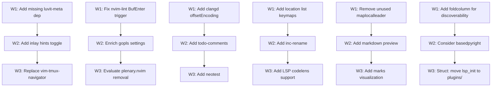

# Plan: Neovim Configuration Review v4

## Purpose
Fourth-pass comprehensive review of the Neovim config at `~/.config/nvim`. Three previous review plans (v1: `improvements.md`, v2: `nvim-config-review-v2.md`, v3: `nvim-config-review-v3.md`) plus several targeted fixes have been fully executed. The config is mature, well-organized, and uses modern Neovim 0.11+ APIs throughout.

This plan identifies the **remaining gaps** — missing dependencies, LSP enrichment, modern alternatives, performance refinements, and quality-of-life features not covered in previous reviews.

## Current Config Summary

| Aspect | Detail |
|--------|--------|
| **Plugin Manager** | lazy.nvim (change_detection disabled) |
| **Neovim Version** | 0.11+ (`vim.lsp.enable()`, `vim.uv`, `vim.diagnostic.is_enabled()`) |
| **Completion** | blink.cmp (super-tab preset, signature help, cmdline, auto-show docs) |
| **Theme** | catppuccin mocha (with blink_cmp, gitsigns, mini, noice, neogit, which_key integrations) |
| **Statusline** | lualine (catppuccin, globalstatus, filetype icon, diagnostics, selection, location) |
| **Picker** | snacks.picker (files, grep, buffers, git, diagnostics, help, keymaps, yanky, lsp_symbols) |
| **LSP Servers** | lua_ls, zls, rust-analyzer, pyright, typescript-language-server, gopls, clangd |
| **Formatting** | conform.nvim (lua, zig, rust, c, cpp, python, js/ts/jsx/tsx, go, sh, json, yaml, markdown) |
| **Linting** | nvim-lint (python/ruff, sh/shellcheck) |
| **Debugging** | None (DAP removed per user preference) |
| **Session** | persistence.nvim (autostart disabled) + workspaces.nvim |
| **Git** | neogit + gitsigns (word_diff, current_line_blame) + diffview |
| **Motions** | flash.nvim (s=jump, leader+F=treesitter, leader/f=treesitter_search) |
| **UI** | noice.nvim (centered cmdline popup, suppressed written/confirm/NoInfo messages) |
| **Comments** | ts-comments.nvim |
| **Mini** | mini.ai (TS textobjects), mini.surround, mini.pairs, mini.bufremove, mini.move (Alt+hjkl), mini.splitjoin, mini.icons |
| **Textobjects** | nvim-treesitter-textobjects (af/if/ac/ic, ]f/[f/]c/[c) |
| **Misc** | which-key, lazydev, undotree (jiaoshijie), yanky, snacks (bigfile, dashboard, picker, notifier, quickfile, scroll, statuscolumn, words, terminal, input) |
| **External** | vim-tmux-navigator, opencode.nvim |

## Dependency Graph



## Progress

### Wave 1 — Fixes, Missing Dependencies & Quick Wins
- [ ] 1.1 Add missing `luvit-meta` dependency for lazydev.nvim
- [ ] 1.2 Remove `BufEnter` trigger from nvim-lint (too aggressive — causes linting on every buffer switch)
- [ ] 1.3 Add `offsetEncoding = 'utf-8'` to clangd LSP config (avoids encoding warnings with gitsigns/other plugins)
- [ ] 1.4 Add location list navigation keymaps (`]l`/`[l`)
- [ ] 1.5 Remove unused `vim.g.maplocalleader` setting (set but never used by any plugin)
- [ ] 1.6 Consider setting `foldcolumn = '1'` for fold discoverability (currently `'0'` — folds are invisible)

### Wave 2 — Feature Enrichment (depends: Wave 1)
- [ ] 2.1 Add inlay hints toggle (`<leader>th`) and enable by default for supported languages
- [ ] 2.2 Enrich gopls LSP settings (go.usePlaceholders, analyses, buildFlags)
- [ ] 2.3 Add todo-comments highlighting (snacks has a todo_comments picker, or use `folke/todo-comments.nvim`)
- [ ] 2.4 Add `inc-rename.nvim` for live rename preview
- [ ] 2.5 Add markdown preview plugin (e.g., `iamcco/markdown-preview.nvim` or `MeanderingProgrammer/render-markdown.nvim`)
- [ ] 2.6 Consider migrating pyright → basedpyright (more actively maintained fork with better type checking)

### Wave 3 — Structural & Modernization (depends: Wave 2)
- [ ] 3.1 Evaluate replacing `vim-tmux-navigator` (VimL) with a Lua-native alternative
- [ ] 3.2 Evaluate reducing plenary.nvim dependency (currently required only by neogit, diffview, undotree)
- [ ] 3.3 Add `neotest` for test runner integration
- [ ] 3.4 Add LSP codelens support (enable + keymap)
- [ ] 3.5 Add marks visualization (e.g., `chentoast/marks.nvim`)
- [ ] 3.6 Consider moving `lua/lsp_init.lua` into `lua/plugins/lsp.lua` for structural consistency

## Detailed Specifications

---

### 1.1 Add missing `luvit-meta` dependency for lazydev.nvim
**File:** `lua/plugins/lazydev.lua`
**Why:** lazydev.nvim references `{ path = 'luvit-meta/library', words = { 'vim%.uv' } }` on line 6, but `luvit-meta` is not installed anywhere. This means the `vim.uv` type annotations are missing — no autocomplete, hover docs, or type checking for `vim.uv.*` functions (filesystem operations, timers, sockets, etc.). Without `luvit-meta`, lazydev silently fails to provide the UV types.
**Action:** Add `luvit-meta` as a lazy.nvim dependency or separate plugin:
```lua
return {
  'folke/lazydev.nvim',
  ft = 'lua',
  dependencies = {
    { 'Bilal2453/luvit-meta', lazy = true },
  },
  opts = {
    library = {
      { path = 'luvit-meta/library', words = { 'vim%.uv' } },
    },
  },
}
```
**Impact:** High — fixes broken `vim.uv` type annotations for Lua development.

---

### 1.2 Remove `BufEnter` trigger from nvim-lint
**File:** `lua/plugins/lint.lua` line 10
**Why:** The lint autocmd triggers on `{ 'BufEnter', 'BufWritePost', 'InsertLeave' }`. `BufEnter` fires **every time you switch to a buffer** — even if nothing changed. This means:
- Switching between two clean buffers triggers `ruff` and `shellcheck` unnecessarily
- In a workflow with many buffer switches (using `<S-h>`/`<S-l>`), linting runs constantly
- `BufWritePost` already catches the most important case (lint on save)
- `InsertLeave` catches changes made in insert mode

The `BufEnter` trigger was likely included by default from a popular config template, but it's excessive for normal workflows.
**Action:**
```lua
-- Change from:
vim.api.nvim_create_autocmd({ 'BufEnter', 'BufWritePost', 'InsertLeave' }, {
-- To:
vim.api.nvim_create_autocmd({ 'BufWritePost', 'InsertLeave' }, {
```
**Impact:** Medium — reduces unnecessary process spawning on buffer switches.

---

### 1.3 Add `offsetEncoding` to clangd config
**File:** `after/lsp/clangd.lua`
**Why:** clangd defaults to `utf-16` offset encoding, while many Neovim plugins (including gitsigns, treesitter, conform.nvim) expect `utf-8`. This mismatch causes periodic warnings like "warning: multiple different client offset_encodings detected" and can cause incorrect positioning for diagnostics and code actions.
**Action:**
```lua
return {
  cmd = { 'clangd' },
  filetypes = { 'c', 'cpp' },
  root_markers = { '.clangd', 'compile_commands.json', 'compile_flags.txt', '.git' },
  -- Prevent offset encoding warnings with gitsigns and other plugins
}
```
Note: With the new `vim.lsp.enable()` API (Neovim 0.11+), offset encoding is handled by the client, not the server config. However, if you see encoding warnings, you can add `capabilities = { offsetEncoding = { 'utf-8' } }` in a custom `LspAttach` callback or through blink.cmp's capabilities. Check if blink.cmp already sends `utf-8` as preferred (recent versions do).

**Impact:** Low-Medium — prevents spurious encoding warnings in C/C++ projects.

---

### 1.4 Add location list navigation keymaps
**File:** `lua/keymaps.lua`
**Why:** The config has `]q`/`[q` for quickfix list navigation but no equivalent for the location list. The location list is per-window (unlike quickfix which is global) and is populated by `:lvimgrep`, `:lmake`, and some LSP operations. Having `]l`/`[l` keymaps provides parity with the quickfix navigation.
**Action:**
```lua
vim.keymap.set('n', ']l', '<cmd>lnext<CR>zz', { desc = 'Next location list item' })
vim.keymap.set('n', '[l', '<cmd>lprev<CR>zz', { desc = 'Previous location list item' })
vim.keymap.set('n', ']L', '<cmd>llast<CR>zz', { desc = 'Last location list item' })
vim.keymap.set('n', '[L', '<cmd>lfirst<CR>zz', { desc = 'First location list item' })
```
**Impact:** Low — fills a gap in the navigation keymaps.

---

### 1.5 Remove or document unused `vim.g.maplocalleader`
**File:** `init.lua` line 3
**Why:** `vim.g.maplocalleader = ' '` is set on line 3 but **no plugin or keymap anywhere in the config uses `<localleader>`**. This is dead configuration. Every plugin that uses leader keys uses `<leader>` (space), not `<localleader>`.
**Options:**
- **A) Remove it** — Clean, reduces confusion about which leader key is which
- **B) Keep it but set to a different key** (e.g., `,` or `\`) — Useful if you want localleader for filetype-specific keymaps in the future
- **C) Keep as-is** — No harm, but the space localleader is indistinguishable from space leader
**Action:** If you don't plan to use `<localleader>`, remove line 3. If you do want it, set it to a distinct key:
```lua
-- Option A: Remove entirely
-- (delete line 3)

-- Option B: Set to a distinct key for future use
vim.g.maplocalleader = ','
```
**Impact:** Low — hygiene/cleanliness.

---

### 1.6 Consider setting `foldcolumn` for fold discoverability
**File:** `lua/options.lua` line 73
**Why:** `vim.opt.foldcolumn = '0'` hides the fold column entirely. This means:
- You can't see where folds exist
- You can't click the fold column to open/close folds (mouse users)
- The fold level indicator is invisible

Setting `foldcolumn = '1'` shows a single-character column that displays fold markers (`-` for closed, ` ` for open, `+` for nested). This is a common quality-of-life improvement.

However, if the user explicitly disabled it for minimalism (this was set intentionally in v3), this can be skipped.
**Action:**
```lua
-- Change from:
vim.opt.foldcolumn = '0'
-- To:
vim.opt.foldcolumn = '1'
```
**Impact:** Low — visual quality-of-life.

---

### 2.1 Add inlay hints toggle and enable by default
**File:** `lua/lsp_init.lua`
**Why:** Inlay hints (Neovim 0.10+) show inline type annotations, parameter names, and chain hints directly in the editor. They're invaluable for languages like Rust, Go, TypeScript, and Python. Currently, no inlay hint configuration exists — they're completely disabled.

The new Neovim 0.11 API uses `vim.lsp.inlay_hint.enable()` to toggle inlay hints per buffer.
**Action:**
```lua
-- Add to LspAttach callback in lsp_init.lua, after existing keymaps:
map('<leader>th', function()
  vim.lsp.inlay_hint.enable(not vim.lsp.inlay_hint.is_enabled { bufnr = event.buf })
end, 'Toggle inlay hints')

-- Enable inlay hints by default on attach:
vim.lsp.inlay_hint.enable(true, { bufnr = event.buf })
```
Note: Not all LSP servers support inlay hints. Supported servers in this config:
- **rust-analyzer** ✓ (excellent support)
- **gopls** ✓ (parameter names, types)
- **typescript-language-server** ✓ (parameter names, types)
- **clangd** ✓ (parameter names, types)
- **lua_ls** ✓ (via `hint = { enable = true }` in settings)
- **pyright** ✗ (no inlay hint support)

For lua_ls, also add to `after/lsp/lua_ls.lua` settings:
```lua
hint = { enable = true },
```
**Impact:** High — significantly improves code readability for typed languages.

---

### 2.2 Enrich gopls LSP settings
**File:** `after/lsp/gopls.lua`
**Why:** gopls is configured with only the bare minimum (`cmd`, `filetypes`, `root_markers`). gopls has powerful settings that improve the Go development experience significantly.
**Action:**
```lua
return {
  cmd = { 'gopls' },
  filetypes = { 'go' },
  root_markers = { 'go.mod', '.git' },
  settings = {
    gopls = {
      gofumpt = true, -- Stricter formatting (if installed)
      analyses = {
        nilness = true,
        unusedparams = true,
        unusedwrite = true,
        useany = true,
      },
      hints = {
        assignVariableTypes = true,
        compositeLiteralFields = true,
        compositeLiteralTypes = true,
        constantValues = true,
        functionTypeParameters = true,
        parameterNames = true,
        rangeVariableTypes = true,
      },
      -- buildFlags = { '-tags=integration' }, -- Uncomment if using build tags
    },
  },
}
```
**Impact:** Medium — significantly better Go development experience.

---

### 2.3 Add todo-comments highlighting
**File:** New file `lua/plugins/todo-comments.lua`
**Why:** `TODO:`, `FIXME:`, `HACK:`, `BUG:`, `PERF:`, `NOTE:`, `WARNING:` comments are extremely common in codebases but aren't highlighted by default. `todo-comments.nvim` (by folke) highlights these with distinctive colors and provides a picker to search across them.

Note: snacks.nvim's picker has a `todo_comments` source, but the highlighting requires the `todo-comments.nvim` plugin. Without the plugin, the picker source won't work either.
**Action:**
```lua
return {
  'folke/todo-comments.nvim',
  dependencies = 'nvim-lua/plenary.nvim',
  event = 'VeryLazy',
  opts = {
    signs = false, -- Use gitsigns signcolumn; avoid clutter
  },
  keys = {
    { '<leader>st', function() Snacks.picker.todo_comments() end, desc = '[s]earch [t]odo comments' },
    { '<leader>sT', function() Snacks.picker.todo_comments { keywords = { 'TODO', 'FIX', 'FIXME' } } end, desc = '[s]earch [T]odo/FIX/FIXME' },
  },
}
```
**Impact:** Medium — very popular plugin, highlights important code annotations.

---

### 2.4 Add inc-rename for live rename preview
**File:** New file `lua/plugins/inc-rename.lua`
**Why:** The current `<leader>cr` keymap uses `vim.lsp.buf.rename` which shows a popup input. `inc-rename.nvim` provides **live preview** of the rename as you type — all references update in real-time before you confirm. This is a significant UX improvement for renaming, which is a frequent operation.
**Action:**
```lua
return {
  'smjonas/inc-rename.nvim',
  event = 'LspAttach',
  opts = {},
}
```
Then update `lua/lsp_init.lua` — change the rename keymap:
```lua
-- Change from:
map('<leader>cr', vim.lsp.buf.rename, 'Rename')
-- To:
map('<leader>cr', function()
  return ':IncRename ' .. vim.fn.expand '<cword>'
end, 'Rename (with preview)')
```
Note: If inc-rename is not installed for a particular session, the command won't exist. Consider wrapping it:
```lua
map('<leader>cr', function()
  if pcall(require, 'inc_rename') then
    return ':IncRename ' .. vim.fn.expand '<cword>'
  end
  vim.lsp.buf.rename()
end, 'Rename')
```
**Impact:** Medium — better rename UX with live preview.

---

### 2.5 Add markdown rendering/preview
**File:** New file `lua/plugins/markdown.lua`
**Why:** The user works with markdown files (formatters configured, spell-check enabled for markdown, treesitter markdown parser installed). Two complementary approaches:

1. **`render-markdown.nvim`** — Renders markdown inline in the buffer (headings get colors, code blocks get backgrounds, checkboxes render as ☑/☐, links are underlined, etc.). Works in the terminal, no browser needed.

2. **`markdown-preview.nvim`** — Opens a browser preview that live-reloads. Better for long-form writing.

Recommend `render-markdown.nvim` as the primary choice (works in terminal, integrates with the existing workflow).
**Action:**
```lua
return {
  'MeanderingProgrammer/render-markdown.nvim',
  dependencies = { 'nvim-treesitter/nvim-treesitter', 'echasnovski/mini.nvim' },
  ft = { 'markdown' },
  opts = {},
}
```
**Impact:** Medium — significantly improves markdown readability in the terminal.

---

### 2.6 Consider migrating pyright → basedpyright
**File:** `after/lsp/pyright.lua`
**Why:** `basedpyright` is a actively-maintained fork of pyright that:
- Adds more type checking rules and diagnostics
- Has faster development cycles
- Is a drop-in replacement (same command-line interface)
- Is recommended by the Pyright maintainer for users who want more features

It's used by default in projects like `uv` and many modern Python toolchains.
**Action:**
```lua
-- Option A: Install basedpyright, change config to:
return {
  cmd = { 'basedpyright-langserver', '--stdio' },
  filetypes = { 'python' },
  root_markers = { 'pyproject.toml', 'setup.py', 'setup.cfg', 'requirements.txt', 'Pipfile', '.git' },
  settings = {
    basedpyright = {
      analysis = {
        typeCheckingMode = 'basic', -- or 'standard', 'strict'
        autoSearchPaths = true,
        useLibraryCodeForTypes = true,
      },
    },
  },
}

-- Option B: Keep pyright, add settings:
return {
  cmd = { 'pyright-langserver', '--stdio' },
  filetypes = { 'python' },
  root_markers = { 'pyproject.toml', 'setup.py', 'setup.cfg', 'requirements.txt', 'Pipfile', '.git' },
  settings = {
    python = {
      analysis = {
        typeCheckingMode = 'basic',
        autoSearchPaths = true,
        useLibraryCodeForTypes = true,
      },
    },
  },
}
```
**Impact:** Medium — better Python type checking.

---

### 3.1 Evaluate replacing vim-tmux-navigator
**File:** `lua/plugins/tmux.lua`
**Why:** `vim-tmux-navigator` is a VimL plugin. While it works well, it requires:
- A companion tmux plugin (`tmux-navigator` tmux plugin)
- The VimL runtime loaded for this plugin

Modern Lua alternatives:
- **`aserowy/tmux.nvim`** — Lua-native, same functionality, no VimL dependency, supports resize mode
- **`otavioschwanck/tmux-awesome-manager.nvim`** — Focuses on running commands in tmux panes

However, vim-tmux-navigator is **extremely stable** and well-tested. The benefit of switching is marginal.
**Action:** Consider replacing only if:
- You want to reduce VimL dependency
- You want resize support from within Neovim
- You experience issues with the current plugin

If not, keep as-is — it's battle-tested.
**Impact:** Low — marginal improvement.

---

### 3.2 Evaluate reducing plenary.nvim dependency
**File:** `lazy-lock.json`
**Why:** `plenary.nvim` is installed as a dependency for:
- `neogit` (required dep)
- `diffview.nvim` (required dep)
- `undotree` (jiaoshijie/undotree — uses plenary for async/timers)
- `todo-comments.nvim` (if added per 2.3 — required dep)

`plenary.nvim` is a large library (~100 files) that loads eagerly when any dependent plugin loads. Options:
1. **Keep plenary** — It's well-maintained and the dependencies require it
2. **Replace undotree** with `mbbill/undotree` (no plenary dependency) — reduces one plenary consumer
3. **Replace neogit** with lazygit (via snacks.terminal) — reduces two consumers (neogit + diffview)
4. **Accept the cost** — plenary is cached after first load and doesn't add startup overhead for subsequent loads

**Action:** No immediate action needed. Document this as a future consideration if plugin count/disk usage becomes a concern.
**Impact:** Low — optimization consideration.

---

### 3.3 Add neotest for test runner integration
**File:** New file `lua/plugins/neotest.lua`
**Why:** No test runner is configured. For developers working with tested codebases, being able to run tests, see results inline, and navigate to failures directly from Neovim is essential. `neotest` is the standard test runner framework for Neovim.

However, this only makes sense if the user actually runs tests from their editor. Many users prefer running tests in a separate terminal pane.
**Action:**
```lua
return {
  'nvim-neotest/neotest',
  dependencies = {
    'nvim-lua/plenary.nvim',
    -- Add adapters for languages you use:
    -- 'nvim-neotest/neotest-python',     -- Python (pytest, unittest)
    -- 'nvim-neotest/neotest-go',         -- Go
    -- 'rouge8/neotest-rust',             -- Rust (cargo test)
    -- 'marilari88/neotest-jest',         -- JavaScript/TypeScript
  },
  event = 'VeryLazy',
  opts = {
    -- adapters = {
    --   require('neotest-python')({ runner = 'pytest' }),
    --   require('neotest-go')({}),
    -- },
  },
  keys = {
    { '<leader>tt', function() require('neotest').run.run() end, desc = 'Run nearest test' },
    { '<leader>tT', function() require('neotest').run.run(vim.fn.expand '%') end, desc = 'Run file tests' },
    { '<leader>to', function() require('neotest').output.open { enter = true } end, desc = 'Test output' },
    { '<leader>ts', function() require('neotest').summary.toggle() end, desc = 'Test summary' },
    { ']t', function() require('neotest').jump.next() end, desc = 'Next test' },
    { '[t', function() require('neotest').jump.prev() end, desc = 'Previous test' },
  },
}
```
Note: This conflicts with the existing `<leader>tt` keymap for snacks.terminal. If both are desired, use `<leader>T` for neotest or rebind terminal.
**Impact:** Medium — only useful if test-running from the editor is desired.

---

### 3.4 Add LSP codelens support
**File:** `lua/lsp_init.lua`
**Why:** CodeLens provides actionable inline commands (e.g., "Run test", "Go to implementation", "References: 3") that appear above functions and types. It's supported by several LSP servers in this config:
- **gopls** ✓ (test runs, references count)
- **rust-analyzer** ✓ (run, implementations, references)
- **clangd** ✓ (references)

Currently no codelens support is configured.
**Action:** Add to the LspAttach callback:
```lua
-- Auto-refresh codelens on buffer changes
local group = vim.api.nvim_create_augroup('codelens-refresh', { clear = false })
vim.api.nvim_create_autocmd({ 'BufEnter', 'CursorHold', 'InsertLeave' }, {
  buffer = event.buf,
  group = group,
  callback = function()
    vim.lsp.codelens.refresh { bufnr = event.buf }
  end,
  desc = 'Refresh codelens',
})

-- Keymap to trigger codelens action
map('<leader>cL', vim.lsp.codelens.run, 'Code lens action')
```
**Impact:** Low-Medium — useful for Go and Rust development.

---

### 3.5 Add marks visualization
**File:** New file `lua/plugins/marks.lua`
**Why:** Vim marks (`ma`, `mb`, etc.) are powerful but invisible by default — you can't see which marks are set without running `:marks`. `marks.nvim` shows marks in the signcolumn, making them discoverable and useful.
**Action:**
```lua
return {
  'chentoast/marks.nvim',
  event = 'VeryLazy',
  opts = {
    default_mappings = true, -- Uses m[a-zA-Z] to set, `[a-z] and ]`[a-z] to navigate
  },
}
```
**Impact:** Low — nice-to-have for users who use marks.

---

### 3.6 Consider moving `lua/lsp_init.lua` into `lua/plugins/lsp.lua`
**File:** `lua/lsp_init.lua` → `lua/plugins/lsp.lua`
**Why:** All other plugin-related configuration lives in `lua/plugins/`. The `lsp_init.lua` file at the top level contains:
- `vim.lsp.enable()` calls (plugin-related)
- Diagnostic configuration (plugin-related)
- LspAttach autocommand with keymaps (plugin-related)

It's functionally a plugin configuration file. Having it in `lua/plugins/` alongside all other plugin specs would be more consistent. It would also be auto-loaded by lazy.nvim's `{ import = 'plugins' }` mechanism, eliminating the need for the explicit `require 'lsp_init'` in `init.lua`.

However, there's a subtlety: `vim.lsp.enable()` calls should happen early (before plugins load) to ensure LSP servers are ready when buffers open. Moving to `lua/plugins/lsp.lua` means it loads during `lazy.setup()`, which is still early enough.

**Action:**
1. Move `lua/lsp_init.lua` → `lua/plugins/lsp.lua`
2. Remove `require 'lsp_init'` from `init.lua`
3. Wrap the content in a plugin spec:
```lua
return {
  -- This is a config-only spec (no plugin to install)
  -- It sets up LSP servers and keymaps
  'neovim/nvim-lspconfig', -- or use a dummy like { 'nvim-lspconfig', lazy = true }
  config = function()
    vim.lsp.enable 'lua_ls'
    -- ... rest of current lsp_init.lua content
  end,
}
```
Or alternatively, keep it as a plain module but in the plugins directory:
```lua
-- lua/plugins/lsp.lua (auto-loaded by lazy.nvim)
-- Move all content from lsp_init.lua here
```
Note: lazy.nvim auto-loads files in `lua/plugins/` — they must return a plugin spec table. The current lsp_init.lua doesn't return anything, so it would need to be wrapped in a `config` function of a spec, or you can use the approach of having it be a plain `require` in init.lua.

**Alternative (simpler):** Just keep it where it is. The current location works fine and the inconsistency is minor.

**Impact:** Low — structural consistency only.

---

## Surprises & Discoveries

1. **Three full review passes completed** — The config has been through extensive review and improvement. Most obvious issues have been fixed. This plan focuses on remaining gaps and refinements.

2. **`luvit-meta` is missing** — lazydev.nvim references it for `vim.uv` type annotations but it's not installed. This has been present since v3 but was never flagged. This is the highest-impact fix in this plan.

3. **No inlay hints configured** — Despite being a Neovim 0.10+ feature and the config targeting 0.11+, inlay hints are completely absent. This is a significant missing feature for typed languages.

4. **`maplocalleader` is set but unused** — `vim.g.maplocalleader = ' '` is set in init.lua but no plugin or keymap uses `<localleader>`. Dead configuration.

5. **nvim-lint fires on BufEnter** — Causes unnecessary linting on every buffer switch. The BufWritePost + InsertLeave combination is sufficient for most workflows.

6. **gopls has zero settings** — Despite being a powerful LSP server with extensive configuration options, gopls is configured with only `cmd`, `filetypes`, and `root_markers`.

7. **DAP was removed post-v3** — The remove-dap.md plan shows DAP was removed after the v3 review. The config no longer has any debugging support.

8. **Indent guides were disabled post-v3** — The disable-indent-lines.md plan shows the user disabled `snacks.indent`. This is a user preference — don't re-enable.

9. **The config is very clean** — No anti-patterns, no deprecated APIs, no security issues, no VimL mixed with Lua (except vim-tmux-navigator which is conditionally loaded). The structure is logical and well-maintained.

10. **Previous "file explorer" suggestions were declined** — The user explicitly declined enabling snacks.explorer or adding oil.nvim/neo-tree in v2 and v3. Don't suggest it again.

## Decision Log

| Decision | Rationale |
|----------|-----------|
| Save to `.opencode/plans/nvim-config-review-v4.md` | Continuation of v2/v3 naming convention in `.opencode/plans/` |
| Not re-suggesting file explorer | User declined in v2 (3.1) and v3 (3.1, 4.6) — respect the preference |
| Not re-suggesting indent guides | User explicitly disabled post-v3 (disable-indent-lines.md) |
| Not re-suggesting DAP | User explicitly removed it (remove-dap.md) |
| Luvit-meta as Wave 1 highest priority | Breaks `vim.uv` type annotations — highest impact fix |
| neotest as Wave 3 (not Wave 2) | Only useful if user wants test-running in editor; keymap conflict with terminal |
| Keep plenary removal as evaluation, not action | plenary is required by neogit/diffview; removing it would require removing those plugins |
| todo-comments despite plenary dep | The highlighting is too useful to skip just to avoid plenary |

## Outcomes & Retrospective

*To be completed during execution.*
