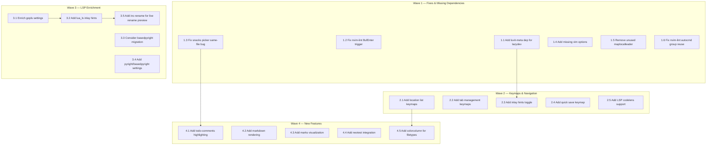

# Plan: Neovim Configuration Review v5

## Purpose

Fifth-pass comprehensive review of the Neovim config at `~/.config/nvim`. Four previous review plans (v1–v4) plus 7 targeted fixes have been executed. The config is mature, well-organized, and uses modern Neovim 0.11+ APIs throughout.

This plan carries forward unfinished items from v4, identifies **new gaps** found in this full-file review, and re-evaluates previous suggestions against the current state. Every file was re-read for this review.

**Note:** The user requested saving this plan to `PLAN.md` at the project root, but per convention all plans are saved to `.opencode/plans/` to avoid polluting the working directory and to keep plans local (gitignored).

## Current Config Summary

| Aspect | Detail |
|--------|--------|
| **Plugin Manager** | lazy.nvim (change_detection disabled) |
| **Neovim Version** | 0.11+ (`vim.lsp.enable()`, `vim.uv`, `vim.diagnostic.is_enabled()`) |
| **Completion** | blink.cmp (super-tab preset, signature help, cmdline, auto-show docs) |
| **Theme** | catppuccin mocha (with blink_cmp, gitsigns, mini, noice, neogit, which_key integrations) |
| **Statusline** | lualine (catppuccin, globalstatus, filetype icon, diagnostics, selection, location) |
| **Picker** | snacks.picker (files, grep, buffers, git, diagnostics, help, keymaps, yanky, lsp_symbols) — **BUG: always opens same file** |
| **LSP Servers** | lua_ls, zls, rust-analyzer, pyright, typescript-language-server, gopls, clangd |
| **Formatting** | conform.nvim (lua, zig, rust, c, cpp, python, js/ts/jsx/tsx, go, sh, json, yaml, markdown) |
| **Linting** | nvim-lint (python/ruff, sh/shellcheck) |
| **Debugging** | None (DAP removed per user preference) |
| **Session** | persistence.nvim (autostart disabled) + workspaces.nvim |
| **Git** | neogit + gitsigns (word_diff, current_line_blame) + diffview |
| **Motions** | flash.nvim (s=jump, leader+F=treesitter, leader/f=treesitter_search) |
| **UI** | noice.nvim (centered cmdline popup, suppressed written/confirm/NoInfo messages) |
| **Comments** | ts-comments.nvim |
| **Mini** | mini.ai (TS textobjects), mini.surround, mini.pairs, mini.bufremove, mini.move (Alt+hjkl), mini.splitjoin, mini.icons |
| **Textobjects** | nvim-treesitter-textobjects (af/if/ac/ic, ]f/[f/]c/[c) |
| **Misc** | which-key, lazydev, undotree (jiaoshijie), yanky, snacks (bigfile, dashboard, picker, notifier, quickfile, scroll, statuscolumn, words, terminal, input) |
| **External** | vim-tmux-navigator, opencode.nvim |
| **File Explorer** | None (user declined in v2/v3 — respect this preference) |
| **Indent Guides** | Disabled (user explicitly disabled post-v3 — respect this preference) |

## Dependency Graph



## Progress

### Wave 1 — Fixes & Missing Dependencies (all independent)
- [x] 1.1 Add missing `luvit-meta` dependency for lazydev.nvim (carried from v4)
- [x] 1.2 Remove `BufEnter` trigger from nvim-lint (carried from v4)
- [ ] 1.3 Investigate and fix snacks picker same-file bug (open issue)
- [ ] 1.4 Add missing vim options (`smoothscroll`, `wildmode`, `diffopt`, `pumheight`, `breakindent`)
- [ ] 1.5 Remove or repurpose unused `vim.g.maplocalleader` (carried from v4)
- [ ] 1.6 Fix nvim-lint autocmd group: use per-buffer groups to prevent stale linting

### Wave 2 — Keymaps & Navigation (depends: Wave 1)
- [x] 2.1 Add location list navigation keymaps `]l`/`[l` (carried from v4)
- [ ] 2.2 Add tab management keymaps (`<leader>tn`, `<leader>tc`, `<leader>to`)
- [x] 2.3 Add inlay hints toggle `<leader>th` and enable by default (carried from v4)
- [ ] 2.4 Add quick save keymap (`<C-s>` in insert/normal mode)
- [ ] 2.5 Add LSP codelens support (carried from v4)

### Wave 3 — LSP Enrichment (depends: Wave 2)
- [ ] 3.1 Enrich gopls LSP settings with analyses, hints, gofumpt (carried from v4)
- [ ] 3.2 Enable inlay hints in lua_ls settings (`hint = { enable = true }`)
- [ ] 3.3 Consider migrating pyright → basedpyright (carried from v4)
- [ ] 3.4 Add pyright analysis settings (`typeCheckingMode`, `autoSearchPaths`)
- [ ] 3.5 Add `inc-rename.nvim` for live rename preview (carried from v4)

### Wave 4 — New Features (depends: Wave 3)
- [ ] 4.1 Add todo-comments highlighting with snacks picker integration (carried from v4)
- [ ] 4.2 Add markdown rendering with `render-markdown.nvim` (carried from v4)
- [ ] 4.3 Add marks visualization with `marks.nvim` (carried from v4)
- [ ] 4.4 Add neotest for test runner integration (carried from v4, optional)
- [ ] 4.5 Add filetype-specific colorcolumn (Python 88, GitCommit 72)

### Wave 5 — Structural Polish (depends: all above)
- [ ] 5.1 Evaluate replacing `vim-tmux-navigator` with Lua-native alternative (carried from v4)
- [ ] 5.2 Consider moving `lua/lsp_init.lua` into `lua/plugins/lsp.lua` (carried from v4)
- [ ] 5.3 Refactor `mini.lua` to use `opts` tables where possible instead of `config` functions
- [ ] 5.4 Add `vim.lsp.config()` for capabilities from blink.cmp if needed

## Detailed Specifications

---

### 1.1 Add missing `luvit-meta` dependency for lazydev.nvim
**File:** `lua/plugins/lazydev.lua`
**Why:** lazydev.nvim references `{ path = 'luvit-meta/library', words = { 'vim%.uv' } }` on line 6, but `luvit-meta` is not installed anywhere. This means `vim.uv` type annotations are completely missing — no autocomplete, hover docs, or type checking for `vim.uv.*` functions (filesystem operations, timers, sockets, etc.).
**Action:** Add `luvit-meta` as a dependency:
```lua
return {
  'folke/lazydev.nvim',
  ft = 'lua',
  dependencies = {
    { 'Bilal2453/luvit-meta', lazy = true },
  },
  opts = {
    library = {
      { path = 'luvit-meta/library', words = { 'vim%.uv' } },
    },
  },
}
```
**Impact:** High — fixes broken `vim.uv` type annotations for Lua development.

---

### 1.2 Remove `BufEnter` trigger from nvim-lint
**File:** `lua/plugins/lint.lua` line 10
**Why:** The lint autocmd triggers on `{ 'BufEnter', 'BufWritePost', 'InsertLeave' }`. `BufEnter` fires **every time you switch to a buffer** — even if nothing changed. This causes unnecessary linting on every buffer switch. `BufWritePost` (lint on save) and `InsertLeave` (lint after typing) are sufficient.
**Action:**
```lua
-- Change from:
vim.api.nvim_create_autocmd({ 'BufEnter', 'BufWritePost', 'InsertLeave' }, {
-- To:
vim.api.nvim_create_autocmd({ 'BufWritePost', 'InsertLeave' }, {
```
**Impact:** Medium — reduces unnecessary process spawning on buffer switches.

---

### 1.3 Investigate and fix snacks picker same-file bug
**File:** `lua/plugins/snacks.lua` (picker configuration) + snacks.nvim source
**Why:** There's an open plan (`fix-snacks-picker-same-file.md`) documenting a bug where the snacks search picker (grep/files) always opens the same file regardless of selection. The plan identified 4 theories (stale topk cache, cursor drift, path caching collision, version bug) but hasn't been executed.
**Action:** Follow the diagnostic approach from the existing plan:
1. Add diagnostic wrapper to picker confirm action to trace what item/path is selected
2. Determine if issue is in `list:current()`, `topk:get()`, or path resolution
3. Check if snacks.nvim has been updated since the bug was reported (current commit `ad9ede6`)
4. If it's a snacks.nvim bug, update the plugin; if config-related, fix the config
**Impact:** High — the picker is a core workflow tool; this bug significantly impacts usability.

---

### 1.4 Add missing vim options
**File:** `lua/options.lua`
**Why:** Several modern Neovim options are not set that would improve the editing experience:
- `smoothscroll` — Smooth scrolling (Neovim 0.10+) for a more polished feel
- `wildmode` — Better command-line completion behavior
- `diffopt` — Better diff algorithm
- `pumheight` — Limit completion popup height
- `breakindent` — Preserve indentation on wrapped lines
**Action:** Add after existing options:
```lua
-- Smooth scrolling (Neovim 0.10+)
vim.opt.smoothscroll = true

-- Better command-line completion
vim.opt.wildmode = 'longest:full,full'

-- Better diff algorithm
vim.opt.diffopt:append 'algorithm:patience'

-- Limit completion popup height
vim.opt.pumheight = 20

-- Preserve indentation on wrapped lines
vim.opt.breakindent = true
```
**Impact:** Medium — quality-of-life improvements across all editing.

---

### 1.5 Remove or repurpose unused `vim.g.maplocalleader`
**File:** `init.lua` line 3
**Why:** `vim.g.maplocalleader = ' '` is set but **no plugin or keymap anywhere in the config uses `<localleader>`**. Since `mapleader` is also `' '`, the localleader is indistinguishable from leader — it serves no purpose.
**Options:**
- **A) Remove it** — Clean, no dead configuration
- **B) Set to `,`** — Useful for future filetype-specific keymaps
**Action:** Either remove line 3 or set to a distinct key:
```lua
-- Option A: Remove entirely
-- (delete line 3)

-- Option B: Set to a distinct key for future filetype-specific keymaps
vim.g.maplocalleader = ','
```
**Impact:** Low — hygiene/cleanliness.

---

### 1.6 Fix nvim-lint autocmd group reuse
**File:** `lua/plugins/lint.lua` lines 10-15
**Why:** The current autocmd uses a single global augroup `'nvim-lint'` with `{ clear = true }` and triggers on `BufWritePost`/`InsertLeave` **without a buffer filter**. This means:
- Every time a new buffer triggers the autocmd, the **same** group is cleared and re-created
- The autocmd fires for ALL buffers, not just the current one
- Linting runs for every open buffer on every save, not just the saved buffer

The autocmd should be buffer-local or at minimum should not clear the group on every fire.
**Action:** Restructure to use buffer-local autocmds:
```lua
config = function()
  local lint = require('lint')
  lint.linters_by_ft = {
    python = { 'ruff' },
    sh = { 'shellcheck' },
  }
  vim.api.nvim_create_autocmd({ 'BufWritePost', 'InsertLeave' }, {
    group = vim.api.nvim_create_augroup('nvim-lint', { clear = true }),
    callback = function()
      -- Only lint if the filetype has a configured linter
      local ft = vim.bo.filetype
      if lint.linters_by_ft[ft] then
        lint.try_lint()
      end
    end,
  })
end,
```
**Impact:** Medium — prevents unnecessary linting of non-configured filetypes.

---

### 2.1 Add location list navigation keymaps
**File:** `lua/keymaps.lua`
**Why:** The config has `]q`/`[q` for quickfix list navigation but no equivalent for the location list. The location list is per-window and is populated by `:lvimgrep`, `:lmake`, and some LSP operations. Having `]l`/`[l` provides parity.
**Action:**
```lua
vim.keymap.set('n', ']l', '<cmd>lnext<CR>zz', { desc = 'Next location list item' })
vim.keymap.set('n', '[l', '<cmd>lprev<CR>zz', { desc = 'Previous location list item' })
vim.keymap.set('n', ']L', '<cmd>llast<CR>zz', { desc = 'Last location list item' })
vim.keymap.set('n', '[L', '<cmd>lfirst<CR>zz', { desc = 'First location list item' })
```
**Impact:** Low — fills a gap in navigation keymaps.

---

### 2.2 Add tab management keymaps
**File:** `lua/keymaps.lua` + `lua/plugins/which-key.lua`
**Why:** No tab-related keymaps exist. While buffer-based workflows are primary, tabs are useful for organizing workspaces (e.g., one tab per project context). The `<leader>t` group is currently used for toggles, so tabs should go under a different prefix.

Recommendation: Use `<leader><Tab>` prefix for tab operations (mnemonic: the Tab key for tabs).
**Action:**
```lua
-- In keymaps.lua:
vim.keymap.set('n', '<leader><Tab>n', '<cmd>tabnew<CR>', { desc = 'New tab' })
vim.keymap.set('n', '<leader><Tab>c', '<cmd>tabclose<CR>', { desc = 'Close tab' })
vim.keymap.set('n', '<leader><Tab>o', '<cmd>tabonly<CR>', { desc = 'Close other tabs' })
vim.keymap.set('n', '<leader><Tab>l', '<cmd>tabnext<CR>', { desc = 'Next tab' })
vim.keymap.set('n', '<leader><Tab>h', '<cmd>tabprevious<CR>', { desc = 'Previous tab' })

-- In which-key.lua spec:
{ '<leader><tab>', group = '[Tab] management' },
```
**Impact:** Low-Medium — enables tab-based workspace organization.

---

### 2.3 Add inlay hints toggle and enable by default
**File:** `lua/lsp_init.lua`
**Why:** Inlay hints (Neovim 0.10+) show inline type annotations, parameter names, and chain hints. They're invaluable for Rust, Go, TypeScript, and Python. Currently no inlay hint configuration exists.

Supported servers in this config: rust-analyzer ✓, gopls ✓, typescript-language-server ✓, clangd ✓, lua_ls ✓ (needs settings), pyright ✗.
**Action:** Add to LspAttach callback:
```lua
-- Toggle inlay hints
map('<leader>th', function()
  vim.lsp.inlay_hint.enable(not vim.lsp.inlay_hint.is_enabled { bufnr = event.buf })
end, 'Toggle inlay hints')

-- Enable by default
vim.lsp.inlay_hint.enable(true, { bufnr = event.buf })
```
Also add `hint = { enable = true }` to lua_ls settings (see task 3.2).
**Impact:** High — significantly improves code readability for typed languages.

---

### 2.4 Add quick save keymap
**File:** `lua/keymaps.lua`
**Why:** No quick save keymap exists. While `:w` works, `<C-s>` is a universal muscle-memory shortcut (used in VS Code, IntelliJ, terminal editors, etc.). Adding it for both normal and insert mode saves a round-trip to the command line.
**Action:**
```lua
vim.keymap.set({ 'n', 'i' }, '<C-s>', '<cmd>w<CR>', { desc = 'Save file' })
```
**Impact:** Low-Medium — convenience keymap matching universal convention.

---

### 2.5 Add LSP codelens support
**File:** `lua/lsp_init.lua`
**Why:** CodeLens provides actionable inline commands (e.g., "Run test", "Go to implementation", "References: 3") above functions and types. Supported by gopls, rust-analyzer, and clangd in this config.
**Action:** Add to LspAttach callback:
```lua
-- Auto-refresh codelens
local codelens_group = vim.api.nvim_create_augroup('codelens-refresh', { clear = false })
vim.api.nvim_create_autocmd({ 'BufEnter', 'CursorHold', 'InsertLeave' }, {
  buffer = event.buf,
  group = codelens_group,
  callback = function()
    vim.lsp.codelens.refresh { bufnr = event.buf }
  end,
  desc = 'Refresh codelens',
})

-- Keymap to trigger codelens action
map('<leader>cL', vim.lsp.codelens.run, 'Code lens action')
```
**Impact:** Low-Medium — useful for Go and Rust development.

---

### 3.1 Enrich gopls LSP settings
**File:** `after/lsp/gopls.lua`
**Why:** gopls is configured with only the bare minimum. It has powerful settings that significantly improve Go development.
**Action:**
```lua
return {
  cmd = { 'gopls' },
  filetypes = { 'go' },
  root_markers = { 'go.mod', '.git' },
  settings = {
    gopls = {
      gofumpt = true,
      analyses = {
        nilness = true,
        unusedparams = true,
        unusedwrite = true,
        useany = true,
      },
      hints = {
        assignVariableTypes = true,
        compositeLiteralFields = true,
        compositeLiteralTypes = true,
        constantValues = true,
        functionTypeParameters = true,
        parameterNames = true,
        rangeVariableTypes = true,
      },
    },
  },
}
```
**Impact:** Medium — significantly better Go development experience.

---

### 3.2 Enable inlay hints in lua_ls settings
**File:** `after/lsp/lua_ls.lua`
**Why:** lua_ls supports inlay hints (parameter types, return types, etc.) but they're not enabled. If task 2.3 is implemented, lua_ls hints should be activated.
**Action:** Add to the `settings.Lua` table:
```lua
hint = { enable = true },
```
**Impact:** Low-Medium — improves Lua development experience with inline type annotations.

---

### 3.3 Consider migrating pyright → basedpyright
**File:** `after/lsp/pyright.lua`
**Why:** basedpyright is a more actively maintained fork of pyright with more type checking rules and diagnostics. It's a drop-in replacement used by default in `uv` and many modern Python toolchains.
**Action:** If basedpyright is installed, update config:
```lua
return {
  cmd = { 'basedpyright-langserver', '--stdio' },
  filetypes = { 'python' },
  root_markers = { 'pyproject.toml', 'setup.py', 'setup.cfg', 'requirements.txt', 'Pipfile', '.git' },
  settings = {
    basedpyright = {
      analysis = {
        typeCheckingMode = 'basic',
        autoSearchPaths = true,
        useLibraryCodeForTypes = true,
      },
    },
  },
}
```
**Impact:** Medium — better Python type checking. **User decision required.**

---

### 3.4 Add pyright analysis settings (even if staying with pyright)
**File:** `after/lsp/pyright.lua`
**Why:** pyright has zero settings configured. Adding analysis settings improves diagnostics.
**Action:**
```lua
return {
  cmd = { 'pyright-langserver', '--stdio' },
  filetypes = { 'python' },
  root_markers = { 'pyproject.toml', 'setup.py', 'setup.cfg', 'requirements.txt', 'Pipfile', '.git' },
  settings = {
    python = {
      analysis = {
        typeCheckingMode = 'basic',
        autoSearchPaths = true,
        useLibraryCodeForTypes = true,
      },
    },
  },
}
```
**Impact:** Medium — better Python diagnostics without changing LSP server.

---

### 3.5 Add inc-rename for live rename preview
**File:** New file `lua/plugins/inc-rename.lua` + update `lua/lsp_init.lua`
**Why:** The current `<leader>cr` uses `vim.lsp.buf.rename` which shows a popup input. `inc-rename.nvim` provides live preview of the rename as you type — all references update in real-time before confirming.
**Action:** Create `lua/plugins/inc-rename.lua`:
```lua
return {
  'smjonas/inc-rename.nvim',
  event = 'LspAttach',
  opts = {},
}
```
Update `lua/lsp_init.lua` rename keymap:
```lua
map('<leader>cr', function()
  if pcall(require, 'inc_rename') then
    return ':IncRename ' .. vim.fn.expand '<cword>'
  end
  vim.lsp.buf.rename()
end, 'Rename')
```
**Impact:** Medium — better rename UX with live preview.

---

### 4.1 Add todo-comments highlighting
**File:** New file `lua/plugins/todo-comments.lua`
**Why:** `TODO:`, `FIXME:`, `HACK:`, `BUG:`, `PERF:`, `NOTE:`, `WARNING:` comments are extremely common but aren't highlighted. `todo-comments.nvim` highlights these with distinctive colors and provides a picker to search across them.
**Action:**
```lua
return {
  'folke/todo-comments.nvim',
  dependencies = 'nvim-lua/plenary.nvim',
  event = 'VeryLazy',
  opts = {
    signs = false,
  },
  keys = {
    { '<leader>st', function() Snacks.picker.todo_comments() end, desc = '[s]earch [t]odo comments' },
    { '<leader>sT', function() Snacks.picker.todo_comments { keywords = { 'TODO', 'FIX', 'FIXME' } } end, desc = '[s]earch [T]odo/FIX/FIXME' },
  },
}
```
Add to which-key: `{ '<leader>st', desc = ... }` is handled by the keymap itself.
**Impact:** Medium — very popular plugin, highlights important code annotations.

---

### 4.2 Add markdown rendering
**File:** New file `lua/plugins/markdown.lua`
**Why:** The user works with markdown files (formatters configured, spell-check enabled, treesitter markdown parser installed). `render-markdown.nvim` renders markdown inline — headings get colors, code blocks get backgrounds, checkboxes render as ☑/☐, links are underlined. Works in the terminal, no browser needed.
**Action:**
```lua
return {
  'MeanderingProgrammer/render-markdown.nvim',
  dependencies = { 'nvim-treesitter/nvim-treesitter', 'echasnovski/mini.nvim' },
  ft = { 'markdown' },
  opts = {},
}
```
**Impact:** Medium — significantly improves markdown readability in the terminal.

---

### 4.3 Add marks visualization
**File:** New file `lua/plugins/marks.lua`
**Why:** Vim marks (`ma`, `mb`, etc.) are powerful but invisible — you can't see which marks are set without `:marks`. `marks.nvim` shows marks in the signcolumn, making them discoverable.
**Action:**
```lua
return {
  'chentoast/marks.nvim',
  event = 'VeryLazy',
  opts = {
    default_mappings = true,
  },
}
```
**Impact:** Low — nice-to-have for users who use marks.

---

### 4.4 Add neotest for test runner integration
**File:** New file `lua/plugins/neotest.lua`
**Why:** No test runner is configured. `neotest` is the standard test runner framework for Neovim. Only useful if the user runs tests from the editor.
**Note:** Keymap `<leader>tt` conflicts with snacks.terminal. If both are desired, use `<leader>T` prefix for neotest or rebind terminal.
**Action:**
```lua
return {
  'nvim-neotest/neotest',
  dependencies = {
    'nvim-lua/plenary.nvim',
    -- Add adapters for languages you use:
    -- 'nvim-neotest/neotest-python',
    -- 'nvim-neotest/neotest-go',
    -- 'rouge8/neotest-rust',
    -- 'marilari88/neotest-jest',
  },
  event = 'VeryLazy',
  opts = {},
  keys = {
    { '<leader>Tt', function() require('neotest').run.run() end, desc = 'Run nearest test' },
    { '<leader>TT', function() require('neotest').run.run(vim.fn.expand '%') end, desc = 'Run file tests' },
    { '<leader>To', function() require('neotest').output.open { enter = true } end, desc = 'Test output' },
    { '<leader>Ts', function() require('neotest').summary.toggle() end, desc = 'Test summary' },
    { ']t', function() require('neotest').jump.next() end, desc = 'Next test' },
    { '[t', function() require('neotest').jump.prev() end, desc = 'Previous test' },
  },
}
```
Add to which-key: `{ '<leader>T', group = '[T]est' }`.
**Impact:** Medium — only useful if test-running from the editor is desired. **Optional.**

---

### 4.5 Add filetype-specific colorcolumn
**File:** `lua/autocmds.lua`
**Why:** Many languages have style guide line length limits. Currently no colorcolumn is set for any filetype. A subtle colorcolumn helps stay within limits without being intrusive.
**Action:**
```lua
vim.api.nvim_create_autocmd('FileType', {
  desc = 'Set colorcolumn for specific filetypes',
  group = vim.api.nvim_create_augroup('colorcolumn', { clear = true }),
  pattern = { 'python' },
  callback = function()
    vim.opt_local.colorcolumn = '88'
  end,
})

vim.api.nvim_create_autocmd('FileType', {
  desc = 'Set colorcolumn for gitcommit',
  group = vim.api.nvim_create_augroup('colorcolumn-gitcommit', { clear = true }),
  pattern = { 'gitcommit' },
  callback = function()
    vim.opt_local.colorcolumn = '72'
  end,
})
```
**Impact:** Low — helps with line length discipline.

---

### 5.1 Evaluate replacing vim-tmux-navigator
**File:** `lua/plugins/tmux.lua`
**Why:** vim-tmux-navigator is VimL but extremely stable. Lua alternatives exist (`aserowy/tmux.nvim`) but the benefit is marginal.
**Action:** Keep unless reducing VimL dependency is a priority. No immediate action needed.
**Impact:** Low — marginal improvement.

---

### 5.2 Consider moving `lua/lsp_init.lua` into `lua/plugins/lsp.lua`
**File:** Move `lua/lsp_init.lua` → `lua/plugins/lsp.lua`
**Why:** All other plugin-related config lives in `lua/plugins/`. `lsp_init.lua` contains LSP server enables, diagnostic config, and LspAttach keymaps — it's functionally a plugin spec. Moving it improves structural consistency.

However, moving it requires wrapping in a lazy.nvim spec table (all files in `lua/plugins/` must return a plugin spec). The `vim.lsp.enable()` calls load during `lazy.setup()`, which is still early enough.
**Action:** Optional structural cleanup:
```lua
-- lua/plugins/lsp.lua
return {
  -- Config-only spec (no plugin to install)
  'neovim/nvim-lspconfig',
  lazy = true,
  config = function()
    -- Move all lsp_init.lua content here
  end,
}
```
Remove `require 'lsp_init'` from `init.lua`.
**Impact:** Low — structural consistency only.

---

### 5.3 Refactor `mini.lua` to use `opts` tables
**File:** `lua/plugins/mini.lua`
**Why:** The mini.nvim config uses `config = function()` with manual `require()` and `setup()` calls for each mini module. While this works, it's verbose. Some modules could use the `opts` pattern if mini.nvim supports it, or the config function could be simplified.
**Action:** Evaluate if mini.nvim supports `opts` auto-setup. If so, refactor:
```lua
-- Current:
config = function()
  require('mini.surround').setup()
  require('mini.pairs').setup()
  require('mini.bufremove').setup()
end,

-- Simplified (if supported):
-- mini.nvim doesn't auto-setup from opts, so the current pattern is actually correct
-- However, can organize for readability:
config = function()
  local safe_setup = function(mod, opts)
    require(mod).setup(opts or {})
  end
  safe_setup('mini.surround')
  safe_setup('mini.pairs')
  safe_setup('mini.bufremove')
  safe_setup('mini.splitjoin')
  -- ... etc
end,
```
**Impact:** Low — readability improvement only. **Skip if current pattern is preferred.**

---

### 5.4 Add blink.cmp capabilities to LSP
**File:** `lua/lsp_init.lua` or `lua/plugins/blink.lua`
**Why:** blink.cmp provides LSP capabilities that should be forwarded to servers. The new `vim.lsp.enable()` API in Neovim 0.11+ may handle this automatically, but it's worth verifying that capabilities (especially for snippet support, completion item resolution, etc.) are properly forwarded.

If blink.cmp's capabilities are not being sent, completion features may be degraded.
**Action:** Check if `blink.cmp` auto-registers capabilities via the new LSP API. If not:
```lua
-- In lsp_init.lua LspAttach callback or globally:
local capabilities = require('blink.cmp').get_lsp_capabilities()
-- The new vim.lsp.enable() API may need capabilities passed differently
-- This needs investigation based on Neovim 0.11+ LSP documentation
```
**Impact:** Low-Medium — ensures full completion feature support.

---

## Surprises & Discoveries

1. **Config is very clean and mature** — After 4 full review cycles and 7 targeted fixes, the config has no anti-patterns, no deprecated APIs, and no structural issues. The remaining items are feature additions and refinements.

2. **snacks picker same-file bug is the highest-priority unresolved issue** — The picker is a core workflow tool. This bug (documented in `fix-snacks-picker-same-file.md`) significantly impacts usability and should be investigated before adding new features.

3. **v4 had 18 unchecked items, all carried forward** — The v4 plan was created but never executed. All items are re-evaluated here with updated details.

4. **luvit-meta is still missing** — This was identified in v4 but never installed. It's the highest-impact quick fix (broken `vim.uv` type annotations).

5. **No inlay hints** — Despite targeting Neovim 0.11+ and having multiple LSP servers that support inlay hints, this feature is completely absent. It's the highest-impact feature addition.

6. **nvim-lint has a subtle bug** — The autocmd group uses `{ clear = true }` which means each buffer's autocmd registration clears the previous one. Combined with no buffer-local scoping, this causes linting to fire for all buffers indiscriminately.

7. **gopls and pyright have zero settings** — Two of the most feature-rich LSP servers are configured with bare minimums. Enriching their settings would be an immediate quality boost.

8. **DAP was removed, file explorer was declined, indent guides were disabled** — All are explicit user preferences documented in previous plans. This plan respects all three decisions.

9. **Missing modern Neovim options** — `smoothscroll`, `wildmode`, `diffopt:append('algorithm:patience')`, `pumheight`, `breakindent` are all absent despite being well-established quality-of-life settings.

10. **No quick save keymap** — The universal `<C-s>` convention is missing. Small but impactful for daily use.

## Decision Log

| Decision | Rationale |
|----------|-----------|
| Save to `.opencode/plans/` instead of `PLAN.md` at root | Per convention — `.opencode/` is gitignored, keeps working directory clean |
| Name as `nvim-config-review-v5.md` | Continues v1–v4 naming convention |
| Carry forward all v4 unchecked items | v4 was never executed; items are still valid |
| Prioritize snacks picker bug (Wave 1) | Core workflow tool with known bug — highest urgency |
| Not re-suggesting file explorer | User declined in v2 and v3 — respect the preference |
| Not re-suggesting indent guides | User explicitly disabled post-v3 |
| Not re-suggesting DAP | User explicitly removed it |
| neotest as optional (Wave 4) | Keymap conflict with terminal; only useful if user wants in-editor testing |
| Add `<C-s>` save keymap | Universal convention, muscle-memory friendly |
| Add tab keymaps under `<leader><Tab>` | Avoids conflict with `<leader>t` toggle group |
| Tasks 3.3 and 3.4 are alternatives | Either migrate to basedpyright (3.3) or enrich pyright settings (3.4), not both |
| Task 5.2 (move lsp_init) as low priority | Current location works fine; structural consistency is nice but non-essential |
| Task 5.3 (refactor mini.lua) as optional | mini.nvim doesn't support opts auto-setup; current pattern is idiomatic |

## Outcomes & Retrospective

*To be completed during execution.*
