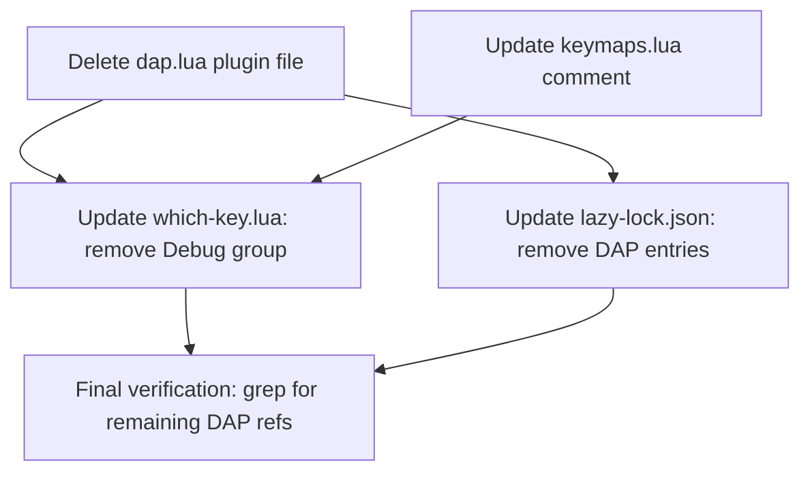

# Plan: Remove DAP (Debug Adapter Protocol) Plugin & Dependencies

## Purpose
Completely remove all DAP-related plugins, configurations, keymaps, and references from the Neovim configuration at `~/.config/nvim`.

## Dependency Graph



## Progress

### Wave 1 — Remove DAP file and update references (all independent)
- [x] 1.1 Delete `lua/plugins/dap.lua` entirely
- [x] 1.2 Update `lua/plugins/which-key.lua`: remove `<leader>d` group line and consider repurposing/removing it
- [x] 1.3 Update `lua/keymaps.lua`: update comment on line 11 that references DAP

### Wave 2 — Cleanup lockfile (depends on Wave 1)
- [x] 2.1 Remove `nvim-dap` and `nvim-dap-ui` entries from `lazy-lock.json`
- [x] 2.2 Final verification: grep entire config for any remaining DAP references

## Detailed Specifications

### 1.1 Delete `lua/plugins/dap.lua`
**Action:** Delete the entire file.
**Why:** This is the sole DAP plugin declaration file. It contains the `nvim-dap` and `nvim-dap-ui` lazy.nvim specs, all DAP keymaps (`<leader>dc`, `dO`, `di`, `do`, `db`, `dB`, `dr`, `du`), adapter configs (codelldb, debugpy, delve), and the dap-ui auto-open listeners. Deleting it removes all DAP plugin code in one action.

**Content to remove:** The entire file (130 lines).

### 1.2 Update `lua/plugins/which-key.lua`
**Action:** Remove line 41: `{ '<leader>d', group = '[D]ebug' },`

**Why:** The `<leader>d` group was registered for DAP keymaps. With DAP removed, this group label becomes orphaned. The keymaps from `keymaps.lua` use `]d`/`[d` (diagnostic navigation) and `<leader>td` (diagnostic toggle) — none of which use the `<leader>d` prefix directly as a group.

**Current (line 41):**
```lua
      { '<leader>d', group = '[D]ebug' },
```

**Result:** Line removed. No replacement needed — the `<leader>d` prefix group is no longer used by anything.

### 1.3 Update `lua/keymaps.lua`
**Action:** Update the comment on line 11.

**Why:** The comment references DAP: `"Diagnostic toggle (under [T]oggle group since <leader>d is [D]ebug)"`. Since DAP is removed, this context is no longer accurate.

**Current (line 11):**
```lua
-- Diagnostic toggle (under [T]oggle group since <leader>d is [D]ebug)
```

**Replace with:**
```lua
-- Diagnostic toggle
```

### 2.1 Remove DAP entries from `lazy-lock.json`
**Action:** Remove these two lines (17-18) from `lazy-lock.json`:
```json
  "nvim-dap": { "branch": "master", "commit": "45a69eba683a2c448dd9ecfc4de89511f0646b5f" },
  "nvim-dap-ui": { "branch": "master", "commit": "1a66cabaa4a4da0be107d5eda6d57242f0fe7e49" },
```

**Why:** These are the lockfile entries for the DAP plugins. Removing them ensures `lazy.nvim` won't try to restore the plugins. Alternatively, simply running `:Lazy clean` after removal will prune them automatically.

### 2.2 Final verification
**Action:** Run a grep across all `.lua` files in `~/.config/nvim` for `dap`, `dapui`, `nvim-dap`, `codelldb`, `debugpy`, `delve` to confirm zero remaining references.

## Surprises & Discoveries

1. **DAP is fully self-contained** — All DAP code lives in a single file (`lua/plugins/dap.lua`). No other plugin files import or depend on DAP.
2. **No autocommands reference DAP** — The `autocmds.lua` file is clean; no DAP-related autocmds exist.
3. **The `<leader>d` group in which-key** was labeled `[D]ebug` — this was changed from `[D]ocument` in a previous review specifically because DAP dominated that prefix. Removing DAP means the group can simply be removed.
4. **The keymaps.lua comment** on line 11 is the only non-dap.lua reference to DAP outside of lockfile and plan files.

## Decision Log

| Decision | Rationale |
|----------|-----------|
| Remove `<leader>d` group entirely from which-key | No keymaps use the `<leader>d` prefix after DAP removal. `]d`/`[d` and `<leader>td` use different prefixes. The group would show an empty menu. |
| Do not repurpose `<leader>d` for something else | Keep the change minimal. The user can add a new group later if desired. |
| Update comment rather than delete it | The `<leader>td` keymap on line 12 still exists; just needs an updated comment. |
| Lockfile entries to be removed manually | Ensures clean state. User can also run `:Lazy clean` as a safety net. |

## Outcomes & Retrospective

**Status: ✅ Complete — All 5 tasks executed successfully.**

### Summary of Changes
1. **Deleted** `lua/plugins/dap.lua` (130 lines) — entire DAP plugin spec, keymaps, adapter configs
2. **Edited** `lua/plugins/which-key.lua` — removed `{ '<leader>d', group = '[D]ebug' }` line
3. **Edited** `lua/keymaps.lua` — simplified comment on line 11 from DAP-referencing to plain "Diagnostic toggle"
4. **Edited** `lazy-lock.json` — removed `nvim-dap` and `nvim-dap-ui` entries

### Verification
- Grep across all `.lua` and `.json` files for `dap`, `dapui`, `nvim-dap`, `codelldb`, `debugpy`, `delve` returned **zero matches**.
- No remaining DAP references exist in the configuration.

### Retrospective
- The plan was accurate — DAP was fully self-contained in one plugin file, making removal clean and simple.
- No surprises during execution. All file paths, line numbers, and content matched the plan exactly.
- Next step for user: run `:Lazy clean` in Neovim to remove the cached plugin directories.
