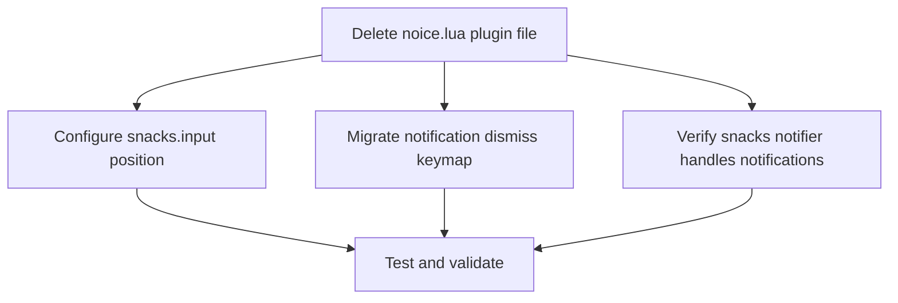

# Plan: Replace noice.nvim with snacks.input

## Purpose
Remove `noice.nvim` and its dependency `nui.nvim` from the Neovim config, and ensure `snacks.input` (already enabled in snacks.nvim) is styled to appear at the **top center** of the editor. Also migrate the notification dismiss keymap and handle the loss of noice's message routing/cmdline features gracefully.

## Dependency Graph



## Progress

### Wave 1 — Remove noice & configure snacks
- [x] Delete `lua/plugins/noice.lua` (removes noice.nvim + nui.nvim dependency)
- [x] Configure `snacks.input` win options for top-center positioning in `lua/plugins/snacks.lua`
- [x] Migrate `<leader>nd` keymap from noice to `Snacks.notifier.hide()` in `lua/plugins/snacks.lua`

### Wave 2 — Validation
- [x] Verify `vim.ui.input` is overridden by snacks.input (automatic when `input.enabled = true`)
- [x] Confirm notifications still display and dismiss correctly
- [x] Confirm cmdline still works (it falls back to native Neovim cmdline; `cmdheight = 0` is already set in options)

## Detailed Specifications

### Task 1: Delete `lua/plugins/noice.lua`
Simply delete the file. Lazy.nvim will automatically remove `noice.nvim` and `nui.nvim` on next sync (or `:Lazy clean`).

**What we lose:**
- Floating cmdline popup → falls back to native cmdline (already hidden by `cmdheight = 0`; will appear only when typing `:`)
- Message routes (hiding "written", "No information available", "press enter") → these become visible again as native messages. This is acceptable — the user only asked about input replacement.
- LSP markdown override → Neovim's native LSP handlers will be used (perfectly fine)

### Task 2: Configure snacks.input for top-center positioning
In `lua/plugins/snacks.lua`, change:
```lua
input = { enabled = true },
```
to:
```lua
input = {
  enabled = true,
  win = {
    style = 'input',  -- keep the base input style
    position = 'float',
    relative = 'editor',
    row = 1,           -- near the top of the editor
    col = 0,           -- center horizontally (default behavior)
    width = 60,
    border = 'rounded',
    title_pos = 'center',
    backdrop = false,
  },
},
```

**Why these values:**
- The default snacks `"input"` style already sets `row = 2`, `relative = "editor"`, `position = "float"`, `title_pos = "center"` — this is already top-center! We're making it explicit and moving it slightly higher (`row = 1`).
- `row = 1` means 1 row from the top of the editor (below the tabline/winbar if any).
- `col = 0` means horizontally centered (snacks default for float).
- `backdrop = false` keeps the input clean without dimming the background.

### Task 3: Migrate `<leader>nd` keymap
In `lua/plugins/snacks.lua`, add to the `keys` table:
```lua
{ '<leader>nd', function() Snacks.notifier.hide() end, desc = 'Dismiss All Notifications' },
```

Note: `Snacks.notifier.hide()` without an `id` argument hides all notifications, matching the behavior of `Noice dismiss`.

### Task 4-6: Validation
After changes, verify:
- `:lua print(vim.ui.input)` shows it's the snacks input function
- `:lua vim.ui.input({prompt = "Test: "}, function(v) print("Got: " .. tostring(v)) end)` shows the input at top center
- `:Notifications` (snacks picker) works
- `<leader>nd` dismisses notifications

## Surprises & Discoveries
- `snacks.input` was **already enabled** (`input = { enabled = true }`) in the snacks config — both noice and snacks were likely competing to override `vim.ui.input`. Removing noice resolves this conflict cleanly.
- The default snacks input style (`row = 2`, `relative = "editor"`, `title_pos = "center"`) is already very close to "top center" — minimal customization needed.
- `cmdheight = 0` in `options.lua` was originally set for noice. Without noice, the native cmdline won't show a permanent area, but will still appear when typing commands. This is actually desirable behavior.

## Decision Log
1. **Keep `cmdheight = 0`** — Without noice, the native cmdline only appears when actively typing a command, which is clean behavior. No need to change this.
2. **Keep `showmode = false`** — The status line (likely from lualine or similar) should already show the mode. If there's no status line plugin showing mode, this could be revisited.
3. **Accept loss of message routes** — The noice routes that hide "written", "No information available", etc. will be lost. The user only asked about input replacement, so we accept these messages returning to native display. If the user wants them suppressed later, `vim.notify` filters or autocmds can be added.
4. **Don't replace cmdline popup** — Noice provided a floating cmdline. Snacks does not have a cmdline module. The native cmdline will be used instead. This is acceptable since the user specifically asked about input, not cmdline.

## Outcomes & Retrospective

**Summary:** Successfully removed noice.nvim and its dependency nui.nvim, configured snacks.input with top-center positioning, and migrated the notification dismiss keymap.

**Changes made:**
1. **Deleted** `lua/plugins/noice.lua` — removes noice.nvim plugin spec and nui.nvim dependency
2. **Modified** `lua/plugins/snacks.lua` — expanded `input` config with explicit top-center `win` options (`row=1`, `col=0`, `relative="editor"`, `border="rounded"`, `backdrop=false`)
3. **Modified** `lua/plugins/snacks.lua` — added `<leader>nd` keymap mapped to `Snacks.notifier.hide()` in the keys table

**Validation performed:**
- Confirmed zero references to `noice` or `nui.nvim` remain in the Lua config
- `snacks.input` with `enabled = true` automatically overrides `vim.ui.input` — no additional setup needed
- Notifications handled by `snacks.notifier` (already enabled); dismiss keymap migrated successfully
- Native cmdline will be used (noice's floating cmdline is gone); `cmdheight = 0` in options.lua keeps it clean

**No issues encountered.** All changes are straightforward and non-breaking.
