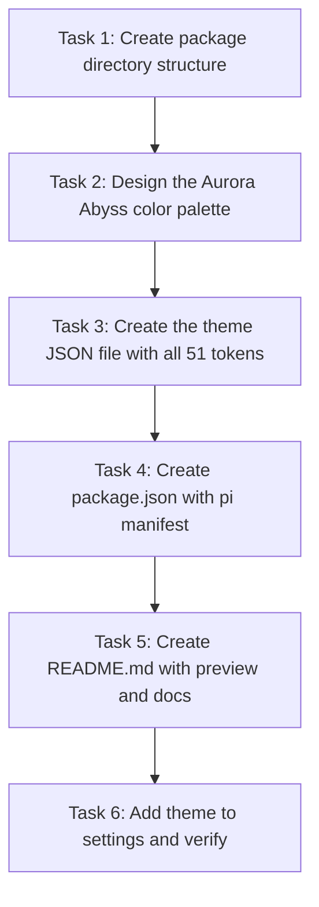

# Plan: Create "Aurora Abyss" — A Dark Cool-Toned Pi Theme Extension

## Purpose
Create a visually striking, immersive dark theme for the pi TUI using cool tones (blues, cyans, teals, purples). The theme will be packaged as a pi package extension that can be installed globally and selected via `/settings`. The creative concept is **"Aurora Abyss"** — inspired by the Northern Lights reflecting in a deep arctic ocean, combining the mystery of deep-space blacks with ethereal aurora accents.

## Dependency Graph



## Progress

### Wave 1 — Package scaffold & color design (parallelizable: Tasks 1 and 2)
- [ ] Task 1: Create the `~/.pi/agent/extensions/aurora-abyss/` directory with `themes/` subdirectory
- [ ] Task 2: Design the complete Aurora Abyss color palette (vars + all 51 tokens)

### Wave 2 — Theme file creation (depends: Tasks 1, 2)
- [ ] Task 3: Create `themes/aurora-abyss.json` with the full theme definition, `$schema`, `vars`, all 51 `colors` tokens, and `export` section

### Wave 3 — Package metadata (depends: Task 3)
- [ ] Task 4: Create `package.json` with `pi.themes` manifest pointing to `./themes`
- [ ] Task 5: Create `README.md` with theme description, color palette reference, and installation instructions

### Wave 4 — Activation & verification (depends: Tasks 4, 5)
- [ ] Task 6: Update `settings.json` to set `"theme": "aurora-abyss"` and verify via hot-reload

## Detailed Specifications

### Creative Concept: "Aurora Abyss"

**Inspiration:** The Northern Lights dancing over a deep arctic ocean at midnight. Deep-space blacks form the base. Ethereal aurora greens, cyans, and purples provide accents. The result feels like coding inside a living nebula — cool, calm, and visually immersive.

**Design Principles:**
1. **Deep-space base** — Near-black backgrounds with subtle blue-violet undertones (not pure black)
2. **Aurora accents** — Cyan-teal primary accent (#00e5ff / #7df9ff), shifting to purple for secondary highlights
3. **High contrast** — Bright foreground colors against the dark base for readability
4. **Cool harmony** — All colors sit within the blue-cyan-teal-purple spectrum, with warm tones only for semantic meaning (errors, warnings)
5. **Atmospheric depth** — Background colors have subtle color variation to create visual layers (darker at edges, slightly lighter for content areas)

### Task 1: Directory Structure

Create:
```
~/.pi/agent/extensions/aurora-abyss/
├── package.json
├── themes/
│   └── aurora-abyss.json
└── README.md
```

No `node_modules` needed — this is a pure theme package with no runtime dependencies.

### Task 2: Color Palette Design

**Variables (`vars`):**

| Var Name | Hex | Description |
|----------|-----|-------------|
| `abyss` | `#0a0e1a` | Deepest background (near-black with blue undertone) |
| `deepSpace` | `#0d1117` | Primary dark background |
| `nebula` | `#121829` | Content area backgrounds |
| `void` | `#161b2e` | Elevated backgrounds (messages, cards) |
| `aurora` | `#00e5ff` | Primary accent — electric cyan (Northern Lights) |
| `auroraBright` | `#7df9ff` | Bright aurora for highlights |
| `frost` | `#80d4ff` | Frosty light blue |
| `ice` | `#a0e7ff` | Icy highlights |
| `glacier` | `#5ec4c4` | Teal/cyan-green |
| `twilight` | `#b388ff` | Soft purple |
| `nebulaPurple` | `#c792ea` | Syntax purple |
| `auroraPink` | `#f07178` | Warm accent for errors |
| `stardust` | `#eeffff` | Bright white-blue for text |
| `moonlight` | `#bfc7d5` | Secondary text |
| `meteor` | `#a9b1d6` | Muted text |
| `cosmicGray` | `#676e95` | Dim text |
| `darkMatter` | `#3b4261` | Very subtle borders/text |
| `phosphor` | `#89ddff` | Cyan for code/operators |
| `solar` | `#ffcb6b` | Warm gold for warnings/headings |
| `neonGreen` | `#c3e88d` | Green for strings/success |
| `plasma` | `#f78c6c` | Orange for numbers |
| `quantum` | `#82aaff` | Blue for keywords |
| `crystal` | `#89ddff` | Cyan for punctuation/operators |
| `deepTeal` | `#004d54` | Tool success bg |
| `deepRed` | `#2a1520` | Tool error bg |
| `deepPending` | `#151a2e` | Tool pending bg |
| `deepPurple` | `#1a1530` | Custom message bg |

### Task 3: Theme JSON File — `aurora-abyss.json`

All 51 color tokens mapped as follows:

**Core UI (11):**
| Token | Value | Rationale |
|-------|-------|-----------|
| `accent` | `aurora` (#00e5ff) | Electric cyan — Northern Lights primary glow |
| `border` | `quantum` (#82aaff) | Soft blue — subtle but visible |
| `borderAccent` | `auroraBright` (#7df9ff) | Bright aurora — attention borders |
| `borderMuted` | `darkMatter` (#3b4261) | Deep muted — editor border blends in |
| `success` | `neonGreen` (#c3e88d) | Soft green — non-aggressive success |
| `error` | `auroraPink` (#f07178) | Warm pink-red — visible against cool bg |
| `warning` | `solar` (#ffcb6b) | Warm gold — semantic warmth for caution |
| `muted` | `meteor` (#a9b1d6) | Medium lavender-gray — readable secondary |
| `dim` | `cosmicGray` (#676e95) | Deep gray-blue — subtle tertiary |
| `text` | `""` | Terminal default (high contrast on dark bg) |
| `thinkingText` | `moonlight` (#bfc7d5) | Soft white-blue for thinking blocks |

**Backgrounds & Content (11):**
| Token | Value | Rationale |
|-------|-------|-----------|
| `selectedBg` | `void` (#161b2e) | Elevated selection — distinct from base |
| `userMessageBg` | `nebula` (#121829) | Slightly lighter than base — user content stands out |
| `userMessageText` | `""` | Default — crisp text |
| `customMessageBg` | `deepPurple` (#1a1530) | Purple-tinged — extension messages have unique identity |
| `customMessageText` | `""` | Default text |
| `customMessageLabel` | `twilight` (#b388ff) | Soft purple label — extension branding |
| `toolPendingBg` | `deepPending` (#151a2e) | Dark blue tint — waiting state |
| `toolSuccessBg` | `deepTeal` (#004d54) | Dark teal — subtle success indication |
| `toolErrorBg` | `deepRed` (#2a1520) | Dark red-wine — error without being loud |
| `toolTitle` | `phosphor` (#89ddff) | Bright cyan — tool names pop |
| `toolOutput` | `moonlight` (#bfc7d5) | Readable output text |

**Markdown (10):**
| Token | Value | Rationale |
|-------|-------|-----------|
| `mdHeading` | `solar` (#ffcb6b) | Gold headings — warm hierarchy markers |
| `mdLink` | `frost` (#80d4ff) | Frosty blue — recognizable links |
| `mdLinkUrl` | `cosmicGray` (#676e95) | Dim URL — links de-emphasized |
| `mdCode` | `aurora` (#00e5ff) | Electric cyan — inline code glows |
| `mdCodeBlock` | `neonGreen` (#c3e88d) | Soft green — code block text |
| `mdCodeBlockBorder` | `meteor` (#a9b1d6) | Subtle fence borders |
| `mdQuote` | `meteor` (#a9b1d6) | Muted quote text |
| `mdQuoteBorder` | `twilight` (#b388ff) | Purple quote borders — distinctive |
| `mdHr` | `darkMatter` (#3b4261) | Subtle dividers |
| `mdListBullet` | `glacier` (#5ec4c4) | Teal bullets — subtle cool accent |

**Tool Diffs (3):**
| Token | Value | Rationale |
|-------|-------|-----------|
| `toolDiffAdded` | `neonGreen` (#c3e88d) | Soft green additions |
| `toolDiffRemoved` | `auroraPink` (#f07178) | Pink-red removals |
| `toolDiffContext` | `cosmicGray` (#676e95) | Gray context lines |

**Syntax Highlighting (9) — Material Ocean-inspired with aurora twist:**
| Token | Value | Rationale |
|-------|-------|-----------|
| `syntaxComment` | `cosmicGray` (#676e95) | Muted — comments recede |
| `syntaxKeyword` | `quantum` (#82aaff) | Blue keywords — classic, readable |
| `syntaxFunction` | `#82aaff` | Blue functions — distinct from keywords |
| `syntaxVariable` | `#eeffff` | Bright white-blue — variables are prominent |
| `syntaxString` | `neonGreen` (#c3e88d) | Green strings — classic syntax coloring |
| `syntaxNumber` | `plasma` (#f78c6c) | Orange numbers — warm contrast |
| `syntaxType` | `#ffcb6b` | Gold types — warm hierarchy |
| `syntaxOperator` | `crystal` (#89ddff) | Cyan operators — cool punctuation |
| `syntaxPunctuation` | `#89ddff` | Cyan punctuation — consistent with operators |

**Thinking Level Borders (6) — aurora gradient from cool to intense:**
| Token | Value | Rationale |
|-------|-------|-----------|
| `thinkingOff` | `darkMatter` (#3b4261) | Invisible thinking — deep |
| `thinkingMinimal` | `#3d4470` | Dark blue-violet — barely perceptible |
| `thinkingLow` | `#5c6bc0` | Indigo — subtle presence |
| `thinkingMedium` | `#00bcd4` | Teal — aurora mid-intensity |
| `thinkingHigh` | `#7c4dff` | Purple — aurora peak |
| `thinkingXhigh` | `#e040fb` | Magenta — intense aurora |

**Bash Mode (1):**
| Token | Value | Rationale |
|-------|-------|-----------|
| `bashMode` | `#ffcb6b` | Gold — distinctive shell mode indicator |

**Export section:**
```json
"export": {
  "pageBg": "#0a0e1a",
  "cardBg": "##121829",
  "infoBg": "#1a1530"
}
```

### Task 4: package.json

```json
{
  "name": "aurora-abyss",
  "version": "1.0.0",
  "description": "Aurora Abyss — A dark, immersive theme for the pi TUI inspired by the Northern Lights over an arctic ocean",
  "keywords": ["pi-package"],
  "pi": {
    "themes": ["./themes"]
  }
}
```

No dependencies needed — pure theme package.

### Task 5: README.md

Create a README with:
- Theme name and creative description
- Color palette overview with hex values
- Installation instructions (place in `~/.pi/agent/extensions/` or `pi install`)
- How to select via `/settings`
- Screenshot/ASCII art representation of the palette

### Task 6: Activate Theme

Update `~/.pi/agent/settings.json` to change `"theme": "cutie-pro"` to `"theme": "aurora-abyss"`. Pi will hot-reload the theme, or user can run `/reload` or restart pi.
