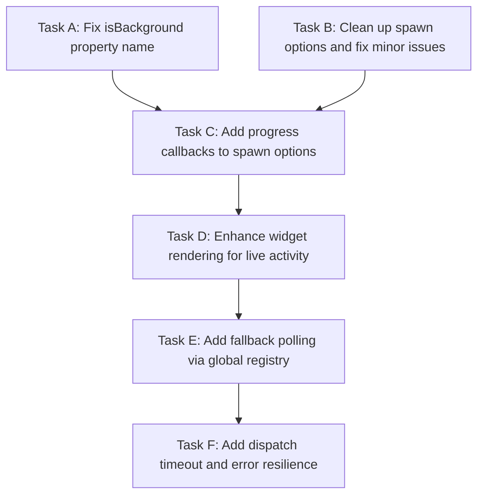

# Plan: Fix Agent-Team Widget Real-Time Updates

## Purpose

The agent-team widgets show agent cards but never update with real-time status/activity when agents are dispatched. The root causes are: (1) a wrong property name in spawn options that prevents lifecycle events from firing, and (2) missing progress callbacks that would provide live streaming updates.

## Dependency Graph



## Progress

### Wave 1 — Critical Bug Fix (independent tasks)
- [ ] Task A: Fix `run_in_background` → `isBackground` in spawn options (Critical: widget never transitions from running)
- [ ] Task B: Clean up unused spawn options (`systemPrompt`, `tools`) and add proper TypeScript typing

### Wave 2 — Real-Time Progress Updates (depends: Task A, B)
- [ ] Task C: Add `onToolActivity`, `onTextDelta`, `onAssistantUsage`, `onTurnEnd` callbacks to spawn options

### Wave 3 — Widget Enhancement (depends: Task C)
- [ ] Task D: Enhance `renderCard()` to display live activity, tool counts, turn info, and context usage from callbacks

### Wave 4 — Resilience (depends: Task D)
- [ ] Task E: Add fallback polling via `Symbol.for("pi-subagents:manager")` global registry for robustness
- [ ] Task F: Add proper dispatch timeout, error handling, and widget state cleanup

## Detailed Specifications

### Task A: Fix `isBackground` Property Name

**File:** `extensions/agent-team.ts`, line ~479

**Problem:** The spawn options object uses `run_in_background: true`, but `AgentManager.spawn()` checks `options.isBackground`. This means:
- `onComplete` callback never fires (only called for background agents)
- `subagents:completed`/`subagents:failed` events never emit
- `handleAgentTerminal()` never runs
- Widget stays stuck in "running" forever
- The `dispatchAgent()` Promise never resolves — tool execution hangs

**Fix:** Change `run_in_background: true` to `isBackground: true` on line 479.

**Acceptance Criteria:**
- Widget transitions from "running" → "done"/"error" when agent completes
- `subagents:completed`/`subagents:failed` events are received and processed
- `dispatchAgent()` Promise resolves properly
- Agent notifications appear in the UI

### Task B: Clean Up Spawn Options

**File:** `extensions/agent-team.ts`, lines ~488-491

**Problem:**
1. `spawnOptions.systemPrompt` and `spawnOptions.tools` are passed but `SpawnOptions` has no such properties — they're silently ignored. pi-subagents loads agent definitions from `.pi/agents/*.md` independently, so these are redundant.
2. The `spawnOptions` is typed as `Record<string, unknown>` — should use proper typing.

**Fix:**
1. Remove the `systemPrompt` and `tools` assignments from spawn options
2. Type the options object properly (use inline type or cast)

**Acceptance Criteria:**
- No dead/wrong properties passed in spawn options
- Code compiles cleanly

### Task C: Add Progress Callbacks to Spawn Options

**File:** `extensions/agent-team.ts`, in `dispatchAgent()` function, spawn options section (~line 477)

**Problem:** The old `.bak` implementation parsed streaming JSON events from child process stdout for real-time updates (tool counts, text deltas, context %). The new RPC implementation only gets start/stop events. The in-process event bus preserves function references, so callbacks CAN be passed through the RPC channel.

**Fix:** Add these callbacks to the spawn options:

```typescript
onToolActivity: (activity: { type: "start" | "end"; toolName: string }) => {
    if (activity.type === "start") {
        state.lastWork = activity.toolName || state.lastWork;
    } else {
        state.toolCount++;
    }
    updateWidget();
},

onTextDelta: (delta: string, fullText: string) => {
    const last = fullText.split("\n").filter(l => l.trim()).pop() || "";
    if (last) state.lastWork = last;
    updateWidget();
},

onAssistantUsage: (usage: { input: number; output: number; cacheWrite: number }) => {
    if (contextWindow > 0) {
        state.contextPct = (usage.input / contextWindow) * 100;
    }
    updateWidget();
},

onTurnEnd: (turnCount: number) => {
    // Could add turnCount to AgentState if desired for display
    updateWidget();
},
```

**Key Insight:** The `pi.events` event bus is in-process (simple EventEmitter pattern). When `agent-team.ts` emits `subagents:rpc:spawn`, the options object is passed **by reference**, not serialized. Function callbacks survive the round-trip and are invoked by `runAgent()` inside pi-subagents. The `manager.spawn()` code already calls `options.onToolActivity?.()`, `options.onTextDelta?.()`, etc.

**Acceptance Criteria:**
- Widget shows which tool the agent is currently using
- Widget updates text output in real-time
- Widget shows context usage percentage updating live
- `toolCount` increments as agent uses tools

### Task D: Enhance Widget Rendering for Live Activity

**File:** `extensions/agent-team.ts`, `renderCard()` function (~line 250)

**Problem:** The current card rendering shows static information. The `lastWork` field is used but not clearly differentiated from the task description.

**Fix:**
1. Add a `turnCount` field to `AgentState` and display it in the card
2. Differentiate between "task description" (when idle) and "current activity" (when running)
3. Show tool count with better formatting
4. Consider showing a spinner character for running agents
5. Use different display for tool activity vs text response in `lastWork`

**Acceptance Criteria:**
- Running agents show animated/refreshed activity description
- Tool use count is visible and updates in real-time
- Context bar updates as agent consumes tokens
- Idle agents show their description; running agents show current activity

### Task E: Add Fallback Polling via Global Registry

**File:** `extensions/agent-team.ts`

**Problem:** If callbacks somehow don't fire (edge cases, race conditions), the widget should still show basic status.

**Fix:** 
1. In the 1-second timer interval, also check the global registry for agent status:
```typescript
const MANAGER_KEY = Symbol.for("pi-subagents:manager");
const registry = (globalThis as any)[MANAGER_KEY];
if (registry && state.subagentId) {
    const record = registry.getRecord(state.subagentId);
    if (record) {
        state.toolCount = record.toolUses;
        state.contextPct = getSessionContextPercent(record.session) ?? state.contextPct;
        if (record.status !== "running" && record.status !== "queued") {
            // Safety net: force terminal state
            // ...
        }
    }
}
```
2. Import `getSessionContextPercent` from pi-subagents' usage module or calculate locally.

**Note:** Since pi-subagents' `usage.ts` is internal, calculate context % from `record.session` and `record.lifetimeUsage` directly, or use a simpler approximation.

**Acceptance Criteria:**
- Widget updates even if callbacks fail
- Terminal state detected via polling as safety net
- No dependency on pi-subagents' internal modules

### Task F: Add Dispatch Timeout and Error Resilience

**File:** `extensions/agent-team.ts`, `dispatchAgent()` function

**Problem:**
1. The RPC reply timeout is 30s — if pi-subagents takes longer to start, it fails
2. If the lifecycle events don't fire (e.g., pi-subagents crashes), the dispatch promise hangs forever
3. No cleanup of stale widget state on errors

**Fix:**
1. Increase RPC reply timeout to 60s (or make it configurable)
2. Add a maximum execution timeout (e.g., 10 minutes) after which the dispatch is marked as error
3. Clean up timer/subagentId/interval on all error paths
4. Add a safety timeout in the timer interval that checks for stale running agents
5. Ensure widget is updated on all error paths

**Acceptance Criteria:**
- Dispatch never hangs indefinitely
- Stale agents are detected and marked as error
- Widget always reflects actual agent state
- Resources (timers, subscriptions) are cleaned up on all paths

## Surprises & Discoveries

1. **In-process event bus preserves function references** — This is the key insight that makes progress callbacks work through the RPC channel without modifying pi-subagents.

2. **The `.bak` file reveals the original design** — The old implementation used `child_process.spawn("pi", args)` with JSON streaming on stdout, which naturally provided real-time updates. The migration to RPC lost this capability.

3. **`SpawnOptions` has no `systemPrompt`/`tools` properties** — agent-team.ts passes these but they're silently ignored. pi-subagents resolves agent types independently from `.pi/agents/*.md`.

4. **The global registry (`Symbol.for`) exposes `getRecord()`** — This provides a fallback mechanism for polling agent status without modifying pi-subagents.

5. **pi-subagents has its own `AgentWidget`** — It uses the same `agentActivity` Map with `onToolActivity`/`onTextDelta` callbacks that we can leverage. Both widgets coexist (agent-team's custom grid + pi-subagents' tree widget).

## Decision Log

1. **Decision: Use callback functions through RPC** — The in-process event bus preserves function references. This is the cleanest approach that doesn't require modifying pi-subagents.

2. **Decision: Keep the RPC dispatch pattern** — Despite the bugs, the RPC approach is architecturally cleaner than child_process spawning. The fix is to correct the property name and add callbacks.

3. **Decision: Add polling as fallback** — Even with callbacks, a polling safety net ensures robustness against edge cases where callbacks might not fire.

4. **Assumption: Both extensions are loaded in the same pi process** — The `pi.events` event bus is in-process. If extensions were loaded in separate processes, neither RPC nor callbacks would work. This is confirmed by the architecture.

5. **Assumption: pi-subagents is installed as `@tintinweb/pi-subagents`** — We shouldn't modify this package. All fixes are in agent-team.ts.
