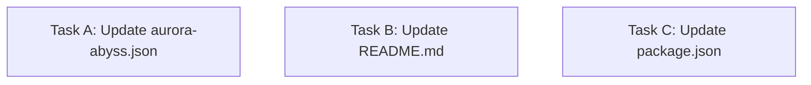

# Plan: Refactor Aurora Abyss to 8-Color Pastel Palette

## Purpose
Simplify the `aurora-abyss` theme into a strict, minimal 8-color palette. The new palette follows a 60-30-10 distribution rule, emphasizing a dark/purple base with pastel and gray accents. This ensures a consistent, immersive, and highly readable experience while significantly reducing color complexity.

## Dependency Graph

## Progress

### Wave 1 — Implement 8-Color Palette (Parallel Execution)
- [ ] Task A (depends: none)
- [ ] Task B (depends: none)
- [ ] Task C (depends: none)

## Detailed Specifications

### Task A: Update `aurora-abyss.json`
Modify `themes/aurora-abyss.json` to completely replace the existing `vars` and rewrite the `colors` mappings.
- **Update `vars`** to contain exactly these 8 colors:
  - `base`: `"#191724"` (Dominant Background)
  - `surface`: `"#1f1d2e"` (Dominant Surface)
  - `muted`: `"#6e6a86"` (Dominant Gray)
  - `text`: `"#e0def4"` (Dominant Text)
  - `primary`: `"#c4a7e7"` (Secondary Pastel Purple)
  - `secondary`: `"#9ccfd8"` (Secondary Pastel Cyan)
  - `accent`: `"#eb6f92"` (Accent Pastel Pink)
  - `warning`: `"#f6c177"` (Accent Pastel Gold)
- **Update `colors`**: Remove all hardcoded hex values and map every key to one of the 8 variables. Use the following logic:
  - Backgrounds & Borders -> `base`, `surface`, `muted`
  - Text & Comments -> `text`, `muted`
  - Branding, Headers, Tool Titles -> `primary`
  - Success states, Strings, Secondary Links -> `secondary`
  - Errors, Removals, High-level Alerts -> `accent`
  - Warnings, Bash Mode, Numbers -> `warning`
- **Update `export`**: Use the explicit hex codes for the backgrounds:
  - `pageBg`: `"#191724"`
  - `cardBg`: `"#1f1d2e"`
  - `infoBg`: `"#1f1d2e"`

### Task B: Update `README.md`
Rewrite the documentation to reflect the new 8-color minimal philosophy.
- Replace the "Color Palette" section with a clean 60-30-10 breakdown:
  - **60% Dominant (Neutrals)**: Base, Surface, Muted, Text (list the hex codes).
  - **30% Secondary (Primary/Brand)**: Primary (Pastel Purple), Secondary (Pastel Cyan).
  - **10% Accent**: Accent (Pastel Pink), Warning (Pastel Gold).
- Update the "Thinking Level Gradient" to use the new 8 colors (e.g., `surface` -> `muted` -> `primary` -> `secondary` -> `warning` -> `accent`).

### Task C: Update `package.json`
- Update the `description` field to reflect the new aesthetic constraint. For example: `"Aurora Abyss — A dark, immersive theme for the pi TUI featuring a minimal 8-shade pastel palette."`

## Surprises & Discoveries
- The original theme used 27 variables and several hardcoded hex values inside the `colors` object. Refactoring to exactly 8 colors requires clever semantic reuse (e.g., mapping both "success" and "syntaxString" to the secondary pastel cyan color, and "error" and "toolDiffRemoved" to the accent pink).
- The requested "dark and purple, pastel, gray" aesthetic perfectly maps to a Rosé Pine inspired palette, which guarantees excellent TUI contrast and readability.

## Decision Log
- **Pre-defined Palette**: I defined the exact 8 color hex codes directly in this plan. By providing the exact specification upfront, I eliminated the dependency path between the JSON update and the Markdown documentation tasks. They can now all execute in parallel.
- **Background Exports**: The `export` block in pi themes often requires literal hex codes rather than variable references depending on the parser. Decided to hardcode the new background hex codes (`#191724` and `#1f1d2e`) in the `export` section to prevent rendering bugs.

## Outcomes & Retrospective
[To be completed during execution]
