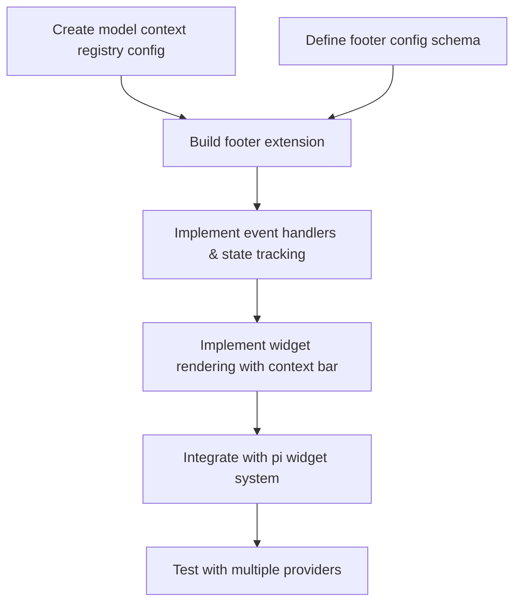

# Plan: Footer Extension with Model Info, Context Bar, and Cost

## Purpose

Create a persistent footer widget extension (`footer`) for pi that displays: **Model:ThinkingMode**, a **visual context usage bar** with percentage and max context, and **cost or subscription information**. The footer should be always visible during agent sessions, updating in real-time as messages stream.

## Dependency Graph



## Progress

### Wave 1 — Configuration & Data Layer
- [ ] Task 1: Create model context window registry (`agent/extensions/footer-models.json`)
- [ ] Task 2: Create footer extension config (`agent/extensions/footer-config.json`)

### Wave 2 — Core Extension Implementation
- [ ] Task 3: Create footer extension scaffold (`agent/extensions/footer.ts`) with state tracking (depends: Task 1, Task 2)
- [ ] Task 4: Implement visual context bar rendering with color zones (depends: Task 3)
- [ ] Task 5: Implement cost/subscription display logic (depends: Task 3)

### Wave 3 — Integration & Polish
- [ ] Task 6: Wire up pi widget lifecycle — register on `agent_start`, render during turns, persist display (depends: Task 4, Task 5)
- [ ] Task 7: Handle edge cases — model changes mid-session, compaction, no usage data (depends: Task 6)

## Detailed Specifications

### Task 1: Create Model Context Window Registry

**File:** `agent/extensions/footer-models.json`

A static mapping of `provider/modelId` → context window size. This is needed because the extension API does not expose `contextWindow` directly (only the built-in powerline status line has `ctx.contextWindow`).

```json
{
  "models": {
    "zai/glm-5.1": { "contextWindow": 128000, "name": "glm-5.1" },
    "zai/glm-5-turbo": { "contextWindow": 128000, "name": "glm-5-turbo" },
    "zai/glm-5v-turbo": { "contextWindow": 128000, "name": "glm-5v-turbo" },
    "google/gemini-3.1-pro-preview": { "contextWindow": 1000000, "name": "gemini-3.1-pro" },
    "google/gemini-3.1-flash-lite": { "contextWindow": 1000000, "name": "gemini-3.1-flash" },
    "google/gemini-3.5-flash": { "contextWindow": 1000000, "name": "gemini-3.5-flash" }
  },
  "defaultContextWindow": 128000
}
```

**Acceptance criteria:**
- File exists at `agent/extensions/footer-models.json`
- Contains entries for all 6 enabled models from `settings.json`
- Has a `defaultContextWindow` fallback
- Values are reasonable (128k for zai, 1M for google models)

### Task 2: Create Footer Extension Config

**File:** `agent/extensions/footer-config.json`

User-configurable display options for the footer.

```json
{
  "barWidth": 20,
  "showThinkingEmoji": false,
  "colorPreset": "theme",
  "contextZones": {
    "normal": 70,
    "warning": 85
  },
  "subscriptionLabels": {
    "zai": "sub"
  }
}
```

**Acceptance criteria:**
- File exists at `agent/extensions/footer-config.json`
- `barWidth` controls the character width of the visual bar
- `contextZones` defines color thresholds (normal → warning → danger)
- `subscriptionLabels` maps providers to subscription display text

### Task 3: Create Footer Extension Scaffold with State Tracking

**File:** `agent/extensions/footer.ts`

Core extension structure following the pattern of `pi-tps.ts`:

```typescript
import { existsSync, readFileSync } from "node:fs";
import { homedir } from "node:os";
import { join } from "node:path";
import type { ExtensionAPI } from "@mariozechner/pi-coding-agent";

// State tracked:
// - currentProvider: string (from event.message.provider)
// - currentModel: string (from event.message.model)  
// - thinkingLevel: string (from settings.json initially, updated via detection)
// - lastInputTokens: number (from event.message.usage.input — this IS the current context size)
// - totalCost: number (cumulative sum of event.message.usage.cost.total)
// - contextWindow: number (looked up from footer-models.json)
// - isSubscription: boolean (detected by cost === 0 for all calls)
// - sessionDuration: number (tracked from agent_start)

export default function (pi: ExtensionAPI) {
  // Load model registry
  // Load config
  // Set up event handlers
  // Register widget
}
```

**Event handlers to implement:**

| Event | What to extract | State update |
|-------|----------------|--------------|
| `agent_start` | Read settings.json for initial model/thinking defaults | Reset all counters, register widget |
| `message_start` | `event.message.provider`, `event.message.model`, `event.message.usage?.input` | Update provider/model/context |
| `message_update` | `event.message.usage?.input` (if available during streaming) | Update context bar live |
| `message_end` | `event.message.usage.input`, `event.message.usage.cost.total`, `event.message.provider`, `event.message.model` | Final context/cost update |
| `agent_end` | — | Keep widget alive showing final state |

**Key insight from session data:** Each message's `usage.input` is the **total input token count** for that LLM call, which includes the full conversation history. The most recent value IS the current context fill level.

**Acceptance criteria:**
- Extension file exists and exports default function
- Tracks provider, model, thinking level, context tokens, and cost
- Reads `footer-models.json` and `footer-config.json` on startup
- Falls back gracefully if config files missing

### Task 4: Implement Visual Context Bar Rendering

The centerpiece of the footer. Renders a bar like:

```
[████████████░░░░░░░░] 65.2% / 128k
```

With color zones:
- **Green/normal** (≤70%): bar fills with `█` in success color
- **Yellow/warning** (70-85%): bar fills with `█` in warning color  
- **Red/danger** (>85%): bar fills with `█` in error color

The bar uses the same `ColorPalette` pattern from `pi-tps.ts`:
- Filled portion: `█` in zone color
- Empty portion: `░` in muted color
- Bar chars are configurable

**Rendering logic:**
```
pct = (lastInputTokens / contextWindow) * 100
filledChars = Math.round(pct / 100 * barWidth)
emptyChars = barWidth - filledChars
bar = zoneColor("█".repeat(filledChars)) + muted("░".repeat(emptyChars))
```

**Full footer line format:**
```
glm-5.1:high  [████████████░░░░░░░░] 65.2% / 128k  $0.04
```

Or for subscription models:
```
glm-5.1:high  [████████████░░░░░░░░] 65.2% / 128k  sub
```

**Note:** No icons/emojis — plain text only.

**Acceptance criteria:**
- Bar width matches config (default 20 chars)
- Colors change at 70% and 85% thresholds
- Percentage shows 1 decimal place
- Context window formatted with k/M suffix
- Handles 0% and 100% edge cases
- Handles unknown context window (shows just token count)

### Task 5: Implement Cost/Subscription Display Logic

Two display modes based on provider:

**Pay-per-use models** (cost > 0, e.g., Google):
- Display accumulated cost: `$0.04`
- Format: `$X.XX` (2 decimal places)

**Subscription models** (cost = 0, e.g., zai):
- Display subscription indicator: `sub`
- Optionally display session duration: `sub 5m` (time in current session)

**Detection logic:**
```typescript
const isSubscription = providerCost === 0;
// Or use config: subscriptionLabels[provider] !== undefined
```

**Acceptance criteria:**
- Correctly detects subscription vs pay-per-use based on cost
- Shows `$X.XX` for pay-per-use with running total
- Shows `sub` label for subscription models (configurable per provider)
- Shows session duration alongside sub info

### Task 6: Wire Up Pi Widget Lifecycle

Following the `pi-tps.ts` pattern:

1. **Register widget** on `agent_start` using `ctx.ui.setWidget("footer", factoryFn)`
2. **Widget factory** receives `(tui, theme)` and returns `{ invalidate(), render(width) }`
3. **Refresh widget** on each event using `tuiRef.requestRender()`
4. **Do NOT unregister** on `agent_end` — keep footer visible between turns

**Widget registration pattern (from pi-tps.ts):**
```typescript
function registerWidget(ctx: { ui: { setWidget: (...args: any[]) => any } }) {
  if (widgetRef) return; // already registered
  ctx.ui.setWidget("footer", (tui: any, theme: any) => {
    tuiRef = tui;
    themeRef = theme;
    return {
      invalidate() { widgetCache = null; },
      render(width: number): string[] {
        // Build and return footer lines
      },
    };
  });
}
```

**Key difference from pi-tps.ts:** The footer should persist across turns. It registers on `agent_start` and stays registered. The `agent_end` event only updates the final state but does NOT call `ctx.ui.setWidget("footer", undefined)`.

**Acceptance criteria:**
- Widget registers on agent start and persists
- Widget updates live during streaming (`message_update`)
- Widget shows final state after agent completes
- Does not conflict with the existing `pi-tps` widget (different widget name)

### Task 7: Handle Edge Cases

- **Model change mid-session:** Update `currentProvider` and `currentModel` from each `message_end` event. Look up new context window from registry.
- **Compaction:** After compaction, the next message's `usage.input` will be much lower. This is correct behavior — the bar should shrink.
- **No usage data:** If `usage.input` is undefined, show `?%` and an empty bar.
- **Unknown model:** Use `defaultContextWindow` from registry.
- **Streaming updates during `message_update`:** Use throttled refresh (same 80ms pattern as pi-tps.ts) to avoid flicker.
- **Thinking level detection:** Read from `settings.json` `defaultThinkingLevel` on startup. During session, detect thinking from `thinking_delta` events or message thinking content.
- **Very long model names:** Truncate to reasonable length.
- **Terminal width too narrow:** Gracefully degrade — hide cost info first, then shorten bar.

**Acceptance criteria:**
- No crashes on missing data
- Model changes reflected immediately
- Compaction causes bar to shrink (correct behavior)
- Works on narrow terminals (≥50 chars)

## Surprises & Discoveries

1. **The extension API does NOT expose `contextWindow` directly.** Only the built-in powerline `SegmentContext` has `ctx.contextWindow`. Extensions must maintain their own model registry. This is the primary reason for `footer-models.json`.

2. **`usage.input` IS the current context size.** Each LLM call includes the full conversation history. The most recent `usage.input` value accurately represents context fill.

3. **No `model_change` or `thinking_level_change` extension events.** These appear in session logs but are not available as `pi.on()` events. Model info must be extracted from message events (`event.message.provider`, `event.message.model`).

4. **The powerline footer package already exists** (`pi-powerline-footer`) with built-in context percentage display, but it's a text-based segment — no visual bar. The user wants a custom widget with a visual bar.

5. **The `pi-tps.ts` extension uses `@mariozechner/pi-coding-agent`** while others use `@earendil-works/pi-coding-agent`. Both seem to work — likely aliases. The footer should use whichever is installed.

6. **Subscription detection is implicit.** When `cost.total === 0` for all calls from a provider, it's subscription-based. The config can override this with explicit `subscriptionLabels`.

## Decision Log

1. **Widget approach vs powerline segment:** Chose widget because the user wants a visual bar, which isn't supported by the text-based powerline segment system. Widgets give full rendering control.

2. **Static model registry vs dynamic detection:** Chose static registry (`footer-models.json`) because the extension API doesn't expose context window. Users must update it when adding new models. This is a pragmatic trade-off.

3. **Persistent widget vs transient:** Footer should persist between turns (unlike pi-tps which removes itself on `agent_end`). This provides continuous visibility.

4. **Cost tracking approach:** Cumulative sum of `cost.total` from each message. For subscription models, show label + session duration instead of dollar amount.

5. **Thinking level source:** Read initial from `settings.json`, then detect from streaming events (`thinking_delta` type). No direct event for level changes.

6. **Import source:** Use `@mariozechner/pi-coding-agent` to match pi-tps.ts (the most recent/active extension).

## Outcomes & Retrospective

[To be completed during execution]
