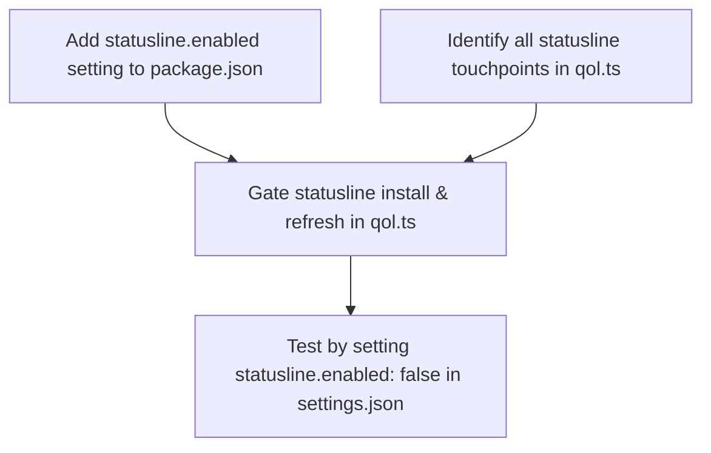

# Plan: Add `statusline.enabled` Setting to pi-qol

## Purpose
Add a boolean setting `statusline.enabled` (default: `true`) to the `@vanillagreen/pi-qol` extension so users can disable the QOL statusline widget while keeping all other QOL features (editor, notifications, session rename, etc.) active. The setting should be accessible via the QOL settings menu (`/qol` command → extension manager settings panel).

## Dependency Graph



## Progress

### Wave 1 — Add Setting Definition & Gate Statusline Code
- [ ] **Task A**: Add `"statusline.enabled"` setting entry to `package.json` `vstack.extensionManager.settings` array (category: "Statusline", type: boolean, default: true, apply: "reload", requiresReload: true)
- [ ] **Task B**: Gate the statusline widget installation in `qol.ts` `session_start` handler behind `settingBoolean("statusline.enabled", true, ctx.cwd)`
- [ ] **Task C**: Gate all `refreshStatusline()` calls in event handlers (`model_select`, `agent_start`, `agent_end`, `session_compact`, and the footer `onBranchChange` callback) behind the same setting
- [ ] **Task D**: Gate the `installSessionTitle()` and `installSessionTitleSync()` calls behind the same setting (these are part of the statusline visual — session name header + tmux title)
- [ ] **Task E**: Ensure `resetStatuslineUi()` still runs unconditionally in `session_shutdown` (it already safely handles no-op when nothing was installed — sets undefined values)

### Wave 2 — Validate
- [ ] **Task F**: Set `"statusline.enabled": false` in `~/.pi/agent/settings.json` under `vstack.extensionManager.config["@vanillagreen/pi-qol"]` and verify pi loads without the statusline

## Detailed Specifications

### Task A — Add Setting to `package.json`
**File:** `/home/mazon/.npm-global/lib/node_modules/@vanillagreen/pi-qol/package.json`

Insert a new entry in the `vstack.extensionManager.settings` array, in the **"Statusline" category** after the existing `"replaceFooter"` entry (approximately line position after the `replaceFooter` setting):

```json
{
  "key": "statusline.enabled",
  "label": "Show statusline",
  "description": "Show the QOL statusline widget (project name, git branch, model, thinking level, context usage bar). Disable to remove the statusline entirely while keeping other QOL features active.",
  "type": "boolean",
  "default": true,
  "category": "Statusline",
  "apply": "reload",
  "requiresReload": true
}
```

This will make it appear in the extension manager settings panel alongside the other "Statusline" settings (`replaceFooter`, `compactPrompt`, `showSessionNameTitle`, etc.).

### Task B — Gate Statusline Widget Installation in `session_start`
**File:** `/home/mazon/.npm-global/lib/node_modules/@vanillagreen/pi-qol/extensions/qol.ts`

In the `pi.on("session_start", ...)` handler, wrap the statusline-specific setup inside the `if (ctx.hasUI)` block. The current code:

```ts
// Inside if (ctx.hasUI) { ... } in session_start handler:
gitState = makeFallbackGitState(ctx.cwd);
void refreshStatusline(ctx);
installSessionTitle(ctx);
installSessionTitleSync(ctx);
// ... editor component ...
const statusWidgetTimer = setTimeout(() => {
    ctx.ui.setWidget("statusline", (tui, theme) => { ... });
}, 0);
statusWidgetTimer.unref?.();
if (settingBoolean("replaceFooter", true, ctx.cwd)) {
    ctx.ui.setFooter(...);
}
```

Should become:

```ts
// Inside if (ctx.hasUI) { ... } in session_start handler:
if (settingBoolean("statusline.enabled", true, ctx.cwd)) {
    gitState = makeFallbackGitState(ctx.cwd);
    void refreshStatusline(ctx);
    installSessionTitle(ctx);
    installSessionTitleSync(ctx);
}

// ... editor component (keep this unconditional) ...

if (settingBoolean("statusline.enabled", true, ctx.cwd)) {
    const statusWidgetTimer = setTimeout(() => {
        ctx.ui.setWidget("statusline", (tui, theme) => {
            activeTui = tui;
            return {
                invalidate() {},
                render(width: number): string[] {
                    return [renderStatusLine(width, ctx, gitState ?? makeFallbackGitState(ctx.cwd), pi, theme)];
                },
            };
        });
    }, 0);
    statusWidgetTimer.unref?.();
    if (settingBoolean("replaceFooter", true, ctx.cwd)) {
        ctx.ui.setFooter((tui, _theme, footerData) => {
            activeTui = tui;
            const unsubscribe = footerData.onBranchChange(() => {
                void refreshStatusline(ctx);
                requestRender();
            });
            return { dispose: unsubscribe, invalidate() {}, render: () => [] };
        });
    }
}
```

Note: The editor component (`ctx.ui.setEditorComponent(...)`) stays **outside** this guard — it's not statusline-related. Similarly, `applyWorkingIndicatorMode(ctx)`, `hiddenThinkingLabel`, and other non-statusline features stay outside.

### Task C — Gate `refreshStatusline` Calls in Event Handlers

Wrap all `refreshStatusline(ctx)` calls with a guard check. The following event handlers need modification:

1. **`pi.on("model_select", ...)`**: Change to:
   ```ts
   if (ctx.hasUI && settingBoolean("statusline.enabled", true, ctx.cwd)) {
       void refreshStatusline(ctx);
       requestRender();
   }
   ```

2. **`pi.on("agent_start", ...)`**: Change to:
   ```ts
   if (ctx.hasUI && settingBoolean("statusline.enabled", true, ctx.cwd)) {
       void refreshStatusline(ctx);
       requestRender();
   }
   ```

3. **`pi.on("agent_end", ...)`**: Change to:
   ```ts
   if (ctx.hasUI && settingBoolean("statusline.enabled", true, ctx.cwd)) {
       void refreshStatusline(ctx);
       requestRender();
   }
   ```

4. **`pi.on("session_compact", ...)`**: Change to:
   ```ts
   if (!ctx.hasUI) return;
   if (settingBoolean("statusline.enabled", true, ctx.cwd)) {
       void refreshStatusline(ctx);
       requestRender();
   }
   ```

5. **Footer `onBranchChange` callback** (inside `setFooter`): This is already gated by being inside the `statusline.enabled` block from Task B, so no additional change needed.

### Task D — Gate `installSessionTitle` / `installSessionTitleSync`

These are already inside the guard from Task B (they're called within the `if (settingBoolean("statusline.enabled", ...))` block). No separate change needed — they're covered by Task B.

### Task E — Verify `resetStatuslineUi()` Safety

The `resetStatuslineUi` function in `session_shutdown`:
- Clears timers (safe — no-op if undefined)
- Restores tmux settings (safe — skips if `tmuxPaneTitleTarget` is undefined)
- Sets widget/header/footer to undefined (safe — no-op if nothing was set)

**No change needed.** The `resetStatuslineUi(ctx)` call can remain unconditional. When statusline is disabled, `tmuxPaneTitleTarget`, `sessionTitleTimer`, etc. are all `undefined`, so the function effectively becomes a series of no-ops. The `ctx.ui.setWidget("statusline", undefined)` call is also safe (it clears a widget that was never registered).

### Task F — Test by Modifying Settings

Edit `~/.pi/agent/settings.json` and add `"statusline.enabled": false` to the QOL config:

```json
"@vanillagreen/pi-qol": {
    ...existing settings...,
    "statusline.enabled": false
}
```

Then start pi and verify:
- ✅ No statusline bar appears
- ✅ Session name header/tmux title are not set
- ✅ Footer replacement does not happen (pi's default footer stays)
- ✅ Other QOL features still work: editor, notifications, thinking timer, session rename, etc.
- ✅ Re-enabling (`"statusline.enabled": true`) and reloading pi restores the statusline

## Surprises & Discoveries

1. **pi-qol is a globally-installed npm package** (`@vanillagreen/pi-qol@1.4.3`), not a git repo. Source modifications must be made directly to the installed package files. These changes will be lost on `npm update`.
2. **The jiti cache in `/tmp/jiti/`** caches compiled versions. After modifying the `.ts` source files, the jiti cache must be cleared (delete `/tmp/jiti/*qol*`) for pi to pick up the changes on next launch.
3. **The extension manager settings panel** (`/qol` command) automatically renders settings defined in `package.json`'s `vstack.extensionManager.settings` array — no additional UI code is needed.
4. **The statusline is composed of three visual elements**: the widget itself (`setWidget("statusline", ...)`), the session name header (`setHeader(...)`), and the footer replacement (`setFooter(...)`). All three should be gated together.
5. **The `replaceFooter` setting** only makes sense when the statusline is active (it replaces Pi's default footer with a branch-change listener for statusline refresh). When the statusline is disabled, `replaceFooter` is irrelevant and should also be skipped.

## Decision Log

- **Decision**: Gate the session name title (`showSessionNameTitle`) together with the statusline rather than separately. Rationale: the session name header is a visual companion to the statusline — they form a cohesive UI. Users can already independently control `showSessionNameTitle` and `showSessionNameWindow`, and those settings will still work when the statusline is enabled. When `statusline.enabled` is false, the header is also skipped to give a completely clean bottom area.
- **Decision**: Use `apply: "reload"` and `requiresReload: true` for the new setting. Rationale: the statusline widget is installed during `session_start` and cannot be dynamically removed mid-session without complex cleanup logic. A reload is cleaner and matches how similar structural settings (`replaceFooter`, `compactPrompt`) work.
- **Decision**: Make the setting key `statusline.enabled` rather than just `statusline` to follow the existing dotted-key convention (e.g., `permissionGate.enabled`, `compaction.customEnabled`, `sessionSearch.enabled`).
- **Assumption**: Modifying the installed npm package directly is acceptable for the user's immediate needs. For a proper upstream contribution, a PR to the [vstack repo](https://github.com/vanillagreencom/vstack) would be needed.

## Outcomes & Retrospective
*(To be completed during execution)*
