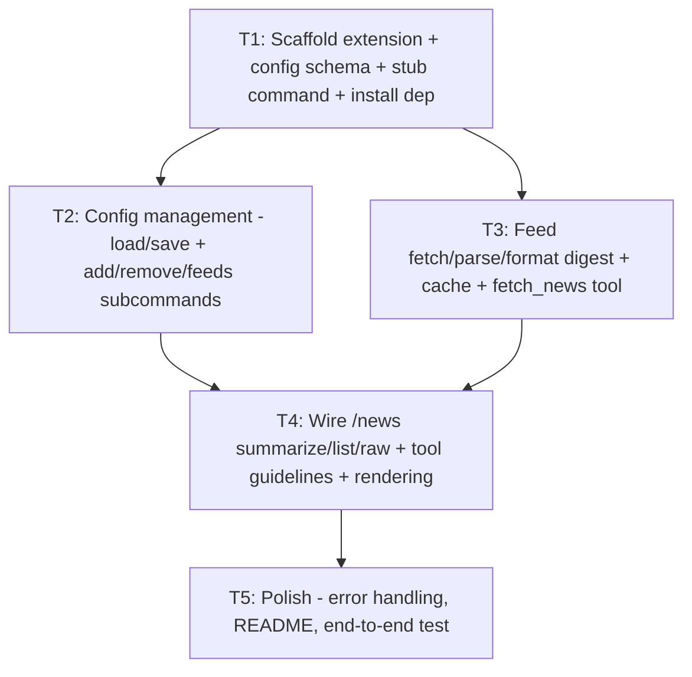

# Plan: RSS `/news` Slash Command for Pi

## Purpose

Give pi a clean **`/news`** slash command that fetches the user's RSS/Atom/JSON
feeds, builds a digest, and has the model summarize the important stories. The
solution must be a first-class `/news` command (not `/skill:news`), fetch feeds
reliably (not by asking the LLM to `curl`+parse XML every time), and leverage the
LLM only for summarization.

## Approach Comparison (decided)

Pi offers four extensibility mechanisms. Here is how each scores for "a clean
`/news` that fetches + summarizes RSS":

| Mechanism | Clean `/news`? | Reliable fetch? | LLM summarize? | Notes |
|-----------|:--------------:|:---------------:|:--------------:|-------|
| **Prompt template** (`~/.pi/agent/prompts/news.md`) | ✅ `/news` | ❌ The model must `curl`+parse XML every turn — unreliable, token-heavy, no caching | ✅ but wasteful | Cheapest to build, worst reliability |
| **Skill** (`~/.pi/agent/skills/news/`) | ⚠️ `/skill:news` only | ✅ via a bundled script | ✅ | Good lightweight option; but not a bare `/news` |
| **Extension** (command + tool) | ✅ `/news` | ✅ TypeScript + npm RSS lib, caching | ✅ via `fetch_news` tool + `sendUserMessage` | **Best UX & reliability** |
| **MCP server** | ❌ | n/a | n/a | Pi's philosophy is "No MCP" — would need an extension anyway |

### Decision: Build an **Extension**.

- An extension registers a real **`/news`** command (the exact UX requested).
- Fetching/parsing happens in TypeScript with a proper feed library
  (`@extractus/feed-extractor`, handles RSS 2.0, RSS 1.0/RDF, Atom, JSON Feed)
  — reliable, cached, and bounded.
- Summarization is delegated to the model via a **`fetch_news` tool** (with
  `promptGuidelines`) + `pi.sendUserMessage`. This keeps the large digest payload
  out of the visible user message and lets it render/collapse like any tool
  result, while still driving an LLM turn.
- Matches the pattern the user already uses (`~/.pi/agent/extensions/pi-web-access`).

A **Skill** is documented below as a lighter fallback (zero TypeScript), but the
extension is the recommended path.

### Design at a glance

```
/news                 -> warm fetch+cache, then sendUserMessage("Summarize my latest RSS news.")
                         Model calls fetch_news tool (cached) and writes a digest.
/news summarize       -> same as default (explicit)
/news list            -> list latest headline per feed (no LLM; direct display)
/news raw             -> dump the full formatted digest (no LLM; direct display)
/news add <url>       -> validate + append feed to config
/news remove <url>    -> remove feed from config
/news feeds           -> list configured feed URLs
```

- Config: `~/.pi/agent/news-feeds.json` (feed URLs + `itemsPerFeed`, `cacheTtlMinutes`).
- Cache: `~/.pi/agent/news-cache.json` (last fetched digest + timestamp; short TTL).
- Tool: `fetch_news` returns the cached/fresh digest; has `promptGuidelines` so the
  model knows to call it when the user wants news; custom `renderResult` for nice UI.

## Dependency Graph



## Progress

### Wave 1 — Foundation
- [ ] T1: Scaffold the `news` extension (package.json, install `@extractus/feed-extractor`, minimal `index.ts` registering a stub `/news` command, and define the config file path + schema/interface)

### Wave 2 — Core capabilities (parallel after T1)
- [ ] T2: Config management — load/save `news-feeds.json` with defaults, plus `/news add|remove|feeds` subcommands (depends: T1)
- [ ] T3: Feed fetching, parsing, digest formatting, caching, and the `fetch_news` tool (depends: T1)

### Wave 3 — Integration
- [ ] T4: Wire `/news` (summarize), `/news list`, `/news raw` to the digest builder + LLM, and add the tool's `promptGuidelines` + custom rendering (depends: T2, T3)

### Wave 4 — Polish
- [ ] T5: Robust error handling, README, and end-to-end manual test of every subcommand (depends: T4)

## Detailed Specifications

All files live under `~/.pi/agent/extensions/news/` (directory extension with
npm deps, following `examples/extensions/with-deps/` and the user's `pi-web-access`).

### T1 — Scaffold extension

**Files to create:**

`~/.pi/agent/extensions/news/package.json`:
```json
{
  "name": "pi-extension-news",
  "private": true,
  "version": "0.1.0",
  "type": "module",
  "pi": { "extensions": ["./index.ts"] },
  "dependencies": {
    "@extractus/feed-extractor": "^7.2.1"
  }
}
```
Then run `npm install` inside that directory (creates `node_modules/`; jiti
resolves imports automatically).

`~/.pi/agent/extensions/news/index.ts` (stub that proves it loads):
```typescript
import type { ExtensionAPI } from "@earendil-works/pi-coding-agent";
import { homedir } from "node:os";
import { join } from "node:path";

// Shared, fixed in T1 so T2/T3 can be built in parallel against it:
export const NEWS_CONFIG_PATH = join(homedir(), ".pi", "agent", "news-feeds.json");
export const NEWS_CACHE_PATH = join(homedir(), ".pi", "agent", "news-cache.json");

export interface NewsFeedConfig {
  feeds: string[];
  itemsPerFeed: number;   // default 5
  cacheTtlMinutes: number; // default 30
}

export default function (pi: ExtensionAPI) {
  pi.registerCommand("news", {
    description: "Fetch and summarize RSS/Atom/JSON feeds",
    getArgumentCompletions: (prefix: string) => {
      const subs = ["summarize", "list", "raw", "add", "remove", "feeds"];
      const hits = subs.filter((s) => s.startsWith(prefix)).map((s) => ({ value: s, label: s }));
      return hits.length > 0 ? hits : null;
    },
    handler: async (_args, ctx) => {
      ctx.ui.notify("/news scaffold loaded — implementation coming next", "info");
    },
  });
}
```
**Done when:** `pi` starts with the extension loaded, `/news` appears in the
command list, typing `/news` shows the stub notification, and `npm install`
succeeded. Verify in the startup header that the `news` extension is listed.

### T2 — Config management

Implement a `config.ts` (or inline in `index.ts`) module exporting:
- `loadConfig(): Promise<NewsFeedConfig>` — read `NEWS_CONFIG_PATH`; if missing,
  create it with sensible defaults and a couple of example feeds (e.g. an
  Hacker News RSS, a tech blog), then return it. tolerate malformed JSON by
  falling back to defaults + notifying.
- `saveConfig(cfg: NewsFeedConfig): Promise<void>` — atomic write (write temp +
  rename).

Wire these subcommands into the `/news` handler (parse `args` as
`<subcommand> [rest]`):
- `add <url>` — basic URL validation (`new URL(url)` + `http(s)` scheme), reject
  duplicates (case-insensitive trim), save, notify "Added N feeds".
- `remove <url>` — remove if present, save, notify result.
- `feeds` — list configured feed URLs via `ctx.ui.notify` (or a select dialog).

Use `node:fs/promises` (`readFile`/`writeFile`/`mkdir({recursive})` for `~/.pi/agent`).
**Done when:** `/news feeds` lists feeds, `/news add <url>` persists across
restarts, `/news remove <url>` removes, and a missing/corrupt config is
auto-created without crashing.

### T3 — Fetch, parse, format, cache, and the `fetch_news` tool

Create `feeds.ts` exporting:
- `fetchDigest(cfg: NewsFeedConfig, signal?: AbortSignal): Promise<Digest>` where
  - For each feed URL, `fetch(url, { signal, redirect: "follow" })` with a per-feed
    timeout (e.g. 8s via `AbortController` + `setTimeout`). Never let one feed
    fail the whole run — catch per-feed, record the error.
  - Parse with `import { extract } from "@extractus/feed-extractor";` →
    `extract(text)`; normalize to `{ feedTitle, items: [{ title, link, pubDate? }] }`.
  - Take `cfg.itemsPerFeed` newest items per feed, dedupe by `link`, sort newest-first.
  - Return `{ fetchedAt, totalItems, entries: Array<{ source, title, link, pubDate? }>, errors: string[] }`.
- Formatting helper `formatDigest(digest): string` — Markdown bullets grouped by
  source, truncated with pi's `truncateHead` (`DEFAULT_MAX_BYTES`/`DEFAULT_MAX_LINES`)
  so we never blow up context.
- Cache: `loadCache()/saveCache(digest)` at `NEWS_CACHE_PATH`; a `getCachedDigest(cfg)`
  that returns cached digest if within `cfg.cacheTtlMinutes`, else calls `fetchDigest`
  and stores it.

Register the **`fetch_news` tool** in `index.ts`:
```typescript
import { Type } from "typebox";
import { truncateHead, DEFAULT_MAX_BYTES, DEFAULT_MAX_LINES } from "@earendil-works/pi-coding-agent";

pi.registerTool({
  name: "fetch_news",
  label: "Fetch News",
  description: "Fetch the user's configured RSS/Atom/JSON feeds and return a formatted digest of recent items. Use when the user asks for their news, headlines, or feed updates.",
  promptGuidelines: ["Use fetch_news when the user asks for their news, RSS feeds, or headlines."],
  parameters: Type.Object({
    refresh: Type.Optional(Type.Boolean({ description: "Bypass cache and fetch fresh (default false)" })),
  }),
  async execute(_id, params, signal, _onUpdate, _ctx) {
    const cfg = await loadConfig();
    const digest = params.refresh
      ? await fetchDigest(cfg, signal)
      : await getCachedDigest(cfg, signal);
    await saveCache(digest);
    return { content: [{ type: "text", text: formatDigest(digest) }], details: digest };
  },
});
```
**Done when:** the `fetch_news` tool is callable (visible in `pi.getAllTools()`
or the model invokes it) and returns a clean Markdown digest; cache short-circuits
repeated calls within the TTL; one bad feed doesn't break the rest.

### T4 — Wire `/news` subcommands + tool rendering

Update the `/news` command handler:
- **default / `summarize`**: warm the cache (`await getCachedDigest(cfg)`), notify
  "Fetched N items from M feeds", then `pi.sendUserMessage("Give me a concise summary of my latest RSS news. Call the fetch_news tool to get the digest, then highlight the most important stories with one-line takeaways and links.")`.
  Guard with `ctx.isIdle()`; if busy, use `{ deliverAs: "followUp" }`.
- **`list`**: fetch digest, display one headline per feed via a `ctx.ui.select`
  dialog (titles linkable text) — no LLM.
- **`raw`**: fetch digest, display `formatDigest(digest)` via
  `pi.sendMessage({ customType: "news", content: formatDigest(digest), display: true })`
  — no LLM.
- Add `renderCall`/`renderResult` to the `fetch_news` tool:
  - `renderCall`: `theme.fg("toolTitle", bold("fetch_news "))` + count.
  - `renderResult`: collapsed shows `✓ N items from M sources`; expanded shows the
    first ~15 digest lines with `theme.fg("dim", ...)`. Handle `isPartial` and errors.
**Done when:** `/news` produces an LLM summary that cites the tool digest, `/news list`
opens a selector, `/news raw` prints the digest, and the tool renders nicely.

### T5 — Polish, docs, and test

- Error handling: bad config, network failure for ALL feeds (notify + return empty
  digest, not a crash), invalid `add` URLs, missing `@extractus/feed-extractor`.
- README.md in the extension dir: install (`npm install`), config file format,
  subcommand reference, example `news-feeds.json`, and the lighter Skill
  alternative note.
- Manual end-to-end test of: `/news`, `/news summarize`, `/news list`, `/news raw`,
  `/news add`, `/news remove`, `/news feeds`, and the model calling `fetch_news`
  on a plain "what's in my feeds?" prompt. Confirm `/reload` picks up edits.
**Done when:** README is accurate and every subcommand works on a fresh run.

---

## Lighter Alternative: Skill (not the primary recommendation)

If zero TypeScript is desired, a skill works at `/skill:news`:

```
~/.pi/agent/skills/news/
├── SKILL.md          # instructs the model to run ./fetch.sh and summarize
└── fetch.sh          # curl feeds, a tiny awk/grep or `jq`-based RSS trim
```
- Trade-off: `/skill:news` (not `/news`), parsing is shell-fragile, no caching,
  no custom rendering. Good enough only for a handful of simple feeds. The
  extension above is preferred.

## Surprises & Discoveries

- Pi's stated philosophy is **"No MCP"** — MCP is explicitly out of scope; an
  extension is the idiomatic way to add this.
- `registerCommand` does **not** take `argument-hint` (that's prompt-template
  only); use `getArgumentCompletions` for `/news <sub>` autocomplete instead.
- Node here is **v26**, so global `fetch` and `AbortController` are available —
  no extra HTTP dependency needed. `@extractus/feed-extractor@7.2.1` is the
  cleanest parser (RSS 2.0, RSS 1.0/RDF, Atom, JSON Feed).
- The user already runs a sophisticated extension (`pi-web-access`) with the
  exact directory + `package.json` + `pi` manifest pattern this plan reuses, so
  the dependency-resolution path is proven in their environment.
- Driving summarization via a **`fetch_news` tool + `sendUserMessage`** is
  cleaner than inlining the big digest into a user message: the payload renders
  as a collapsible tool result and the cache makes the model's tool call instant.

## Decision Log

- **Extension over Skill/Template** — only an extension gives a bare `/news`,
  reliable fetching, and clean caching. (Assumption: the user is fine with a
  small TypeScript file + one npm dependency.)
- **`@extractus/feed-extractor`** chosen over `rss-parser` for broader format
  coverage (Atom/JSON Feed) in one tiny dependency-free package.
- **Tool + `sendUserMessage`** chosen for summarization so the digest is a
  collapsible tool result rather than a giant user message. (Assumption: the
  model reliably calls `fetch_news` when steered by `promptGuidelines` + the
  command's explicit instruction.)
- **Config at `~/.pi/agent/news-feeds.json`** to match the user's existing
  convention of `~/.pi/*` JSON config files (cf. `pi-web-access`'s
  `~/.pi/web-search.json`).
- Default feeds will be seeded (HN + a tech blog) so `/news` works on first run;
  user can edit/remove. (Assumption: user wants sensible defaults, not an empty
  start.)

## Outcomes & Retrospective
[To be completed during execution]
