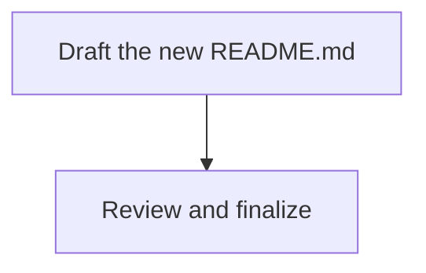

# Plan: Professional README.md Focused on Usability & Security

## Purpose

Rewrite `~/.pi/README.md` to be a polished, professional, concise reference that highlights the security architecture, showcases capabilities, and teaches users how to use this pi configuration. The current README is an exhaustive technical spec — the new one should be a **focused usability guide** that a user actually wants to read.

## Dependency Graph



Single task — this is a self-contained content rewrite with no parallelizable sub-tasks.

## Progress

### Wave 1 — Content rewrite
- [ ] Rewrite README.md as a professional, security-focused usability guide

## Detailed Specifications

### Rewrite README.md

**Goal:** Replace the current README with a professional, concise, usability-focused document.

**Design Principles:**
1. **Security-first** — Lead with the security architecture; it's the most impressive and differentiating feature
2. **Show, don't tell** — Use compact tables, badges, and callout blocks instead of paragraphs
3. **Progressive disclosure** — Quick-start at top → core workflow → reference details
4. **Cut the fat** — Remove: full directory tree, extension code details, internal package list, verbose agent descriptions
5. **Professional polish** — Use shields.io-style badges, clean typography, consistent formatting

**Structure (top to bottom):**

#### 1. Header & Badges
- Title: `~/.pi` or similar clean heading
- One-line tagline: "Secure, agent-based AI coding configuration for [pi](https://github.com/nicepkg/pi-coding-agent)"
- Badges for key features: `🔒 Sandboxed` · `🛡️ Permission-Gated` · `🌳 Worktree Isolated` · `🎨 Aurora Abyss Theme`

#### 2. Quick Start — The Core Workflow
- Show the most common user journey in a compact code block:
  ```
  /idea "Fix login bug"    → capture task
  /plan #1                 → plan → creates dependency-linked tasks
  /do-next                 → execute next available task
  /do-all                  → run all tasks in parallel by wave
  /skill:review            → review the changes
  /skill:git-pr            → commit + open PR
  ```
- Keep this to 6-8 lines maximum. This is the "aha" section.

#### 3. Security Architecture
This is the hero section. Highlight:

**Sandbox (OS-level):**
- Bubblewrap sandbox enabled
- Network: only whitelisted domains (default: deny all)
- Filesystem read denied: `.env`, `*.pem`, `*.key`, `~/.ssh`, `~/.aws`, `~/.gnupg`, `~/.config`
- Filesystem write denied: shell configs (`~/.bashrc`, `~/.zshrc`), `~/.ssh`, `~/.gitconfig`, secrets

**Permission System:**
- Default-deny: all tools require explicit permission (`*` → `ask`)
- `rm -rf` and `sudo` are globally **denied** (non-overridable)
- Per-agent permission overrides (agents get only the permissions they need)
- Yolo mode disabled

**Agent Isolation:**
- **Do** agent runs in **worktree isolation** — changes happen in a separate git worktree, merged only on success
- **Explore/Reviewer/Assistant** — strictly read-only (write: deny, edit: deny)
- **Plan** — read + write (plan files only); no code editing, no bash

**Present as a compact table or structured block**, not a wall of text.**

#### 4. Agents — What They Do
- Compact table: Agent | Purpose | Can Edit?
- 5 rows max:
  | Agent | Purpose | File Access |
  |-------|---------|-------------|
  | Assistant | Chat, Q&A, analysis | 🔒 Read-only |
  | Explore | Code search & discovery | 🔒 Read-only |
  | Plan | Context → plan → tasks | 📝 Plans only |
  | Do | Implement, build, test | ✅ Full (worktree) |
  | Reviewer | Code review & security audit | 🔒 Read-only |

#### 5. Slash Commands
- One compact table: Command | What | Example
- Include: `/idea`, `/plan`, `/do`, `/do-next`, `/do-all`, `/ask`, `/init`, `/grill-me`
- Skip internal implementation details

#### 6. Skills
- Brief table: Skill | What it does
- `git-commit`, `git-pr`, `git-merge`, `review`, `debug`

#### 7. Models
- Compact table of enabled models with provider
- Note local llama.cpp support

#### 8. Customization Decisions
- Brief callout of key configuration choices:
  - Theme: Aurora Abyss (custom dark theme)
  - Default model: zai/glm-5.1 with high thinking
  - Thinking block hidden for clean output
  - Compaction disabled (full context retained)
  - Web search: summary-review workflow
  - Double-escape: interrupts agent
  - Follow-up mode: one-at-a-time

**What NOT to include (explicitly):**
- ❌ Full directory tree structure
- ❌ Package list with npm names
- ❌ Extension implementation details (do-executor code, llama-cpp code)
- ❌ Verbose agent prompt descriptions
- ❌ Plan file format specification
- ❌ Observability/powerline segment config details
- ❌ settings.json raw content

**Length target:** 120-180 lines of markdown (current is ~200+ lines of dense reference). The new version should feel lighter because of better structure, not because it's missing important content.

**Tone:** Professional, confident, security-conscious. Think "enterprise security doc meets developer tool README." Use emoji sparingly as visual anchors (🔒, 🛡️, ✅, 🎨) but don't overdo it.

**Formatting rules:**
- Use `>` blockquotes for callout/important notes
- Use tables for structured reference data
- Use code blocks for workflow examples
- Use `---` horizontal rules to separate major sections
- Keep paragraphs to 1-2 sentences

## Surprises & Discoveries

- The current README is quite thorough but reads like internal documentation rather than a user-facing guide
- The security configuration is genuinely impressive (sandbox + permissions + worktree isolation + read-only agents) but buried in the middle/end of the current README
- There's a lot of redundancy (agent descriptions are in the README AND in the agent .md files)

## Decision Log

- **Decision:** Single task, not split into "draft sections" then "assemble" — the README is a cohesive document that should be written as one piece
- **Decision:** Lead with security rather than models — the security architecture is the most distinctive and impressive aspect
- **Decision:** Keep Quick Start workflow section near the top — users want to know "how do I use this?" immediately
- **Decision:** Omit directory tree and package list — these are internal details users don't interact with directly
- **Decision:** Omit extension code details — users use `/do`, they don't need to know the TypeScript implementation
- **Assumption:** The README audience is the config owner (Mazon) — not someone evaluating pi for the first time. Focus on "how does MY config work" not "what is pi"

## Outcomes & Retrospective

[To be completed during execution]
