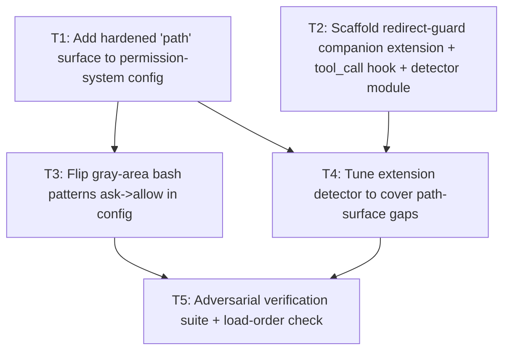

# Plan: Allow "gray-area" bash commands while still blocking malicious output redirection

## Purpose

Make commands like `echo`, `echo *`, `printf`, `base64`, `awk`, `cat` run silently
(**allow**) instead of prompting (**ask**), *without* losing protection against their
real danger — **abusive output redirection / file writes** to sensitive targets
(`echo x > ~/.bashrc`, `cat f > /dev/sda`, `echo x >> /etc/hosts`, `dd of=/dev/sda`,
here-docs to rc files, pipes to `tee`/`cp`/`mv`, process-substitution writers, etc.).

The desired end state: a safe `echo hello` runs silently, but `echo x > ~/.bashrc`
is caught and escalated to `ask`/`deny`.

## Feasibility Verdict: PARTIAL → almost fully YES, and mostly via CONFIG, not a new extension

This is the single most important finding of the investigation, and it **corrects the
stated premise**.

### Correction: there is no built-in "allow/ask/deny" in pi

Stock pi has **no** command-level verdict system. The built-in `bash` tool
(`packages/coding-agent/src/core/tools/bash.ts`) just spawns whatever the model sends —
there is no risk scoring, allowlist, redirect parser, or "gray-area" classification.
Pi's stated philosophy is *"No permission popups"* (README → Philosophy). The *only*
blocking hook in the agent loop is `beforeResult?.block`, which is fed exclusively by
extension `tool_call` handlers
(`packages/agent/src/agent-loop.ts:597-602`).

### The "ask" behavior comes from `@gotgenes/pi-permission-system`, which the user already has

The user's `~/.pi/agent/settings.json` loads `extensions/@gotgenes/pi-permission-system`,
and the user's own config at
`~/.pi/agent/extensions/pi-permission-system/config.json` explicitly sets:

```jsonc
"bash": { "*": "ask", "echo *": "ask", "printf *": "ask", "base64 *": "ask", "awk *": "ask", "cat *": "allow", ... }
```

So **`echo *` is "ask" because the user configured it that way** — almost certainly
*because* of the redirect-danger concern this plan addresses.

### The permission system ALREADY extracts redirect targets — this is the key enabler

`pi-permission-system` parses every bash command with **tree-sitter-bash** and walks the
AST. Critically, in
`src/handlers/gates/bash-program.ts`:

- `collectPathCandidateTokens()` explicitly handles `file_redirect` nodes via
  `collectRedirectTokens()` — i.e. **the destination of `>`, `>>`, etc. is extracted as a
  path candidate**.
- Those candidates are fed to the **cross-cutting `path` surface** (`describeBashPathGate`
  in `src/handlers/gates/bash-path.ts`).

The gate pipeline (`src/handlers/gates/tool-call-gate-pipeline.ts`) runs gates in order and
**short-circuits on the first block**:

```
skill-read → path → external_directory → bash-external-directory
           → bash-path  ← redirect destination checked HERE
           → bash-command  ← "echo *" matched HERE
```

So **`bash-path` (the redirect-target gate) is evaluated BEFORE `bash-command` (the
`echo *` rule)**. A `path` deny/ask on a redirect target therefore overrides a bash
`allow`, exactly the semantics we want. Combined with most-restrictive-wins
(`src/handlers/gates/candidate-check.ts`: deny > ask > allow) and last-matching-rule-wins
in each surface (`schemas/permissions.schema.json`), the clean solution is:

> **Add a hardened `path` surface (protect sensitive targets), THEN flip the gray
> commands to `allow`.** The existing redirect extraction does the rest. No new code
> needed for ~90% of cases.

### Known gaps the `path` surface does NOT cover (justify an optional companion extension)

Verified from `bash-token-classification.ts` + `bash-program.ts`:

| Gap | Why the path surface misses it |
|-----|-------------------------------|
| `dd of=/dev/sda` | token `of=/dev/sda` is rejected as an "env assignment" (`rejectNonPathToken`: `=` before `/`) |
| `echo x > bashrc` (bare relative name, no `.`/`/`) | `classifyTokenAsRuleCandidate` requires a leading `.`, a `/`, or `..` |
| `>&file` / FD-style / `exec >~/.bashrc` redirects | depends on tree-sitter node type; worth a defensive check |
| `cp`/`mv`/`install` to sensitive targets | actually **caught** (generic positional args) — listed to confirm |
| `echo x \| tee ~/.bashrc` | **caught** (`tee` arg is a path candidate) |
| `>(tee ~/.bashrc)` process-substitution writer | **caught** (process_substitution is a nested execution context that gets enumerated) |

So a **companion extension** using the `tool_call` hook is justified specifically to cover
`dd of=`, bare-relative sensitive filenames, and a few redirect shapes — i.e. it is a
*gap-filler* that complements the config, not a replacement for it.

## The exact extension API to use (with citations)

For the optional companion extension, the API is the **`tool_call` event** (can block,
input is mutable, sees the full raw command string):

- Doc: `docs/extensions.md` → "Tool Events → tool_call".
- Type: `BashToolCallEvent { toolName: "bash"; input: { command: string; timeout? } }`
  (`packages/coding-agent/src/core/extensions/types.ts:811-815`).
- Narrowing helper: `isToolCallEventType("bash", event)` (same file, ~line 928).
- Block contract: return `{ block: true, reason?: string }`. Non-interactive modes have no
  UI → guard with `ctx.hasUI` (see `examples/extensions/permission-gate.ts`).
- Existing pattern to copy: `examples/extensions/permission-gate.ts` and
  `examples/extensions/protected-paths.ts`.

For the primary solution, no API is needed — it is a JSON config edit to
`pi-permission-system`.

## Dependency Graph



## Progress

### Wave 1 — Lay the protective layer and the extension scaffold (parallel, independent)
- [ ] T1: Add a hardened cross-cutting `path` surface to `~/.pi/agent/extensions/pi-permission-system/config.json`
- [ ] T2: Scaffold the `redirect-guard` companion extension (`~/.pi/agent/extensions/redirect-guard/`) with the `tool_call` hook and a pure detector module

### Wave 2 — Enable gray commands + close the gaps (depend on Wave 1)
- [ ] T3: Flip gray-area bash patterns from `ask` → `allow` in the permission-system config (depends: T1)
- [ ] T4: Implement/tune the redirect-guard detector rules for the gaps the `path` surface misses (depends: T1, T2)

### Wave 3 — Verify the whole thing is safe (depends on Wave 2)
- [ ] T5: Adversarial verification — confirm safe commands pass silently and every dangerous redirect/write escalates (depends: T3, T4)

## Detailed Specifications

### T1 — Add the `path` surface (the protective layer)

Edit `~/.pi/agent/extensions/pi-permission-system/config.json` and add a `path` key inside
`permission`. Order matters: **last matching rule wins**, so put the broad `*: allow`
catch-all FIRST and the sensitive-target denies AFTER.

Target categories (deny = hard block; ask = prompt — choose per category):
- **Shell-startup / dotfile targets (deny):** `~/.bashrc`, `~/.bash_profile`, `~/.profile`,
  `~/.zshrc`, `~/.zprofile`, `~/.zshenv`, `~/.bash_aliases`, `~/.config/fish/*`,
  `~/.bash_login`, `~/.bash_logout`, `~/.tmux.conf`, `~/.inputrc`, `~/.vimrc`,
  `~/.config/nvim/*`, `~/.gitconfig`, `~/.git-*`. A convenient glob family:
  `~/.bashrc`, `~/.bash*`, `~/.profile*`, `~/.zsh*`, `~/.config/**` (or `~/.config/*`).
- **System files (deny):** `/etc/**`, `/usr/**`, `/boot/**`, `/bin/**`, `/sbin/**`,
  `/lib/**`, `/lib64/**`, `/var/**` (consider ask for `/var/log`), `/proc/**`, `/sys/**`.
- **Devices (deny):** `/dev/**` (covers `/dev/sda`, `/dev/null` overwrites are harmless but
  block to be safe; `/dev/tcp`, `/dev/udp`).
- **Credentials/secrets (deny):** `~/.ssh/**`, `~/.gnupg/**`, `~/.aws/**`, `~/.config/gcloud/**`,
  `~/.docker/**`, `~/.kube/**`, `~/.netrc`, `~/.npmrc`, `*/*.env`, `*/*.env.*`.
- **Home directory root writes via redirect (ask):** `~/*` — broad; consider `ask` rather
  than deny so legitimate `echo > ~/notes.txt` is still confirmable.

Recommended starter block (place inside `permission`, before `bash`):

```jsonc
"path": {
  "*": "allow",
  "~/.ssh/**": "deny",
  "~/.gnupg/**": "deny",
  "~/.aws/**": "deny",
  "~/.config/**": "deny",
  "~/.docker/**": "deny",
  "~/.kube/**": "deny",
  "~/.netrc": "deny",
  "~/.npmrc": "deny",
  "~/.bashrc": "deny",
  "~/.bash_profile": "deny",
  "~/.bash_login": "deny",
  "~/.profile": "deny",
  "~/.zshrc": "deny",
  "~/.zprofile": "deny",
  "~/.zshenv": "deny",
  "~/.bash*": "deny",
  "~/.zsh*": "deny",
  "~/.profile*": "deny",
  "~/.gitconfig": "deny",
  "~/.git-*": "deny",
  "/etc/**": "deny",
  "/usr/**": "deny",
  "/boot/**": "deny",
  "/bin/**": "deny",
  "/sbin/**": "deny",
  "/lib/**": "deny",
  "/lib64/**": "deny",
  "/proc/**": "deny",
  "/sys/**": "deny",
  "/dev/**": "deny",
  "*.env": "deny",
  "*.env.*": "deny",
  "*.env.example": "allow"
}
```

Notes / validation:
- The `path` surface is **cross-cutting** (tools + bash + MCP + extension tools) and a
  `path` deny **cannot be overridden** by a per-tool/bash allow (schema description +
  README). This is exactly why it is the right home for redirect protection.
- `~/` and `$HOME/` are expanded at match time; `*` crosses `/` (same as `**`).
- Verify the JSON is still valid and reload pi (`/reload`) after editing. The user's review
  log shows a prior attempt that *removed* a `path` section — this task re-adds a hardened
  one intentionally.

### T2 — Scaffold the `redirect-guard` companion extension

Create a **directory** extension (global, since the gray-command concern is general):

```
~/.pi/agent/extensions/redirect-guard/
├── index.ts        # default factory: pi.on("tool_call", ...)
├── detector.ts     # pure, synchronous, well-tested redirect/write heuristic
└── README.md       # what it does, how it complements pi-permission-system
```

`index.ts` shape (mirrors `examples/extensions/permission-gate.ts`):

```ts
import type { ExtensionAPI } from "@earendil-works/pi-coding-agent";
import { isToolCallEventType } from "@earendil-works/pi-coding-agent";
import { detectSuspiciousWrite } from "./detector.ts";

export default function (pi: ExtensionAPI) {
  pi.on("tool_call", async (event, ctx) => {
    if (!isToolCallEventType("bash", event)) return undefined;
    const command = event.input.command as string;
    const hit = detectSuspiciousWrite(command, ctx.cwd);
    if (!hit) return undefined;                 // let pi-permission-system decide
    if (!ctx.hasUI) return { block: true, reason: hit.reason }; // non-interactive: block
    const ok = await ctx.ui.confirm("Suspicious write/redirect", `${hit.summary}\n\nAllow?`);
    return ok ? undefined : { block: true, reason: "Blocked by redirect-guard" };
  });
}
```

- **Load-order note:** extension `tool_call` handlers chain; if this returns `undefined`,
  `pi-permission-system` still runs its own gates regardless of order. If this *blocks*,
  it short-circuits. Order is therefore not critical as long as this extension only blocks
  on true gap cases. Because it is in the global auto-discover dir, ensure
  `pi-permission-system` remains enabled in `settings.json` `packages`.
- `detector.ts` must be **pure & synchronous** so it is unit-testable (see
  `pi-permission-system/test/` for the testing style used in this env).

### T3 — Flip gray-area commands to `allow`

In the same `config.json` `bash` map, change the patterns that are only `ask` *because* of
redirect danger (now that T1 protects redirects) to `allow`:

```diff
- "echo *": "ask",
- "printf *": "ask",
- "base64 *": "ask",
- "awk *": "ask",
+ "echo *": "allow",
+ "printf *": "allow",
+ "base64 *": "allow",
+ "awk *": "allow",
```

Keep `deny` rules (`rm -rf *`, `sudo *`) and keep genuinely risky writers as-is. Re-validate
JSON, `/reload`. Expectation after this: `echo hello` runs silently; `echo x > ~/.bashrc`
is denied by the T1 `path` surface (which runs before the `echo *` allow).

**Hard requirement:** T1 must be in place and verified BEFORE this flip, otherwise
`echo x > ~/.bashrc` would be allowed unprotected. (This is why T3 is blocked by T1.)

### T4 — Tune the detector for the gaps the `path` surface misses

`detector.ts` should flag (and only flag) cases `pi-permission-system`'s `path` gate does
**not** catch, so the two layers compose without redundant prompts:

1. **`dd of=<sensitive>`** and other `KEY=/path` writers whose token is rejected as an
   env-assignment by `rejectNonPathToken`. Regex: `\bdd\b[^|;&]*\bof\s*=\s*(\S+)` and
   resolve the captured target against cwd; treat as suspicious if it matches a sensitive
   pattern (reuse the T1 category list — export it from a shared constant).
2. **Bare relative sensitive filenames as redirect targets** with no `/` or leading `.`
   (e.g. `echo x > bashrc` after `cd ~`). Resolve `cwd` + token; if the resolved absolute
   path matches a sensitive target (e.g. `~/bashrc` is not sensitive, but `~/.bashrc` is —
   the dangerous bare case is e.g. `> authorized_keys` inside `~/.ssh`). Practically:
   resolve the token against the effective cwd and match the sensitive list.
3. **`exec`/builtin redirects to sensitive files** (`exec > ~/.bashrc`).
4. **Defensive FD/`&>` redirect shapes** to `file` (not to `&1`/`&2`), where the node type
   is uncertain — a pragmatic regex for `(?:\d)?&?>` followed by a sensitive-looking path.
5. **Here-doc/here-string that writes via a redirected_statement** is already covered by
   the `file_redirect` extraction, so do NOT duplicate — only flag if the target is a
   bare-relative name as in (2).

Detector contract:
- Input: `(command: string, cwd: string)`. Output: `null | { summary: string; reason: string; targets: string[] }`.
- Pragmatic heuristic, NOT a full shell parser. Document the known false-positive/negative
  trade-offs in `README.md`. The general problem of perfectly parsing shell redirects is
  intractable from a regex; we deliberately lean on `pi-permission-system`'s tree-sitter
  parser for the common cases and only handle the documented gaps here.

### T5 — Adversarial verification suite

Manual + scripted checks (write a small bash script under the extension dir, or a TS test
file mirroring the env's vitest style). For each, confirm the observed verdict via the
permission prompt (or `permissionReviewLog`):

**Must PASS silently (allow):**
- `echo hello`, `echo *`, `printf '%s\n' a b`, `cat README.md`, `awk '{print $1}' f`,
  `echo hello > ./local.txt`, `echo hello >> ./build.log`, `echo x > /tmp/pi-test.txt`.

**Must ESCALATE (ask or deny):**
- `echo x > ~/.bashrc`, `echo x >> ~/.bashrc`, `echo x > ~/.profile`,
  `echo x > /etc/passwd`, `echo x >> /etc/hosts`, `cat f > /dev/sda`,
  `echo x | tee ~/.bashrc`, `echo x | tee -a ~/.profile`, `dd if=/dev/zero of=/dev/sda`
  (gap — needs T4), `dd of=/etc/evil` (gap — needs T4),
  `cp ~/evil ~/.ssh/authorized_keys`, `echo x > ~/.ssh/config`,
  `bash -c 'echo x > ~/.bashrc'` (subshell), `echo x > >(tee ~/.bashrc)` (process sub).

Also verify:
- The companion extension loads (startup header lists `redirect-guard`) and
  `pi-permission-system` is still active.
- `permissionReviewLog: true` is set so events are auditable in
  `logs/pi-permission-system-permission-review.jsonl`.
- No regression: `rm -rf *` still denied, `sudo *` still denied.

## Surprises & Discoveries

1. **Premise correction:** pi core has no allow/ask/deny. The behavior is entirely from
   the installed `@gotgenes/pi-permission-system` extension, and `echo *` is `ask` because
   the *user* configured it so.
2. **Redirect extraction already exists:** `pi-permission-system` already parses bash with
   tree-sitter and runs redirect destinations through a cross-cutting `path` gate that
   takes precedence over bash command rules. The "extension" the user imagined is largely
   already built — the real lever is the config.
3. **Prior attempt visible in logs:** the permission-review log shows a verification script
   that checks `"path section removed"` — a previous session removed a `path` section. T1
   deliberately re-introduces a hardened one.
4. **`dd of=` is a real blind spot:** the env-assignment heuristic in
   `bash-token-classification.ts` rejects `of=/dev/sda`, so it slips the path gate. This is
   the strongest justification for the companion extension.
5. The user's env also has `pi-claude-sandbox` (bwrap/seccomp) and `@vanillaggreen/pi-qol`
   with a (disabled) `permissionGate`. These are complementary hardening layers and do not
   conflict with this plan.

## Decision Log

- **Decision:** Treat the config change (T1+T3) as the *primary* solution and the
  companion extension (T2+T4) as an *optional gap-filler*, because the existing
  tree-sitter redirect extraction already covers the common cases. Rationale: least code,
  uses the maintained upstream behavior, no duplicated parsing.
- **Decision:** Ship the companion extension globally (`~/.pi/agent/extensions/redirect-guard/`)
  because the gray-command concern is general, not project-specific.
- **Decision:** Companion extension only blocks/asks on documented gap cases and returns
  `undefined` otherwise, so it composes safely with `pi-permission-system` regardless of
  load order.
- **Assumption (needs validation):** tree-sitter-bash represents `>>`, `&>file` as
  `file_redirect` so they are already path-gated. T5 includes `>>` and a `&>` case to
  confirm; if `&>` is NOT caught, T4 must add it.
- **Assumption (needs validation):** `~/*` as a broad `ask` may be too noisy; T1 starts
  with explicit denies for known-sensitive names and omits the broad `~/*` catch-all. Can
  be tightened later.

## Outcomes & Retrospective
[To be completed during execution]
