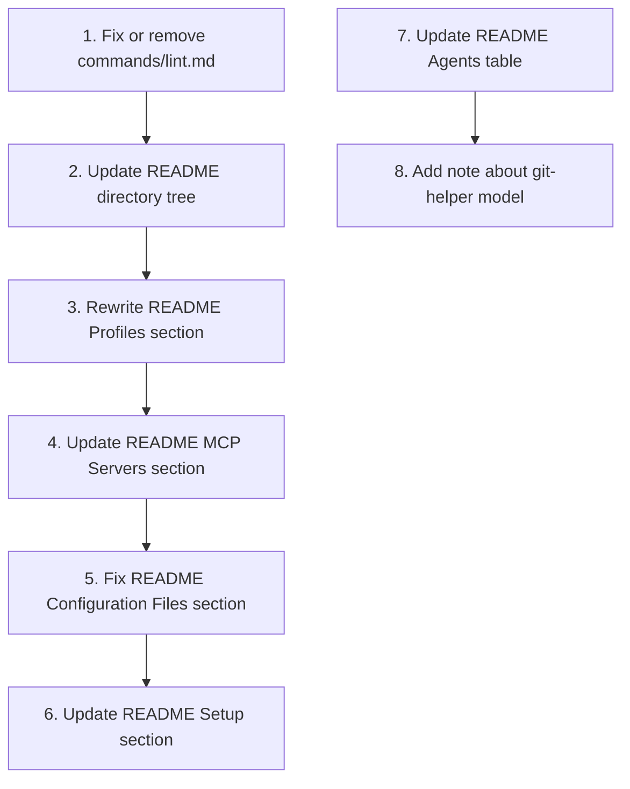

# Plan: Full Config Audit & Documentation Update

## Purpose

Review all configuration files for correctness, consistency, and completeness, then update the README to reflect the current state of the configuration after the simplify-config migration (profiles removed, two standalone config files).

## Dependency Graph



## Progress

### Wave 1 — Fix missing/broken command file
- [ ] 1. Investigate and fix or remove `commands/lint.md`

### Wave 2 — Update README to reflect current config state
- [x] 2. Update README directory tree (remove profiles/, add opencode.json.work)
- [x] 3. Rewrite README Profiles section (standalone files, not profile directories)
- [x] 4. Update README MCP Servers section (only in work config, all disabled by default)
- [x] 5. Fix README Configuration Files section (remove profiles/<name>/opencode.jsonc reference)
- [x] 6. Update README Setup section (manual file swap, not profile selection)

### Wave 3 — Minor documentation accuracy fixes
- [ ] 7. Update README Agents table (git-helper model reference, work profile details)
- [ ] 8. Add .env.example AWS variables documentation note to README

## Detailed Specifications

---

### Task 1: Investigate and fix or remove `commands/lint.md`

**Problem:** The README lists `/lint` as a command, and the `commands/` directory listing shows `lint.md`, but the file could not be read (file not found error). The glob tool also does not find it in the commands directory. This means either:
- The file was recently deleted but the directory cache is stale
- The file exists but is inaccessible (permissions issue)
- The file is a broken symlink

**Actions:**
1. Re-check if `commands/lint.md` exists and is readable
2. If it exists: read it and verify it's valid
3. If it doesn't exist: either create a lint command file or remove it from the README commands table and directory tree

---

### Task 2: Update README directory tree

**File:** `README.md` (lines 7–45)

**Current (incorrect):**
```
~/.config/opencode/
├── ...
├── profiles/              # Environment-specific overrides
│   ├── personal/          #   GLM models, no MCP servers
│   └── work/              #   Gemini model, full MCP integration
└── .opencode/             # Runtime state (plans, history) — gitignored
    └── plugins/
        └── git-worktree.ts
```

**Should become:**
```
~/.config/opencode/
├── opencode.json          # Core configuration — personal profile (GLM models)
├── opencode.json.work     # Work configuration — Gemini model, MCP definitions
├── .env                   # API tokens and secrets (gitignored)
├── .env.example           # Template for required environment variables
├── agents/                # Agent definitions
│   ├── prime.md           #   Orchestrator — routes tasks to subagents
│   ├── planning.md        #   Plan creator — writes execution plans
│   ├── do.md              #   Task executor — runs planned steps
│   ├── explore.md         #   Code searcher — read-only codebase exploration
│   ├── reviewer-alpha.md  #   Conservative code reviewer
│   ├── reviewer-beta.md   #   Balanced code reviewer
│   ├── reviewer-gamma.md  #   Exploratory code reviewer
│   ├── git-helper.md      #   Git operations specialist
│   └── chat.md            #   Conversational agent — web-enabled Q&A
├── commands/              # Slash command implementations
│   ├── plan.md            #   /plan — create or update an execution plan
│   ├── do.md              #   /do — execute planned tasks in parallel
│   ├── review.md          #   /review — tri-model code review
│   ├── commit.md          #   /commit — generate commit message and push
│   ├── defects.md         #   /defects — triage DefectDojo findings
│   └── test-rust.md       #   /test-rust — run Rust test suite
├── skills/                # Domain-specific skill files
│   ├── api-design-rust.md
│   ├── devops-rust.md
│   ├── documentation.md
│   ├── git-workflows.md
│   ├── rust-async.md
│   ├── rust-basics.md
│   ├── rust-testing.md
│   └── testing.md
└── .opencode/             # Runtime state (plans, history) — gitignored
    └── plugins/
        └── git-worktree.ts
```

**Key changes:**
- Remove `profiles/` directory (deleted in simplify-config)
- Add `opencode.json.work` to the tree
- Add `opencode.json` description clarifying it's the personal profile
- Add `test-rust.md` to commands (was missing from original tree)
- Keep or remove `lint.md` depending on Task 1 outcome
- Add `package.json` and `bun.lock` as runtime artifacts (optional)

---

### Task 3: Rewrite README Profiles section

**File:** `README.md` (lines 81–98)

**Current (incorrect):**
```markdown
## Profiles

Profiles override the default agent models and MCP server configuration.

### Personal Profile
- **Models:** GLM family via Z.AI Coding Plan
  ...
- **MCP:** All servers disabled
- **Use case:** Local development without work infrastructure

### Work Profile
- **Models:** Google Gemini via Google Workspace
  - All agents → `google/gemini-3-flash-preview`
- **MCP:** All servers enabled (Sherpa, DefectDojo, Buildkite, GitHub, Atlassian, AWS, Datadog, Trelica)
- **Use case:** Work environment with full infrastructure access
```

**Should become:**
```markdown
## Configuration Profiles

Two standalone configuration files are provided. The active profile is determined by which file is named `opencode.json`. To switch profiles, manually swap the files.

### Personal Profile (`opencode.json`)

This is the **default** active configuration.

- **Models:** GLM family via Z.AI Coding Plan
  - `prime` / `planning` → `zai-coding-plan/glm-5.1`
  - `do` / `explore` → `zai-coding-plan/glm-5-turbo` (faster for execution/search)
  - `reviewer-alpha` → `zai-coding-plan/glm-4.7` (conservative)
  - `reviewer-beta` → `zai-coding-plan/glm-5` (balanced)
  - `reviewer-gamma` → `zai-coding-plan/glm-5.1` (exploratory)
  - `git-helper` → `zai-coding-plan/glm-5-turbo`
  - `chat` → `zai-coding-plan/glm-5.1`
- **MCP:** No MCP servers configured
- **Use case:** Local development without work infrastructure

### Work Profile (`opencode.json.work`)

To activate: `cp opencode.json.work opencode.json` (backup personal config first).

- **Models:** Google Gemini
  - All agents → `google/gemini-3-flash-preview`
- **MCP:** 8 servers defined (Sherpa, DefectDojo, Buildkite, GitHub, Atlassian, AWS, Datadog, Trelica) — **all disabled by default**. Enable specific servers by setting `"enabled": true` in the MCP section.
- **Use case:** Work environment with infrastructure access. Enable MCP servers as needed.
```

**Key changes:**
- Explain the file-swapping mechanism instead of "profile selection"
- Fix work profile MCP description from "All servers enabled" to "all disabled by default"
- Add all agent model details (reviewers, git-helper, chat) to personal profile
- Add instructions for activating the work profile

---

### Task 4: Update README MCP Servers section

**File:** `README.md` (lines 100–111)

**Current:**
```markdown
## MCP Servers

| Server | Type | Purpose |
...
```

**Should add a note:**
```markdown
## MCP Servers

> **Note:** MCP servers are defined in `opencode.json.work` only. The personal profile (`opencode.json`) has no MCP configuration. All servers are disabled by default — enable individual servers by setting `"enabled": true`.

| Server | Type | Purpose |
|--------|------|---------|
...
```

No table changes needed — the server list itself is accurate.

---

### Task 5: Fix README Configuration Files section

**File:** `README.md` (lines 150–156)

**Current (last line is wrong):**
```markdown
## Configuration Files

- `opencode.json` — Core config: enabled agents, MCP server definitions
- `agents/*.md` — Agent frontmatter (model, temperature, tools, permissions) + system prompts
- `commands/*.md` — Command instructions loaded when slash command is invoked
- `profiles/<name>/opencode.jsonc` — Per-profile agent model and MCP overrides
- `.env` — Secrets (gitignored, never committed)
```

**Should become:**
```markdown
## Configuration Files

- `opencode.json` — Active config: enabled agents, model assignments, MCP servers (personal profile by default)
- `opencode.json.work` — Work profile config: Gemini models, MCP server definitions (activate by copying to `opencode.json`)
- `agents/*.md` — Agent frontmatter (model, temperature, tools, permissions) + system prompts
- `commands/*.md` — Command instructions loaded when slash command is invoked
- `.env` — Secrets (gitignored, never committed)
- `.env.example` — Template for required environment variables
```

---

### Task 6: Update README Setup section

**File:** `README.md` (lines 137–149)

**Current:**
```markdown
## Setup

1. **Clone** this repository to `~/.config/opencode`
2. **Copy** `.env.example` to `.env` and fill in your tokens:
   ```bash
   cp .env.example .env
   # Edit .env with your actual API tokens
   ```
3. **Select a profile** in opencode:
   - `personal` — GLM models, no external services
   - `work` — Gemini model, full MCP integration
4. **Start opencode** and use the slash commands listed above
```

**Should become:**
```markdown
## Setup

1. **Clone** this repository to `~/.config/opencode`
2. **Copy** `.env.example` to `.env` and fill in your tokens:
   ```bash
   cp .env.example .env
   # Edit .env with your actual API tokens
   ```
3. **Choose your configuration:**
   - Default: `opencode.json` (personal profile — GLM models, no MCP servers)
   - Work: `cp opencode.json.work opencode.json` (Gemini model, MCP servers available)
4. **Start opencode** and use the slash commands listed above
```

---

### Task 7: Update README Agents table

**File:** `README.md` (lines 49–59)

**Current table is mostly correct** but needs minor adjustments:

- `git-helper` row says `glm-5-turbo` — verify this matches `agents/git-helper.md` frontmatter model `zai-coding-plan/glm-5-turbo` ✓
- The table doesn't mention that reviewer models come from agent frontmatter, not opencode.json — this is fine since the models are correct

**No changes needed** to the agent table — it's accurate.

---

### Task 8: Add .env.example AWS variables note to README

**File:** `README.md` (in MCP Servers or Setup section)

**Action:** The `.env.example` now includes `AWS_REGION` and `AWS_PROFILE` (added in config-review-v2). The README MCP Servers table should note which env vars each server needs. This is a minor improvement.

**Optional — only if there's a natural place to add it without cluttering the README.**

---

## Surprises & Discoveries

1. **`commands/lint.md` is in a liminal state** — Appears in directory listing but not in glob results and returns "file not found" when read. This suggests it may have been deleted between reads, or there's a filesystem/symlink issue.

2. **`opencode.json` MCP section is completely empty** (`"mcp": {}`) — All MCP definitions were moved to `opencode.json.work` during the simplify-config migration. The README still implies MCP servers are in the main config.

3. **Work profile has ALL MCP servers disabled** — The README says "All servers enabled" for the work profile, but `opencode.json.work` has every single MCP server with `"enabled": false`. This was flagged in config-review-v2 (CONFIG-3) as likely incorrect, and the simplify-config plan preserved this behavior. The documentation never caught up.

4. **`.gitignore` still ignores `package.json` and itself** — Flagged as CRITICAL-1 and IMPROVE-8 in config-review-v2, but the user removed those tasks from scope. Not re-flagging here since this is a documentation-focused review.

5. **The README is the main source of drift** — All three prior review plans focused on config fixes, but the README was last updated after config-review (the first review) and wasn't updated after simplify-config removed the profiles directory. The documentation now describes a system that no longer exists.

6. **All prior plans are completed** — `config-review.md` (9/9 tasks), `config-review-v2.md` (7/7 tasks), `simplify-config.md` (5/5 tasks) — all checkboxes are checked. The remaining issues are documentation-only.

## Decision Log

- **Decision:** Focus on documentation accuracy rather than re-flagging known config issues (`.gitignore`, MCP auth) that were previously scoped out.
- **Decision:** The `lint.md` issue needs investigation first since it affects both the README and the actual command availability.
- **Decision:** The work profile MCP description must be corrected from "All servers enabled" to "all disabled by default" — this is a functional documentation error that could mislead users.
- **Assumption:** The `lint.md` file may have been intentionally removed or may need to be recreated. Will determine based on investigation.
- **Assumption:** The README's Agents table is accurate — verified against agent frontmatter models.

## Outcomes & Retrospective

[To be completed during execution]
