# Plan: Comprehensive Configuration Review — Security, Correctness, Best Practices & Improvements

## Purpose

Thorough review of all configuration files in `/Users/hardy/.config/opencode` to identify improvements across security, correctness, best practices, consistency, missing settings, deprecated options, and performance. A previous review was completed (all 9 tasks in `.opencode/plans/config-review.md`), so this plan focuses on remaining and newly discovered issues.

**Note:** Original Wave 1 (security/correctness) and Wave 2 (configuration correctness) tasks were removed per user direction. Only the hardcoded PATH fix (original task 2) was applied. Remaining tasks are the former Wave 3 and Wave 4 items, renumbered. A new Wave 1 task (task 1) has been added to address plan file location guardrails in the planning agent.

## Dependency Graph

```mermaid
graph TD
    F[1. Add plan file location guardrails to agents/planning.md]
    G[2. Update deprecated CI actions in skill files]
    H[3. Add maxTokens / token limits to agents]
    I[4. Expand testing.md skill]
    J[5. Remove deprecated Docker Compose version key]
    K[6. Deduplicate identical profile ocx.jsonc configs]
    L[7. Add .env validation or startup check]

    style F fill:#fff3e0
    style G fill:#e1f5fe
    style H fill:#e1f5fe
    style I fill:#e1f5fe
    style J fill:#e8f5e9
    style K fill:#e8f5e9
    style L fill:#e8f5e9
```



## Progress

### Completed

- [x] Remove hardcoded `/Users/hardy` path from `aws-omise-infra` MCP config

### Wave 1 — Best Practices & Quality
- [x] 1. Add plan file location guardrails to `agents/planning.md`
- [x] 2. Update deprecated CI/CD action versions in skill files
- [x] 3. Consider adding `maxTokens` configuration to agent frontmatter
- [x] 4. Expand `skills/testing.md` with more comprehensive content

### Wave 2 — Polish & Minor Improvements
- [x] 5. Remove deprecated `version` key from Docker Compose examples in skills
- [x] 6. Evaluate deduplication of identical `ocx.jsonc` profile configs
- [x] 7. Add `.env` validation notes or startup check documentation

## Detailed Specifications

---

### 🟠 GUARDRAIL-1: Add plan file location guardrails to `agents/planning.md`

- **File:** `agents/planning.md`
- **Category:** Correctness / Process Improvement
- **Severity:** High
- **Description:** The planning agent previously saved a plan to the project root (`plan.md`) instead of the canonical location (`.opencode/plans/`). The planning agent's instructions (`agents/planning.md`) lack explicit rules about where plan files must be saved. A new section called `## Plan File Location` needs to be added to enforce the correct behavior.
- **Where to insert:** Between the `## Process` section (ends at line 36) and the existing `## Using Explore Subagents` section (starts at line 38). The section should appear before `## Plan File Structure` (line 53).
- **Content to add — `## Plan File Location` section:**

  ```markdown
  ## Plan File Location

  Plans MUST be saved to `.opencode/plans/` in the workspace root. This is non-negotiable.

  ### Rules

  1. **Canonical path:** Save plans to `.opencode/plans/` — never in the project root or any other directory
  2. **Check before creating:** Check for existing plans in `.opencode/plans/` before creating a new one — reuse or extend if a related plan already exists
  3. **Override bad paths:** If the Prime agent passes a path outside `.opencode/plans/`, ignore it, use `.opencode/plans/` instead, and note the correction in the return summary
  4. **Descriptive naming:** Name the file descriptively: e.g., `add-oauth-auth.md`, `config-review-v2.md`, `fix-ci-pipeline.md`
  5. **No overwriting:** Never overwrite an existing plan unless explicitly asked to update it
  6. **Why this matters:**
     - `.opencode/` is gitignored so plans stay local (not committed to version control)
     - Keeping plans in one place makes them discoverable by the Prime agent and other subagents
     - Placing files in the project root pollutes the working directory and creates noise
  ```

- **Why it matters:** Without explicit instructions, the planning agent may save plans to arbitrary locations, making them undiscoverable and potentially committing local-only files to version control.
- **Verification:** After the edit, `agents/planning.md` should contain a `## Plan File Location` section with the 6 rules above, positioned between `## Process` and `## Using Explore Subagents`.

---

### 🔴 CRITICAL-1: `.gitignore` excludes `package.json` and `bun.lock`

- **File:** `.gitignore` (lines 2–3)
- **Category:** Correctness / Reproducibility
- **Severity:** Critical
- **Description:** The `.gitignore` explicitly ignores `package.json` (line 2) and `bun.lock` (line 3). This means:
  - The `@opencode-ai/plugin` dependency (version 1.3.13) declared in `package.json` won't be version-controlled
  - The lockfile ensuring reproducible installs won't be tracked
  - Anyone cloning this config won't get the required dependencies
  - The `plugin` field in `opencode.json` (line 4: `"opencode-cmux"`) depends on npm packages being installed
- **Current lines:**
  ```
  node_modules
  package.json      ← should NOT be ignored
  bun.lock          ← should NOT be ignored
  .gitignore        ← also unusual to ignore itself
  ```
- **Why it matters:** If this config is shared/published, other users won't be able to install dependencies. The `node_modules` ignore is correct, but ignoring `package.json` and `bun.lock` prevents reproducible setups.
- **Fix:** Remove lines 2 (`package.json`) and 3 (`bun.lock`) from `.gitignore`. Keep `node_modules`. Consider also removing line 4 (`.gitignore`) so the ignore rules themselves are version-controlled.
- **Recommended `.gitignore`:**
  ```
  node_modules
  .opencode
  .ocx
  *.env

  # IDE and editor files
  .idea/
  .vscode/
  *.swp
  *.swo

  # OS files
  .DS_Store
  Thumbs.db
  ```

---

### 🔴 CRITICAL-2: Hardcoded user path in `aws-omise-infra` MCP config

- **File:** `opencode.json` (line 102)
- **Category:** Correctness / Portability
- **Severity:** Critical
- **Description:** The `aws-omise-infra` MCP server config has a hardcoded PATH environment variable:
  ```json
  "PATH": "/usr/local/bin:/usr/bin:/bin:/Users/hardy/.local/bin"
  ```
  This path contains `/Users/hardy/.local/bin` — a user-specific directory. This will not work for any other user who clones this configuration.
- **Why it matters:** If `uvx`, `aws`, or other CLI tools are installed in a user's home directory under a different username, the MCP server will fail silently or not find required binaries.
- **Fix options:**
  1. **Use env var inheritance:** Replace with `"{env:PATH}"` to pass through the system PATH
  2. **Append to PATH:** If the MCP framework supports it, append to the existing PATH rather than replacing it
  3. **Remove entirely:** If the MCP server can find binaries without PATH override, remove this line
- **Recommended fix:**
  ```json
  "environment": {
    "AWS_REGION": "{env:AWS_REGION}",
    "AWS_PROFILE": "{env:AWS_PROFILE}"
  }
  ```
  (Remove the PATH override entirely, or use `"{env:PATH}"`)

---

### 🔴 CRITICAL-3: Remote MCP servers missing authentication

- **File:** `opencode.json` (lines 76–117)
- **Category:** Security / Correctness
- **Severity:** Critical
- **Description:** Three remote MCP servers have no authentication configuration:
  
  | MCP Server | URL | Auth Headers | OAuth |
  |------------|-----|-------------|-------|
  | `buildkite` | `https://mcp.buildkite.com/mcp` | None | Not specified |
  | `atlassian` | `https://mcp.atlassian.com/v1/mcp` | None | Not specified |
  | `datadog` | `https://mcp.datadoghq.com/api/unstable/mcp-server/mcp` | None | Not specified |
  
  Compare with `sherpa` which has explicit auth:
  ```json
  "headers": {
    "Authorization": "Bearer {env:SHERPA_AUTH_TOKEN}"
  },
  "oauth": false
  ```
- **Why it matters:** Without auth, these servers either:
  1. Won't work at all (return 401/403)
  2. Use platform-level OAuth that's not documented here
  3. Work anonymously with limited functionality
- **Fix:**
  1. For **buildkite**: Add `"oauth": true` if it uses browser OAuth, or add API key header: `"Authorization": "Bearer {env:BUILDKITE_API_TOKEN}"`
  2. For **atlassian**: These MCP servers typically require OAuth. Add `"oauth": true`
  3. For **datadog**: Add API key header: `"DD-API-KEY": "{env:DATADOG_API_KEY}"` and/or `"DD-APPLICATION-KEY": "{env:DATADOG_APP_KEY}"`
  4. Update `.env.example` with any new token placeholders

---

### 🟡 CONFIG-1: `opencode-cmux` plugin reference

- **File:** `opencode.json` (line 4)
- **Category:** Correctness / Dependency Management
- **Severity:** High
- **Description:** The `plugin` array lists `"opencode-cmux"`:
  ```json
  "plugin": [
    "opencode-cmux"
  ]
  ```
  However, `package.json` only declares `@opencode-ai/plugin` (not `opencode-cmux`):
  ```json
  {
    "dependencies": {
      "@opencode-ai/plugin": "1.3.13"
    }
  }
  ```
  There is no `opencode-cmux` in `node_modules/`. This could be:
  1. A built-in plugin that doesn't need npm installation
  2. A plugin that needs separate installation
  3. A typo or stale reference
- **Why it matters:** If this plugin doesn't exist or isn't installed, opencode may log warnings or fail to load the plugin.
- **Fix:** Verify the plugin name against opencode documentation. If it needs npm installation, add it to `package.json`. If it's a built-in, the reference is fine. If stale, remove it.

---

### 🟡 CONFIG-2: DefectDojo MCP points to staging environment

- **File:** `opencode.json` (line 70)
- **Category:** Correctness / Best Practice
- **Severity:** Medium
- **Description:** The DefectDojo MCP server points to a staging URL:
  ```json
  "DEFECTDOJO_API_BASE": "https://defectdojo.apps.staging-omise.co"
  ```
  This means all DefectDojo operations (via `/defects` command) query the staging environment, not production. If this is intentional for development, it's fine. But if this config is used for production security triage, it should point to the production instance.
- **Why it matters:** Security findings from staging may not reflect the production environment's actual vulnerability posture.
- **Fix:** 
  - If intentional: Add a comment (in a `.jsonc` version) or document in README that this points to staging
  - If not intentional: Change to the production DefectDojo URL
  - Better: Make it an env var: `"DEFECTDOJO_API_BASE": "{env:DEFECTDOJO_API_BASE}"` and set the default in `.env.example`

---

### 🟡 CONFIG-3: Work profile disables ALL MCP servers

- **File:** `profiles/work/opencode.jsonc` (lines 31–39)
- **Category:** Correctness / Functionality
- **Severity:** High
- **Description:** The work profile explicitly disables every MCP server:
  ```jsonc
  "mcp": {
    "sherpa": { "enabled": false },
    "defectdojo": { "enabled": false },
    "buildkite": { "enabled": false },
    "atlassian": { "enabled": false },
    "aws-omise-infra": { "enabled": false },
    "datadog": { "enabled": false },
    "trelica": { "enabled": false },
    "github": { "enabled": false }
  }
  ```
  This is the same as the personal profile. Given that the work profile uses `google/gemini-3-flash-preview`, one would expect work-specific MCP servers (sherpa, defectdojo, buildkite, atlassian, aws-omise-infra, datadog) to be **enabled** — they appear to be work-related services.
- **Why it matters:** The work profile cannot use any MCP tools. The `/defects` command, Buildkite CI integration, and all other MCP-dependent features are non-functional in the work profile.
- **Fix:** Enable the appropriate work MCP servers in `profiles/work/opencode.jsonc`:
  ```jsonc
  "mcp": {
    "sherpa": { "enabled": true },
    "defectdojo": { "enabled": true },
    "buildkite": { "enabled": true },
    "atlassian": { "enabled": true },
    "aws-omise-infra": { "enabled": true },
    "datadog": { "enabled": true },
    "trelica": { "enabled": true },
    "github": { "enabled": true }
  }
  ```
  Or selectively enable only the ones needed for work.

---

### 🟡 CONFIG-4: Personal profile also disables ALL MCP servers

- **File:** `profiles/personal/opencode.jsonc` (lines 22–31)
- **Category:** Observation
- **Severity:** Low
- **Description:** The personal profile disables all MCP servers with the comment `// Disable all work MCP servers`. This is logical for personal use but means the personal profile has zero MCP integrations. This is likely intentional but worth noting.
- **No action needed** if intentional.

---

### 🔵 IMPROVE-1: Deprecated CI/CD actions in skill files

- **Files:**
  - `skills/devops-rust.md` (lines 627–631, 667–668, 688–692)
  - `skills/rust-testing.md` (lines 844–850)
- **Category:** Best Practices / Accuracy
- **Severity:** Medium
- **Description:** Several skill files reference deprecated or outdated GitHub Actions:
  
  | Action | Current Version | Recommended |
  |--------|----------------|-------------|
  | `actions/cache@v3` | v3 | `actions/cache@v4` |
  | `actions/upload-artifact@v3` | v3 | `actions/upload-artifact@v4` |
  | `actions-rs/toolchain@v1` | Deprecated | `actions-rust-lang/setup-rust-toolchain@v1` |
  | `actions-rs/cargo@v1` | Deprecated | `actions-rust-lang/setup-rust-toolchain@v1` (includes cargo) |
  
  The `actions-rs` organization is archived and no longer maintained. The `actions-rust-lang` organization provides maintained replacements.
- **Why it matters:** Skill files are used as reference by the AI when writing CI/CD configs. Outdated action versions could lead to broken CI pipelines or deprecation warnings.
- **Fix:** Update all action references to current versions across both skill files.

---

### 🔵 IMPROVE-2: Missing `maxTokens` / token limits for agents

- **Files:** All agent files in `agents/`
- **Category:** Performance / Best Practices
- **Severity:** Low
- **Description:** No agent frontmatter specifies `maxTokens` or equivalent output token limits. Without limits:
  - Agents may produce excessively long responses (especially `do` when implementing complex tasks)
  - Token costs are unbounded
  - `chat` agent with temperature 0.7 could produce very verbose responses
- **Why it matters:** Token limits help control costs and response quality. The `do` agent in particular could benefit from a generous but bounded output.
- **Fix (optional):** Add `maxTokens` to agent frontmatter where appropriate:
  - `do`: `maxTokens: 8192` (needs room for code generation)
  - `planning`: `maxTokens: 4096` (plans can be long)
  - `reviewer-*`: `maxTokens: 4096` (review reports)
  - `chat`: `maxTokens: 2048` (conversational, should be concise)
  - `explore`: `maxTokens: 2048` (reports should be scannable)

---

### 🔵 IMPROVE-3: `testing.md` skill is skeletal

- **File:** `skills/testing.md` (82 lines)
- **Category:** Quality / Completeness
- **Severity:** Low
- **Description:** The general `testing.md` skill is only 82 lines and covers only:
  - Test types table
  - AAA pattern (TypeScript/Jest only)
  - Naming conventions
  - Coverage goals table
  - Basic mocking patterns (Jest only)
  - Short best practices list
  
  Compare with `rust-testing.md` at 860 lines which covers unit tests, integration tests, mocking, property-based testing, benchmarks, coverage, async testing, and more.
- **Why it matters:** The general testing skill is too thin to be useful as a reference for the AI. It only covers Jest/TypeScript patterns and lacks depth.
- **Fix:** Expand with:
  - Python testing (pytest)
  - Go testing patterns
  - E2E testing (Playwright/Cypress)
  - Test doubles taxonomy (mocks, stubs, fakes, spies)
  - Snapshot testing
  - Contract testing
  - Test data factories
  - Or simplify the scope: rename to `testing-jest.md` to match the actual content

---

### 🔵 IMPROVE-4: Deprecated Docker Compose `version` key in skills

- **File:** `skills/devops-rust.md` (line 145)
- **Category:** Accuracy / Best Practices
- **Severity:** Low
- **Description:** The Docker Compose example uses:
  ```yaml
  version: '3.8'
  ```
  The `version` key is deprecated in Docker Compose V2 (since 2020). Docker Compose V2 ignores it but it generates warnings.
- **Fix:** Remove the `version: '3.8'` line from the Docker Compose example in the skill file.

---

### 🔵 IMPROVE-5: Identical `ocx.jsonc` profile configs

- **Files:**
  - `profiles/personal/ocx.jsonc` (13 lines)
  - `profiles/work/ocx.jsonc` (13 lines)
- **Category:** Consistency / DRY
- **Severity:** Low
- **Description:** Both profile `ocx.jsonc` files are identical:
  ```jsonc
  {
    "$schema": "https://ocx.kdco.dev/schemas/profile.json",
    "registries": {},
    "renameWindow": true,
    "exclude": [
      "**/CLAUDE.md",
      "**/CONTEXT.md",
      "**/.opencode/**",
      "**/opencode.jsonc",
      "**/opencode.json"
    ],
    "include": []
  }
  ```
  If the profiles always share the same ocx configuration, consider whether the root `ocx.jsonc` could serve as the shared base (it already exists with `"registries": {}`). The profile-level files may be redundant.
- **Fix (optional):** If the profiles will always share the same ocx config, move the shared config to the root `ocx.jsonc` and remove the profile-level duplicates. If they might diverge in the future, keep them separate.

---

### 🔵 IMPROVE-6: No `.env` validation or missing-vars documentation

- **Files:** `.env`, `.env.example`, `opencode.json`
- **Category:** Best Practices
- **Severity:** Low
- **Description:** The config references 6 environment variables across MCP servers:
  - `SHERPA_AUTH_TOKEN` (required by sherpa MCP)
  - `DEFECTDOJO_API_TOKEN` (required by defectdojo MCP)
  - `GITHUB_TOKEN` (required by github MCP)
  - `TRELICA_ACCESS_TOKEN` (required by trelica MCP)
  - `AWS_REGION` (required by aws-omise-infra MCP)
  - `AWS_PROFILE` (required by aws-omise-infra MCP)
  
  The `.env.example` only lists 4 of these (missing `AWS_REGION` and `AWS_PROFILE`). There's no documentation about which variables are required vs optional, or what happens when they're missing.
- **Fix:** 
  1. Add `AWS_REGION` and `AWS_PROFILE` to `.env.example`
  2. Add comments in `.env.example` indicating which are required vs optional
  3. Document in README which MCP servers need which variables

---

### 🔵 IMPROVE-7: Reviewer agents reference TypeScript-specific checks

- **Files:**
  - `agents/reviewer-alpha.md` (lines 87–90)
  - `agents/reviewer-beta.md` (lines 87–90)
  - `agents/reviewer-gamma.md` (lines 87–90)
- **Category:** Consistency / Accuracy
- **Severity:** Low
- **Description:** All three reviewer agents list "TypeScript Specific" as a review focus area with checks like `any` usage and discriminated unions. However, the configuration is primarily used for Rust projects (5 of 8 skills are Rust-focused). The reviewers should ideally adapt their focus to the project language.
- **Fix (optional):** Either:
  1. Add "Rust Specific" focus areas (unsafe usage, unwrap in production, trait bounds, etc.)
  2. Generalize the section to "Language-Specific" with examples for both TypeScript and Rust
  3. Keep as-is if the AI adapts based on the project context

---

### 🔵 IMPROVE-8: `.gitignore` ignores itself

- **File:** `.gitignore` (line 4)
- **Category:** Best Practice
- **Severity:** Low
- **Description:** The `.gitignore` includes `.gitignore` on line 4, meaning the ignore rules themselves won't be version-controlled. This is unusual — typically you want `.gitignore` tracked so that everyone shares the same ignore rules.
- **Fix:** Remove `.gitignore` from its own ignore list.

---

## Additional Observations (No Action Needed)

### ✅ Correctly Configured

| Item | Details |
|------|---------|
| Agent permissions | All 8 agents have appropriate tool access for their roles |
| Model assignment | Graduated reviewer strategy (glm-4.7 → glm-5 → glm-5.1) with increasing temperatures is elegant |
| Temperature settings | Prime/Planning: 0.1 (deterministic), Do/Explore: 0.1 (precise), Chat: 0.7 (creative), Reviewers: graduated 0.1/0.2/0.5 |
| Plugin architecture | Multi-agent orchestration with Prime → Planning/Do/Explore/Reviewers is well-structured |
| `.env` gitignored | `*.env` pattern in `.gitignore` prevents credential leakage |
| `.env.example` | Exists with placeholder values for all main tokens |
| Profile overrides | Personal and work profiles correctly override models and MCP settings |
| Reviewer bash permissions | Allowlisted to read-only commands (git diff, rg, etc.) — appropriately restrictive |
| Chat agent isolation | No filesystem access, web-only — correct for conversational use |
| Explore agent bash allowlist | Restricted to search commands (rg, git log, find, wc, head, tail) — correct |

### ⚠️ Architectural Notes

| Note | Details |
|------|---------|
| Skills are inert | All 8 skill files (4,297 lines) are not loaded by any agent or registered in config. They exist but may not be discovered by the framework. |
| `plan` agent disabled correctly | Built-in `plan` agent disabled, replaced by custom `planning` subagent — no conflict |
| `build` and `general` agents disabled | Appropriate — these built-in agents are replaced by custom workflow |
| `summary`, `title`, `compaction` agents enabled | These are built-in utility agents with no custom overrides — correct |
| Previous review completed | All 9 tasks from `.opencode/plans/config-review.md` are checked off — prior issues resolved |

## Surprises & Discoveries

1. **`.gitignore` is self-defeating** — It ignores `package.json`, `bun.lock`, and itself, which means the dependency tree and ignore rules won't be version-controlled when published.

2. **Work profile has ALL MCP servers disabled** — This was likely copied from the personal profile and never customized. The work profile should be the one WITH MCP servers enabled.

3. **No auth for 3 remote MCP servers** — buildkite, atlassian, and datadog have zero auth configuration. They may rely on platform OAuth, but this should be explicit.

4. **Skills remain inert** — The previous review noted this (IMPROVE-1 in the old plan) but it wasn't addressed. All 8 skill files are still not referenced by any agent or config.

5. **The `opencode-cmux` plugin is unresolvable** — It's listed in the plugin array but doesn't appear in npm dependencies or node_modules.

6. **Hardcoded username path** — The `aws-omise-infra` MCP config embeds `/Users/hardy/.local/bin` in the PATH, which will break for any other user.

## Decision Log

- **Decision:** Previous review findings that were already fixed (reviewers in opencode.json, model switches, commit.md expansion, README creation) are NOT re-listed here. Only new/remaining issues are included.
- **Decision:** Skills being inert is noted but not included as an action item — this may be a framework limitation that requires investigation beyond config changes.
- **Assumption:** The work profile should have MCP servers enabled (especially sherpa, defectdojo, buildkite, atlassian) since these appear to be work-related services. The personal profile disabling them makes sense.
- **Assumption:** The `opencode-cmux` plugin is either a built-in or needs separate investigation. Flagged but not fixable without more context.
- **Assumption:** Remote MCP servers without auth (buildkite, atlassian, datadog) may use platform OAuth flows that don't require explicit headers. Flagged for verification.

## Outcomes & Retrospective

All 7 tasks completed successfully.

### Summary

| # | Task | Files Modified | Status |
|---|------|---------------|--------|
| 1 | Add plan file location guardrails to `agents/planning.md` | `agents/planning.md` | Done |
| 2 | Update deprecated CI/CD action versions in skill files | `skills/devops-rust.md`, `skills/rust-testing.md` | Done |
| 3 | Add `maxTokens` configuration to agent frontmatter | All 7 agent files | Done |
| 4 | Expand `skills/testing.md` with comprehensive content | `skills/testing.md` (82 → 684 lines) | Done |
| 5 | Remove deprecated `version` key from Docker Compose | `skills/devops-rust.md` | Done |
| 6 | Evaluate deduplication of identical `ocx.jsonc` configs | No changes — evaluated and kept as-is | Done |
| 7 | Add `.env` validation notes and update `.env.example` | `.env.example` | Done |

### Decisions

- **Task 3 (maxTokens):** Prime agent was intentionally left without `maxTokens` since it orchestrates other agents and may need variable-length responses.
- **Task 6 (ocx dedup):** Root `ocx.jsonc` uses a different schema (`ocx.json`) than profile files (`profile.json`), so they cannot be merged. Profile files kept separate since they may diverge in the future.
- **Task 4 (testing.md):** Expanded from Jest-only content to multi-language coverage (TypeScript, Python, Go) with new sections for test doubles taxonomy, snapshot testing, E2E testing, contract testing, and test data factories.

### Surprises

- The `actions-rs/cargo@v1` action in `rust-testing.md` was completely unnecessary alongside `actions-rs/toolchain@v1` — replaced both with the maintained `actions-rust-lang/setup-rust-toolchain@v1` which includes cargo functionality.
