# Plan: Pre-Publish Config Review — Correctness, Consistency & Improvements

## Purpose

Comprehensive review and fix of all opencode configuration files in `/Users/hardy/.config/opencode` before publishing. Address: (1) stale plan.md reference, (2) skills/commands normalization, (3) permission correctness, (4) model assignments — including user-requested switch to `glm-5-turbo` for `do` and `explore`, and (5) create a README.md for the repo.

## Dependency Graph

```mermaid
graph TD
    A[1. Delete stale plan.md]
    B[2. Audit .env secrets exposure]
    C[3. Add reviewers to opencode.json]
    D[4. Remove hardcoded model names from reviewers]
    E[5. Standardize commands/commit.md]
    F[6. Complete work profile agent config]
    G[7. Switch do & explore to glm-5-turbo]
    H[8. Create README.md]
    I[9. Clean up old plan files in .opencode/plans]

    style A fill:#ffcdd2
    style B fill:#ffcdd2
    style C fill:#fff3e0
    style D fill:#fff3e0
    style E fill:#fff3e0
    style F fill:#e1f5fe
    style G fill:#e1f5fe
    style H fill:#e1f5fe
    style I fill:#e8f5e9
```



## Progress

### Wave 1 — Security & Correctness (bugs)
- [x] 1. Delete stale `plan.md` at repo root
- [x] 2. Audit `.env` secrets and ensure safe for publishing

### Wave 2 — Consistency fixes
- [x] 3. Add reviewer agents to `opencode.json` agent section
- [x] 4. Remove hardcoded model names from reviewer agent descriptions and body text
- [x] 5. Expand `commands/commit.md` to match standard command format

### Wave 3 — Model changes & profile improvements
- [x] 6. Complete work profile — add reviewer/chat agent config to `profiles/work/opencode.jsonc`
- [x] 7. Switch `do` and `explore` agents to `zai-coding-plan/glm-5-turbo` model

### Wave 4 — Documentation & cleanup
- [x] 8. Create `README.md` with usage guide and configuration description
- [x] 9. Clean up old completed plan files in `.opencode/plans/`

## Detailed Specifications

### Findings Catalog

Every issue found during the systematic review, organized by severity.

---

#### 🔴 BUG-1: Stale `plan.md` at repo root
- **File:** `plan.md` (root level)
- **Category:** Bug
- **Lines:** Entire file (263 lines)
- **Description:** A completed plan from a previous `do-subagent → do` rename operation sits at the repo root. This is the "wrong plan.md reference" from the user's concern. Active plan files should live in `.opencode/plans/` with unique timestamped names. This stale file is confusing because it makes the root look like the plan target directory.
- **Fix:** Delete `plan.md` from the root. All active plans are (and should be) in `.opencode/plans/*.md`.
- **Action:** `rm plan.md`

---

#### 🔴 BUG-2: `.env` file contains real API tokens
- **File:** `.env` (lines 2–4)
- **Category:** Security Bug
- **Description:** The `.env` file contains what appear to be real credentials:
  - `SHERPA_AUTH_TOKEN=1e31c8b4-...` (line 2)
  - `DEFECTDOJO_API_TOKEN=d95784c3e718...` (line 3)
  - `GITHUB_TOKEN=github_pat_11AAAOS7Y0...` (line 4)
  - `TRELICA_ACCESS_TOKEN=REPLACE_WITH_YOUR_TOKEN` (line 5, placeholder)
- **Mitigation:** The `.gitignore` includes `*.env` at line 8, so the file is **not tracked by git**. However, if this repo will be published:
  1. **Verify** the file was never committed: `git log --all --full-history -- .env`
  2. **If it was committed**, rotate all tokens immediately and use `git filter-branch` or BFG to remove from history
  3. **If it was never committed**, current state is safe but add a `.env.example` file (with placeholder values) so users know what to configure
- **Action:** Verify git history, add `.env.example` if missing

---

#### 🟡 INCON-1: Reviewer agents not listed in `opencode.json`
- **File:** `opencode.json` (lines 7–40)
- **Category:** Inconsistency
- **Description:** The `agent` section lists `prime`, `planning`, `do`, `chat`, `explore` with explicit `"disable": false` entries. However, `reviewer-alpha`, `reviewer-beta`, and `reviewer-gamma` are absent despite being:
  - Defined in `agents/reviewer-*.md` with `mode: subagent`
  - Listed in `agents/prime.md` subagent types table (line 41–43)
  - Spawned by `commands/review.md` via Task tool
- **Likely harmless** if opencode auto-discovers agent files, but inconsistent with how other subagents are registered.
- **Fix:** Add entries for all three reviewers to `opencode.json`:
  ```json
  "reviewer-alpha": {
    "disable": false
  },
  "reviewer-beta": {
    "disable": false
  },
  "reviewer-gamma": {
    "disable": false
  }
  ```
- **Location:** Add after the `explore` entry (after line 25)

---

#### 🟡 INCON-2: Reviewer descriptions hardcode model names
- **Files:**
  - `agents/reviewer-alpha.md` (lines 2, 40)
  - `agents/reviewer-beta.md` (lines 2, 40)
  - `agents/reviewer-gamma.md` (lines 2, 40)
- **Category:** Maintainability / Inconsistency
- **Description:** The frontmatter `description` and the body paragraph both specify model names and temperatures:
  - Alpha: `"using glm-4.7 with low temperature"` (description), `"using the glm-4.7 model with temperature 0.1"` (body)
  - Beta: `"using glm-5 with moderate temperature"` (description), `"using the glm-5 model with temperature 0.2"` (body)
  - Gamma: `"using glm-5.1 with higher temperature"` (description), `"using the glm-5.1 model with temperature 0.5"` (body)
- **Problem:** If the model in frontmatter changes, these descriptions become misleading. No other agent (prime, planning, do, explore, chat) hardcodes its model name in the description or body.
- **Fix:** Replace model-specific descriptions with role-focused descriptions:
  - Alpha description: `Reviewer Alpha - conservative code review focused on correctness and security`
  - Alpha body: `You are a read-only code reviewer focused on precision. You conservatively flag only clear, definite issues with strong evidence. You never modify files.`
  - Beta description: `Reviewer Beta - balanced code review focused on maintainability and patterns`
  - Beta body: `You are a read-only code reviewer providing balanced analysis. You flag both obvious issues and subtle concerns with full context. You never modify files.`
  - Gamma description: `Reviewer Gamma - exploratory code review focused on architecture and edge cases`
  - Gamma body: `You are a read-only code reviewer with an exploratory mindset. You think creatively and explore alternative perspectives, catching unusual or edge-case issues. You never modify files.`

---

#### 🟡 INCON-3: `commands/commit.md` is incomplete
- **File:** `commands/commit.md` (34 lines total)
- **Category:** Inconsistency
- **Description:** Compared to other commands (`do.md` = 480 lines, `review.md` = 278 lines, `lint.md` = 398 lines, `test-rust.md` = 507 lines, `defects.md` = 85 lines), `commit.md` is skeletal:
  - No `## Usage` section with code examples
  - No `## Implementation Instructions` section (other commands have step-by-step guides)
  - No `## Error Handling` section (just a one-liner about conflicts)
  - No `## Examples` section
  - Uses `!` prefix for git commands (lines 32–34) which is undocumented syntax
- **Fix:** Expand to standard command format with Usage → Implementation Instructions → Error Handling → Examples sections. The `!` prefix syntax needs clarification — if it's opencode-specific, document it; if not, use standard bash command format.
- **Suggested outline:**
  ```markdown
  # Commit Command
  
  ## Usage
  /commit, /commit <message>, /commit --amend
  
  ## Implementation Instructions
  ### 1. Gather changes (git diff, git status)
  ### 2. Generate commit message from diff
  ### 3. Stage and commit
  ### 4. Push (with confirmation)
  
  ## Commit Prefixes [keep existing table]
  
  ## Error Handling
  ### No changes to commit
  ### Push rejected (remote has new commits)
  ### Merge conflicts
  
  ## Examples
  [Show example workflows]
  ```

---

#### 🟡 INCON-4: Work profile missing reviewer/chat agent config
- **File:** `profiles/work/opencode.jsonc`
- **Category:** Inconsistency
- **Description:** The work profile overrides models for `prime`, `planning`, `do`, and `explore` to use `google/gemini-3-flash-preview`. However:
  - `reviewer-alpha`, `reviewer-beta`, `reviewer-gamma` are NOT listed — they'd fall back to their default models (glm-4.7, glm-5, glm-5.1) from the agent files
  - `chat` is NOT listed — it'd use the default `zai-coding-plan/glm-5.1`
  - This means in the work profile, the orchestrator runs Gemini but reviewers run GLM — a mixed-model setup that may not be intentional
- **Decision needed:** Should the work profile use Gemini for ALL agents (including reviewers), or is the mixed setup intentional?
- **Recommended fix (if Gemini everywhere):** Add reviewer and chat configs:
  ```jsonc
  "reviewer-alpha": {
    "model": "google/gemini-3-flash-preview"
  },
  "reviewer-beta": {
    "model": "google/gemini-3-flash-preview"
  },
  "reviewer-gamma": {
    "model": "google/gemini-3-flash-preview"
  },
  "chat": {
    "model": "google/gemini-3-flash-preview"
  }
  ```
- **Note:** The personal profile has the same gap but since it uses the same model as defaults (glm-5.1), the impact is zero.

---

#### 🔵 IMPROVE-1: Skills are not discoverable by the framework
- **Files:** `skills/*.md` (8 files: `api-design-rust.md`, `devops-rust.md`, `documentation.md`, `git-workflows.md`, `rust-async.md`, `rust-basics.md`, `rust-testing.md`, `testing.md`)
- **Category:** Potential Configuration Gap
- **Description:** All 8 skill files have proper frontmatter with `description` fields. However:
  - No agent references any skill by name
  - The `opencode.json` has no `skill` configuration section
  - No command loads a skill
  - The system prompt reports "No skills are currently available" when the skill tool is available
  - The `skill` tool in the system prompt definition says: `Load a specialized skill that provides domain-specific instructions and workflows. No skills are currently available.`
- **Possible causes:**
  1. Skills require registration in `opencode.json` (e.g., a `"skill"` section) that's missing
  2. Skills are auto-discovered but require a different directory structure or naming convention
  3. Skills need to be explicitly loaded by agents using the `skill` tool, but no agent does this
- **Impact:** All 8 skill files (3,300+ lines of carefully crafted domain knowledge) are currently inert.
- **Action:** Investigate opencode documentation for skill registration. If skills require explicit loading, update agent instructions to load relevant skills. If skills require config registration, add to `opencode.json`.

---

#### 🔵 IMPROVE-2: Reviewer bash permissions are overly restrictive but correct
- **Files:** `agents/reviewer-alpha.md`, `agents/reviewer-beta.md`, `agents/reviewer-gamma.md` (lines 15–35)
- **Category:** Observation (not a bug)
- **Description:** All three reviewers have `"cat *": deny` in their bash permissions. This is fine because they have the `read` tool for file inspection. The allow list (`git diff`, `git show`, `git log`, `git blame`, `rg`, `wc`, `head`, `tail`) is appropriate for code review.
- **Note:** `head` and `tail` are allowed but `cat` is denied — this is slightly inconsistent since they serve similar purposes. But since the `read` tool exists, this is a belt-and-suspenders approach that's acceptable.

---

#### 🔵 IMPROVE-3: Prime agent `webfetch: false` is correct by design
- **File:** `agents/prime.md` (line 13)
- **Category:** Observation (not a bug)
- **Description:** The Prime agent has `webfetch: false`, meaning it can't fetch web content. This is intentional — it delegates web research to the `planning` subagent (`webfetch: true`) and the `chat` agent (`webfetch: true`). The Prime agent is an orchestrator, not a researcher.

---

#### 🔵 IMPROVE-4: Explore agent description says "Agent" not "Subagent"
- **File:** `agents/explore.md` (line 2)
- **Category:** Naming inconsistency
- **Description:** The description says `"Explore Agent"` while its `mode` is `subagent`. The other subagents use consistent naming: `"Planning Subagent"`, `"Do"` (neutral). For consistency:
  - Either rename to `"Explore Subagent"` to match planning
  - Or keep as-is since "Explore Agent" is also reasonable for a subagent that can be spawned independently
- **Severity:** Cosmetic only.

---

#### 🔵 IMPROVE-5: Old plan files in `.opencode/plans/` accumulate
- **Files:** `.opencode/plans/` (6 files)
- **Category:** Housekeeping
- **Description:** The plans directory contains 6 completed plan files:
  - `1775181810171-jolly-orchid.md`
  - `1775186919218-crisp-orchid.md`
  - `1775188837927-jolly-engine.md`
  - `1775214495750-kind-orchid.md`
  - `1775217524069-quick-tiger.md`
  - `1775300000000-fix-agent-instructions.md`
- These are historical records. The `.gitignore` excludes `.opencode/` so they won't be published.
- **Action:** Optional cleanup — delete old plans or leave as-is since they're gitignored.

---

#### 🟢 NEW-1: Switch `do` and `explore` to `glm-5-turbo`
- **Files:**
  - `agents/do.md` (line 4: `model: zai-coding-plan/glm-5.1` → `model: zai-coding-plan/glm-5-turbo`)
  - `agents/explore.md` (line 4: `model: zai-coding-plan/glm-5.1` → `model: zai-coding-plan/glm-5-turbo`)
  - `profiles/personal/opencode.jsonc` (lines 13–14, 17–18: update `do` and `explore` model overrides)
- **Category:** User-requested improvement
- **Description:** The user wants faster models for `do` (execution) and `explore` (codebase search). Both currently use `glm-5.1` which is the most capable but slower. Switching to `glm-5-turbo` trades a small amount of reasoning quality for significantly faster responses — ideal for these agents where speed matters more than deep reasoning.
- **Rationale:** `do` executes well-defined plan steps (doesn't need deep reasoning). `explore` searches and reports (speed > depth). The heavy thinking tasks (planning, review) stay on capable models.
- **Changes:**
  1. `agents/do.md` line 4: `model: zai-coding-plan/glm-5-turbo`
  2. `agents/explore.md` line 4: `model: zai-coding-plan/glm-5-turbo`
  3. `profiles/personal/opencode.jsonc`: Update `do` and `explore` model values to `zai-coding-plan/glm-5-turbo`
  4. `profiles/work/opencode.jsonc`: Already uses `google/gemini-3-flash-preview` for both — no change needed (work profile uses Gemini, not GLM)
- **Temperature:** Keep at 0.1 for both — these agents need deterministic output, not creativity.

---

#### 🟢 NEW-2: Create README.md
- **File:** `README.md` (new file, root level)
- **Category:** User-requested documentation
- **Description:** Create a comprehensive README.md that serves as a usage guide and describes the configuration structure for anyone cloning/forking this repo.
- **Suggested sections:**
  ```markdown
  # OpenCode Configuration

  ## Overview
  Brief description: A structured opencode.ai configuration with custom agents, commands, skills, and profiles.

  ## Directory Structure
  agents/         — Agent definitions (prime, planning, do, explore, reviewers, chat)
  commands/       — Slash command implementations (/plan, /do, /review, /commit, etc.)
  skills/         — Domain-specific skill files (Rust, testing, DevOps, etc.)
  profiles/       — Environment-specific overrides (personal, work)
  .opencode/      — Runtime state (plans, history) — gitignored
  opencode.json   — Core configuration (agents, MCP servers)

  ## Agents
  Table of all agents with their role, model, and permissions.

  | Agent | Role | Model | Access |
  |-------|------|-------|--------|
  | prime | Orchestrator | glm-5.1 | Read-only, routes to subagents |
  | planning | Plan creator | glm-5.1 | Read/write (plans only) |
  | do | Task executor | glm-5-turbo | Full read/write |
  | explore | Code search | glm-5-turbo | Read-only |
  | reviewer-alpha | Conservative review | glm-4.7 | Read-only |
  | reviewer-beta | Balanced review | glm-5 | Read-only |
  | reviewer-gamma | Exploratory review | glm-5.1 | Read-only |
  | chat | Conversation | glm-5.1 | Web-only |

  ## Commands
  Table of slash commands with descriptions.

  | Command | Description |
  |---------|-------------|
  | /plan | Create or update a plan |
  | /do | Execute planned tasks |
  | /review | Run 3-reviewer code analysis |
  | /commit | Generate commit and push |
  | /lint | Run linting with auto-fix |
  | /test-rust | Run Rust tests |
  | /defects | Triage DefectDojo findings |

  ## Profiles
  Explain personal vs work profiles.

  ## Skills
  List available skills (Rust, testing, DevOps, etc.).

  ## MCP Servers
  List configured MCP servers (Sherpa, DefectDojo, Buildkite, GitHub, Atlassian, AWS, Datadog, Trelica).

  ## Setup
  1. Clone to ~/.config/opencode
  2. Copy .env.example to .env and fill in tokens
  3. Select profile: personal (GLM) or work (Gemini + MCP)
  ```

---

### Permissions Audit (All Correct ✅)

| Agent | bash | read | write | edit | glob | grep | webfetch | Permission | Assessment |
|-------|------|------|-------|------|------|------|----------|------------|------------|
| `prime` | ❌ | ✅ | ❌ | ❌ | ✅ | ✅ | ❌ | edit:ask, write:ask | ✅ Correct — orchestrator only |
| `planning` | ❌ | ✅ | ✅ | ❌ | ✅ | ✅ | ✅ | write:ask, edit:ask | ✅ Correct — creates plans, can research |
| `do` | ✅ | ✅ | ✅ | ✅ | ✅ | ✅ | ❌ | (none) | ✅ Correct — full execution access |
| `explore` | ✅ (restricted) | ✅ | ❌ | ❌ | ✅ | ✅ | ❌ | bash: allowlist | ✅ Correct — read-only exploration |
| `reviewer-alpha` | ✅ (restricted) | ✅ | ❌ | ❌ | ✅ | ✅ | ❌ | bash: allowlist | ✅ Correct — read-only review |
| `reviewer-beta` | ✅ (restricted) | ✅ | ❌ | ❌ | ✅ | ✅ | ❌ | bash: allowlist | ✅ Correct — read-only review |
| `reviewer-gamma` | ✅ (restricted) | ✅ | ❌ | ❌ | ✅ | ✅ | ❌ | bash: allowlist | ✅ Correct — read-only review |
| `chat` | ❌ | ❌ | ❌ | ❌ | ❌ | ❌ | ✅ | (none) | ✅ Correct — pure conversational |

### Model Assignment Audit

| Agent | Current Model | After Fix | Temperature | Assessment |
|-------|--------------|-----------|-------------|------------|
| `prime` | `zai-coding-plan/glm-5.1` | — (no change) | 0.1 | ✅ Orchestrator needs consistency |
| `planning` | `zai-coding-plan/glm-5.1` | — (no change) | 0.1 | ✅ Planning needs structured output |
| `do` | `zai-coding-plan/glm-5.1` | `zai-coding-plan/glm-5-turbo` | 0.1 | ✅ Execution — speed > deep reasoning |
| `explore` | `zai-coding-plan/glm-5.1` | `zai-coding-plan/glm-5-turbo` | 0.1 | ✅ Search — speed > depth |
| `chat` | `zai-coding-plan/glm-5.1` | — (no change) | 0.7 | ✅ Conversational needs creativity |
| `reviewer-alpha` | `zai-coding-plan/glm-4.7` | — (no change) | 0.1 | ✅ Conservative — older model, low temp |
| `reviewer-beta` | `zai-coding-plan/glm-5` | — (no change) | 0.2 | ✅ Balanced — middle model, moderate temp |
| `reviewer-gamma` | `zai-coding-plan/glm-5.1` | — (no change) | 0.5 | ✅ Exploratory — newest model, higher temp |

**Profile overrides:**
- **Personal:** prime/planning → `glm-5.1`, do/explore → `glm-5-turbo` (after fix)
- **Work:** prime/planning/do/explore → `google/gemini-3-flash-preview` (missing reviewers & chat — see INCON-4)

---

### Skills Inventory (8 files, currently inert)

| Skill | Lines | Description | Status |
|-------|-------|-------------|--------|
| `api-design-rust.md` | 813 | REST/GraphQL API design | ⚠️ Not discoverable |
| `devops-rust.md` | 1006 | Docker, K8s, Terraform, CI/CD | ⚠️ Not discoverable |
| `documentation.md` | 71 | Writing docs, READMEs | ⚠️ Not discoverable |
| `git-workflows.md` | 81 | Branch strategies, commits | ⚠️ Not discoverable |
| `rust-async.md` | 813 | Tokio, async patterns | ⚠️ Not discoverable |
| `rust-basics.md` | 571 | Rust idioms, ownership | ⚠️ Not discoverable |
| `rust-testing.md` | 860 | Testing strategies | ⚠️ Not discoverable |
| `testing.md` | 82 | General testing patterns | ⚠️ Not discoverable |

---

### Commands Inventory (7 files)

| Command | Lines | Format Quality | Issues |
|---------|-------|---------------|--------|
| `do.md` | 480 | ✅ Full format | None |
| `plan.md` | 107 | ✅ Full format | None |
| `review.md` | 278 | ✅ Full format | None |
| `defects.md` | 85 | ✅ Full format | None |
| `lint.md` | 398 | ✅ Full format | None |
| `test-rust.md` | 507 | ✅ Full format | None |
| `commit.md` | 34 | ❌ Incomplete | Missing Usage, Implementation, Error Handling, Examples |

---

## Surprises & Discoveries

1. **No `do-subagent` or `echo` references remain in active files.** The previous rename operation was thorough. All references are confined to the stale `plan.md` at the root and historical `.opencode/plans/` files (both gitignored).

2. **The `.env` file contains real tokens but is gitignored.** The `.gitignore` at line 8 has `*.env` which covers it. No `do-subagent` references in git history should be a concern since the file was never tracked.

3. **The `plan.md` at the root IS the "wrong plan.md reference"** the user mentioned. It's not a reference _inside_ a config file pointing to the wrong location — it's the stale file itself sitting at the root instead of `.opencode/plans/`.

4. **Skills are a substantial body of work** (4,297 lines across 8 files) that's completely inert. This is the biggest hidden issue — all that domain knowledge is unused.

5. **The graduated reviewer model strategy is elegant.** Using glm-4.7 (conservative), glm-5 (balanced), glm-5.1 (exploratory) with increasing temperatures (0.1, 0.2, 0.5) is a thoughtful multi-model ensemble approach.

6. **The `commands/defects.md` references DefectDojo MCP** which is only relevant for the work environment but is defined globally. The personal profile disables the DefectDojo MCP, so this is handled correctly.

7. **`opencode.json` disables built-in `plan` agent** but the custom `planning` agent handles planning. The `/plan` command correctly references `subagent_type="planning"`, not the built-in `plan`. No conflict.

## Decision Log

- **Decision:** Categorize stale `plan.md` as a bug (BUG-1) rather than improvement — it's the user's stated key concern and actively confusing.
- **Decision:** Flag `.env` tokens as high-severity security concern even though gitignored — the user said "about to publish" which warrants extra caution.
- **Decision:** Not flagging the `planning` agent's `edit: false` as a bug. The planning agent creates plans from scratch using the Write tool. It doesn't need Edit to update existing plan content (that's the do agent's job).
- **Decision:** Not flagging the Prime agent's `write: false` + `permission: write: ask` as a bug. The permission override allows writing when explicitly approved, which is needed for plan file sync.
- **Decision:** The skills gap is categorized as an "improvement" rather than "bug" since it may be a framework limitation rather than a config error. Omitted from task list — user can investigate separately.
- **Decision:** User wants `glm-5-turbo` for `do` and `explore` — accepted. Rationale: these agents benefit more from speed than deep reasoning. Heavy-thinking agents (planning, reviewers) keep capable models.
- **Decision:** Work profile keeps `google/gemini-3-flash-preview` for do/explore — no change needed. The model switch only affects default and personal profile.
- **Assumption:** The opencode framework auto-discovers agent files from the `agents/` directory, so reviewer agents work despite not being in `opencode.json`.
- **Assumption:** The `TRELICA_ACCESS_TOKEN=REPLACE_WITH_YOUR_TOKEN` is a placeholder (not a real token).

## Outcomes & Retrospective

To be completed during execution.
