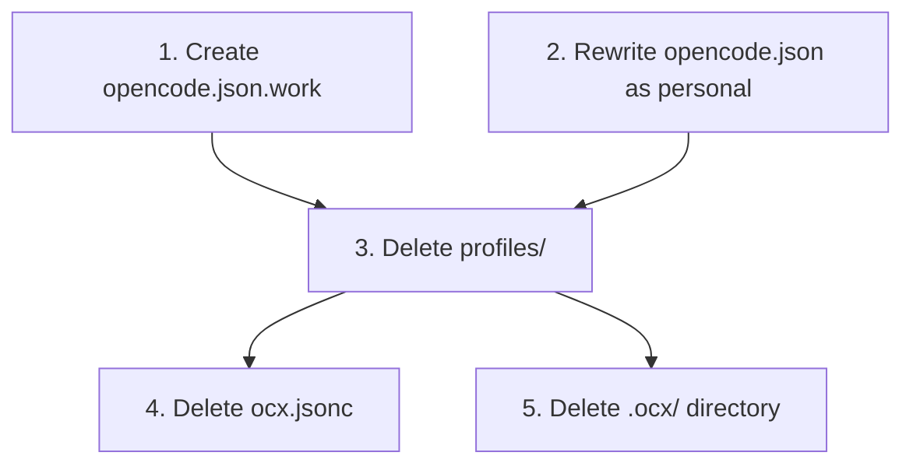

# Plan: Simplify Config — Remove OCX & Profiles, Create Two Standalone Files

## Purpose

Replace the current profile/OCX system with two self-contained config files the user switches between manually:
- `opencode.json` = **personal** (default)
- `opencode.json.work` = **work**

All OCX artifacts (`ocx.jsonc`, `.ocx/`, `profiles/`) will be deleted.

## Dependency Graph



Tasks 1 & 2 are independent (different files). Task 3–5 are cleanup that depends on 1 & 2 being complete first.

## Progress

### Wave 1 — Create new standalone configs
- [x] 1. Create `opencode.json.work` (work setup, standalone)
- [x] 2. Rewrite `opencode.json` as personal setup (standalone)

### Wave 2 — Remove OCX & profile artifacts
- [x] 3. Delete `profiles/` directory (depends: 1, 2)
- [x] 4. Delete `ocx.jsonc` (depends: 3)
- [x] 5. Delete `.ocx/` directory (depends: 3)

## Detailed Specifications

---

### Task 1: Create `opencode.json.work` (work setup)

**File:** `/Users/hardy/.config/opencode/opencode.json.work`

Build a complete, self-contained config by starting from the root `opencode.json` and applying the **work profile overrides** from `profiles/work/opencode.jsonc`:

- **Agent models:** `google/gemini-3-flash-preview` for: prime, planning, do, explore, reviewer-alpha, reviewer-beta, reviewer-gamma, chat
- **Agent permissions:** `external_directory: "allow"` ONLY on `explore` agent
- **MCP servers:** All 8 servers present (keep full definitions from root) but ALL `enabled: false`
- **Everything else unchanged:** plugins, default_agent, agent disable flags, etc.

Resulting `opencode.json.work`:

```json
{
  "$schema": "https://opencode.ai/config.json",
  "plugin": [
    "opencode-cmux",
    ".opencode/plugins/git-worktree.ts"
  ],
  "default_agent": "prime",
  "agent": {
    "prime": {
      "disable": false,
      "model": "google/gemini-3-flash-preview"
    },
    "planning": {
      "disable": false,
      "model": "google/gemini-3-flash-preview"
    },
    "do": {
      "disable": false,
      "model": "google/gemini-3-flash-preview"
    },
    "chat": {
      "disable": false,
      "model": "google/gemini-3-flash-preview"
    },
    "build": {
      "disable": true
    },
    "explore": {
      "disable": false,
      "model": "google/gemini-3-flash-preview",
      "permission": { "external_directory": "allow" }
    },
    "reviewer-alpha": {
      "disable": false,
      "model": "google/gemini-3-flash-preview"
    },
    "reviewer-beta": {
      "disable": false,
      "model": "google/gemini-3-flash-preview"
    },
    "reviewer-gamma": {
      "disable": false,
      "model": "google/gemini-3-flash-preview"
    },
    "git-helper": {
      "disable": false
    },
    "plan": {
      "disable": true
    },
    "general": {
      "disable": true
    },
    "summary": {
      "disable": false
    },
    "title": {
      "disable": false
    },
    "compaction": {
      "disable": false
    }
  },
  "mcp": {
    "sherpa": {
      "type": "remote",
      "url": "https://sherpa.apps.omise.co/mcp/sse",
      "headers": {
        "Content-Type": "application/json",
        "Authorization": "Bearer {env:SHERPA_AUTH_TOKEN}"
      },
      "oauth": false,
      "enabled": false
    },
    "defectdojo": {
      "type": "local",
      "command": ["uvx", "defectdojo-mcp"],
      "environment": {
        "DEFECTDOJO_API_TOKEN": "{env:DEFECTDOJO_API_TOKEN}",
        "DEFECTDOJO_API_BASE": "https://defectdojo.apps.staging-omise.co"
      },
      "enabled": false
    },
    "buildkite": {
      "type": "remote",
      "url": "https://mcp.buildkite.com/mcp",
      "enabled": false
    },
    "github": {
      "type": "local",
      "command": ["npx", "-y", "@modelcontextprotocol/server-github"],
      "environment": {
        "GITHUB_PERSONAL_ACCESS_TOKEN": "{env:GITHUB_TOKEN}"
      },
      "enabled": false
    },
    "atlassian": {
      "type": "remote",
      "url": "https://mcp.atlassian.com/v1/mcp",
      "enabled": false
    },
    "aws-omise-infra": {
      "type": "local",
      "command": [
        "uvx",
        "mcp-proxy-for-aws@latest",
        "https://aws-mcp.us-east-1.api.aws/mcp"
      ],
      "environment": {
        "AWS_REGION": "{env:AWS_REGION}",
        "AWS_PROFILE": "{env:AWS_PROFILE}",
        "PATH": "{env:PATH}"
      },
      "enabled": false
    },
    "datadog": {
      "type": "remote",
      "url": "https://mcp.datadoghq.com/api/unstable/mcp-server/mcp",
      "enabled": false
    },
    "trelica": {
      "type": "remote",
      "url": "https://mcp.1password.com/trelica/mcp",
      "headers": {
        "Authorization": "Bearer {env:TRELICA_ACCESS_TOKEN}"
      },
      "enabled": false
    }
  }
}
```

---

### Task 2: Rewrite `opencode.json` as personal setup

**File:** `/Users/hardy/.config/opencode/opencode.json`

Build a complete, self-contained config by starting from the root `opencode.json` and applying the **personal profile overrides** from `profiles/personal/opencode.jsonc`:

- **Agent models:**
  - `zai-coding-plan/glm-5.1` for: prime, planning
  - `zai-coding-plan/glm-5-turbo` for: do, explore
- **Agent permissions:** `external_directory: "allow"` on ALL agents (prime, planning, do, explore)
- **MCP servers:** All 8 servers present (keep full definitions from root) but ALL `enabled: false`
- **Everything else unchanged:** plugins, default_agent, agent disable flags, etc.

Resulting `opencode.json`:

```json
{
  "$schema": "https://opencode.ai/config.json",
  "plugin": [
    "opencode-cmux",
    ".opencode/plugins/git-worktree.ts"
  ],
  "default_agent": "prime",
  "agent": {
    "prime": {
      "disable": false,
      "model": "zai-coding-plan/glm-5.1",
      "permission": { "external_directory": "allow" }
    },
    "planning": {
      "disable": false,
      "model": "zai-coding-plan/glm-5.1",
      "permission": { "external_directory": "allow" }
    },
    "do": {
      "disable": false,
      "model": "zai-coding-plan/glm-5-turbo",
      "permission": { "external_directory": "allow" }
    },
    "chat": {
      "disable": false
    },
    "build": {
      "disable": true
    },
    "explore": {
      "disable": false,
      "model": "zai-coding-plan/glm-5-turbo",
      "permission": { "external_directory": "allow" }
    },
    "reviewer-alpha": {
      "disable": false
    },
    "reviewer-beta": {
      "disable": false
    },
    "reviewer-gamma": {
      "disable": false
    },
    "git-helper": {
      "disable": false
    },
    "plan": {
      "disable": true
    },
    "general": {
      "disable": true
    },
    "summary": {
      "disable": false
    },
    "title": {
      "disable": false
    },
    "compaction": {
      "disable": false
    }
  },
  "mcp": {
    "sherpa": {
      "type": "remote",
      "url": "https://sherpa.apps.omise.co/mcp/sse",
      "headers": {
        "Content-Type": "application/json",
        "Authorization": "Bearer {env:SHERPA_AUTH_TOKEN}"
      },
      "oauth": false,
      "enabled": false
    },
    "defectdojo": {
      "type": "local",
      "command": ["uvx", "defectdojo-mcp"],
      "environment": {
        "DEFECTDOJO_API_TOKEN": "{env:DEFECTDOJO_API_TOKEN}",
        "DEFECTDOJO_API_BASE": "https://defectdojo.apps.staging-omise.co"
      },
      "enabled": false
    },
    "buildkite": {
      "type": "remote",
      "url": "https://mcp.buildkite.com/mcp",
      "enabled": false
    },
    "github": {
      "type": "local",
      "command": ["npx", "-y", "@modelcontextprotocol/server-github"],
      "environment": {
        "GITHUB_PERSONAL_ACCESS_TOKEN": "{env:GITHUB_TOKEN}"
      },
      "enabled": false
    },
    "atlassian": {
      "type": "remote",
      "url": "https://mcp.atlassian.com/v1/mcp",
      "enabled": false
    },
    "aws-omise-infra": {
      "type": "local",
      "command": [
        "uvx",
        "mcp-proxy-for-aws@latest",
        "https://aws-mcp.us-east-1.api.aws/mcp"
      ],
      "environment": {
        "AWS_REGION": "{env:AWS_REGION}",
        "AWS_PROFILE": "{env:AWS_PROFILE}",
        "PATH": "{env:PATH}"
      },
      "enabled": false
    },
    "datadog": {
      "type": "remote",
      "url": "https://mcp.datadoghq.com/api/unstable/mcp-server/mcp",
      "enabled": false
    },
    "trelica": {
      "type": "remote",
      "url": "https://mcp.1password.com/trelica/mcp",
      "headers": {
        "Authorization": "Bearer {env:TRELICA_ACCESS_TOKEN}"
      },
      "enabled": false
    }
  }
}
```

---

### Task 3: Delete `profiles/` directory

**Path:** `/Users/hardy/.config/opencode/profiles/`

Remove the entire `profiles/` directory and all contents:
- `profiles/personal/opencode.jsonc`
- `profiles/personal/ocx.jsonc`
- `profiles/work/opencode.jsonc`
- `profiles/work/ocx.jsonc`

---

### Task 4: Delete `ocx.jsonc`

**Path:** `/Users/hardy/.config/opencode/ocx.jsonc`

Remove the root OCX config file (currently empty registries, no longer needed).

---

### Task 5: Delete `.ocx/` directory

**Path:** `/Users/hardy/.config/opencode/.ocx/`

Remove the entire `.ocx/` directory and contents:
- `.ocx/receipt.jsonc`

---

## Surprises & Discoveries

1. **Both profiles disable all MCP servers** — The work profile disables the same work-related MCP servers (sherpa, defectdojo, buildkite, etc.) that the personal profile does. This was flagged in the previous config review (CONFIG-3 in `config-review-v2.md`) as likely incorrect for the work profile. The new standalone files preserve this behavior exactly as-is (all disabled), but the user should verify this is intentional for the work config.
2. **No work MCP enablement expected** — The user's context explicitly states "All 8 MCP servers DISABLED" for both profiles, so the plan faithfully reproduces this.
3. **Root config currently has all MCP enabled** — The current `opencode.json` has all 8 MCP servers `enabled: true`. After this change, the default (personal) config will have them all disabled. This is correct per the user's request.

## Decision Log

- **Decision:** Both files will have all MCP servers disabled, matching the profile overrides exactly. If the user wants work MCP servers enabled, that's a separate change.
- **Decision:** The `.ocx/` directory is inside `/Users/hardy/.config/opencode/.ocx/` — note this is distinct from `/Users/hardy/.config/opencode/.opencode/` which must be preserved.
- **Decision:** Used `.json` extension for `opencode.json.work` (not `.jsonc`) to match the root config format. Both files are plain JSON without comments.
- **Assumption:** Switching between configs is done manually by the user (e.g., `cp opencode.json.work opencode.json` or symlinking). No automated switching mechanism is being set up.
- **Assumption:** The `opencode.json.work` naming is a convention the user chose — opencode itself will only read `opencode.json`.

## Outcomes & Retrospective

[To be completed during execution]
