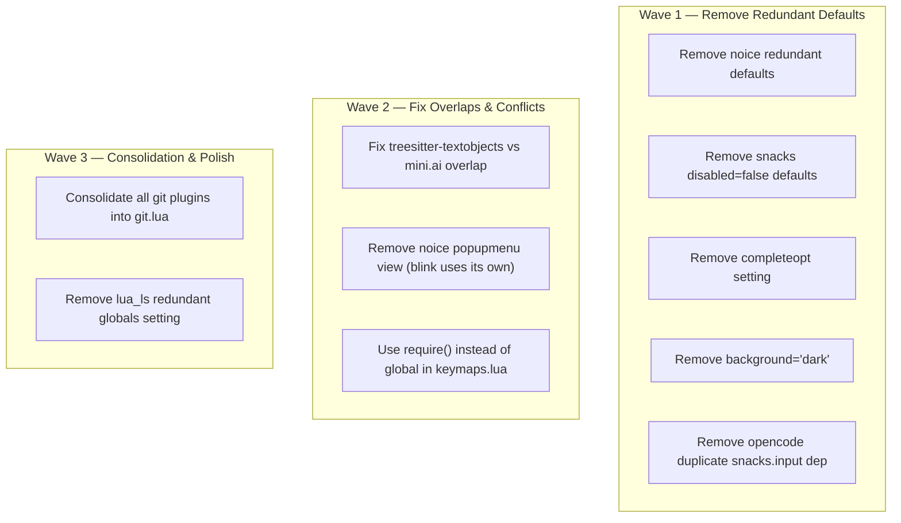

# Plan: Neovim Configuration Audit — Simplifications & Improvements

## Purpose
Comprehensive audit of the Neovim configuration at `/home/mazon/.config/nvim`, identifying redundant plugins, unnecessary config, modernization opportunities, lazy-loading gaps, and structural improvements.

## Current Config Structure

```
~/.config/nvim/
├── init.lua                    # Entry point, leader keys, lazy.nvim bootstrap
├── .stylua.toml                # StyLua formatter config
├── lazy-lock.json              # Plugin lockfile (30 plugins)
├── lua/
│   ├── options.lua             # Vim options (73 lines)
│   ├── keymaps.lua             # General keymaps (60 lines)
│   ├── autocmds.lua            # Autocommands (22 lines)
│   ├── lsp_init.lua            # LSP setup — vim.lsp.enable() (42 lines)
│   └── plugins/                # 21 plugin specs
│       ├── blink.lua           # blink.cmp — completion + signature
│       ├── colorscheme.lua     # Catppuccin mocha
│       ├── flash.lua           # Flash jump / treesitter navigation
│       ├── formatter.lua       # conform.nvim — format on save
│       ├── git.lua             # Neogit + diffview + gitsigns (merged)
│       ├── ~~gitsigns.lua~~    # ← To be deleted (merged into git.lua)
│       ├── lazydev.lua         # Lua dev environment for nvim config
│       ├── lint.lua            # nvim-lint — ruff, shellcheck
│       ├── lualine.lua         # Status line
│       ├── mini.lua            # mini.ai, surround, pairs, bufremove, move, splitjoin, icons
│       ├── noice.lua           # Cmdline popup, message routing, notify
│       ├── opencode.lua        # OpenCode integration
│       ├── persistence.lua     # Session restore (manual)
│       ├── snacks.lua          # Dashboard, picker, terminal, notifier, bigfile, scroll, etc.
│       ├── tmux.lua            # Tmux navigator (conditional)
│       ├── treesitter.lua      # Treesitter + textobjects
│       ├── ts-comments.lua     # TS-based comment string
│       ├── undotree.lua        # Undo tree visualization
│       ├── which-key.lua       # Keybinding help
│       ├── workspaces.lua      # Workspace switcher
│       └── yanky.lua           # Yank history + cycle
└── after/
    └── lsp/                    # Per-server LSP configs (Neovim 0.11+ native)
        ├── clangd.lua
        ├── gopls.lua
        ├── lua_ls.lua
        ├── pyright.lua
        ├── rust.lua
        ├── ts.lua
        └── zls.lua
```

**Plugin count:** 30 (via lazy-lock.json)
**Overall quality:** Well-organized, modern (uses `vim.lsp.enable()`, blink.cmp, snacks.nvim). Most plugins are actively maintained. The config is clean with good separation of concerns.

---

## Dependency Graph



All items within each wave are independent of each other. Waves represent increasing effort/decreasing impact.

---

## Progress

### Wave 1 — Remove Redundant Defaults (Quick Wins)

- [x] **1.1** Remove redundant noice defaults (`noice.lua`)
- [x] **1.2** Remove redundant snacks `enabled = false` entries (`snacks.lua`)
- [x] **1.3** Remove `completeopt` setting (`options.lua`)
- [x] **1.4** Remove `background = 'dark'` (`options.lua`)
- [x] **1.5** Remove duplicate `snacks.input` dependency in opencode (`opencode.lua`)

### Wave 2 — Fix Overlaps & Conflicts (Functional Improvements)

- [x] **2.1** Remove `select` from treesitter-textobjects, keep only `move` (`treesitter.lua`)
- [x] **2.2** Remove `popupmenu` view from noice — blink.cmp renders its own completion menu (`noice.lua`)
- [x] **2.3** Use `require('mini.bufremove')` instead of global `MiniBufremove` (`keymaps.lua`)

### Wave 3 — Consolidation & Polish (Nice to Have)

- [x] **3.1** Consolidate all git plugins (neogit, diffview, gitsigns) into a single `git.lua` file; delete `gitsigns.lua`
- [x] **3.2** Remove redundant `vim` global from lua_ls settings (lazydev handles it) (`after/lsp/lua_ls.lua`)
- [~] ~~**3.3** Consider enabling `snacks.explorer` for file navigation~~ — _Cancelled: user does not want a file explorer_
- [~] ~~**3.4** Re-enable `snacks.picker` previews (`preview = false` → `preview = true`)~~ — _Cancelled: user wants to keep `preview = false`_

---

## Detailed Specifications

### Wave 1 — Remove Redundant Defaults

#### 1.1 Remove redundant noice defaults — `lua/plugins/noice.lua`
**Priority:** High | **Effort:** Trivial

These settings are already noice defaults — setting them explicitly adds noise:

| Line | Setting | Default | Action |
|------|---------|---------|--------|
| 14 | `progress.enabled = true` | `true` | Remove line |
| 19 | `presets.bottom_command = false` | `false` | Remove line |
| 93-96 | `notify = { enabled = true, view = 'notify' }` | Both defaults | Remove block |

After cleanup:
```lua
opts = {
    lsp = {
      override = {
        ['vim.lsp.util.convert_input_to_markdown_lines'] = true,
        ['vim.lsp.util.stylize_markdown'] = true,
      },
      progress = { view = 'mini' },
    },
    presets = {
      long_message_to_split = true,
    },
    routes = { -- keep as-is
    ...
```

#### 1.2 Remove redundant snacks disabled entries — `lua/plugins/snacks.lua`
**Priority:** High | **Effort:** Trivial

Lines 20-21: `explorer = { enabled = false }` and `indent = { enabled = false }` — both default to `false`. Remove both lines.

#### 1.3 Remove `completeopt` — `lua/options.lua`
**Priority:** High | **Effort:** Trivial

**Line 66:** `vim.opt.completeopt = 'menu,menuone,noselect'`

blink.cmp manages `completeopt` internally on initialization. Setting it manually is redundant and can cause issues if blink changes its default strategy. Remove this line.

#### 1.4 Remove `background = 'dark'` — `lua/options.lua`
**Priority:** Medium | **Effort:** Trivial

**Line 19:** `vim.opt.background = 'dark'`

The catppuccin colorscheme (with `flavour = 'mocha'`) sets `background = 'dark'` automatically when it loads. This is redundant. Remove line 19.

#### 1.5 Remove duplicate snacks.input dependency — `lua/plugins/opencode.lua`
**Priority:** Medium | **Effort:** Trivial

**Lines 3-5:** The dependency `{ 'folke/snacks.nvim', opts = { input = { enabled = true } } }` duplicates what's already set in `snacks.lua` (line 22: `input = { enabled = true }`). Remove the dependency override — simplify to:

```lua
return {
  'NickvanDyke/opencode.nvim',
  opts = {},
  keys = {
```

---

### Wave 2 — Fix Overlaps & Conflicts

#### 2.1 Fix treesitter-textobjects vs mini.ai overlap — `lua/plugins/treesitter.lua`
**Priority:** High | **Effort:** Small

**Problem:** Both `mini.ai` and `nvim-treesitter-textobjects` configure `af`/`if`/`ac`/`ic` text objects via treesitter. These keymaps **conflict** — whichever loads last wins. `mini.ai` (VeryLazy) maps `f` and `c` as text object specifiers used with `a`/`i`, while textobjects maps `af`/`if`/`ac`/`ic` directly. The two systems fight over the same key sequences.

**Solution:** Remove the `select` section from `nvim-treesitter-textobjects` (lines 24-33). Keep only the `move` section (lines 34-53) which provides unique `]f`/`[f`/`]c`/`[c` navigation that mini.ai does NOT provide.

The mini.ai treesitter specs in `lua/plugins/mini.lua` (lines 10-16) already handle the select use case correctly via the `a`/`i` text object prefix convention.

Updated textobjects config:
```lua
{
  'nvim-treesitter/nvim-treesitter-textobjects',
  event = 'VeryLazy',
  config = function()
    require('nvim-treesitter-textobjects').setup {
      move = {
        enable = true,
        set_jumps = true,
        goto_next_start = {
          [']f'] = '@function.outer',
          [']c'] = '@class.outer',
        },
        goto_next_end = {
          [']F'] = '@function.outer',
          [']C'] = '@class.outer',
        },
        goto_previous_start = {
          ['[f'] = '@function.outer',
          ['[c'] = '@class.outer',
        },
        goto_previous_end = {
          ['[F'] = '@function.outer',
          ['[C'] = '@class.outer',
        },
      },
    }
  end,
},
```

#### 2.2 Remove noice popupmenu view — `lua/plugins/noice.lua`
**Priority:** Medium | **Effort:** Small

**Lines 66-80:** The `popupmenu` view in noice styles the built-in completion popupmenu. However, **blink.cmp renders its own completion menu** and does not use the built-in popupmenu. This entire view configuration is dead code.

Remove the `popupmenu` block from `views`:
```lua
views = {
  cmdline_popup = { -- keep this one
    ...
  },
},
```

#### 2.3 Use `require()` instead of global in keymaps — `lua/plugins/keymaps.lua`
**Priority:** Medium | **Effort:** Trivial

**Lines 38-42:** `MiniBufremove.delete(0, false)` relies on the `MiniBufremove` global set by mini.nvim during setup. Since mini.nvim is `VeryLazy`, this global doesn't exist at startup. If `<leader>bd` is pressed before VeryLazy fires, it will error.

Replace with `require()` which allows lazy.nvim to load the module on demand:

```lua
vim.keymap.set('n', '<leader>bd', function()
  require('mini.bufremove').delete(0, false)
end, { desc = 'Delete buffer (keep window)' })
vim.keymap.set('n', '<leader>bD', function()
  require('mini.bufremove').delete(0, true)
end, { desc = 'Force delete buffer (keep window)' })
```

---

### Wave 3 — Consolidation & Polish

#### 3.1 Consolidate all git plugins into single `git.lua` — `lua/plugins/git.lua` + `lua/plugins/gitsigns.lua`
**Priority:** Medium | **Effort:** Medium

**Current state — two separate files:**

| File | Plugin | Load event | Contains |
|------|--------|------------|----------|
| `lua/plugins/git.lua` | neogit | `keys` (lazy) | Neogit status/commit/pull/push, diffview open/history/close, gitsigns full blame |
| `lua/plugins/gitsigns.lua` | gitsigns | `VeryLazy` | Signs config, current-line-blame, word_diff, hunk stage/reset/undo/preview/blame/diff, hunk nav |

**Problem:** Git-related plugins are spread across two files. The `<leader>gB` (full blame) keymap in `git.lua` calls `gitsigns` directly, creating a hidden cross-file coupling. Having all git concerns in one place improves discoverability and maintainability.

**Action:** Merge `gitsigns.lua` into `git.lua` as a multi-spec lazy.nvim file, then delete `gitsigns.lua`.

**Target file — `lua/plugins/git.lua`:**

```lua
return {
  -- Gitsigns: gutter signs, hunk actions, blame
  {
    'lewis6991/gitsigns.nvim',
    event = 'VeryLazy',
    opts = {
      signs = {
        add = { text = '+' },
        change = { text = '~' },
        delete = { text = '_' },
        topdelete = { text = '‾' },
        changedelete = { text = '~' },
      },
      current_line_blame = true,
      current_line_blame_opts = {
        virt_text_pos = 'eol',
      },
      word_diff = true,
    },
    keys = {
      { '<leader>ghs', function() require('gitsigns').stage_hunk() end, desc = 'Stage hunk', mode = { 'n', 'v' } },
      { '<leader>ghr', function() require('gitsigns').reset_hunk() end, desc = 'Reset hunk', mode = { 'n', 'v' } },
      { '<leader>ghu', function() require('gitsigns').undo_stage_hunk() end, desc = 'Undo stage hunk' },
      { '<leader>ghp', function() require('gitsigns').preview_hunk() end, desc = 'Preview hunk' },
      { '<leader>ghb', function() require('gitsigns').blame_line() end, desc = 'Blame line' },
      { '<leader>gB', function() require('gitsigns').blame_line { full = true } end, desc = 'Blame line (full)' },
      { '<leader>ghd', function() require('gitsigns').diffthis() end, desc = 'Diff this' },
      { ']h', function() require('gitsigns').nav_hunk('next') end, desc = 'Next hunk' },
      { '[h', function() require('gitsigns').nav_hunk('prev') end, desc = 'Previous hunk' },
    },
  },

  -- Neogit: Git workflow UI + Diffview: Diff viewer
  {
    'NeogitOrg/neogit',
    dependencies = {
      'nvim-lua/plenary.nvim',
      'sindrets/diffview.nvim',
      'folke/snacks.nvim',
    },
    keys = {
      { '<leader>gs', '<cmd>Neogit<CR>', desc = 'Neogit status' },
      { '<leader>gc', '<cmd>Neogit commit<CR>', desc = 'Neogit commit' },
      { '<leader>gp', '<cmd>Neogit pull<CR>', desc = 'Neogit pull' },
      { '<leader>gP', '<cmd>Neogit push<CR>', desc = 'Neogit push' },
      { '<leader>gd', '<cmd>DiffviewOpen<CR>', desc = 'Diff view' },
      { '<leader>gD', '<cmd>DiffviewFileHistory %<CR>', desc = 'Diff file history' },
      { '<leader>gC', '<cmd>DiffviewClose<CR>', desc = 'Diff view close' },
    },
  },
}
```

**Key changes:**
- `<leader>gB` (full blame) moves from the neogit spec into the gitsigns spec's `keys` table — all blame keymaps now live together
- Neogit no longer has the `<leader>gB` keymap (removed from its `keys`)
- File returns a **table of two lazy.nvim specs** — lazy.nvim supports this natively
- Gitsigns retains its `event = 'VeryLazy'` load behavior (not affected by being in the same file)
- **Delete `lua/plugins/gitsigns.lua`** after merging

**Verification:**
- Run `:checkhealth lazy` to confirm both plugins load correctly
- Test `<leader>ghb` (short blame), `<leader>gB` (full blame), `<leader>gs` (neogit), `<leader>gd` (diffview)
- Confirm no orphaned references to `gitsigns.lua` elsewhere

#### 3.2 Remove redundant `vim` global from lua_ls settings — `after/lsp/lua_ls.lua`
**Priority:** Low | **Effort:** Trivial

**Line 16:** `diagnostics = { globals = { 'vim' } }`

`lazydev.nvim` automatically configures lua_ls with `diagnostics = { globals = { 'vim' } }` when it detects lua_ls. This manual setting is redundant. However, it serves as a safety net if lazydev is ever removed. **Consider keeping** if you value the safety net, or remove for cleanliness.

#### ~~3.3 Consider enabling snacks explorer~~ — CANCELLED
_User decision: No file explorer wanted. Current workflow using `snacks.picker.files()` is sufficient._

#### ~~3.4 Re-enable snacks picker preview~~ — CANCELLED
_User decision: Keep `preview = false` in snacks picker config._

---

## Surprises & Discoveries

1. **No file explorer at all** — The config has no file tree or oil-style navigator. Snacks explorer is explicitly disabled. User confirmed this is intentional — they rely on `snacks.picker.files()` via `<leader>sf`.

2. **Snacks picker has preview disabled** — `preview = false` means all picker results show without file content previews. User confirmed this is intentional, likely for performance.

3. **Very modern config** — Uses `vim.lsp.enable()` (Neovim 0.11+ API), blink.cmp, snacks.nvim. This is bleeding-edge. The config targets Neovim nightly/0.11+.

4. **Snacks statuscolumn replaces traditional signcolumn** — `vim.opt.signcolumn = 'yes'` is set in options.lua, but snacks `statuscolumn = { enabled = true }` takes over rendering. The `signcolumn` option still has effect as a fallback before snacks loads.

5. **undotree pulls in plenary.nvim** — `jiaoshijie/undotree` depends on plenary.nvim. However, neogit already depends on plenary, so this doesn't add extra weight. The classic `mbbill/undotree` doesn't need plenary if you ever want to simplify the dependency tree.

6. **Cross-plugin keymaps** — `git.lua` contained a keymap calling `require('gitsigns')` directly, creating a hidden coupling. This is resolved by task 3.1 (consolidation into single file).

## Decision Log

| Decision | Rationale |
|----------|-----------|
| Kept `vim.opt.termguicolors = true` | While Neovim 0.10+ auto-detects, explicit setting is a safety net for edge-case terminals |
| Kept `vim.schedule` clipboard pattern | Still a best practice for tmux/terminal compatibility |
| Kept noice.nvim (not removed) | Provides cmdline popup, message routing, and LSP hover override that snacks.notifier alone doesn't cover |
| Kept plenary dependency | Required by neogit (non-negotiable) and undotree piggybacks on it for free |
| Suggested keeping lua_ls `globals = { 'vim' }` | Safety net if lazydev is removed, but flagged as removable |
| **Cancelled task 3.3** (file explorer) | User confirmed no file explorer is wanted; `snacks.picker.files()` workflow is sufficient |
| **Cancelled task 3.4** (picker preview) | User confirmed `preview = false` is intentional for performance |
| **Replaced task 3.1** with full git consolidation | Original task only moved one blame keymap; user requested full merge of gitsigns.lua into git.lua, subsuming the original scope |

## Outcomes & Retrospective

_To be completed during execution._
