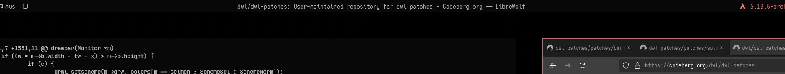

### Description
A homegrown port of dwm's _truecenteredtitle_ patch, with the addition of a config option to toggle its effects. Requires [the bar patch](https://codeberg.org/dwl/dwl-patches/src/branch/main/patches/bar) to be applied beforehand.

### Download
- [v0.7/v0.6](/dwl/dwl-patches/raw/branch/main/patches/bartruecenteredtitle/bartruecenteredtitle.patch) Works on both v0.7 and v0.6.

### Author
- [moonsabre](https://codeberg.org/moonsabre)
- [sewn](https://codeberg.org/sewn)
