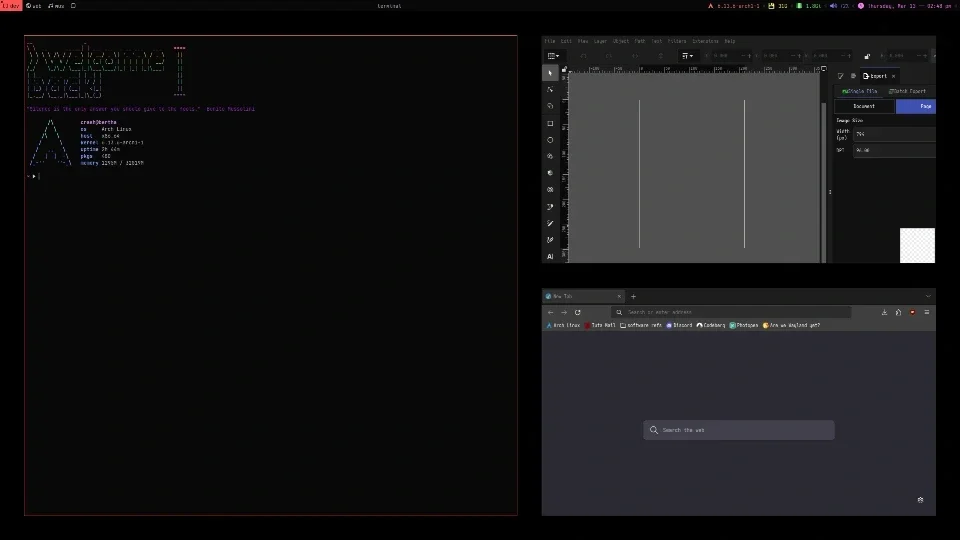

### Description
An extremely simple patch that adds the option to change DWL's window sending behavior; when active, sent windows will be followed, i.e. when a window is sent to another tag, the view changes to that tag. No dependencies.

### Download
- [v0.7](/dwl/dwl-patches/raw/branch/main/patches/follow/follow.patch) Targets tag v0.7, but also works on git master and v0.6.

### Author
- [moonsabre](https://codeberg.org/moonsabre)
