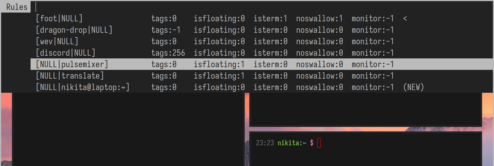

### Description

This patch adds a dmenu interface to [setrule][setrule], which allows to add or
change client rules at runtime. It must be applied on top of [setrule][setrule]
and [menu][menu] patches.

You can invoke the menu by pressing `Alt+R`. The menu lists all the rules, plus
a shortcut to define a new one that would apply to the currently focused client
(marked with `(NEW)`). Rules that already apply to the focused client are marked
with `<`.



To edit a rule, you need to select it, press `Tab`, change what you need  and
finally press `Enter`. You can remove a rule by prepending it with `-`. To add a
new rule, just put new values into `[appid|title]`.

To add support for new rules, you need to edit `fprintf` and `sscanf` calls in
`menurulefeed` and `menuruleaction` functions respectively.

For example, this is what I did to add support for [swallow][swallow] patch
rules.

```diff
diff --git a/dwl.c b/dwl.c
index 34397fc..f1b31ea 100644
--- a/dwl.c
+++ b/dwl.c
@@ -2441,10 +2441,14 @@ menurulefeed(FILE *f)
 		fprintf(f, "%-*s "
 			" tags:%-4"PRIi32
 			" isfloating:%-2d"
+			" isterm:%-2d"
+			" noswallow:%-2d"
 			" monitor:%-2d"
 			"%s\n", wid, buf,
 			r->tags,
 			r->isfloating,
+			r->isterm,
+			r->noswallow,
 			r->monitor,
 			(r == &t) ? "  (NEW)" : match ? "  <" : "");
 	}
@@ -2465,10 +2469,14 @@ menuruleaction(char *line)
 	sscanf(line, "[%255[^|]|%255[^]]]"
 		" tags:%"SCNu32
 		" isfloating:%d"
+		" isterm:%d"
+		" noswallow:%d"
 		" monitor:%d"
 		"%n", appid, title,
 		&r.tags,
 		&r.isfloating,
+		&r.isterm,
+		&r.noswallow,
 		&r.monitor,
 		&end);
```

[setrule]: /dwl/dwl-patches/src/branch/main/patches/setrule
[menu]:    /dwl/dwl-patches/src/branch/main/patches/menu
[swallow]: /dwl/dwl-patches/src/branch/main/patches/swallow

### Download

- [v0.7](/dwl/dwl-patches/raw/branch/main/patches/menurule/menurule.patch)

### Authors

- [Nikita Ivanov](https://codeberg.org/nikitaivanov) ([GitHub](https://github.com/NikitaIvanovV))
